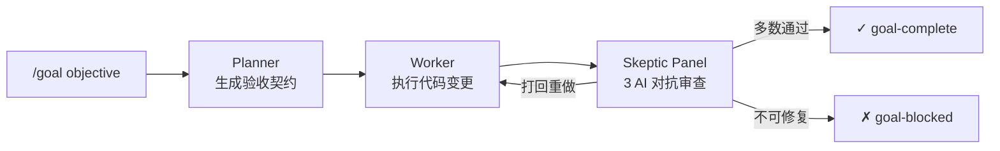
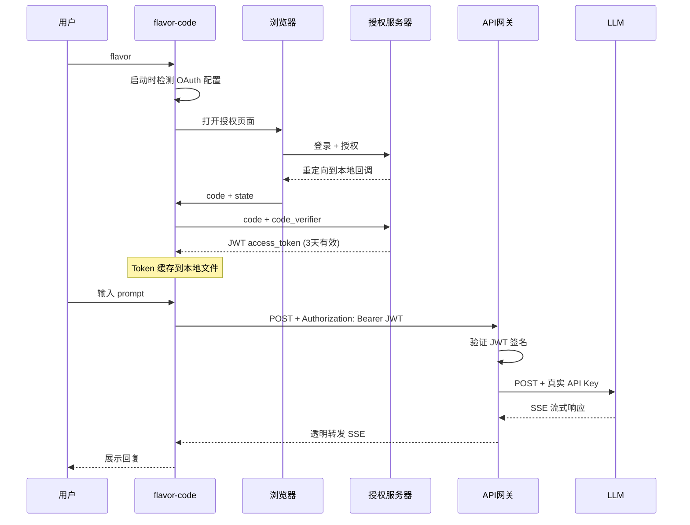

# flavor-code

<p align="center">
  <b>终端与桌面端的 AI 编程助手</b><br/>
  <sub>像和资深程序员结对编程一样，在命令行或 Electron 桌面应用里完成读、写、搜、改</sub>
</p>

---

`flavor-code` 是一个同时提供终端界面与 Electron 桌面应用的 AI 编程助手。它接入大语言模型（OpenAI GPT、Anthropic Claude 或任何兼容服务），能理解你的项目结构，在工作区范围内安全操作文件，甚至能把复杂任务拆成多块，分给多个"小助手"并行处理。

当前稳定版本：**1.0.2**

## 它能做什么

- **阅读和理解代码** — 你问"这个函数是干什么的"，它读文件然后告诉你
- **修改和创建文件** — "帮我在 `src/` 下新建一个 `utils.ts`"，它写出来
- **搜索代码库** — "项目里哪些地方调用了这个函数"，它用 ripgrep 帮你搜
- **运行命令** — 在受控范围内执行 shell 命令，比如跑测试、装依赖
- **拆分复杂任务** — 如果需求涉及多个文件，它先列出计划，再按步骤执行，独立子任务并行推进
- **主动提问澄清** — 需求不明确时，先给结构化选项，最后一项始终允许用户自行输入
- **实时进度面板** — 终端里显示任务执行状态：○ 待执行 · ⟳ 执行中 · ✓ 完成 · ✗ 失败
- **恢复完整时间线** — 聊到一半退出，下次 `--resume` 会恢复消息、工具调用、任务步骤、重试、用量和 Diff；旧的已压缩会话会明确展示压缩摘要边界
- **长任务不中断** — 上下文快满时自动压缩旧消息并生成工作摘要，检测到活跃进度时自动扩展迭代上限
- **跨会话长期记忆** — 自动保留少量用户偏好、项目约定和行为反馈，新会话不必重复说明
- **插件和 Skill** — 通过插件扩展功能，通过 Skill（技能包）教它新的工作流
- **MCP 服务管理** — CLI 与 Electron 共享项目级配置，可添加、编辑、启停和删除 stdio / HTTP 服务
- **审计日志** — 所有工具执行失败都会被记录到 `.flavor/audit.jsonl`
- **事故上报与 RCA** — 工具执行失败自动上报到 langgraph-claw 告警管道，P0 级错误触发自动根因分析（Auto-RCA）
- **对抗性审查（/goal）** — 分离"规划 - 执行 - 审查"三角色，3 个独立 AI 质疑者多数投票验证目标是否达成，不通过则打回重做

### 子 Agent 字节级提示词缓存（0.8.0）

同一次 `Task` 调度现在只冻结一次主 Agent 的模型可见上下文。每个子 Agent 都从这份快照创建独立副本，完整复用 system prompt、`FLAVOR.md`、任务状态、压缩摘要和父会话历史，只在最后追加自己的角色约束与任务 directive。共享部分保持消息顺序和 UTF-8 字节一致，可提高 Anthropic Prompt Cache 与 OpenAI Automatic Prompt Caching 的命中机会，同时父子消息、压缩和 usage 状态仍然彼此隔离。

Anthropic 请求会在 fork 边界发送显式 `cache_control`；OpenAI 与 OpenAI-compatible 服务继续使用自动缓存，不注入可能与旧模型不兼容的专用字段。缓存仍受提供商规则限制：短于最小 token 门槛的前缀不会缓存；主/子 Agent 工具定义或模型不同会阻止整包父子命中；首批完全并发的 Anthropic 子请求也可能在缓存写入可见前同时发生 miss。后续兄弟任务、依赖节点和重试仍可复用相同的父前缀。

### 工具结果溢出保护（0.7.0）

工具输出现在会在执行层主动控制大小：单个结果最多内联 50,000 字符，同一模型轮次的全部工具结果共用 200,000 字符预算。超过任一限制时，Flavor 保留头尾预览，并把完整结果写入工作区的 `.flavor/tool-results/`；返回给模型的结果会包含原始字符数、截断原因和可直接交给 `Read` 的绝对文件路径。

这层保护发生在 `PostToolUse` Hook、UI 事件和上下文入库之前，可避免一次异常大的命令、搜索或 MCP 响应挤占模型窗口。上下文管理器原有的 `toolOutputChars` 截断仍然保留，负责保护恢复的历史会话和外部注入消息。

---

## 安装

**前置条件：Node.js ≥ 20**

```bash
npm install -g flavor-code
```

进入你的项目，启动：

```bash
cd your-project
flavor
```

首次使用时输入 `/init`，Flavor 会自动检测项目（语言、包管理器、源码目录、测试命令），生成 `FLAVOR.md` 项目指南文件。

### 从源码运行

```bash
git clone <repo-url>
cd flavor-code
npm ci
npm run build
node dist/cli.js
```

---

## 配置模型

Flavor 本身不包含 AI 模型，需要你提供 API Key。支持三种方式：

### 环境变量（最快捷）

```bash
# macOS / Linux
export OPENAI_API_KEY="sk-你的密钥"
flavor

# Windows PowerShell
$env:OPENAI_API_KEY = "sk-你的密钥"
flavor
```

### .env 文件

在项目根目录放一个 `.env` 文件（记得加入 `.gitignore`）：

```
OPENAI_API_KEY=sk-你的密钥
```

### 配置文件（最灵活）

在项目下创建 `.flavor/flavor.json`：

```json
{
  "providers": {
    "openai": {
      "type": "openai",
      "baseURL": "https://api.openai.com/v1",
      "apiKey": "${OPENAI_API_KEY}",
      "defaultModel": "gpt-5",
      "cheapModel": "gpt-5-mini"
    }
  },
  "agents": {
    "main": { "model": "openai:gpt-5" },
    "subagent": { "model": "openai:gpt-5-mini" }
  },
  "maxSubagents": 3,
  "permissionMode": "default",
  "language": "zh-CN",
  "sleep": true,
  "maxIterations": {
    "main": 80,
    "subagent": 40,
    "softLimitFactor": 0.8,
    "extendBy": 20
  },
  "loop": {
    "maxCycles": 20,
    "maxTokens": 500000,
    "isolation": "auto"
  }
}
```

`sleep` 默认是 `false`。项目配置为 `true` 且 Flavor 进程跨过本地零点时，
Flavor 会调用 subagent/cheap 模型整理刚结束的前一天会话，并将一份
`日期-摘要.md` 报告写入项目的 `.flavor/sleep/`。前一天没有 session 时不会
调用模型或生成报告；不同项目的 Flavor 进程各自独立整理自己的 workspace。

- 主 Agent 用大模型，子 Agent 用小模型，兼顾质量和成本
- `${OPENAI_API_KEY}` 自动从环境变量或 `.env` 取值
- `language: "zh-CN"` 让 Flavor 用简体中文回复（也支持 `en-US`、`ja-JP` 等 BCP47 标签）
- 支持 Anthropic（`"type": "anthropic"`）和任何兼容 OpenAI 接口的服务（`"type": "openai-compatible"`）
- 关于 OAuth PKCE 企业级认证，请参阅下方 [PKCE 认证配置](#pkce-认证配置)

## MCP 服务器

Flavor 可以作为 MCP client，在启动时连接配置的 server，并把远端 tools 直接加入 Agent 的工具列表。支持本地 stdio 与远程 Streamable HTTP 两种传输。

在项目级 `.flavor/flavor.json`（或全局 `~/.flavor-code/flavor.json`）中添加：

```json
{
  "mcpServers": {
    "mcp-docs": {
      "url": "https://modelcontextprotocol.io/mcp"
    },
    "filesystem": {
      "command": "cmd",
      "args": ["/c", "npx", "-y", "@modelcontextprotocol/server-filesystem", "."],
      "cwd": ".",
      "timeoutMs": 60000
    },
    "company-api": {
      "url": "https://mcp.example.com/mcp",
      "headers": {
        "Authorization": "Bearer ${MCP_API_TOKEN}"
      },
      "timeoutMs": 120000
    }
  }
}
```

- stdio server 使用 `command`，并可配置 `args`、`env`、`cwd`；相对 `cwd` 从工作区解析。
- 上面的 filesystem 配置适用于 Windows；macOS/Linux 可改为 `"command": "npx"`，并从 `args` 删除 `"/c", "npx"`。
- HTTP server 使用 `url`，并可配置 `headers`。鉴权信息建议通过 `.env` 和 `${ENV_NAME}` 插值传入。
- 两种 server 都支持 `disabled: true` 和 `timeoutMs`（默认 60000，范围 100–1800000 毫秒）。
- 远端 tool 暴露为 `mcp__<server>__<tool>`；不兼容模型命名规则的字符会被稳定转义。
- MCP 调用按网络工具处理：`default` / `acceptEdits` 模式会请求批准，`bypassPermissions` 直接允许，`auto` 交给分类器判断；`--print` 不会绕过批准策略。
- MCP tools 只暴露给主 Agent，不会出现在子 Agent 的工具列表中。
- 单个 server 连接失败不会阻止 Flavor 启动，可通过 `/config` 查看已脱敏的 diagnostics。
- 当前版本接入 MCP tools；resources、prompts、sampling、elicitation 与旧式 HTTP+SSE 尚未暴露给 Agent。

运行时可以直接管理 MCP 服务：

```text
/mcp                         # 查看服务状态、传输类型和工具数量
/mcp tools <server>          # 查看服务暴露的工具及输入 schema
/mcp reconnect <server>      # 重新连接服务并刷新模型工具列表
/mcp enable [server|all]     # 启用服务，省略名称时处理全部
/mcp disable [server|all]    # 禁用服务，省略名称时处理全部
```

启用/禁用状态会写入项目的 `.flavor/flavor.json`，并在当前会话中立即更新，无需重启 Flavor。stdio server 的启动日志不会直接写入交互终端；连接失败可通过 `/mcp` 查看。

Electron 可从项目栏打开 **MCP 服务** 工作台，以表单添加、编辑、开启/关闭或删除项目级 stdio / HTTP 配置。保存不会打断已经运行的对话，新配置会从下一个任务开始生效。全局 MCP 配置仍会被运行时加载，但工作台只修改当前项目的 `.flavor/flavor.json`。

独立 CLI 使用同一配置管理层，适合脚本和不进入交互会话的场景：

```text
flavor mcp list [--json]
flavor mcp add local --command npx --arg=-y --arg @modelcontextprotocol/server-filesystem --arg .
flavor mcp add docs --url https://mcp.example.com/mcp --header Authorization="Bearer ${MCP_TOKEN}"
flavor mcp update docs --url https://new.example.com/mcp
flavor mcp enable|disable <name>
flavor mcp delete <name>
flavor mcp path
```

`--arg`、`--env KEY=VALUE` 和 `--header KEY=VALUE` 均可重复；`--cwd` 与 `--timeout <毫秒>` 适用于对应传输。CLI 的配置操作从下次运行时启动生效；需要查看连接状态、刷新工具或在当前会话即时启停时，继续使用 `/mcp` 命令。

## 事故上报与 RCA（0.4.0）

Flavor 内置了工具执行失败的事故上报通道，将 `PostToolUseFailure` 事件通过 AlertManager 兼容的 webhook 推送到 langgraph-claw 告警管道，触发自动根因分析（Auto-RCA）。

### 告警分级

工具失败按错误码自动分级：

| 级别 | 严重度 | 错误码 | 处理方式 |
|------|--------|--------|----------|
| **P0** | critical | `tool_error` | 自动触发 RCA，通过 agent harness + code-rca skill 分析根因 |
| **P1** | warning | `permission_denied`, `hook_denied`, `unknown_tool`, `user_denied` | 存储 + SSE 广播，需人工分析 |
| **P2** | info | `approval_required`, `invalid_input` | 低优先级记录 |
| **P3** | none | 其他 | 不上报 |

每条告警自动附带 Git 上下文（分支、commit、工作区是否脏），无需手动补充现场信息。

### 配置方式

在 `.flavor/flavor.json` 中添加：

```json
{
  "incidents": {
    "enabled": true,
    "webhookUrl": "http://localhost:8000"
  }
}
```

或通过环境变量：

```bash
export FLAVOR_INCIDENT_ENABLED=true
export FLAVOR_INCIDENT_WEBHOOK_URL="http://localhost:8000"
```

- 上报是 fire-and-forget 模式：网络失败不会中断 Agent 循环，仅输出 `[incidents]` 日志
- 默认 webhook 端点：`{webhookUrl}/api/otel/alerts`，兼容 AlertManager v4 格式
- 未启用时，IncidentReporter 为零开销空操作

### Loop Engineering

使用 `/loop <goal>` 启动经过宿主验证的前台自治循环，例如：

```text
/loop 修复当前项目的类型错误并通过测试
```

- `loop.maxCycles` 和 `loop.maxTokens` 是每次用户授权的步长；达到门槛后询问是否继续，再按相同步长增加下一道门槛。
- 验证命令从 `package.json` 与 `FLAVOR.md` 自动推断；若启动时没有，则先运行一次 verifier-discovery cycle，让 worker 建立有意义的项目原生检查，再由宿主重新推断。只有宿主执行的确定性验证通过才会结束为 `succeeded`。
- `isolation: "auto"` 对只读目标使用当前目录，对代码修改或不明确目标使用独立 Git worktree；不能安全隔离时进入 `needs_human`。
- 运行状态与证据写入 `.flavor/loops/<loop-id>/`。Ctrl+C 可取消；不会自动 merge、push 或 deploy。

### 对抗性审查（/goal）

`/goal` 提供了一套结构化、多角色对抗验证的质量门禁机制：

```text
/goal 修复项目里所有的 TypeScript 类型错误，并确保 npm test 全部通过
```

**核心思路：干活的和审查的是不同角色。** 流水线分为三个阶段：

1. **Planner（规划者）**：将自然语言目标翻译为结构化验收标准（gating 门槛 + evidence 证据），写入 `.flavor/goal-plan.md`
2. **Worker（执行者）**：在验收标准约束下执行代码变更并自我验证
3. **Skeptic Panel（质疑团）**：3 个独立 AI 并行审查工作成果——默认立场是"我不信，证明给我看"



**关键机制：**

- **多数投票**：3 个 Skeptic 独立审查，≥2 个确认才算通过
- **精准反馈**：打回重做时附带具体缺陷清单（哪条验收标准、什么问题、是否模型可修复）
- **停滞熔断**：连续 2 轮修复后 gap 指纹不变 → 自动熔断（`goal-stalled`），避免烧钱死循环
- **契约清晰**：Planner 只描述结果不指定实现，Skeptic 只审查契约不许发明新需求
- **Fail-open**：Skeptic 解析失败按"不通过"处理，宁可多跑一轮也不错过问题

当前硬编码参数：`skepticCount: 3`、`maxRounds: 5`、`maxStallStreak: 2`。

---

## PKCE 认证配置

> **适用场景**：企业或团队需要通过统一授权体系访问 LLM 服务，且不希望真正的 API Key 暴露给每个开发者。

### 什么是 PKCE

PKCE（Proof Key for Code Exchange，发音 "pixy"）是 OAuth 2.0 的一种扩展协议，专为**无法安全存储客户端密钥**的原生应用设计。flavor-code 内置了完整的 PKCE 客户端能力，配合 **flavor-pkce** 项目（授权服务器 + API 网关）实现"无 API Key 暴露"的 LLM 安全访问。

### 工作原理

一句话概括：**用户浏览器登录授权服务器 → 获取短期 JWT → 用 JWT 通过 API 网关访问 LLM → 网关将 JWT 替换为真正的 API Key 再转发到上游**。



真实 API Key **只存在于 API 网关**，在整个授权和调用过程中不会离开网关。

### 配置方法

#### 方式一：显式 OAuth 配置（推荐）

在 `.flavor/flavor.json` 中配置完整的 OAuth 参数：

```json
{
  "providers": {
    "openai": {
      "type": "oauth-callback",
      "apiType": "openai",
      "baseURL": "https://api-gateway.your-company.com",
      "authorizationUrl": "https://auth.your-company.com/authorize",
      "tokenUrl": "https://auth.your-company.com/token",
      "clientId": "flavor-code-cli",
      "scope": "models:read models:use",
      "defaultModel": "gpt-5",
      "cheapModel": "gpt-5-mini"
    }
  }
}
```

| 字段 | 必填 | 说明 |
|------|------|------|
| `type` | 是 | 固定为 `"oauth-callback"` |
| `apiType` | 是 | `"openai"` 或 `"anthropic"`，决定上游 API 协议 |
| `baseURL` | 是 | API 网关地址（注意：不是 LLM 服务商的地址） |
| `authorizationUrl` | 是 | 授权服务器的 `/authorize` 端点 |
| `tokenUrl` | 是 | 授权服务器的 `/token` 端点 |
| `clientId` | 是 | 在授权服务器注册的客户端标识 |
| `scope` | 否 | 空格分隔的权限范围，默认 `"models:read models:use"` |
| `defaultModel` | 是 | 主 Agent 使用的模型 |
| `cheapModel` | 是 | 子 Agent 使用的模型 |

#### 方式二：环境变量内建默认值

如果不想在每个项目配置文件里写 OAuth 地址，可以通过环境变量设置全局默认值（`.env` 或 shell 环境变量）：

```bash
export OAUTH_AUTHORIZATION_URL="https://auth.your-company.com/authorize"
export OAUTH_TOKEN_URL="https://auth.your-company.com/token"
export OAUTH_CLIENT_ID="flavor-code-cli"
export OAUTH_SCOPE="models:read models:use"
```

此时 `.flavor/flavor.json` 只需最简配置：

```json
{
  "providers": {
    "openai": {
      "type": "oauth-callback",
      "apiType": "openai",
      "baseURL": "https://api-gateway.your-company.com",
      "defaultModel": "gpt-5",
      "cheapModel": "gpt-5-mini"
    }
  }
}
```

### 首次使用流程

1. 按上述方式配置 `.flavor/flavor.json`
2. 运行 `flavor`
3. 系统自动打开浏览器，跳转到授权服务器登录页面
4. 输入用户名和密码登录
5. 在授权确认页面点击 Approve
6. 浏览器显示"授权成功，请返回终端"
7. flavor-code 自动获取 JWT Token 并缓存（3 天有效）
8. 后续 3 天内重启 flavor 无需再次授权

Token 缓存文件位于 `~/.flavor-code/auth.json`。

### 常见问题

**Q: 和直接用 API Key 有什么区别？**
从使用体验上几乎没有区别。从安全角度，你的终端从未持有真正的 LLM API Key——它拿到的只是一个 3 天过期的 JWT。即使 JWT 泄露，影响范围也有限（3 天、受 scope 约束、可被服务端撤销）。

**Q: 缓存过期了怎么办？**
flavor-code 默认在过期前 60 秒自动丢弃缓存，下次启动时自动重新弹出浏览器授权。你也可以手动删除 `~/.flavor-code/auth.json` 强制重新授权。

**Q: 如何搭建授权服务器和网关？**
参考 **flavor-pkce** 项目，提供了完整的 Docker Compose 部署方案（FastAPI + SQLite + JWT RS256），一键启动。

---

## 基本用法

### Electron 桌面端（1.0.2）

1.0.0 正式提供参考 Codex 交互方式设计的 Electron 桌面端。它不是简单套壳网页：Agent 运行时在 Electron 主进程中工作，桌面界面通过受控 IPC 与运行时通信，因此与 CLI 共享同一套工具、会话和配置能力。

桌面端已支持：

- 项目切换、新建会话、历史会话分组、恢复与安全删除
- 消息流式输出、Markdown、思考过程、工具调用、Diff 和子 Agent 状态展示
- 权限确认、Agent 提问、任务取消，以及模型和权限模式切换
- 顶部“完成任务”入口和右侧非阻塞式长期记忆确认栏
- 全部 `/` 命令，以及 Skills、Plugins、MCP、`/loop` 和 `/goal` 等现有运行时能力
- 可视化 Skill 工作台：项目 Skill 支持新建、查看、编辑、删除，所有来源均可按项目开启或关闭
- 可视化 MCP 工作台：项目服务支持 stdio / HTTP 配置、编辑、开启/关闭和安全删除
- 接近 Codex 的三栏工作台与单层自绘顶栏，并适配窄窗口显示

从源码运行或打包：

```powershell
npm run desktop:dev      # 启动带热更新的桌面开发环境
npm run desktop:start    # 构建后启动桌面应用
npm run desktop:pack     # 生成 release/win-unpacked（Windows）
npm run desktop:dist     # 生成 Windows NSIS 安装包
```

Windows 打包产物位于：

- 免安装目录：`release/win-unpacked/Flavor Code.exe`
- NSIS 安装包：`release/Flavor-Code-1.0.2-x64.exe`

模型配置仍读取全局 `~/.flavor-code/flavor.json`、项目 `.flavor/flavor.json`、`.env` 和环境变量，因此 CLI 与桌面端可以共享配置与会话。生产版桌面窗口启用了 `contextIsolation` 和 Chromium 沙箱，关闭了渲染进程的 Node.js 集成；文件、命令和 Agent 操作只通过显式 IPC 接口进入主进程。Windows 的 `desktop:dev` 为兼容工作区内 Chromium 子进程启动，仅在本地开发启动器中使用 `--no-sandbox`，打包产物不携带该参数。

Electron 的模型菜单默认提供 `deepseek-v4-pro` 与 `deepseek-v4-flash`，也可以通过“新增”接入 OpenAI 兼容或 Anthropic 协议的其他厂商服务。新增时填写厂商名称、模型名称、Base URL 和 API Key；厂商与模型信息会同时写入全局 `~/.flavor-code/flavor.json` 和项目 `.flavor/flavor.json`，同名字段以项目配置为准。API Key 只写入全局配置并使用本机配置密钥加密，项目配置通过合并继承该密钥，避免明文密钥进入项目仓库。保存后桌面端会新建会话并切换到该模型。CLI 继续沿用通用的 `provider:model` 与现有配置优先级。

### 交互模式

```bash
flavor
```

直接打字聊天：

- "这个项目的入口文件是什么"
- "帮我在 src/utils 下写一个日期格式化的函数"
- "把所有 console.log 替换成 logger.debug"
- "解释一下 src/config/load.ts 里的配置加载逻辑"

### 非交互模式（脚本/CI 调用）

```bash
flavor --print "列出 src/ 下所有导出了类的文件"
flavor -p "分析这个项目的依赖关系"
```

`--print` 模式下所有需要审批的操作默认拒绝，不会悬挂等待。

### 恢复上次会话

```bash
flavor --resume                    # 恢复最近一次会话
flavor --resume session-20250101   # 恢复指定会话
flavor --resume -p "继续刚才的工作"  # 恢复后非交互执行
```

交互式 CLI 与 Electron 历史会话会恢复完整执行时间线。上下文压缩不会删除新格式会话的可见时间线；对于升级前已经压缩、原始步骤已不存在的会话，界面会显示压缩时间和保存的摘要，不会把摘要伪装成原始对话。`--resume -p` 只恢复模型上下文用于继续执行，不会把历史记录重新打印到标准输出。

### 长任务与上下文压缩

Flavor 的压缩是分层执行的：

1. **微压缩**：上下文接近阈值时，先把旧的工具结果替换为清理标记，保留最近 5 个
2. **完整压缩**：仍然超阈值时，调用模型生成结构化工作摘要，包含用户意图、技术决策、文件、错误、待办、当前工作和下一步
3. **反应式压缩**：模型返回 `context_overflow` 且无可见输出时，强制压缩并重试同一轮

压缩后摘要作为"续接消息"注入，保留系统指令、项目指南、任务状态和近期消息。输入 `/compact` 可手动触发。

---

## 长期记忆

Flavor 1.0.2 使用“任务级长期记忆”：普通的隐式信息和应用退出都不会触发提取，用户明确完成当前任务时才评价整项任务。CLI 输入 `/finish`，Electron 点击顶部“完成任务”。这避免了同一任务的每轮对话都调用模型，也不会把半成品结论当成稳定事实。

另有一个用户主动保存的快捷入口：当提示中出现“记住”“帮我记住”“加入长期记忆”“please remember that”等明确表达时，当前回复结束后立即调用 cheap 模型，只分析用户明确要求保存的内容，不必等到 `/finish`，也不受 200 字符下限影响。“不要记住”“不用帮我记住”“别记”“无需保存到长期记忆”等否定表达不会触发。因为保存意图已经由用户明确给出，合格候选通过敏感信息检查和相似度查重后直接写入，不再重复弹出确认栏；`/remember` 仍走不调用模型的精确手工写入。

任务中的 user/assistant 可见文本不足 200 个 Unicode 字符时直接跳过，不产生额外 token；达到门槛后才调用配置的 cheap/subagent 模型。模型把候选归入 `user`（用户偏好）、`feedback`（行为反馈）、`project`（项目约定）或 `reference`（外部引用），并分别按“持久性、未来价值、来源权威性、是否难以从仓库重新推导”打 0–3 分。宿主只保留总分至少 9，且前三项都至少 2 分的候选，每个任务最多 3 条。

对于 `/finish` 产生的隐式候选，通过评分仍不等于写入。CLI 使用 `Ctrl+Y` 保存当前候选、`Ctrl+N` 忽略；Electron 在右侧非阻塞审阅栏逐条处理。用户接受后，宿主再使用规范化文本、单词和字符 n-gram/Jaccard 相似度做最终查重；只有没有同类高置信重复时才追加。密钥、Token、私钥、提示词注入、临时进度、原始工具输出和模型猜测会被拒绝。非交互模式不会运行 `/finish` 式隐式评价，但用户在输入中明确要求“记住”时仍可执行这条主动保存路径。

存储分为路由索引和正文：

```text
.flavor/memory/
├── MEMORY.md            # 摘要、类型、日期、正文路径、召回次数等路由信息
└── tasks/
    └── <task-id>.md     # 该任务确认保存的完整记忆正文
```

`user` 表示跨任务稳定生效的用户偏好。宿主会读取全部 `user` 正文，将其作为固定系统上下文的最后一段注入，并在该段设置 prompt-cache 断点；它不参与关键词召回。`feedback`、`project` 和 `reference` 仍在每个新任务提示到来时按短摘要做本地相关度排序，再读取最相关的任务文件。相关度综合单词 Jaccard、Unicode 字符三元组和关键词，默认最多召回 5 条，完整注入受 `maxPromptChars` 字符预算限制。一个按需记忆在同一任务中最多计一次召回。滚动 7 天内被 10 个以上不同任务召回会标为 `[hot]` 并小幅加权，超过 3 天未召回会标为 `[cold]` 并降权；标签只代表近期使用频率，不代表更正确或拥有更高权限。当前用户指令、系统规则、`FLAVOR.md` 和仓库证据始终优先。

Electron 左侧“长期记忆”工作台仍可按四种类型筛选、搜索、新建、编辑或删除记忆；`/remember` 和独立 CLI CRUD 属于用户主动写入，不经过模型评分。

交互会话中可以快速维护：

```text
/memory
/remember project 所有仓库脚本使用 pnpm
/remember feedback 不要自动提交代码
/forget pnpm
```

CLI 还提供适合终端和自动化脚本的精确 CRUD。先进入项目目录，再执行：

```bash
flavor memory list
flavor memory list --json
flavor memory add project "所有仓库脚本使用 pnpm"
flavor memory update <12位ID> feedback "不要自动提交代码"
flavor memory delete <12位ID>
flavor memory path
```

`list` 会输出后续更新和删除所需的稳定 ID；更新内容或类型后会生成新的 ID。`--json` 适合由脚本读取。

项目配置支持：

```json
{
  "memory": {
    "enabled": true,
    "autoExtract": true,
    "autoExtractMinChars": 200,
    "scoreThreshold": 9,
    "maxCandidatesPerTask": 3,
    "retrievalTopK": 5,
    "maxEntries": 200,
    "maxEntryChars": 1000,
    "maxPromptChars": 12000
  }
}
```

存储更新使用文件锁、备份和原子替换。召回和去重全部在本地完成，不需要向量数据库，也不会为每次查询增加 embedding 调用；当前版本不包含跨设备同步或团队共享。

---

## 睡眠整理

当 Flavor 进程持续运行跨过本地零点时，如果项目配置了 `"sleep": true`，它会自动调用 cheap 模型回顾前一天的项目会话，并生成一份结构化的 Markdown 回顾报告。

### 配置

在 `.flavor/flavor.json` 中设置：

```json
{
  "sleep": true
}
```

默认值为 `false`。设为 `true` 后，进程启动即调度零点回调；如果目标日期没有任何 session，不会调用模型或写文件。不同项目的 Flavor 进程各自独立整理自己的 workspace。

### 报告内容

每份报告生成到 `.flavor/sleep/YYYY-MM-DD-摘要.md`，由宿主渲染 Markdown，模型只负责生成结构化 JSON。报告包含以下章节：

| 章节 | 说明 |
|------|------|
| 当天任务摘要 | 当天完成的主要工作 |
| 执行情况反思 | 工作方式的回顾和反思 |
| 📊 量化统计 | 工具调用分布、Token 消耗估算、人工干预统计 |
| 关键决策与收获 | 重要的技术决策和经验 |
| 🛡️ 质量与可信度 | 幻觉告警、失败与重试、代码变更概要、整体评估 |
| 🧠 知识沉淀 | 值得记住的技术发现、陷阱和模式 |
| 未决事项与风险 | 尚待解决的问题和潜在风险 |
| 明日可能规划 | 下一步的工作方向建议 |
| 涉及会话 | 被审查的所有 session ID 列表 |

报告由宿主渲染 Markdown，模型只负责生成结构化 JSON。文件名中的不安全字符会被规范化，长度最多 60 个中文字符。

### 并发安全

- 同一日期使用排他锁（`.lock` 文件），防止并发进程重复整理
- 报告通过临时文件 + `fsync` + `rename` 原子写入，不会出现半写文件
- 获取锁后会再次检查报告是否已存在，消除 TOCTOU 竞态
- 整理失败（模型错误、解析失败等）不会留下损坏的报告或永久锁文件，下一个零点的定时器保持调度

报告写入 `.flavor/sleep/` 目录，可随时手动查看或删除。

---

## 内置命令

交互模式下，以 `/` 开头触发命令：

| 命令 | 作用 |
|------|------|
| `/model main <provider:model>` | 切换主 Agent 模型 |
| `/model subagent <provider:model>` | 切换子 Agent 模型 |
| `/permissions default\|acceptEdits\|plan\|bypassPermissions\|auto\|bubble` | 切换权限模式 |
| `/init` | 生成或更新 FLAVOR.md |
| `/config` | 查看当前配置（密钥已脱敏） |
| `/skills` | 列出已发现的 Skill |
| `/plugins` | 列出已加载的插件 |
| `/hooks` | 列出 Hook 状态 |
| `/tasks` | 显示当前任务计划与进度 |
| `/audit [toolFilter]` | 查看工具失败审计日志 |
| `/memory` | 查看长期项目记忆及文件路径 |
| `/remember [user\|feedback\|project\|reference] <text>` | 保存一条长期记忆（默认 `project`） |
| `/forget <text-or-id>` | 删除匹配的长期记忆 |
| `/finish` | 完成当前任务，并在达到门槛时评价长期记忆候选 |
| `/compact` | 强制压缩上下文 |
| `/clear` | 清空终端显示 |
| `/mcp [status\|tools\|reconnect\|enable\|disable]` | 管理 MCP 服务器 |
| `/loop <goal>` | 启动经验证的前台自治循环 |
| `/goal <objective>` | 启动对抗性审查流水线（Plan → Execute → Verify） |
| `/help` | 显示帮助 |
| `/exit` | 退出 |

输入 `/` 后弹出交互式菜单，列出所有可用命令（内置 + 插件 + Skill），支持模糊匹配和实时过滤。还可以直接输入 `/<skill-name>` 调用某个 Skill，或 `/<plugin-command>` 执行插件命令。

---

## 权限模式

为了安全，Flavor 提供六种权限模式。旧配置会自动迁移：`safe` / `workspace` → `default`，`full` → `bypassPermissions`。

| 模式 | 读文件 | 写文件 | Shell | 网络 | 破坏性操作 |
|------|--------|--------|-------|------|------------|
| **default**（默认） | 自动放行 | 需确认 | 需确认 | 需确认 | 需确认 |
| **acceptEdits** | 自动放行 | 工作区内自动放行 | 例行验证自动放行 | 需确认 | 需确认 |
| **plan** | 自动放行 | 拒绝 | 拒绝 | 拒绝 | 拒绝 |
| **bypassPermissions** | 自动放行 | 自动放行 | 通过硬安全检查后放行 | 主 Agent 放行 | 通过硬安全检查后放行 |
| **auto** | 自动放行 | 工作区内自动放行 | AI 分类 | AI 分类 | AI 分类 |
| **bubble** | 自动放行 | 冒泡审批 | 例行验证自动放行，其余冒泡 | 冒泡审批 | 冒泡审批 |

子 Agent 使用 **bubble** 模式，把无法本地判定的请求交给主会话审批；主会话处于 **plan** 时，子 Agent 同样只读。`auto` 分类器不可用或不确定时会退回人工确认。权限系统是纵深防御，但它不是操作系统级别的沙箱——被批准的命令仍然以你的用户权限运行。

配置写入使用排他锁、锁内重读、`.bak` 备份和原子替换。全局 `~/.flavor-code/flavor.json` 的敏感字段与 OAuth `auth.json` 使用 AES-256-GCM 认证加密；旧明文数据会在读取/下一次保存时迁移。

---

## 任务计划与子 Agent 并行

当你提出复杂需求时，Flavor 会先制定任务计划，然后逐步推进。终端显示实时进度面板：

```
── task progress ──
✓ 分析项目结构
⟳ 重构配置加载模块 (1.2s)
○ 更新测试用例
○ 更新文档
```

独立子任务会被分派给子 Agent **并行处理**：多个子 Agent 同时工作，每个使用独立的上下文窗口和便宜模型，完成后返回结构化结果。一次 DAG 调度中的子 Agent 从同一份父上下文快照 fork，只在末尾追加各自任务，因此可共享字节一致的缓存前缀；任何子 Agent 的后续消息和压缩都不会回写父会话。最大并行数由 `maxSubagents` 配置（默认 3，最大 16）。

---

## Skill（技能包）

Skill 是放在 `.flavor/skills/` 或全局 `~/.flavor-code/skills/` 下的 Markdown 包，用来教 Flavor 处理特定场景。每个 Skill 是一个含 `SKILL.md` 的目录：

```markdown
---
name: code-review
description: Review code for common issues
---

# Code Review

检查代码时关注：
1. 类型安全
2. 错误处理
3. 命名规范
4. 可测试性

参考 `references/checklist.md` 中的详细清单。
```

当你提问时，Flavor 自动匹配相关 Skill 并加载指导。也可以直接输入 `/code-review` 显式调用。Skill 正文中的资源（`assets/`、`references/`、`scripts/`）只有被显式引用才能被访问。

桌面端点击侧栏“技能”可打开管理工作台。项目 Skill（`.flavor/skills/`）支持完整增删改查；全局和插件提供的 Skill 以只读方式展示，但仍可为当前项目开启或关闭。关闭后，自动匹配、显式调用和 Skill 资源读取都会拒绝该 Skill。状态保存在当前项目的 `.flavor/flavor.json`：

```json
{
  "skills": {
    "disabled": ["code-review"]
  }
}
```

CLI 与桌面端共享这套配置语义，并提供轻量的启停命令：

```bash
flavor skills list
flavor skills disable code-review
flavor skills enable code-review
```

---

## 插件

插件放在 `.flavor/plugins/` 下，可以注册自定义命令、工具、Hook、Skill 根目录等。插件命令可以直接通过 `/command-name` 调用。

> ⚠️ 插件是进程内运行的 Node.js 代码，不是沙箱隔离。请只加载你信任的插件。

---

## 审计日志

每次工具执行失败都会被记录到 `.flavor/audit.jsonl`，包含时间戳、会话 ID、工具名、Agent 角色和错误信息：

```bash
/audit          # 查看所有工具失败汇总
/audit Shell    # 按工具名过滤
```

---

## 项目文件结构

Flavor 相关的文件都放在 `.flavor/` 目录下：

```
.flavor/
├── flavor.json        # 项目级配置
├── goal-plan.md       # /goal 生成的验收契约
├── sessions/          # 会话存档（v2 JSONL 格式）
│   └── session-xxx.jsonl
├── memory/            # 跨会话长期记忆
│   └── MEMORY.md
├── sleep/             # 睡眠整理每日报告
│   └── YYYY-MM-DD-摘要.md
├── audit.jsonl        # 工具失败审计日志
├── skills/            # 项目 Skill
└── plugins/           # 项目插件
```

---

## 安全须知

- AI 模型的输出不一定总是正确或安全的，请审查它生成的代码
- Skill 和插件中的内容应视为潜在不可信输入
- 被批准执行的 shell 命令以你的用户身份运行
- 不要将 `.flavor/sessions/` 中的会话文件当作秘密仓库
- 建议在版本控制下使用、配置最小权限的 API Key

---

## 开发

```bash
npm ci              # 安装依赖
npm test            # 跑测试
npm run test:watch  # 监听模式
npm run typecheck   # 类型检查
npm run build       # 构建
npm run smoke:install  # 验证打包和安装
```

- **语言**：TypeScript（strict 模式，ES2022 目标）
- **构建**：tsup → ESM `dist/cli.js`
- **测试**：Vitest，零真实凭据
- **CI**：Windows / macOS × Node 20 / 24

---

## 路线图

后续方向包括（这些是未来规划，非 1.0.2 已交付能力）：

- `/loop` 的后台恢复、调度与并发 loop 管理
- 长期记忆的全文/语义检索和质量整合
- 更细粒度的任务恢复与重放
- IDE 集成（VS Code / JetBrains 扩展）
- 系统凭据存储（keychain 集成）
- 插件隔离/签名验证
- 跨设备会话

---

## 技术架构

详细技术方案请参阅 [技术方案报告](./技术方案报告.md)，涵盖：

- 系统架构拓扑与全链路时序
- Agent 核心循环（迭代控制、流式处理、工具执行）
- 三级上下文压缩（微压缩、模型摘要、反应式压缩）
- 任务系统（TaskPlan 六状态机、子 Agent DAG 并行调度）
- Provider 适配层与错误标准化
- **PKCE 到 SSE 全链路（OAuth 授权 → API 网关 → 流式代理）**
- **事故上报与 RCA（PostToolUseFailure → langgraph-claw → 自动根因分析）**
- **对抗性审查流水线（Plan → Execute → Skeptic Panel 多数投票 → 停滞检测熔断）**
- 权限引擎决策树与 Shell 安全分析
- Hook 事件总线（19 个事件）
- Skill 渐进加载与资源安全
- 插件生命周期与信任模型
- 会话 JSONL 持久化与 v1/v2 兼容
- 安全威胁模型与缓解措施

---

## License

见 [LICENSE](./LICENSE) 文件。
