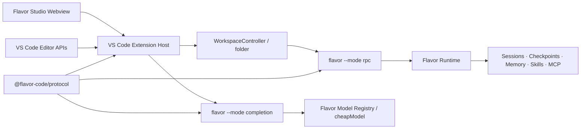

# Flavor Code IDE 插件独立工程开发方案

## 1. 决策摘要

建议建立独立仓库 `flavor-code-vscode`，产品名称暂定 **Flavor Studio**，但保留现有扩展标识 `flavor-code.flavor-code`，让已安装用户可以直接升级。

不建议直接复制 `flavor-code` 的 Agent、模型、会话、权限或配置实现。正确的拆分方式是：

- `flavor-code`：唯一的运行时与数据源，负责 Agent、模型、工具、权限、会话、checkpoint、MCP、Skills、Memory 和补全推理。
- `@flavor-code/protocol`：从核心仓库发布的纯协议包，包含 Zod schema、TypeScript 类型、能力标识和协议版本，不依赖 Electron、Ink 或具体模型 SDK。
- `flavor-code-vscode`：独立发布的 VS Code/Qoder 客户端，只负责进程管理、编辑器上下文、工作台 UI、Diff 呈现和 Inline Completion 展示。

独立仓库应在协议包和兼容测试完成后再正式切走，避免一次性复制代码造成两个实现源。现有 `extensions/vscode` 作为迁移源，在新版发布稳定后只保留跳转说明或删除。

## 2. 当前基础与缺口

### 2.1 可直接复用的 Flavor 能力

- `SessionStore` 已支持会话 `list/load/delete`，并具有工作区隔离、大小限制、损坏隔离和原子写入。
- `TaskSnapshot` 已包含计划、Subagent 图、状态和结果，可直接支撑多 Agent 看板。
- `ProjectMcpConfigManager` 已支持 MCP 的增删改、启停和 schema 校验。
- `SkillManager` 已支持 Skills 的列表、读取、创建、更新、删除和启停。
- Memory、模型配置、checkpoint、session tree、trace 与 IDE bridge 已经存在核心实现。
- 当前 JSONL RPC 已支持 prompt、steer、follow-up、abort、queue、checkpoint、rewind、fork 和 shutdown。

### 2.2 必须补齐的核心边界

- RPC 没有协议握手、版本协商和 capability discovery。
- SDK 没有公开 RPC command/event schema，也没有官方 RPC client。
- 会话列表和删除能力尚未暴露给 RPC；切换会话需要重新启动 runtime。
- 配置、MCP、Skills、Memory 的管理 API 尚未进入控制协议。
- prompt 仍是单个字符串，没有结构化 context references 和附件字段。
- Runtime event 没有稳定序列号，插件重连后无法精确补齐状态。
- Agent RPC 当前以 `approvalPolicy: "deny"` 运行，涉及审批的操作无法形成完整 IDE 交互。
- Inline Completion 不存在，且不应复用长任务 Agent 的串行执行链路。
- 当前扩展只使用 `workspaceFolders[0]`，没有真正的 multi-root controller。

## 3. 总体架构



### 3.1 为什么采用双进程

- Agent 进程面向分钟级任务、工具调用和多 Agent 调度。
- Completion 进程面向 100–1000 ms 请求，无工具、可取消、允许覆盖旧请求。
- 两者共享 Flavor 的模型配置和 provider adapter，但不共享队列与上下文锁。
- Agent 崩溃或执行长任务时，补全仍然可用；补全超时也不会污染任务会话。

### 3.2 Runtime 选择策略

插件设置提供四种来源：

1. `managed`：推荐。插件在 `globalStorageUri` 中安装经过 SHA-256 校验的匹配版 Flavor runtime。
2. `system`：使用 PATH 中的 `flavor`。
3. `path`：使用用户明确配置的 CLI/JS 入口。
4. `development`：连接本地仓库构建产物。

`auto` 模式优先选择兼容的 system runtime，否则使用 managed runtime。禁止未经确认执行工作区里的 `node_modules/.bin/flavor`。Windows 必须沿用当前已修复的 npm shim 解析方式，通过 `node.exe + dist/cli.js` 启动，不使用 `shell: true`。

## 4. 协议与兼容策略

### 4.1 首次握手

客户端第一条消息必须是：

```json
{
  "type": "hello",
  "id": "1",
  "client": "flavor-code-vscode",
  "clientVersion": "2.0.0",
  "protocolRange": ">=2 <4",
  "workspace": "C:/repo"
}
```

Runtime 返回：

```json
{
  "type": "welcome",
  "id": "1",
  "runtimeVersion": "1.2.0",
  "protocolVersion": 2,
  "sessionId": "session-...",
  "capabilities": [
    "chat.attachments",
    "sessions.list",
    "review.hunks",
    "config.manage",
    "agents.graph",
    "context.references"
  ]
}
```

插件只显示 capability 支持的操作。协议不兼容时显示明确升级路径，不允许继续发送未知命令。

### 4.2 状态恢复

- 所有 runtime event 增加 `sequence`、`sessionId` 和 `timestamp`。
- 新增 `get_snapshot`，一次返回连接、任务、Agent、queue、usage、当前 transcript 游标和待审批请求。
- 新增 `replay_events(afterSequence)`，用于 Webview reload 和短暂断线恢复。
- Extension Host 保存状态，Webview 只是投影；Webview 重载不能影响 Agent。

### 4.3 新增协议命令

| 领域 | 命令 |
| --- | --- |
| 基础 | `hello`, `get_snapshot`, `replay_events`, `ping` |
| 对话 | `prompt`, `steer`, `follow_up`, `abort`, `get_transcript` |
| 会话 | `list_sessions`, `get_session`, `delete_session` |
| 审阅 | `get_change_set`, `get_file_diff`, `reject_hunk`, `reject_file`, `mark_reviewed` |
| 配置 | `get_config`, `patch_config`, `set_provider_secret` |
| MCP | `list_mcp`, `create_mcp`, `update_mcp`, `toggle_mcp`, `delete_mcp`, `probe_mcp` |
| Skills | `list_skills`, `get_skill`, `save_skill`, `toggle_skill`, `delete_skill` |
| Memory | `list_memories`, `get_memory`, `save_memory`, `delete_memory` |
| Agent | `get_task_snapshot`, `steer_agent`, `abort_agent` |
| Context | `estimate_context`, `resolve_context_refs` |
| 审批 | `approval_decision`, `answer_question` |

会话切换不要求 runtime 原地替换。插件先安全关闭当前 Agent，再以 `--resume <session-id>` 启动新进程；新建会话则不带 `--resume`。当前 session 不允许删除。

## 5. 插件工程结构

```text
flavor-code-vscode/
├─ package.json
├─ extension/
│  ├─ src/
│  │  ├─ extension.ts
│  │  ├─ runtime/
│  │  │  ├─ runtime-manager.ts
│  │  │  ├─ workspace-controller.ts
│  │  │  ├─ rpc-client.ts
│  │  │  └─ completion-client.ts
│  │  ├─ features/
│  │  │  ├─ chat/
│  │  │  ├─ sessions/
│  │  │  ├─ review/
│  │  │  ├─ control-center/
│  │  │  ├─ agents/
│  │  │  ├─ context/
│  │  │  └─ completion/
│  │  ├─ bridge/
│  │  └─ platform/
│  └─ test/
├─ webview/
│  ├─ src/
│  │  ├─ app/
│  │  ├─ chat/
│  │  ├─ sessions/
│  │  ├─ review/
│  │  ├─ control-center/
│  │  ├─ agents/
│  │  └─ context/
│  └─ test/
├─ test-fixtures/
│  ├─ fake-runtime/
│  └─ workspaces/
└─ scripts/
   ├─ package.mjs
   ├─ install-managed-runtime.mjs
   └─ smoke-ide.mjs
```

Extension Host 与 Webview 使用显式 message schema，禁止发送任意 command 名或任意文件路径。所有路径在 Host 和 Runtime 两侧分别验证一次。

## 6. UI 信息架构

### 6.1 设计方向

- 对象：一个在真实代码库中工作的 Agent 控制台。
- 用户：需要观察、干预、审阅和恢复 Agent 工作的开发者。
- 单一核心任务：在不离开编辑器的情况下，清楚知道 Agent 正在做什么，并安全地控制结果。
- 视觉：完全使用 VS Code theme variables，遵循高对比度主题；正文使用编辑器 UI 字体，代码与数据使用 `--vscode-editor-font-family`。
- 标志性元素：**Execution Rail**。一条连续执行轨道串起用户消息、模型思考、工具调用、Subagent 分支、Diff 和最终验证，表达真实执行关系，而不是装饰性卡片。

### 6.2 布局

侧边栏保留轻量入口，完整工作台在 editor area 打开：

```text
┌ Session / model / connection ───────────────────────────────┐
│                                                             │
│ Sessions       Conversation + Execution Rail     Live scope │
│ ─────────      ─────────────────────────────     ────────── │
│ Recent         User / Flavor / tools             Context    │
│ Pinned         Agent branches                    Agents     │
│ Archived       Diff summaries                    Queue      │
│                Composer                           Budget     │
├─────────────────────────────────────────────────────────────┤
│ Chat │ Review │ Control center │ Context                     │
└─────────────────────────────────────────────────────────────┘
```

窄屏时左、右栏折叠为抽屉；键盘可到达所有控件；动画只用于 Execution Rail 状态转换，并遵守 `prefers-reduced-motion`。

## 7. 七项功能设计

### 7.1 原生对话面板（功能 3）

能力：

- 流式 Markdown、代码块、文件链接、tool start/end、warning、error 和 usage。
- Composer 根据状态明确切换 `Prompt`、`Steer`、`Follow-up`，不靠隐式猜测。
- 支持图片、文件、symbol、selection、diagnostics、Git change 和 terminal excerpt context chips。
- 工具调用默认折叠，失败和需要用户处理的事件自动展开。
- Webview reload 后通过 snapshot + sequence replay 恢复，不丢 transcript。
- 支持 stop、retry、copy、在编辑器打开文件和从某条消息创建新 session branch。

验收：

- 首条文本事件到达后 50 ms 内增量显示。
- 10,000 条事件通过虚拟列表保持流畅。
- 重载 Webview 不启动新 Agent、不重复消息。
- Prompt/Steer/Follow-up 在忙闲状态下语义正确。

### 7.2 会话中心（功能 4）

能力：

- 最近会话列表，展示更新时间、模型、首条 prompt 摘要和完成状态。
- 新建、恢复、删除、置顶和本地归档；置顶/归档元数据由插件保存，不修改核心 session schema。
- 切换会话前检查 active task 和未审阅变更，必要时要求停止或创建 checkpoint。
- 每个 workspace folder 独立 controller；窗口级选择器显示当前 folder。
- IDE 重启后恢复上一次明确打开的会话，但不得隐式恢复未完成执行。

验收：

- 能读取并恢复现有 SessionStore 会话。
- 删除必须二次确认，且不能删除当前会话。
- multi-root 下会话不串工作区。
- 损坏会话显示 quarantined 状态，不导致整个列表失败。

### 7.3 可视化 Diff 审阅（功能 5）

设计原则：只审阅本次 Agent 相对自动 checkpoint 的变化，不能把用户原有未提交修改误算为 Agent 变更。

能力：

- 文件列表、统计、side-by-side/inline diff、hunk 导航。
- `Accept` 表示标记已审阅，不修改文件；`Reject hunk/file` 通过 Flavor checkpoint/diff 服务安全反向应用。
- 每次拒绝前校验当前文件 hash；发生并发编辑时停止并要求重新计算。
- 支持打开 VS Code 原生 diff、复制 patch、让 Flavor 修正选中 hunk。
- 全部审阅完成后可运行验证或创建新 checkpoint。

验收：

- 新增、修改、删除、重命名和二进制文件状态正确。
- Reject 只影响选择的 Agent 变更。
- 文件内容变化后旧 hunk 不可应用。
- 每个 destructive review action 都有可恢复 checkpoint。

### 7.4 模型、MCP、Skills、Memory 控制中心（功能 7）

分为四个页签：

- Models：provider、base URL、可选模型、main/subagent/cheapModel、连通性测试。
- MCP：stdio/http 服务 CRUD、启停、probe、工具数量和最近错误。
- Skills：来源、启停、正文编辑、模型调用开关和冲突提示。
- Memory：类型、摘要、正文、来源、热/冷状态、最近召回、编辑和删除。

安全要求：

- API key 永远不回传给 Webview；只返回 `configured: true/false`。
- secret 通过一次性 Host 消息交给 Flavor 加密配置层，日志统一 redaction。
- 工作区未信任时禁止启动 MCP stdio、写配置或运行 provider probe。
- 所有配置写入调用核心 manager，插件不得自己拼接 `.flavor/flavor.json`。

验收：

- CLI、桌面端和插件读取到相同配置结果。
- 无效 schema 不落盘。
- MCP/Skill 修改后明确提示“下个 session 生效”或执行受控重启。
- Webview state、日志和 crash report 中不出现明文密钥。

### 7.5 多 Agent 看板（功能 8）

能力：

- 使用 TaskSnapshot 呈现依赖图、pending/running/completed/failed/blocked/cancelled 状态。
- 每个节点显示描述、Agent ID、运行时间、当前工具、结果摘要和文件影响。
- 选择节点后 Execution Rail 只高亮该 Agent 的事件。
- 全局 steer/stop 首先交付；核心支持后再启用 `steer_agent` 和 `abort_agent`。
- 展示并发槽、主/子 Agent token、预算和阻塞原因。

验收：

- out-of-order event 不会让已完成 Agent 回退为 running。
- 50 个节点仍可浏览，布局不抖动。
- Agent 结果与 task ID、文件 footprint 可追溯。
- 断线重连后看板与 `get_task_snapshot` 一致。

### 7.6 上下文构建器（功能 9）

ContextRef 使用结构化类型：

```ts
type ContextRef =
  | { kind: "file"; uri: string; version?: number }
  | { kind: "selection"; uri: string; range: Range; version: number }
  | { kind: "symbol"; uri: string; range: Range; name: string }
  | { kind: "diagnostics"; uris?: string[] }
  | { kind: "git-change"; path: string }
  | { kind: "terminal"; terminalId: string; start: number; end: number }
  | { kind: "image"; attachmentId: string };
```

能力：

- 从 Explorer、Outline、Problems、Source Control、Terminal 和编辑器选区添加。
- Composer 显示可排序、可移除的 context chips。
- `estimate_context` 返回字符/token 估算、截断和排除原因。
- 文件内容由 Runtime 在提交时读取，避免 Webview 承载大文本；selection 使用 document version 防止引用漂移。
- 默认忽略 secrets、二进制、大文件、`.git`、`.flavor`、依赖和构建目录。

验收：

- 同一引用去重，路径和版本变化可见。
- 超预算时按明确策略裁剪并在发送前提示。
- 未信任工作区不能读取 workspace 外路径。
- 图片沿用现有 5 张、单张 5 MiB、总计 20 MiB 约束。

### 7.7 独立低延迟 Inline Completion（功能 10）

新增 `flavor --mode completion --workspace <path>`，协议请求包含：

- document URI、language ID、document version、cursor position。
- bounded prefix/suffix、最近编辑片段和可选相关 symbol。
- request ID 和 cancellation token。

Completion runtime：

- 默认使用 provider 的 `cheapModel`；没有时要求用户明确选择，不自动使用昂贵主模型。
- 禁止工具调用、写文件、MCP 和 Memory 自动写入。
- 120 ms debounce，同一文档新请求取消旧请求。
- 本地 LRU cache，key 包含 document version、position 和上下文 hash。
- 首 token 目标 p95 < 800 ms，硬超时默认 1,500 ms；超时静默隐藏 suggestion。
- 仅在 workspace trusted、配置启用、非 secret/large/generated 文件时运行。
- 使用 `registerInlineCompletionItemProvider`，接受结果由 VS Code 原生命令完成。

验收：

- 不阻塞 Agent RPC；Agent 忙时仍能补全。
- 快速输入不会显示旧 document version 的建议。
- Escape、光标移动、文档关闭会取消请求。
- `.env`、凭证文件、二进制和超大文件默认不发送。
- 可按语言、workspace 和全局三级关闭。

## 8. 权限与安全

尽管不在本次七项列表中，权限审批是这些功能可用的前置条件。新版 Agent RPC 不应继续固定 `approvalPolicy: "deny"`。

- Runtime 发出结构化 `approval-request`，包含 tool、路径、命令摘要、原因和风险级别。
- Extension Host 使用 VS Code modal 或 Studio approval sheet 收集 `once/always/deny`。
- `always` 必须绑定到 Flavor 已有 permission rule，而不是插件自定义规则。
- 工作区未信任时所有写操作、Shell、MCP stdio、配置写入和 completion 均 fail closed。
- Runtime 进程使用参数数组启动，不经过 shell；stdout 只承载 JSONL，stderr 进入专用日志。
- Webview 使用 nonce CSP，禁止远程脚本、任意导航和 `eval`。

## 9. 实施阶段

### Phase 0：协议与独立仓库基线

- 在核心仓库创建 `@flavor-code/protocol`。
- 加入 hello/welcome、capabilities、sequence、snapshot 和官方 RpcClient。
- 创建独立仓库，迁移当前 extension、Windows EPIPE 修复和测试。
- 建立 core `main`、最新稳定版和 N-1 的兼容测试矩阵。

完成门槛：独立扩展可连接兼容 CLI，旧 CLI 会显示明确升级提示。

### Phase 1：WorkspaceController、会话与上下文

- 每 workspace folder 一个 Agent controller。
- 完成 Session Center、ContextRef 和 snapshot/replay。
- 完成 managed/system/path runtime manager。

完成门槛：multi-root 会话隔离，重载可恢复 UI 状态。

### Phase 2：Chat Studio 与多 Agent 看板

- 实现 Studio shell、Execution Rail、虚拟 transcript 和 composer。
- 接入 TaskSnapshot、Agent graph、queue 和 token budget。
- 接入审批请求。

完成门槛：用户可在 Studio 完成 prompt、steer、follow-up、stop 和 Agent 观察。

### Phase 3：Diff Review

- 核心增加 checkpoint-relative change set 与 hash-guarded reject API。
- 插件实现文件/hunk 审阅、原生 diff 跳转和验证入口。

完成门槛：所有 reject 都可恢复且不会覆盖用户任务前修改。

### Phase 4：Control Center

- 暴露 config、MCP、Skills 和 Memory management RPC。
- 完成安全的 secret 输入和受控 runtime restart。

完成门槛：CLI、桌面端和插件配置一致，secret 不泄露。

### Phase 5：Inline Completion

- 新建 completion runtime 和协议。
- 完成 provider、缓存、取消、privacy filters 和性能遥测。

完成门槛：达到延迟目标，且与 Agent 任务完全隔离。

### Phase 6：硬化与发布

- VS Code/Qoder smoke、可访问性、故障恢复、升级/降级和 managed runtime 校验。
- 发布 beta 渠道，收集匿名且默认关闭的性能指标。
- 稳定后用相同 extension ID 推送正式版。

## 10. 测试矩阵

| 层级 | 覆盖 |
| --- | --- |
| Schema | 每个 command/event 的合法、非法、向前兼容 fixture |
| Unit | RpcClient、reducer、ContextRef、diff/hunk、completion cache/cancel |
| Contract | Extension 对 Flavor stable、N-1、main 的握手与 capability gating |
| Integration | fake runtime 的断线、乱序、stderr、EPIPE、重启、replay |
| Real runtime | prompt、resume、checkpoint、reject、配置管理、MCP probe |
| Extension Host | VS Code Extension Test Runner，multi-root 和 workspace trust |
| Webview | component、keyboard、high contrast、reduced motion、10k event 性能 |
| Platform | Windows 11、macOS、Linux；Node 20/24；VS Code 与 Qoder |
| Packaging | VSIX 安装、升级旧版、managed runtime hash、卸载残留 |

关键故障注入：CLI 不存在、版本不兼容、半行 JSON、stdout 噪声、stdin EPIPE、runtime crash、session 损坏、文件 hash 冲突、provider 429/timeout、MCP hang、Webview reload。

## 11. 发布与版本管理

- Extension 使用独立 SemVer，如 `2.0.0-beta.1`。
- Protocol 使用整数主版本和 capability 增量，不与产品版本绑定。
- Flavor runtime 声明 `protocolMin/protocolMax`。
- 正式支持 runtime 当前稳定版和 N-1；更老版本只提供升级指引。
- Beta 与 stable 使用同一仓库、不同 VS Marketplace pre-release channel。
- Qoder 使用相同 VSIX，并在 CI 做安装与命令注册 smoke test。

## 12. 迁移清单

迁移到独立仓库：

- `extensions/vscode/src/*` 的 Activity Bar、IDE bridge、prompts、RPC client 和 dashboard reducer。
- Windows npm shim 安全解析、spawn readiness、并发启动去重和 pipe error 处理。
- `tests/vscode/*` 与安装脚本。
- extension ID、publisher、icon、用户设置 key 和 command ID，避免升级后配置丢失。

不迁移：

- `src/production.ts`、模型 adapters、SessionStore、MCP/Skill/Memory managers。
- `.flavor` 文件解析和写入逻辑。
- 权限决策、checkpoint restore、patch apply 和 provider secret encryption。

这些能力必须继续由 Flavor runtime 提供并通过协议访问。

## 13. 最终验收标准

1. 插件和 CLI 可独立发布，协议不兼容时不会静默失败。
2. 七项功能全部能在 VS Code 和 Qoder 中使用，不依赖 Electron UI。
3. 插件不直接解析或修改 Flavor 私有数据文件。
4. Agent、Session、Agent graph、Diff 和配置在重连后保持一致。
5. 用户任务前已有修改不会被 Diff Review 的 reject 覆盖。
6. API key 不进入 Webview state、日志、trace 或异常报告。
7. Completion 与 Agent 进程隔离，满足取消、隐私和延迟目标。
8. Windows 不再通过 shell 启动 npm shim，EPIPE/ENOENT 显示真实根因。
9. multi-root、workspace trust、高对比度和键盘操作通过测试。
10. 旧扩展可原地升级，保留设置、快捷键和工作区数据。

## 14. 工作量建议

对于熟悉现有 Flavor 核心的团队：

- 1 名工程师串行完成生产质量版本：约 10–14 周。
- 2–3 名工程师按 Protocol/Core、Extension Host、Webview/Completion 并行：约 5–8 周。

不能压缩的关键路径是协议稳定、checkpoint-relative Diff、权限审批和 Completion runtime。优先交付顺序应为 Phase 0 → 1 → 2 → 3 → 4 → 5；不要先画完整 UI，再回头补控制协议。
