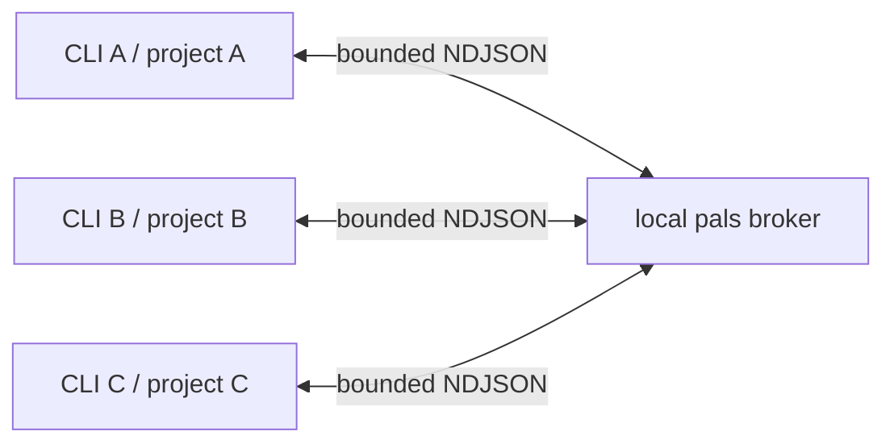
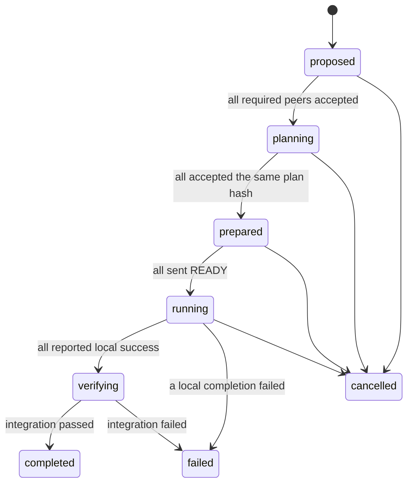

# CLI Pals and cross-project co-work

Status: implemented core; artifact exchange, restart persistence, and large-group hardening remain follow-up work  
Date: 2026-08-14  
Scope: interactive CLI only. Electron, VS Code, print, RPC, and eval modes are not pals.

## Goal and delivered behavior

Independently started `flavor` CLI processes owned by the same OS user can discover one another and coordinate work across projects. The shipped core provides:

- one UUID v4 per interactive CLI process and a case-insensitive active alias;
- `/pals`, `/pals --verbose`, `/pals rename`, and `/pals info`;
- attributed, bounded, deduplicated task delivery with `/chat <pal> <goal>`;
- automatic safe model work on the receiving session, including steer/follow-up behavior when it is busy;
- a broker-authoritative co-work plan hash, early READY intents, and an exactly-once START barrier;
- broker-selected integration ownership, bounded completion assertions, and explicit END/FAIL terminal events;
- typed agent tools for listing peers, sending facts, planning, readiness, progress, state, and local completion;
- Windows named pipes and Unix domain sockets on macOS/Linux, with no TCP fallback.

The core protocol uses participant arrays and therefore routes three or more clients without a wire change. The current CLI shortcut creates a two-required-participant co-work; production hardening for larger groups is described below.

## Security and non-goals

- Communication is local to the current OS user and never opens a TCP listener.
- A peer cannot approve tool calls, change permission mode, or gain implicit access to another workspace.
- Remote text is attributed collaboration input, never system/developer text.
- A remote string such as `/exit`, `/clear`, or a tool-shaped JSON object is JSON-quoted inside a normal prompt and never sent through slash-command dispatch.
- File, shell, network, and destructive-action approvals remain local to the receiving CLI.
- API keys, environment variables, complete transcripts, and arbitrary workspace files are not transported.
- Electron and renderer IPC are intentionally unchanged.

## Identity and discovery

The interactive CLI generates `instanceId` with `crypto.randomUUID()` and passes it explicitly to the collaboration runtime. It lasts for that process and is independent of the persisted session ID. Restarting the CLI creates a new UUID.

The default alias is `<workspace-basename>-<first-eight-uuid-chars>`. A user can set a clearer alias at startup or rename it while connected:

```text
flavor --pal-name B
/pals rename api
```

Aliases are case-insensitive and unique among active peers. Aliases and targets reject terminal/control Unicode. Targets accept an exact alias, exact UUID, or a unique UUID prefix of at least eight characters; ambiguous or shorter prefixes fail closed consistently in commands, tools, and the broker. Presence currently contains only protocol version, UUID, alias, a bounded project path, connection time, and last-seen time. `/pals` omits the project path, while `/pals --verbose` includes it.

A graceful close sends `disconnect`; an ungraceful client is removed when its socket closes or its heartbeat lease expires. Heartbeats default to 10 seconds and the broker lease defaults to 30 seconds.

## Local transport and broker lifecycle

All clients for one OS user connect to one local broker:



- Windows uses a `node:net` named pipe such as `\\.\pipe\flavor-code-pals-u-<hash>-v1`.
- macOS/Linux use `pals-v1.sock` inside a per-user runtime directory forced to mode `0700`.
- Frames are strict, versioned NDJSON and limited to 64 KiB. Central encoding rejects an oversized request, response, or event before a socket write; aggregate list, plan, snapshot, path, task, and assertion limits keep broker-generated envelopes below that ceiling.
- Client and hidden broker independently load a random 32-byte application credential from `~/.flavor-code/pals/auth-token` (user-only directory/file modes on Unix). Registration must authenticate before list or send, and the broker derives every later actor from that authenticated connection. The token is never echoed or logged.
- Unix startup holds an exclusive per-endpoint ownership lock before probing or removing an exact stale socket; a live endpoint is never unlinked. Startup locks record PID/time/nonce, preserve live owners, reclaim dead owners only when the endpoint is unavailable, and apply a bounded grace period to corrupt locks.
- The broker closes after a bounded idle period. Current co-work state is in memory and is not journaled across broker restart.

## Commands

### Presence

```text
/pals
/pals --verbose
/pals rename <alias>
/pals info <alias-or-uuid>
```

### Task chat

```text
/chat <alias-or-uuid> <goal>
```

`/chat B 你好啊` is intentionally task-oriented: A receives a `delivered` receipt and B receives an attributed task event containing A's broker-derived UUID, a message UUID, a task UUID, and the exact Unicode goal.

B converts the delivery into a non-slash prompt that names the sender and message UUID and JSON-quotes the remote text. Then:

- if B is idle, a normal `FlavorSession` model turn starts immediately;
- if B has an active model turn, the task is queued as steering for that turn;
- if a local submission is pending but not active, it is queued as a follow-up;
- duplicate message UUIDs do not start duplicate work.

Queued remote submissions retain structured sender/context metadata separately from the model-facing safety wrapper. When a delayed peer turn becomes visible, the transcript renders a bounded attributed PAL/co-work prompt rather than presenting that internal wrapper as local user input.

B can reply with `/chat A ...`; routing is symmetric. This command does not execute a remote shell command directly and does not bypass B's approvals.

### Co-work

```text
/co-work <alias-or-uuid> <goal>
/co-work status [co-work-uuid]
/co-work cancel <co-work-uuid> [reason]
```

`/co-work B <goal>` proposes a co-work containing A and B as required participants. A proposal delivered to B is accepted by B's runtime, and both sessions enter planning under their existing `plan` permission behavior. The agents use the registered tools below; there are no separate user-facing `accept` or `reject` commands in the current CLI.

| Tool | Current role |
| --- | --- |
| `PalsList` | List bounded active peer identity fields |
| `PalSend` | Send a bounded collaboration fact |
| `CoWorkState` | Read broker-authoritative state |
| `CoWorkPlan` | Submit a strict task plan |
| `CoWorkReady` | Accept the current plan hash and declare readiness |
| `CoWorkProgress` | Send a bounded progress fact |
| `CoWorkComplete` | Report local completion with verification detail |
| `CoWorkIntegrate` | Integration owner only: inspect assertions and finalize with nonempty evidence |

`PalsList`, `CoWorkState`, and token-only `CoWorkReady` are automatic main-agent controls. Every model-originated content-sharing tool requires a once-only local approval unless the user intentionally selected bypass policy; subagents cannot call them. A runtime-scoped sharing guard redacts configured secrets and enforces a cumulative 128 KiB UTF-8 budget across outbound fields. Approval metadata contains only identifiers/counts, never the raw shared content. User-typed `/chat` remains an explicit user action and is not charged to the model-tool sharing guard.

## Co-work protocol

The strict plan shape implemented today is:

```ts
interface CoWorkPlan {
  version: 1;
  coWorkId: string;
  epoch: number;
  goal: string;
  participants: Array<{ palId: string; required: boolean }>;
  tasks: Array<{
    id: string;
    assigneeId: string;
    description: string;
    dependsOn: string[];
  }>;
}
```

The broker rejects self-only or duplicate proposal rosters. It validates participant membership, assignees, unique task IDs, dependency existence, and the absence of directed dependency cycles, then hashes the canonical plan with SHA-256. Submitting a revision increments the epoch and invalidates earlier plan acceptance, readiness, completion assertions, and integration state.



Only the broker emits `START`, and only after every required participant is ready for the exact `(coWorkId, epoch, planHash)`. A participant may atomically record its READY intent during planning after accepting that exact plan; the intent is retained until the remaining required participants accept and become ready. Replays do not emit another START. Before START, planning prompts explicitly prohibit mutation.

Each CLI has one aggregate planning-permission gate because its permission mode is global. The first applicable planning turn captures one baseline; further concurrent co-works join the same gate. An invitation received during unrelated local work is queued, and `plan` is activated immediately before its attributed planning submission begins. START removes only that `(coWorkId, epoch)` membership. Execution prompts remain FIFO-held until every current planning membership has resolved and no planning model turn is still active; the baseline is then restored once before any execution prompt runs. START or a terminal event stops only an active matching planning flow with an attributed control message and waits for it to become idle. CANCEL/FAIL/END never launches execution. Replayed same-epoch PLAN events after START/terminal cannot re-enter plan mode, while a higher epoch may plan again. Closing the session cancels planning, discards held execution, drains the lifecycle tails, and restores the captured baseline.

After safe gate release, each session receives only the tasks assigned to its own UUID, the shared goal, and the plan hash. Local completion is not global completion.

The broker designates one required participant as the authoritative `integrationOwnerId`. Each `CoWorkComplete` stores one bounded assertion containing participant identity, pass/fail, and optional detail. A failed local assertion immediately emits `FAIL`. After all required local assertions pass, the snapshot enters `verifying`; only the integration owner may inspect those assertions and call `CoWorkIntegrate` with nonempty bounded evidence. A passed integration emits `END`, a failed integration emits `FAIL`, and terminal replays cannot duplicate terminal events. `CANCEL` remains a distinct user-driven terminal outcome.

## Protocol guarantees and limits

- Strict Zod schemas reject unknown fields, malformed UUIDs, stale epochs, invalid plan hashes, and oversized text.
- Message UUIDs provide bounded broker and receiver deduplication. The current in-memory delivery contract is broker-acknowledged delivery, not durable store-and-forward.
- Per-client reconnect uses bounded exponential backoff and re-registers the same process UUID.
- Each client feeds broker events through one bounded FIFO runtime pump before session delivery. Pre-session events use the same queue, slow alias/acceptance work cannot be overtaken, one failed event adds a diagnostic without breaking later delivery, and disposal stops intake and awaits the active pump.
- Maximums are 16 active pals, 16 participants per co-work, 32 plan tasks, and 64 in-memory co-works. Project paths are capped at 1 KiB, encoded plans at 24 KiB, snapshots at 56 KiB, completion detail/integration evidence at 4 KiB per assertion, and completion assertions at 12 KiB in aggregate.
- Co-work state, messages, and artifacts are not persisted across broker shutdown in this release.

## More than two instances

Presence and addressed task routing already work for A, B, C, and further active peers without protocol changes. Co-work snapshots and plans already use participant arrays and an all-required barrier.

Before advertising large-group co-work as hardened, add:

1. a CLI/API for selecting more than one target and explicit observer roles;
2. durable ordered event journaling and restart/rejoin claims;
3. membership revision rules that invalidate readiness safely;
4. per-recipient backpressure so a slow observer cannot stall required peers;
5. explicit integration-owner transfer/re-election rules when the integration owner disconnects;
6. multi-party transcript/status presentation and stress tests.

Quorum starts should remain an explicit future policy. The default must stay all-required so online count cannot silently weaken the barrier.

## Artifact exchange follow-up

The current protocol exchanges bounded text and plan metadata only. A later local content-addressed artifact store may exchange contracts, schemas, patches, or packages by digest. It must enforce size/lifetime bounds, explicit producer selection, a fixed import area, digest verification, and the receiver's normal permission checks. It must not become arbitrary cross-workspace file access.

## Verification evidence

Unit and transport tests cover schemas, routing, deduplication, leases, named-pipe/Unix-socket address handling, the co-work state machine, tools, slash commands, prompt safety, permission transitions, runtime disposal, and transcript attribution.

`tests/pals/cross-process.test.ts` bundles a small fixture and starts real OS child processes on a unique injected local IPC address and auth home. It proves distinct UUID registration and listing; A-to-B exact Unicode delivery and attribution; B's real `FlavorSession` invocation with a fake model run and safe non-slash prompt before its `work-started` signal; B-to-A reply; routing to C; disconnect removal; and bounded closure of children and sockets.

The same acceptance also drives the full broker protocol across process boundaries: PROPOSE and PLAN activate real session planning permission without mutation; an early A READY is retained; A and B both enter their real `FlavorSession` START model runs before either local run is released; bounded assertions produce a `verifying` snapshot; the broker-designated owner integrates; and A, B, plus an optional C observer each receive exactly one ordered START and END. A separate CANCEL case restores the permission baseline and proves no stale START/work/END. The broker is then stopped and restarted with the same injected credential so existing clients re-register without replaying task, START, or END events.

Two additional child processes concurrently call public `ensurePalBrokerRunning` with injected starters. The starters race real `PalBrokerServer` instances at one address; the acceptance asserts exactly one endpoint owner and then registers a client through the winning broker. This covers process-level ensure/endpoint ownership without coupling the fixture to the production CLI entry-point spawning path.

On the current Windows development host these cases exercise a real named pipe. Existing CI runs the suite on both `windows-latest` and `macos-latest` with Node 20 and 24, so macOS exercises the real Unix socket path rather than treating macOS support as inferred.
