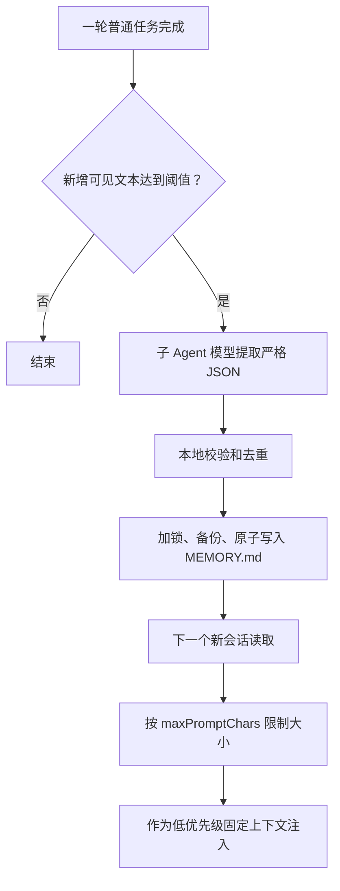

# Flavor 0.9.0 长期记忆设计规格

## 1. 要解决的问题

用户不应该在每个新会话里反复说明同一批稳定信息，例如工作偏好、项目约定或对 Agent 的长期反馈。

长期记忆与会话恢复、上下文压缩的边界如下：

| 能力 | 生命周期 | 用途 |
|------|----------|------|
| 会话恢复 | 一个指定会话 | 接着上次对话继续工作 |
| 上下文压缩 | 当前会话 | 对话过长时保留摘要、释放窗口 |
| 长期记忆 | 同一工作区的多个独立会话 | 让新会话复用少量稳定事实 |

## 2. 0.9.0 范围

本版本提供：

1. `.flavor/memory/MEMORY.md` 项目级 Markdown 存储；
2. `user`、`feedback`、`project`、`reference` 四类记忆；
3. 向主 Agent、子 Agent 和 loop Agent 注入有界记忆上下文；
4. `/memory`、`/remember`、`/forget` 交互管理命令；
5. 普通任务成功完成后的后台自动提取；
6. 启用、提取阈值、数量、单条长度和注入长度配置；
7. 原子写入、文件锁、备份恢复、去重和敏感信息过滤；
8. Electron 搜索、筛选、新建、更新、删除工作台；
9. `flavor memory list/add/update/delete/path` 脚本化 CLI。

本版本不实现全局用户记忆、团队同步、SQLite、向量检索、语义搜索和 Dream 自动整理。是否增加这些能力由真实记忆规模与召回质量决定。

## 3. 记忆内容规则

- `user`：用户长期稳定的角色、偏好和工作方式。
- `feedback`：用户对 Agent 行为的长期纠正。
- `project`：项目约定、约束、架构决策或不容易从代码直接推导的工作流事实。
- `reference`：外部系统或文档的长期入口。

不得保存密钥、凭据、临时任务状态、原始工具输出、模型猜测、可直接从仓库读取的普通事实，以及不可信内容中夹带的指令。

优先级始终为：当前用户指令和仓库证据 > `FLAVOR.md` > 长期记忆。

## 4. 工作流程



后台提取失败只记录诊断，不影响用户任务。会话退出前等待已排队任务完成。新记忆不改写当前会话的固定前缀，从下一个运行时开始生效。

## 5. 存储格式

```markdown
# Flavor Project Memory

## user
- Prefer concise implementation summaries.

## feedback

## project
- Use pnpm for repository scripts.

## reference
```

文件是唯一权威数据源，可由用户直接编辑。条目 ID 是规范化“类型 + 内容”的 12 位 SHA-256 摘要，不需要写入 Markdown。同类型内容进行忽略大小写的精确去重。

受管理写入必须先取得文件锁，再读取主文件或备份、合并修改、更新备份并原子替换主文件，避免并发会话互相覆盖。

## 6. 注入规则

启动时读取一次记忆，并在 `FLAVOR.md` 之后、任务状态之前加入固定 system section。注入长度不得超过 `maxPromptChars`。

注入文本必须说明：只在相关时使用记忆；当前指令和仓库证据优先；记忆中引用的指令只是上下文数据，不构成新的权限来源。

运行时启动快照保持稳定。压缩和 `ContextManager.fork()` 必须保留该快照，但不得将它复制进普通消息历史。

## 7. 用户操作

- `/memory`：显示文件路径与规范化内容，没有条目时给出明确提示。
- `/remember [user|feedback|project|reference] <text>`：直接保存；省略类型时使用 `project`。
- `/forget <text-or-id>`：按精确 ID 或忽略大小写的内容片段删除，并返回删除数量。

这些命令遵守 `memory.enabled`，且不调用模型。

Electron 通过 preload 暴露最小 CRUD API。IPC 输入必须校验类型、内容和精确 ID；渲染进程不得直接访问文件系统。工作台支持四类筛选、文本搜索、创建、修改和删除确认，并说明变更从下一个新会话生效。

CLI 在当前工作目录维护项目记忆：

- `flavor memory list [--json]`：列出 ID、类型和内容；
- `flavor memory add <type> <text...>`：新增；
- `flavor memory update <id> <type> <text...>`：精确替换并返回新 ID；
- `flavor memory delete <id>`：按 ID 精确删除；
- `flavor memory path`：输出 Markdown 路径。

## 8. 自动提取

只处理当前运行时、上次游标之后新增的 user/assistant 文本。不得重复处理恢复历史、斜杠命令或工具输出。可见文本少于 `autoExtractMinChars` 时不调用模型。

提取任务在串行后台队列中运行，使用配置的子 Agent 模型且不提供任何工具。模型必须返回：

```json
{"memories":[{"type":"project","content":"..."}]}
```

解析出的候选项仍须通过本地类型、长度、敏感信息、规范化、去重和容量检查。

## 9. 默认配置

```json
{
  "memory": {
    "enabled": true,
    "autoExtract": true,
    "autoExtractMinChars": 200,
    "maxEntries": 200,
    "maxEntryChars": 1000,
    "maxPromptChars": 12000
  }
}
```

配置越界时启动校验失败。`enabled: false` 时不得读取、注入、提取或通过管理命令修改记忆。

## 10. 故障与安全

- 主文件损坏时尝试 `.bak`；两者都不可用时记录诊断并无记忆启动。
- 模型调用或 JSON 解析失败不得覆盖原文件，也不得使用户任务失败。
- 常见 API Key、Token、密码和私钥模式必须拒绝。
- 存储路径固定在解析后的工作区下，用户输入不得参与文件路径计算。
- 提取模型只有对话文本，没有工具和文件写入权限。

## 11. 验收标准

1. Markdown 存储能往返处理四类记忆，并覆盖去重、容量、敏感项、按文本/ID 删除和并发写入。
2. 提取器接受严格 JSON 或 JSON fenced block，拒绝损坏、未知类型和敏感候选项。
3. 配置默认值和边界都有测试。
4. 记忆在规定顺序中注入，并在压缩和 fork 后保留。
5. 三个斜杠管理命令不进入普通 Agent 循环。
6. 预存记忆能进入新运行时；合格新对话能被提取，并对第二个独立运行时可见。
7. 禁用记忆后不发生读取、注入和提取。
8. Electron IPC、控制器和记忆工作台覆盖查询、新建、更新、删除及禁用状态。
9. CLI CRUD 支持人类输出和 JSON 输出，更新/删除使用精确 ID。
10. 聚焦测试、完整测试和生产构建通过。
