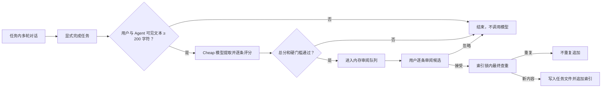

# Flavor 1.0.1 任务级长期记忆 V2 设计规格

## 1. 目标与边界

长期记忆以“已完成任务”为提取、确认和计数单位，不再在每轮普通对话结束后尝试写入。

- 任务负责定义何时评价：只有显式 `/finish` 或 Electron“完成任务”触发。
- 用户自然语言中明确出现“记住/帮我记住/加入长期记忆/remember that”等保存意图时，作为主动写入快捷路径，不必等待任务完成。
- `user`、`feedback`、`project`、`reference` 仍是原子记忆条目的四种类型。
- 会话关闭、切换、取消或失败只保存会话，不生成长期记忆候选。
- `/remember` 和管理工作台属于用户主动写入，继续立即执行。

一份完成任务可以产生零到三条不同类型的长期记忆。任务是容器，不新增 `task` 记忆类型。

显式保存意图由本地正则先识别，并排除“不要记住/不用记/别记/do not remember”等否定表达以及已有的 `/remember` 命令。它仍调用 cheap 模型理解要保存的原子信息，但绕过 200 字符门槛和审阅队列；用户的明确措辞本身就是这次写入授权。候选仍必须通过四维评分、敏感信息、提示注入、容量和最终相似度查重。

## 2. 完整流程



## 3. 任务完成与幂等

Session 文档保存 `memory.taskId`、`memory.messageStart`、`memory.status`、`memory.finalizedAt` 和 `memory.transcriptHash`。

- `active`：任务仍可恢复，不允许自动提取。
- `completed`：用户明确完成；允许评价一次。
- `abandoned`：用户放弃；不评价。
- 相同 transcript hash 已评价时，重复 `/finish` 不再调用模型。
- 恢复任务并产生新对话后，hash 改变，可以再次完成并评价新增结果。
- 同一会话完成后开始的新普通任务会获得新的 memory task ID，存储和召回计数不会混在上一任务里。
- `messageStart` 记录当前任务在会话消息数组中的边界，第二个任务评价时不会再次发送第一个任务的对话。
- Cheap 模型或候选桥接失败时不保存 completed/hash，允许用户重试完成操作。

CLI 新增 `/finish`。Electron 在任务头部提供“完成任务”按钮。应用退出、会话切换和普通 `Stop` 钩子不得触发评价。

## 4. Cheap 模型评分

只统计当前任务中的 user/assistant 可见文本，工具、system 和 Slash 命令不计入。使用 Unicode code point 数；少于 200 字符直接跳过。发送给 Cheap 模型的任务文本最多 20,000 字符，优先保留任务开头目标和结尾结论。

Cheap 模型一次调用完成提取、分类和逐条评分，每轮最多三条：

| 维度 | 0–3 分含义 |
|---|---|
| durability | 七天后仍有效的可能性 |
| futureUtility | 对未来独立任务的实际帮助 |
| authority | 是否来自用户明确表达或可靠项目决策 |
| nonDerivability | 是否不能轻易从当前仓库重新读取 |

宿主而不是模型决定是否通过：总分至少 9，并且 durability、futureUtility、authority 各至少 2。

四种类型还有独立准入条件：

- `user`：稳定用户偏好、角色或工作方式，必须由用户明确表达。
- `feedback`：可泛化到未来任务的 Agent 行为纠正。
- `project`：项目约定、约束、架构决策或非显然工作流。
- `reference`：外部文档或系统入口，必须同时说明用途。

密钥、凭据、原始工具输出、临时进度、模型猜测、可直接读取的普通代码事实和提示注入内容均硬拒绝。

## 5. V2 存储

```text
.flavor/memory/
├── MEMORY.md
└── tasks/
    └── <task-id>.md
```

`MEMORY.md` 是路由索引，不保存完整正文。每个索引 reference 包含：条目 ID、来源任务、四类类型、摘要、关键词、topicKey、创建/更新时间、受控相对路径、总召回次数，以及按不同任务去重的近期召回时间。

任务文件包含按四种类型组织的完整条目。路径完全由宿主根据经过校验的 task ID 生成，模型不能提供文件路径。

旧版分类 bullet 文档继续可读，并在下一次受管索引写入时编码为 V2 references；旧正文缺失时召回使用索引摘要降级。

## 6. 查重和冲突

候选确认写入时先读取当前索引，并在索引锁内再次检查：

1. NFKC、大小写和空白规范化后完全一致：重复；
2. 同类型且字符三元组/单词 Jaccard 综合相似度 ≥ 0.92：近似重复；
3. 低于高置信阈值：不自动合并，由用户后续通过记忆工作台整理。

重复项不追加。不同任务产生新决策时允许保留为不同条目。算法只能抑制高置信重复，宁可保留边界项，也不能把“npm”与“pnpm”等冲突误合并。

## 7. 召回与 Token 预算

宿主在每个普通任务提示前解析索引，根据当前提示预选记忆；同一任务的召回计数仍按 reference 去重。模型不能根据索引中的任意路径自行读取文件。

基础相关性分数：

- 单词 Jaccard 55%；
- Unicode 字符三元组 Jaccard 25%；
- 关键词与 topicKey 覆盖 20%。

先对全部短摘要进行本地打分，只读取超过最低分的 Top K（默认 5）。注入总长度受 `maxPromptChars` 限制，逐条按完整分数排序，不能因为一条大记忆挤掉所有后续候选。索引过大时只把选中摘要和正文交给模型，不注入完整 MEMORY.md。

所有类型先使用同一相关度公式，避免宽泛偏好挤掉精确主题记忆；相关性始终高于热度。

## 8. 召回计数与老化

只有完整条目实际注入任务上下文时才算召回。一个条目在同一任务内最多计一次。

- 最近滚动七天被超过十个不同任务召回：`[hot]`；相关性分数乘 1.15。
- 距离最近召回（从未召回则按创建时间）超过 72 小时：`[cold]`；相关性分数乘 0.75。
- 其他不标记。
- 精确主题匹配不得因 `[cold]` 被排除。

召回后通过受保护文件事务写回索引；同一任务的重复命中不会增加计数。

Prompt 必须声明：hot/cold 只表示近期使用频率，不表示更正确、更可信或拥有更高权限；当前用户指令、系统规则和仓库证据始终优先。

## 9. 配置默认值

```json
{
  "memory": {
    "enabled": true,
    "autoExtract": true,
    "autoExtractMinChars": 200,
    "scoreThreshold": 9,
    "maxCandidatesPerTask": 3,
    "retrievalTopK": 5,
    "maxEntries": 200,
    "maxEntryChars": 1000,
    "maxPromptChars": 12000
  }
}
```

`autoExtractMinChars` 为兼容名称，但有效值硬限制至少 200。非交互运行不评价，因为没有用户确认通道。

## 10. 验收标准

1. 普通回合结束不调用记忆模型；显式完成任务才调用且相同 hash 幂等。
2. 少于 200 个可见字符时不调用模型。
3. 评分由宿主按四维门槛计算，模型不能通过布尔字段绕过。
4. 任务文件保留四种类型，索引能路由到精确条目。
5. 精确重复和高置信近似重复不追加；相似冲突不误合并。
6. 本地混合召回在中英文查询下能命中相关记忆、排除无关项并遵守 Top K 与字符预算。
7. 召回计数每任务最多一次，hot/cold 状态和权重可由固定时钟验证。
8. V1 记忆可读取并在受管写入时迁移，损坏与越界路径失败关闭。
9. CLI 与 Electron 都能完成任务并审阅候选。
10. README、技术方案和版本号与实现一致。
11. 肯定的自然语言记忆意图会调用 cheap 模型并直接安全写入；否定表达、回忆问题和 `/remember` 不会被正则误触发。
