# flavor-code 技术方案报告

> 版本：0.1.0 | 语言：TypeScript | 运行时：Node.js ≥20 | 包管理器：npm

---

## 1. 项目概述

**flavor-code** 是一个运行在终端里的 AI 编程助手。它不像传统 IDE 插件那样需要图形界面——你只要在命令行里和它对话，它就能阅读代码、搜索文件、修改项目、执行命令、拆分复杂任务并调度多个子 Agent 并行工作，就像一个坐在你旁边的资深程序员。

从架构上讲，它是一个实现了 "ReAct 循环"（Reasoning + Acting）的本地 Agent 框架：接入大语言模型（OpenAI GPT、Anthropic Claude 或兼容服务），在工作区权限范围内安全操作文件，通过分层上下文压缩突破单次模型窗口限制，并通过任务 DAG 实现结构化多步协作。

本报告面向开发者、架构师以及希望深入理解 Agent 系统的技术人员，从目标定位、架构设计、核心子系统到安全策略逐一展开。

---

## 2. 目标与非目标

### 2.1 0.1.0 版本目标

- 提供 `npm install -g flavor-code` 一键安装的终端编程 Agent
- 统一接入多种模型 provider（OpenAI、Anthropic、OpenAI 兼容）
- 以可取消的流式循环调用本地工具（文件读写、搜索、Shell 等）
- 在权限与 Hook 边界内安全运行
- 支持受限于 workspace 权限的子 Agent 进行 DAG 任务并行
- 通过分层上下文压缩跨越单次模型窗口
- 按需加载 Skill（技能包）与可信插件
- 通过 `/loop <goal>` 运行具备宿主验证、预算门槛、隔离与持久化证据的 loop-engineering 外循环
- 在 Windows / macOS 上验证构建和安装

### 2.2 非目标（明确排除）

- 后台 Session Memory（持久化记忆系统）
- Anthropic cache editing
- 压缩后的文件/Skill 附件恢复
- Partial compact UI（渐进式压缩界面）
- IDE 原生协议/扩展
- 云端会话同步 / 多设备协作
- 操作系统级沙箱
- 精确 tokenizer（使用字符估算兜底）
- 授权服务器端实现（委托给 flavor-pkce 项目）

---

## 3. 系统架构总览

### 3.1 模块依赖拓扑

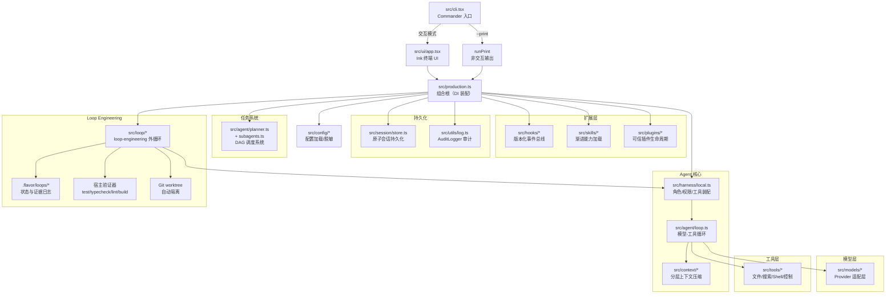
```mermaid
flowchart TD
    CLI["src/cli.tsx<br/>Commander 入口"]
    CLI -->|交互模式| UI["src/ui/app.tsx<br/>Ink 终端 UI"]
    CLI -->|--print| PRINT["runPrint<br/>非交互输出"]
    UI --> PROD["src/production.ts<br/>组合根（DI 装配）"]
    PRINT --> PROD

    PROD --> CFG["src/config/*<br/>配置加载/脱敏"]
    PROD --> HARNESS["src/harness/local.ts<br/>角色/权限/工具装配"]
    PROD --> TASK_SYS["src/agent/planner.ts<br/>+ subagents.ts<br/>DAG 调度系统"]
    PROD --> HOOKS["src/hooks/*<br/>版本化事件总线"]
    PROD --> SKILLS["src/skills/*<br/>渐进能力加载"]
    PROD --> PLUGINS["src/plugins/*<br/>可信插件生命周期"]
    PROD --> SESSION["src/session/store.ts<br/>原子会话持久化"]
    PROD --> AUDIT["src/utils/log.ts<br/>AuditLogger 审计"]
    PROD --> OUTER["src/loop/*<br/>loop-engineering 外循环"]

    HARNESS --> LOOP["src/agent/loop.ts<br/>模型-工具循环"]
    OUTER --> HARNESS
    OUTER --> LOOP_STATE[".flavor/loops/*<br/>状态与证据日志"]
    OUTER --> VERIFY["宿主验证器<br/>test/typecheck/lint/build"]
    OUTER --> ISOLATE["Git worktree<br/>自动隔离"]
    LOOP --> CTX["src/context/*<br/>分层上下文压缩"]
    LOOP --> MODELS["src/models/*<br/>Provider 适配层"]
    LOOP --> TOOLS["src/tools/*<br/>文件/搜索/Shell/控制"]

    subgraph "Agent 核心"
        LOOP
        CTX
        HARNESS
    end

    subgraph "模型层"
        MODELS
    end

    subgraph "工具层"
        TOOLS
    end

    subgraph "扩展层"
        HOOKS
        SKILLS
        PLUGINS
    end

    subgraph "持久化"
        SESSION
        AUDIT
    end

    subgraph "任务系统"
        TASK_SYS
    end

    subgraph "Loop Engineering"
        OUTER
        LOOP_STATE
        VERIFY
        ISOLATE
    end
```

**关键设计原则：**

- **组合根集中装配** — `createProductionRuntime()` 负责所有依赖注入，业务模块之间以窄接口连接
- **单向依赖** — `AgentLoop` 不读配置、不操作 UI；`SessionStore` 不接收 provider 配置，从类型边界减少凭据落盘风险
- **隔离上下文** — 主 Agent 和每个子 Agent 拥有独立的 `ContextManager` 和 `ToolRuntime` 实例

### 3.2 全链路时序

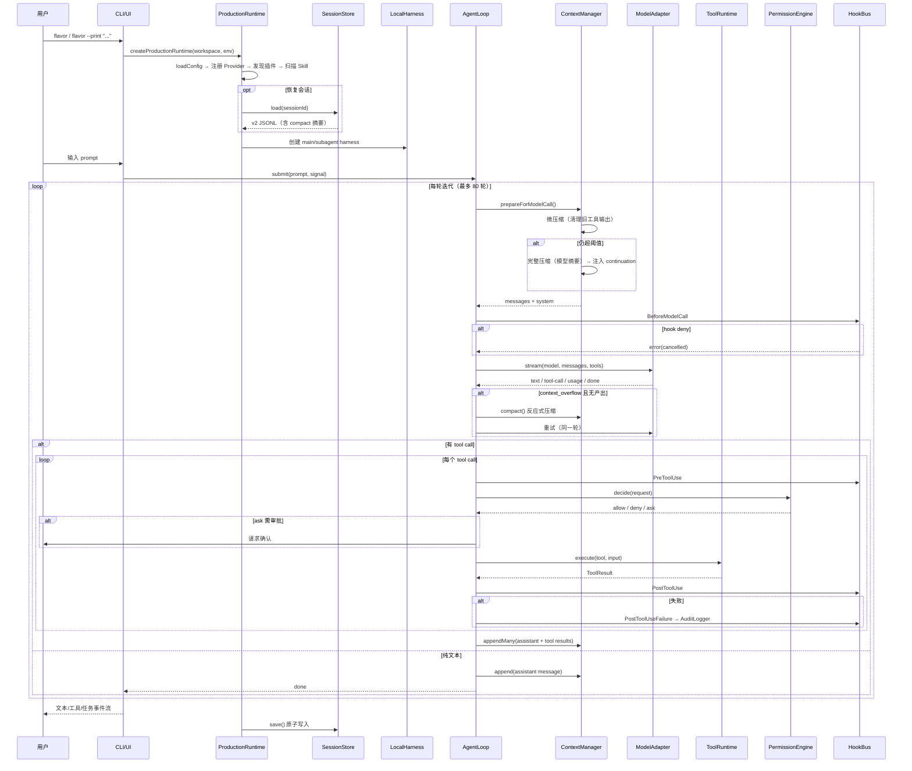
```mermaid
sequenceDiagram
    participant U as 用户
    participant CLI as CLI/UI
    participant P as ProductionRuntime
    participant S as SessionStore
    participant H as LocalHarness
    participant L as AgentLoop
    participant C as ContextManager
    participant M as ModelAdapter
    participant T as ToolRuntime
    participant PE as PermissionEngine
    participant HK as HookBus

    U->>CLI: flavor / flavor --print "..."
    CLI->>P: createProductionRuntime(workspace, env)
    P->>P: loadConfig → 注册 Provider → 发现插件 → 扫描 Skill
    opt 恢复会话
        P->>S: load(sessionId)
        S-->>P: v2 JSONL（含 compact 摘要）
    end
    P->>H: 创建 main/subagent harness

    U->>CLI: 输入 prompt
    CLI->>L: submit(prompt, signal)

    loop 每轮迭代（最多 80 轮）
        L->>C: prepareForModelCall()
        C->>C: 微压缩（清理旧工具输出）
        alt 仍超阈值
            C->>C: 完整压缩（模型摘要）→ 注入 continuation
        end
        C-->>L: messages + system

        L->>HK: BeforeModelCall
        alt hook deny
            HK-->>L: error(cancelled)
        end

        L->>M: stream(model, messages, tools)
        M-->>L: text / tool-call / usage / done

        alt context_overflow 且无产出
            L->>C: compact() 反应式压缩
            L->>M: 重试（同一轮）
        end

        alt 有 tool call
            loop 每个 tool call
                L->>HK: PreToolUse
                L->>PE: decide(request)
                PE-->>L: allow / deny / ask
                alt ask 需审批
                    L->>U: 请求确认
                end
                L->>T: execute(tool, input)
                T-->>L: ToolResult
                L->>HK: PostToolUse
                alt 失败
                    L->>HK: PostToolUseFailure → AuditLogger
                end
            end
            L->>C: appendMany(assistant + tool results)
        else 纯文本
            L->>C: append(assistant message)
            L-->>CLI: done
        end
    end

    CLI-->>U: 文本/工具/任务事件流
    P->>S: save() 原子写入
```

---

## 4. 启动与配置系统

### 4.1 入口路由

`src/cli.tsx` 基于 Commander 实现三个入口：

| 模式 | 命令 | 说明 |
|------|------|------|
| 交互模式 | `flavor` | 全功能 Ink 终端 UI，支持 slash 命令、审批面板、任务进度 |
| 非交互模式 | `flavor --print "..."` | 单次执行，所有审批默认拒绝（deny policy） |
| 会话恢复 | `flavor --resume [id]` | 从 `.flavor/sessions/` 恢复历史会话继续工作 |

非 TTY 且无 `--print` 时退出码 2 并提示用法。

### 4.2 配置加载优先级

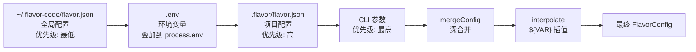
```mermaid
flowchart LR
    A["~/.flavor-code/flavor.json<br/>全局配置<br/>优先级: 最低"] --> B[".env<br/>环境变量<br/>叠加到 process.env"]
    B --> C[".flavor/flavor.json<br/>项目配置<br/>优先级: 高"]
    C --> D["CLI 参数<br/>优先级: 最高"]
    D --> E["mergeConfig<br/>深合并"]
    E --> F["interpolate<br/>${VAR} 插值"]
    F --> G["最终 FlavorConfig"]
```

- `${VAR}` 插值优先从 `.env` 取值，其次 `process.env`
- `redactConfig()` 对 `apiKey`、`authorization`、`token` 字段脱敏为 `[redacted]`
- 会话保存前递归扫描并删除敏感字段（`authorization`、`api_key`、`access_token`、`sk-*`）

### 4.3 核心配置项

```typescript
FlavorConfigSchema = {
  providers: {                          // 模型提供商
    [name]: {
      type: "openai" | "anthropic" | "openai-compatible",
      baseURL, apiKey, defaultModel, cheapModel
    }
  },
  agents: {
    main: { model: "provider:model" }, // 主 Agent 模型
    subagent: { model: "provider:model" } // 子 Agent 模型
  },
  maxSubagents: 1-16,                  // 子 Agent 最大并行数（默认 3）
  permissionMode: "safe" | "workspace" | "full", // 默认 workspace
  language: "zh-CN",                   // BCP47 语言标签
  maxIterations: {
    main: 10-500,                      // 主 Agent 迭代上限（默认 80）
    subagent: 10-200,                  // 子 Agent 迭代上限（默认 40）
    softLimitFactor: 0.8,              // 软限制比例
    extendBy: 20                       // 扩展步数
  },
  loop: {
    maxCycles: 20,                     // 每次用户授权增加的 cycle 数
    maxTokens: 500_000,                // 每次用户授权增加的模型 token 数
    isolation: "auto"                  // 只读用当前目录；改代码自动用 worktree
  },
  context: {
    windowTokens: 200_000,             // 模型上下文窗口
    reservedOutputTokens: 20_000,      // 保留给输出
    autoCompactBufferTokens: 13_000,   // 自动压缩缓冲
    toolOutputChars: 30_000,           // 单次工具输出截断
    microcompactKeepRecentToolResults: 5 // 微压缩保留数
  }
}
```

---

## 5. Agent 核心循环

### 5.1 迭代控制

`AgentLoop.run()` 是一个 `async *` 生成器，输出 `AgentEvent` 事件流，由消费方（UI 或子 Agent 调用者）通过 `for await...of` 消费。

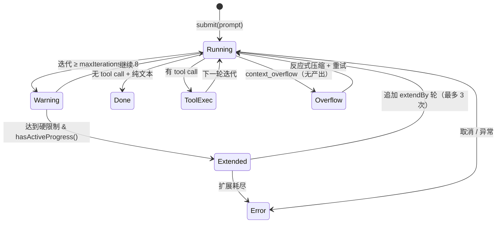
```mermaid
stateDiagram-v2
    [*] --> Running: submit(prompt)
    Running --> Warning: 迭代 ≥ maxIterations × 0.8
    Warning --> Running: 继续
    Warning --> Extended: 达到硬限制 & hasActiveProgress()
    Extended --> Running: 追加 extendBy 轮（最多 3 次）
    Extended --> Error: 扩展耗尽
    Running --> Done: 无 tool call + 纯文本
    Running --> ToolExec: 有 tool call
    ToolExec --> Running: 下一轮迭代
    Running --> Overflow: context_overflow（无产出）
    Overflow --> Running: 反应式压缩 + 重试
    Running --> Error: 取消 / 异常
```

**软限制**：迭代达到 80% 时发出 `warning` 事件，告知用户剩余轮数有限。

**硬限制 + 自动扩展**：到达上限时检查 `hasActiveProgress()`——如果存在 `in_progress` 的主任务或 `running` 的子 Agent，自动追加扩展轮数（默认 20 轮，最多 3 次扩展）。子 Agent 不可扩展。

### 5.2 单轮循环详解

```
prepareForModelCall()
  ├── 自动微压缩（快速清理旧工具输出）
  ├── needsCompaction() 判断
  │     └── 完整压缩（模型摘要）
  └── 返回 messages + system
       ↓
BeforeModelCall hook（可 deny）
       ↓
adapter.stream(model, messages, tools)
  ├── text → yield text 事件
  ├── tool-call → 暂存
  ├── usage → 回写 ContextManager
  └── context_overflow → 反应式压缩 + 重试（最多 1 次）
       ↓
AfterModelCall hook
       ↓
有 tool calls?
  ├── 是 → 逐个执行
  │     ├── PreToolUse hook
  │     ├── PermissionEngine.decide()
  │     ├── tool.execute()
  │     ├── PostToolUse hook
  │     └── 失败时 PostToolUseFailure → AuditLogger
  │     └── appendMany(assistant + tool results)
  └── 否 → append(assistant message) → done
```

关键设计细节：

- **整轮暂存**：工具调用整轮暂存后一次性 `appendMany()` 提交 assistant + tool 消息，保证 provider 对话结构有效
- **反应式压缩**：正常请求在尚未产生文本或工具调用时若返回 `context_overflow`，循环在同一 iteration 内强制压缩并重建请求，最多重试一次。若已有可见输出则不重试，避免拼接
- **取消安全**：通过 `AbortSignal` 支持取消，取消后立即合成错误结果并清理

### 5.3 Loop Engineering 外循环

#### 调研结论与边界

截至 2026-07-15，外部资料对 loop engineering 的共同定义不是“把同一个 prompt 无限重试”，而是设计 Agent 外部的控制系统：明确目标、状态、权限、独立验证、反馈路径、停止规则和记忆。论文 *Stop Hand-Holding Your Coding Agent* 将可复用 loop specification 概括为 trigger、goal、verification、stopping rule 和 memory；[Loop Engineering](https://loopengineering.sh/) 也强调它是围绕 Agent 的控制系统。OpenAI 对 [Codex agent loop](https://openai.com/index/unrolling-the-codex-agent-loop/) 的说明则对应本项目已有的内部“模型—工具—观察”循环；[Harness engineering](https://openai.com/index/harness-engineering/) 展示了在其外层通过审查与反馈继续迭代的实践。

因此本项目明确区分两层：

- `AgentLoop` 是一次 worker 内部的 ReAct 循环，模型无工具调用时即可结束。
- `LoopOrchestrator` 是宿主持有的外循环，worker 的“完成”只表示请求验证；只有宿主验证器通过才产生 `succeeded`。

这种分层也用于控制无限循环风险。[When Agents Do Not Stop](https://arxiv.org/abs/2607.01641) 指出，无有效边界的 Agent 循环会放大成本、上下文增长和重复副作用，因此实现必须同时具备预算门槛、可取消性、无进展熔断和具名终态。

#### 命令与运行流程

用户只需调用：

```text
/loop <goal>
```

`loop` 是保留的内置命令，插件或普通 Skill 不能覆盖。方法论由内置 Loop Skill 注入每个新 cycle；调度、验证、预算、持久化和终态判断属于核心运行时，不能由模型自行批准。

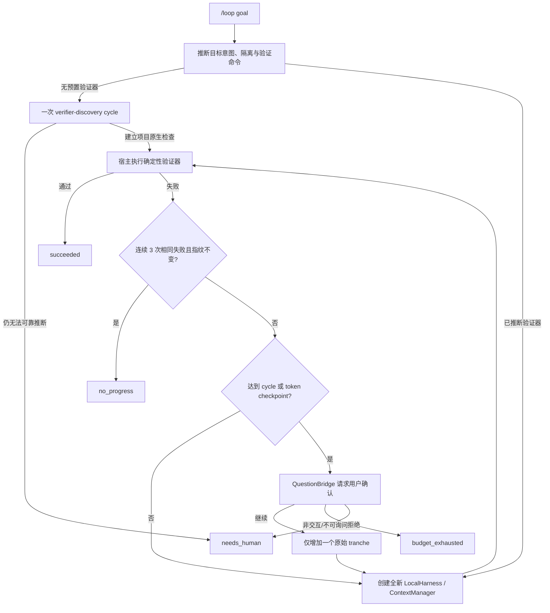
```mermaid
flowchart TD
    START["/loop goal"] --> RESOLVE["推断目标意图、隔离与验证命令"]
    RESOLVE -->|无预置验证器| DISCOVERY["一次 verifier-discovery cycle"]
    DISCOVERY -->|仍无法可靠推断| HUMAN["needs_human"]
    DISCOVERY -->|建立项目原生检查| VERIFY
    RESOLVE -->|已推断验证器| WORKER["创建全新 LocalHarness / ContextManager"]
    WORKER --> VERIFY["宿主执行确定性验证器"]
    VERIFY -->|通过| SUCCESS["succeeded"]
    VERIFY -->|失败| PROGRESS{"连续 3 次相同失败且指纹不变?"}
    PROGRESS -->|是| STUCK["no_progress"]
    PROGRESS -->|否| BUDGET{"达到 cycle 或 token checkpoint?"}
    BUDGET -->|否| WORKER
    BUDGET -->|是| CONFIRM["QuestionBridge 请求用户确认"]
    CONFIRM -->|继续| EXTEND["仅增加一个原始 tranche"]
    EXTEND --> WORKER
    CONFIRM -->|拒绝| EXHAUSTED["budget_exhausted"]
    CONFIRM -->|非交互/不可询问| HUMAN
```

#### 验证与隔离推断

验证器按稳定顺序读取 `package.json` 中的 `test`、`typecheck`、`lint`、`build`、`smoke:install`，也识别 `FLAVOR.md` 中明确列出的受信任 npm 命令。命令由宿主的 Shell 工具执行，退出码、截断后的 stdout/stderr 和摘要写入 cycle evidence。若启动时没有确定性命令，调度器不会在 `0 token` 处退出，而是先运行一次 verifier-discovery cycle：worker 检查项目并建立有意义的项目原生检查，宿主随后重新推断并执行。显然无条件成功的脚本（如 `exit 0`、`echo ok`）不会被信任；discovery 后仍没有可靠命令才进入 `needs_human`，不会用模型自述替代证据。

`isolation: "auto"` 的规则是：只读目标使用当前 workspace；代码修改目标及语义不明确的目标要求干净 Git 仓库，并创建 `.worktrees/loop-<id>` 与 `loop/<id>` 分支。`.worktrees/` 只写入仓库本地 `.git/info/exclude`，不修改共享 `.gitignore`。隔离失败时进入 `needs_human`，不会静默降级到主工作区。

#### 分段预算确认

`loop.maxCycles` 与 `loop.maxTokens` 是授权步长，不是整个 loop 的一次性硬上限。初始 checkpoint 等于配置值；达到门槛后只在当前模型流和宿主验证完成的安全边界询问用户，确认后按原始步长增加：

```text
maxTokens = 5,000,000
5,000,000 → 确认 → 10,000,000 → 确认 → 15,000,000 → ...

maxCycles = 20
20 → 确认 → 40 → 确认 → 60 → ...
```

token 统计包括 worker 的所有模型调用以及上下文压缩模型调用；本地 Shell 验证命令不计 token。用户拒绝产生 `budget_exhausted`；非交互模式无法确认时产生 `needs_human`。预算批准记录维度、旧/新 checkpoint、当时累计用量和时间戳。

#### 状态、持久化与当前限制

每次运行写入 `.flavor/loops/<loop-id>/state.json` 和 `events.jsonl`。snapshot 使用临时文件加原子 rename；journal 追加 cycle、预算和终态事件。具名状态包括 `running`、`succeeded`、`failed`、`blocked`、`cancelled`、`budget_exhausted`、`no_progress`、`needs_human`。

当前版本是前台单 loop：不包含后台调度、跨进程自动恢复、自动 merge/push/deploy、容器沙箱或并发 loop 管理。worktree 与分支会保留供用户检查，不自动合并或删除。`blocked` 已进入持久化协议，首版主要通过权限错误和最终失败证据呈现，尚未对所有工具拒绝原因做精细自动分类。

---

## 6. 上下文管理与压缩系统

### 6.1 消息布局

每次模型请求时，`ContextManager` 按以下层次拼装消息：

```
┌──────────────────────────────────────┐
│  System Prompt（身份/规则/指令）       │  ← #pinnedMessages() 固定层
├──────────────────────────────────────┤
│  FLAVOR.md（项目指南）                 │  ← 可选
├──────────────────────────────────────┤
│  TaskSnapshot（当前任务状态）          │  ← 可选
├──────────────────────────────────────┤
│  Compact Continuation（压缩摘要续接）  │  ← 注入为 user 消息
├──────────────────────────────────────┤
│  近期完整消息（未压缩部分）            │  ← provider-valid messages
└──────────────────────────────────────┘
```

固定层（system、FLAVOR、TaskSnapshot）不参与压缩持久化，每次由新的 ContextManager 重新生成。

### 6.2 三级压缩策略

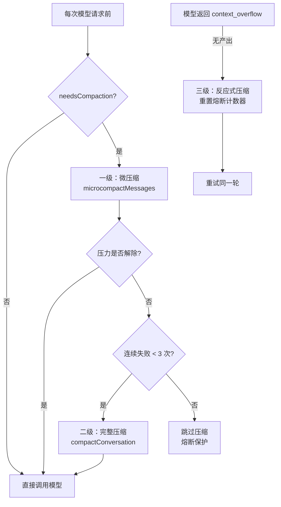
```mermaid
flowchart TD
    REQ[每次模型请求前] --> CHK{needsCompaction?}
    CHK -->|否| GO[直接调用模型]
    CHK -->|是| MICRO[一级：微压缩<br/>microcompactMessages]
    MICRO --> CHK2{压力是否解除?}
    CHK2 -->|是| GO
    CHK2 -->|否| AUTO{连续失败 < 3 次?}
    AUTO -->|是| FULL[二级：完整压缩<br/>compactConversation]
    AUTO -->|否| GO_WARN[跳过压缩<br/>熔断保护]
    FULL --> GO

    OVERFLOW[模型返回 context_overflow] -->|无产出| REACT[三级：反应式压缩<br/>重置熔断计数器]
    REACT --> GO_RETRY[重试同一轮]
```

**一级 — 微压缩（Microcompact）**

- 在完整压缩前快速释放空间
- 识别已完成的可压缩工具调用（Read、Shell、Grep、Glob、Edit、Write、ApplyPatch 等 11 种）
- 保留最近 5 个工具结果（`microcompactKeepRecentToolResults`），其余替换为 `[Old tool result content cleared]`
- 失败可回滚，不破坏对话

**二级 — 完整压缩（Model Summary）**

- 调用当前角色模型（空工具集）生成结构化摘要
- 九段式摘要提示词：用户意图与技术决策、文件与代码区、错误与修复、问题解决、待办项、当前工作、下一步、可选分析草稿
- 保留最近 10K–40K token 或 5 条文本消息，不切断 tool call/result
- 自动压缩连续 3 次失败后熔断（避免重复消耗 API）
- 手动 `/compact` 和反应式压缩绕过熔断
- 通过 `snapshot()` / `restore()` 保存和恢复压缩边界

**三级 — 反应式压缩（Reactive）**

- agent loop 在 `context_overflow` 且无可见输出时触发
- 强制完整压缩并重试同一轮
- 重置自动压缩失败计数器

### 6.3 工具输出截断

单次工具消息按 `toolOutputChars`（默认 30,000 字符）进行头尾截断，中间插入截断标记。截断方式为保留字符级头和尾，避免丢失关键信息的同时控制上下文窗口占用。

### 6.4 压力估算模型

- 模型 usage 的 input tokens 回写 ContextManager
- 下一轮以真实 usage + 新增消息估算增量作为压力基线
- 与完整上下文估算取较大值
- 有效窗口 = `windowTokens - reservedOutputTokens`（默认 180K）
- 自动压缩阈值 = 有效窗口 - `autoCompactBufferTokens`（默认 167K）
- 首次调用和刚追加工具结果时使用字符/4 保守估算兜底

---

## 7. 任务系统

### 7.1 两层状态机

Flavor 有两套独立但互补的任务管理机制：

| 层 | 角色 | 工具 | 状态数 | 特点 |
|----|------|------|--------|------|
| TaskPlan | 主 Agent 对用户的结构化承诺 | TaskPlan、TaskUpdate | 6 种 | DAG 依赖、依赖校验、仅主 Agent 可用 |
| TodoWrite | Agent 自用的轻量进度清单 | TodoWrite | 4 种 | 无依赖、最多 50 项、至多 1 项 in_progress |

### 7.2 TaskPlan 状态机

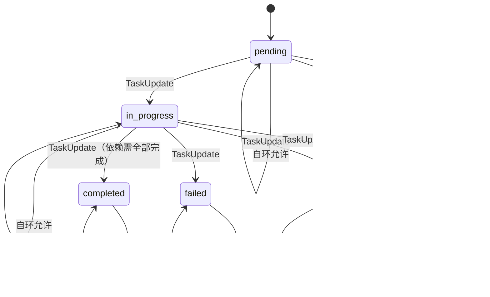
```mermaid
stateDiagram-v2
    [*] --> pending
    pending --> in_progress: TaskUpdate
    pending --> blocked: TaskUpdate
    pending --> cancelled: TaskUpdate
    pending --> pending: 自环允许

    in_progress --> completed: TaskUpdate（依赖需全部完成）
    in_progress --> failed: TaskUpdate
    in_progress --> blocked: TaskUpdate
    in_progress --> cancelled: TaskUpdate
    in_progress --> in_progress: 自环允许

    completed --> completed: 仅自环（终态）
    failed --> failed: 仅自环（终态）
    blocked --> blocked: 仅自环（终态）
    cancelled --> cancelled: 仅自环（终态）
```

**Schema 校验规则：**

- 无重复 ID
- 依赖项必须指向已知 ID
- 不允许重复依赖
- `completed` 节点的所有依赖必须 `completed`
- 最多一个 `in_progress` 任务
- 无循环依赖

`normalizeAbandonedPlan()` 在会话恢复时将所有 `in_progress` 转为 `cancelled`，防止脏状态残留。

### 7.3 子 Agent DAG 调度

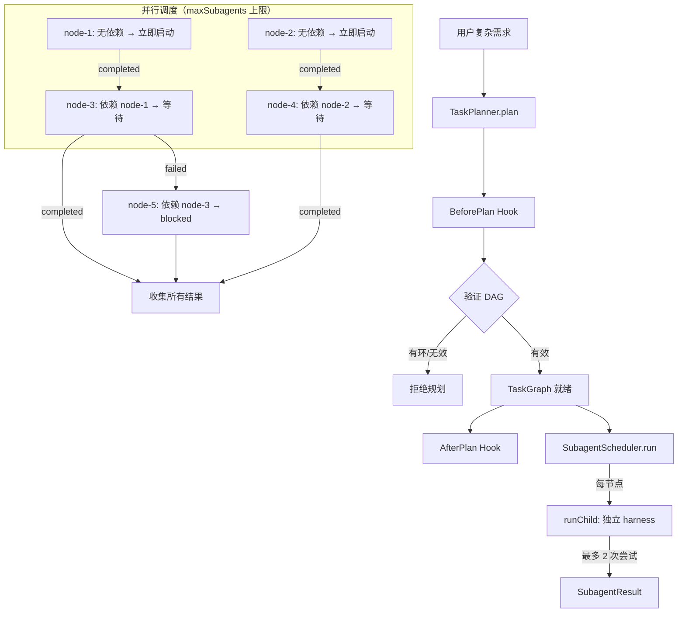
```mermaid
flowchart TD
    PROMPT[用户复杂需求] --> TP[TaskPlanner.plan]
    TP --> HK_BEFORE[BeforePlan Hook]
    HK_BEFORE --> DAG{验证 DAG}
    DAG -->|有环/无效| ERR[拒绝规划]
    DAG -->|有效| TP_OK[TaskGraph 就绪]
    TP_OK --> HK_AFTER[AfterPlan Hook]

    TP_OK --> SCHED[SubagentScheduler.run]

    subgraph "并行调度（maxSubagents 上限）"
        N1[node-1: 无依赖 → 立即启动]
        N2[node-2: 无依赖 → 立即启动]
        N3[node-3: 依赖 node-1 → 等待]
        N4[node-4: 依赖 node-2 → 等待]
    end

    N1 -->|completed| N3
    N2 -->|completed| N4
    N3 -->|completed| DONE[收集所有结果]
    N4 -->|completed| DONE

    N3 -->|failed| N5[node-5: 依赖 node-3 → blocked]
    N5 --> DONE

    SCHED -->|每节点| SUB[runChild: 独立 harness]
    SUB -->|最多 2 次尝试| RESULT[SubagentResult]
```

**调度机制：**

- 最大并行度：`maxSubagents`（1–16，默认 3）
- 基于 `Promise.race` 事件驱动调度
- 依赖传播：失败/blocked 的节点级联阻塞下游
- 每次尝试最多 2 次：第一次不符合 `SubagentResultSchema` 给修复提示，第二次仍非法则合成 failed

**子 Agent 约束：**

- 权限强制 `workspace` 模式
- 工具集合过滤 `Task`、`TaskPlan`、`TaskUpdate`、`AskUserQuestion`（不可委派）
- 独立 `ContextManager`、`ToolRuntime`、`AgentLoop`
- 通过 `TaskOutput` 工具或最终 assistant 消息的 JSON 解析获取结构化结果

---

## 8. Provider 适配层

### 8.1 统一流协议

所有模型 provider 通过 `ModelAdapter.stream()` 接口统一接入，输出五种事件：

```typescript
type ModelEvent =
  | { type: "text"; text: string }           // 流式文本块
  | { type: "tool-call"; ... }               // 工具调用
  | { type: "usage"; inputTokens; ... }      // token 用量
  | { type: "error"; error: ProviderError }  // 标准化错误
  | { type: "done" };                        // 流结束
```

`ModelRegistry` 管理 `Map<string, ModelAdapter>`，模型 ID 格式为 `provider:model`。

### 8.2 错误标准化

`normalizeProviderError()` 将各 SDK 的异常归类为 8 种标准错误码：

| 错误码 | 典型场景 |
|--------|----------|
| `authentication` | API key 无效（401） |
| `rate_limit` | 速率限制（429） |
| `context_overflow` | 上下文超窗口 |
| `output_limit` | max_tokens 耗尽 |
| `model_not_found` | 模型不存在 |
| `network` | 网络/连接异常 |
| `cancelled` | AbortSignal 触发 |
| `unknown` | 未知异常 |

### 8.3 适配器实现要点

**Anthropic（`src/models/anthropic.ts`）**
- 系统消息提升为顶级 `system` 参数
- tool 消息聚合为 `tool_result` 块
- toolCalls 映射为 `tool_use` 块
- 追踪缓存 token（`cache_creation_input_tokens + cache_read_input_tokens`）

**OpenAI（`src/models/openai.ts`）**
- 使用 Responses API 而非 Chat Completions
- 工具消息映射为 `function_call_output`
- toolCalls 映射为 `function_call`
- 所有工具参数使用 `strict: true`
- 通过 `pendingCalls` Map 处理输出索引与调用 ID 的时序问题

---

## 9. 工具系统与权限引擎

### 9.1 工具分类

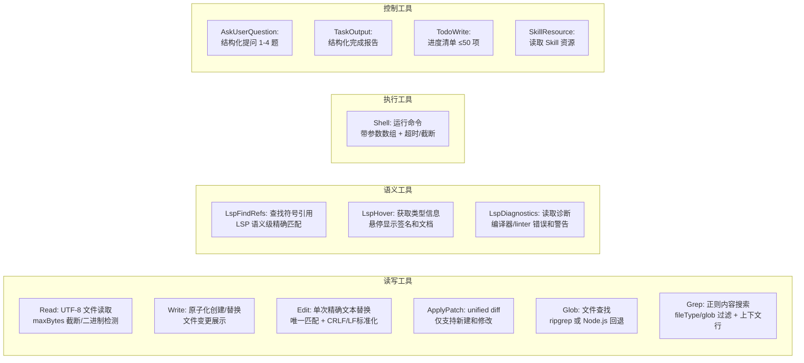
```mermaid
flowchart LR
    subgraph "读写工具"
        READ[Read: UTF-8 文件读取<br/>maxBytes 截断/二进制检测]
        WRITE[Write: 原子化创建/替换<br/>文件变更展示]
        EDIT[Edit: 单次精确文本替换<br/>唯一匹配 + CRLF/LF标准化]
        PATCH[ApplyPatch: unified diff<br/>仅支持新建和修改]
        GLOB[Glob: 文件查找<br/>ripgrep 或 Node.js 回退]
        GREP[Grep: 正则内容搜索<br/>fileType/glob 过滤 + 上下文行]
    end

    subgraph "语义工具"
        LSP_REF[LspFindRefs: 查找符号引用<br/>LSP 语义级精确匹配]
        LSP_HOV[LspHover: 获取类型信息<br/>悬停显示签名和文档]
        LSP_DIAG[LspDiagnostics: 读取诊断<br/>编译器/linter 错误和警告]
    end

    subgraph "执行工具"
        SHELL[Shell: 运行命令<br/>带参数数组 + 超时/截断]
    end

    subgraph "控制工具"
        ASK[AskUserQuestion:<br/>结构化提问 1-4 题]
        OUTPUT[TaskOutput:<br/>结构化完成报告]
        TODO[TodoWrite:<br/>进度清单 ≤50 项]
        SKILL_RES[SkillResource:<br/>读取 Skill 资源]
    end
```

### 9.2 权限引擎决策树

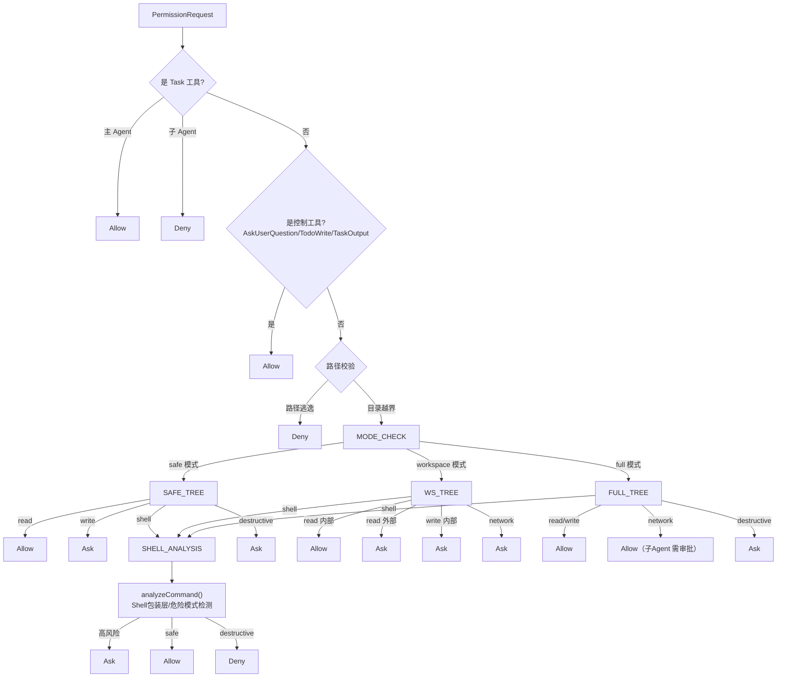
```mermaid
flowchart TD
    REQ[PermissionRequest] --> T1{是 Task 工具?}
    T1 -->|主 Agent| A1[Allow]
    T1 -->|子 Agent| D1[Deny]

    T1 -->|否| T2{是控制工具?<br/>AskUserQuestion/TodoWrite/TaskOutput}
    T2 -->|是| A2[Allow]

    T2 -->|否| T3{路径校验}
    T3 -->|路径逃逸| D2[Deny]
    T3 -->|目录越界| MODE_CHECK

    MODE_CHECK -->|safe 模式| SAFE_TREE
    MODE_CHECK -->|workspace 模式| WS_TREE
    MODE_CHECK -->|full 模式| FULL_TREE

    SAFE_TREE -->|read| A3a[Allow]
    SAFE_TREE -->|write| ASK3a[Ask]
    SAFE_TREE -->|shell| SHELL_ANALYSIS
    SAFE_TREE -->|destructive| ASK3b[Ask]

    WS_TREE -->|read 内部| A3b[Allow]
    WS_TREE -->|read 外部| ASK3c[Ask]
    WS_TREE -->|write 内部| ASK3d[Ask]
    WS_TREE -->|shell| SHELL_ANALYSIS
    WS_TREE -->|network| ASK3e[Ask]

    FULL_TREE -->|read/write| A3c[Allow]
    FULL_TREE -->|shell| SHELL_ANALYSIS
    FULL_TREE -->|network| A3d[Allow（子Agent 需审批）]
    FULL_TREE -->|destructive| ASK3f[Ask]

    SHELL_ANALYSIS --> CMD["analyzeCommand()<br/>Shell包装层/危险模式检测"]
    CMD -->|高风险| ASK_S[Ask]
    CMD -->|safe| ALLOW_S[Allow]
    CMD -->|destructive| DENY_S[Deny]
```

### 9.3 运行时权限链

```
PreToolUse hook → (可 deny / 修改 input)
  → PermissionEngine.decide()
    → 若 ask: 触发 PermissionRequest hook
      → 若 main agent: 调用 approve callback（UI 弹审批面板）
      → 若 "always": 同分类后续放行（destructive 除外）
  → tool.execute()
  → PostToolUse hook
  → 失败时: PostToolUseFailure hook → AuditLogger
```

### 9.4 Shell 安全分类

`analyzeCommand()` 对每个命令执行多层分析：

- **包装层检测**：`sh -c`、`cmd /c`、`powershell -Command` 等会递归提取内部命令进行再分析
- **模式匹配**：删除命令（`rm -rf`、`del /f`）、磁盘操作（`mkfs`、`format`、`dd`）、仓库破坏（`git push --force`、`git reset --hard`）、权限修改（`chmod 777`）等
- **例行命令**：测试、构建、版本控制、包管理、格式化等常规开发命令
- **降级规则**：不透明命令（复杂管道、重定向）、多语句串联自动降级

### 9.5 工具参数提示 (Tool Hint)

每个工具定义可选实现 `summarize(input) → string | undefined` 方法，用于生成工具调用的简短参数摘要，不包含 ANSI 转义序列。`ToolRuntime.hint()` 在工具开始前解析 input 并调用 summarize，返回纯文本字符串。

`AgentLoop` 将 hint 附加到 `tool-start` 和 `tool-end` 事件的可选 `hint` 字段中，沿事件管道传递至 UI 层。`transcriptReducer` 将 hint 存储在 `TranscriptBlock.hint` 字段，`StatusLine` 组件以灰暗文字 (`dimColor`) 在括号中渲染：` (hint)`。长 hint 使用 `truncate-end` 截断并附加省略号，不会导致换行。

目前已为所有控制工具和搜索工具实现 summarize：

| 工具 | 摘要示例 |
|------|----------|
| Shell | `npm run build`（命令 + 参数拼接） |
| Glob | `pattern: "**/*.ts" in src` |
| Grep | `pattern: /import/ [typescript] in src` |
| TodoWrite | `3/7 done · Implementing cache layer` |
| AskUserQuestion | `2 questions · 6 options` |
| TaskOutput | 直接复用 `summary` 字段内容 |

hint 生成失败时安全降级——输入 schema 校验失败、summarize 抛异常或返回空字符串均视为无 hint，不影响工具执行流程。

---

### 9.4 LSP 语义代码分析

传统代码搜索（Grep）只能做**文本匹配**——搜 `handleAuth` 可能返回注释、字符串、甚至不同函数里的同名变量。flavor-code 通过 LSP（Language Server Protocol）实现了**语义级代码理解**。

#### 什么是 LSP

LSP 是微软主导的开放协议。核心理念：一种语言只需写一个 Language Server，所有工具（VS Code、Neovim、flavor-code）都能复用。flavor-code 作为 LSP **客户端**，启动各语言的 Language Server 子进程，通过 JSON-RPC 2.0 over stdio 通信，查询代码的语义信息。

#### 三个 LSP 工具

| 工具 | 作用 | 与 Grep 的对比 |
|------|------|---------------|
| `LspFindRefs` | 找到某个符号的所有引用位置 | Grep 搜到的可能是同名变量、注释、字符串；LSP 只返回同一个符号的精确匹配 |
| `LspHover` | 获取光标处符号的类型定义和文档 | Grep 不支持；LSP 直接返回类型签名和 markdown 文档 |
| `LspDiagnostics` | 读取编译器和 linter 的诊断信息 | Grep 不确定是否有错误；LSP 给出精确的行列号和错误描述 |

#### 架构层次

```
Agent（模型）
  ↓ 调用 LspFindRefs / LspHover / LspDiagnostics
ToolRuntime（统一工具执行）
  ↓ execute()
createLspTools(workspace) → ToolDefinition[]
  ↓ 委托
LspManager（接口：findReferences / hover / diagnostics / dispose）
  ↓ 实现
RealLspManager（会话级管理器）
  ↓ 按需懒启动
LspConnection × N（每种语言一个长连接子进程）
  ↓ JSON-RPC 2.0
Language Server 进程（typescript-language-server / pyright / rust-analyzer / gopls）
```

#### 按需懒启动流程

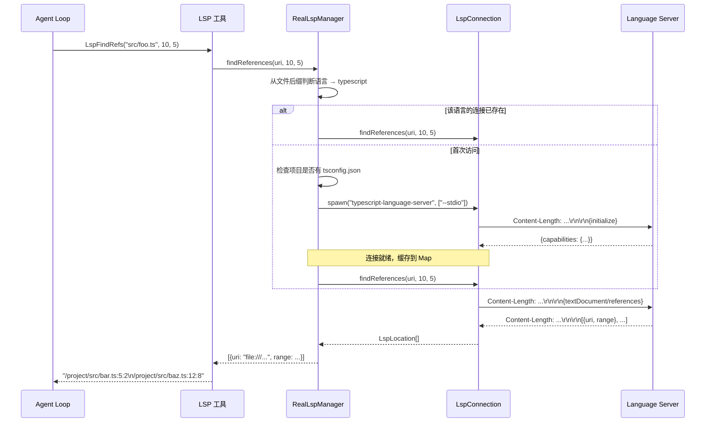
```mermaid
sequenceDiagram
    participant Agent as Agent Loop
    participant Tools as LSP 工具
    participant Mgr as RealLspManager
    participant Conn as LspConnection
    participant LS as Language Server

    Agent->>Tools: LspFindRefs("src/foo.ts", 10, 5)
    Tools->>Mgr: findReferences(uri, 10, 5)

    Mgr->>Mgr: 从文件后缀判断语言 → typescript

    alt 该语言的连接已存在
        Mgr->>Conn: findReferences(uri, 10, 5)
    else 首次访问
        Mgr->>Mgr: 检查项目是否有 tsconfig.json
        Mgr->>Conn: spawn("typescript-language-server", ["--stdio"])
        Conn->>LS: Content-Length: ...\r\n\r\n{initialize}
        LS-->>Conn: {capabilities: {...}}
        Note over Mgr,Conn: 连接就绪，缓存到 Map
        Mgr->>Conn: findReferences(uri, 10, 5)
    end

    Conn->>LS: Content-Length: ...\r\n\r\n{textDocument/references}
    LS-->>Conn: Content-Length: ...\r\n\r\n[{uri, range}, ...]
    Conn-->>Mgr: LspLocation[]
    Mgr-->>Tools: [{uri: "file:///...", range: ...}]
    Tools-->>Agent: "/project/src/bar.ts:5:2\n/project/src/baz.ts:12:8"
```

#### JSON-RPC 通信协议

Language Server 是一个独立进程，通过 stdin/stdout 通信。每条消息遵循 LSP 标准帧格式：

```
Content-Length: 156\r\n
Content-Type: application/vscode-jsonrpc; charset=utf-8\r\n
\r\n
{"jsonrpc":"2.0","id":1,"method":"textDocument/references","params":{...}}
```

`LspConnection` 内部维护 `LspBuffer` 做流式帧拆分——TCP 是字节流，消息边界靠 `Content-Length` 头部的数字确定，拆分后按 `id` 匹配请求和响应。支持的请求/通知包括：

| 方法 | 方向 | 说明 |
|------|------|------|
| `initialize` | 请求 | 握手，声明客户端能力（hover、references、diagnostics） |
| `initialized` | 通知 | 握手完成 |
| `textDocument/references` | 请求 | 查找引用 |
| `textDocument/hover` | 请求 | 获取悬停信息 |
| `textDocument/diagnostic` | 请求 | 拉取诊断 |
| `shutdown` + `exit` | 请求+通知 | 优雅关闭 |

#### 语言自动检测

`RealLspManager` 根据**文件后缀**匹配语言，再检查工作区内的**根文件**确认是否需要启动：

| 语言 | 文件后缀 | 根文件（任一存在即启动） | Language Server 命令 |
|------|----------|-------------------------|---------------------|
| TypeScript | `.ts`, `.tsx`, `.mts`, `.cts` | `tsconfig.json` | `typescript-language-server --stdio` |
| Python | `.py`, `.pyi`, `.pyx` | `pyproject.toml`, `pyrightconfig.json` | `pyright-langserver --stdio` |
| Rust | `.rs` | `Cargo.toml` | `rust-analyzer` |
| Go | `.go` | `go.mod`, `go.work` | `gopls` |

连接按语言缓存（`Map<language, LspConnection>`），同一种语言的所有文件共享一个长连接，避免重复启动进程。

#### 权限与安全

LSP 三个工具均归类为 `READ_TOOLS`（只读），与 `Read`、`Grep` 同级。工作区内自动放行，无额外审批开销。Language Server 子进程通过 `spawn` 启动，`windowsHide: true`，dispose 时发送 `shutdown` + `exit` 后 `kill` 清理。


## 10. Hook 事件总线

### 10.1 19 个事件全集

| 类别 | 事件 | 触发时机 | 决定支持 |
|------|------|----------|----------|
| **会话** | `SessionStart` | 会话开始 | — |
| | `UserPromptSubmit` | 用户提交 prompt | deny→阻止执行 |
| | `Stop` | 中断当前请求 | — |
| | `SessionEnd` | 会话结束 | — |
| **规划** | `BeforePlan` | TaskPlanner 调用前 | deny→拒绝计划 |
| | `AfterPlan` | 计划创建后 | — |
| **子 Agent** | `SubagentStart` | 子 Agent 启动 | — |
| | `SubagentStop` | 子 Agent 结束 | — |
| **模型** | `BeforeModelCall` | 模型调用前 | deny→阻止调用 |
| | `AfterModelCall` | 模型调用后 | — |
| **工具** | `PreToolUse` | 工具执行前 | deny→阻止 / updatedInput |
| | `PermissionRequest` | 权限引擎 ask | allow/deny/ask |
| | `PostToolUse` | 工具执行后 | — |
| | `PostToolUseFailure` | 工具执行失败 | — |
| **压缩** | `PreCompact` | 压缩开始前 | — |
| | `PostCompact` | 压缩完成后 | — |
| **插件** | `PluginLoad` | 插件激活 | — |
| | `PluginUnload` | 插件卸载 | — |
| **通用** | `Notification` | 任意时机 | — |

### 10.2 事件格式与处理

```typescript
// 事件格式
{ version: 1, type: "PreToolUse", payload: { toolName, input, ... } }

// 决定格式
{ decision: "allow" | "deny" | "ask", reason?, updatedInput?, additionalContext? }
```

**处理管道：**

1. 按注册顺序遍历处理器
2. `deny` → 短路返回
3. `ask` → 聚合到汇总决定
4. `updatedInput` → 替换后续处理器的 payload（管道模式）
5. `additionalContext` → 跨处理器累积
6. 超时 / 异常 → 按 `failurePolicy` 策略（error/allow/deny/ask）兜底

**Shell 处理器**：通过子进程 stdin 传递 JSON 事件，从 stdout 解析决定，最大输出 1MB，进程树终止跨平台兼容。

---

## 11. Skill 系统

### 11.1 渐进加载流水线

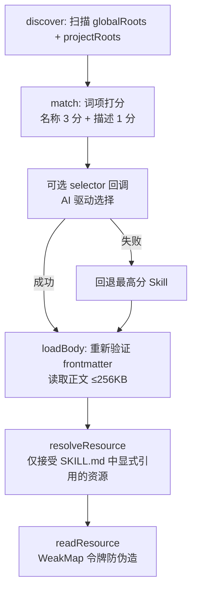
```mermaid
flowchart TD
    DISCOVER[discover: 扫描 globalRoots + projectRoots] --> MATCH[match: 词项打分<br/>名称 3 分 + 描述 1 分]
    MATCH --> SELECT[可选 selector 回调<br/>AI 驱动选择]
    SELECT -->|成功| BODY[loadBody: 重新验证 frontmatter<br/>读取正文 ≤256KB]
    SELECT -->|失败| FALLBACK[回退最高分 Skill]
    FALLBACK --> BODY

    BODY --> RESOLVE[resolveResource<br/>仅接受 SKILL.md 中显式引用的资源]
    RESOLVE --> READ_RES[readResource<br/>WeakMap 令牌防伪造]
```

### 11.2 资源安全

- **引用校验**：使用 `marked.lexer` 解析正文中的 Markdown 链接、图片和代码跨度，只有显式引用 `{assets|references|scripts}/{name}` 的资源才可被访问
- **路径安全**：资源访问的每一步都做 stat 快照验证和路径逃逸检查
- **执行隔离**：脚本通过 `SkillResource` 工具仅返回 UTF-8 或 base64 数据，不自动执行
- **覆盖规则**：project 同名覆盖 global

---

## 12. 插件系统

### 12.1 生命周期

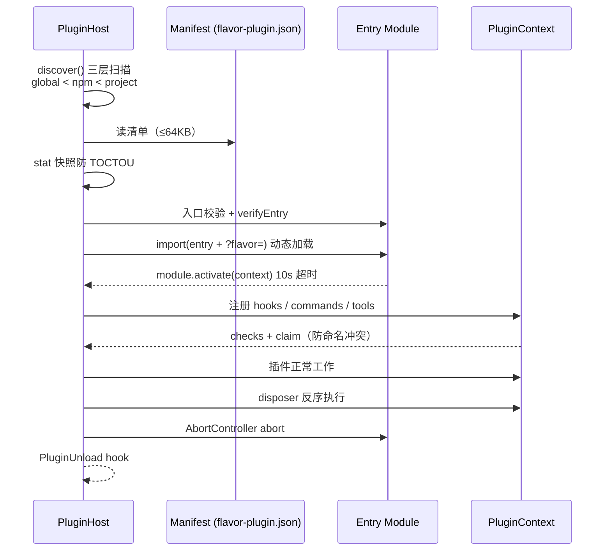
```mermaid
sequenceDiagram
    participant H as PluginHost
    participant M as Manifest (flavor-plugin.json)
    participant E as Entry Module
    participant C as PluginContext

    H->>H: discover() 三层扫描<br/>global < npm < project
    H->>M: 读清单（≤64KB）
    H->>H: stat 快照防 TOCTOU
    H->>E: 入口校验 + verifyEntry

    H->>E: import(entry + ?flavor=) 动态加载
    E-->>H: module.activate(context) 10s 超时

    H->>C: 注册 hooks / commands / tools
    C-->>H: checks + claim（防命名冲突）
    H->>C: 插件正常工作

    H->>C: disposer 反序执行
    H->>E: AbortController abort
    H-->>H: PluginUnload hook
```

### 12.2 信任模型

- 插件运行在**进程内**，不是沙箱
- 安全边界：文件系统授权回调 + stat 快照防 TOCTOU + 贡献点声明-注册一致性 + 路径逃逸检测
- 当前信任模型：**只加载可信插件**，恶意插件可绕过窄 API
- 未来方向：Worker/process sandbox、签名验证、能力 broker

---

## 13. 会话持久化

### 13.1 JSONL 格式

```
第 1 行：__meta {"version":2,"sessionId":"...","workspace":{"path":"..."},...}
第 2 行：{"role":"user","content":"帮我分析项目"}
第 3 行：{"role":"assistant","content":[{"type":"text","text":"..."}]}
第 4 行：{"role":"assistant","content":[...],"toolCalls":[...]}
第 5 行：{"role":"tool","content":"工具执行结果","toolCallId":"..."}
...
```

### 13.2 v1 → v2 迁移

| 特性 | v1 | v2 |
|------|----|----|
| 摘要格式 | `conversation.summary`（单条 system 消息） | `conversation.compact`（结构化字段） |
| 任务状态 | 内嵌于消息 | `tasks.plan` + `tasks.states` + `tasks.results` |
| 压缩边界 | 无 | `compact.summary` + `compact.compactedAt` |
| 迁移策略 | — | 检测 `"Conversation summary\n"` 前缀，提取文本 |

### 13.3 写入安全

- **原子写入**：写临时文件 → fsync → rename
- **隔离**：损坏文件重命名为 `.corrupt-{timestamp}-{uuid}`，不隐式回退
- **工作区校验**：realpath 比较防符号链接逃逸
- **大小限制**：5MB 上限（`DEFAULT_MAX_SESSION_BYTES`）
- **保存时机**：prompt/tool 轮完成、任务转换、压缩、模型/权限变化、SessionEnd、dispose 边界——避免 token 级写盘

---

## 14. UI 架构

### 14.1 Ink 组件树

flavor-code 的终端 UI 基于 **Ink**（React for CLI）构建，使用自定义的 `claude-ink` 渲染层（内嵌 yoga-layout 排版引擎）。

核心组件层次：

```
App
├── StartingLayout（runtime 初始化中）
│   └── 加载中指示器
└── TerminalLayout（runtime 就绪）
    ├── ScrollBox（可滚动主区域）
    │   ├── Header: "flavor · {model} · {workspaceName}"
    │   ├── TurnView × N（已完成对话）
    │   │   ├── 用户提示（灰底白字 + ❯ 前缀）
    │   │   └── 模型输出块
    │   │       ├── AssistantText（文本块）
    │   │       ├── StatusLine（工具调用状态 + 灰暗参数提示）
    │   │       ├── TaskStatusLine（子任务状态）
    │   │       └── FileDiffView（文件变更 diff）
    │   └── TurnView（进行中对话）
    ├── TaskProgressPanel（底部进度面板，最多 6 条）
    ├── ApprovalPanel（审批请求面板）
    ├── QuestionCards（用户选择题面板）
    ├── SlashMenu（斜杠命令补全菜单）
    ├── PromptLine（多行输入框）
    └── 底部快捷键提示
```

### 14.2 交互流程

- **输入处理优先级**：终端滚动/翻页 → Ctrl+C 中断 → 审批面板 y/n/a → 问题面板数字选择 → 斜杠补全 ↑/↓/Tab → 提交 prompt → 普通编辑
- **历史记录**：上限 200 条，↑/↓ 导航
- **任务进度面板**：子 Agent 显示橙色旋转动画 + 实时计时器，完成/失败后显示用时

### 14.3 斜杠命令（14 个内置）

| 命令 | 功能 |
|------|------|
| `/model` | 切换主/子 Agent 模型 |
| `/init` | 生成 FLAVOR.md |
| `/config` | 查看配置（脱敏） |
| `/permissions` | 切换权限模式 |
| `/skills` | 列出已安装 Skill |
| `/plugins` | 列出已加载插件 |
| `/hooks` | 列出 Hook 状态 |
| `/tasks` | 查看任务计划 |
| `/compact` | 强制压缩上下文 |
| `/clear` | 仅清屏 |
| `/audit [toolFilter]` | 查看失败审计 |
| `/loop <goal>` | 启动带宿主验证与分段预算确认的 loop-engineering 外循环 |
| `/help` | 帮助信息 |
| `/exit` | 退出 |

输入 `/` 后弹出交互式菜单，列出所有可用命令（内置 + 插件 + Skill），支持模糊匹配与编辑距离建议。未识别命令返回不超过 3 个最近的有效命令。

---

## 15. 失败分类与容错

| 层 | 代表性失败 | 处理策略 |
|----|-----------|----------|
| **启动配置** | JSON/Zod 错误、无 provider | 启动错误或可操作诊断；无密钥可进入 UI |
| **Provider** | auth/rate/context/model/network | `normalizeProviderError` 结构化分类 |
| **模型流** | 无 done/error、迭代耗尽 | `incomplete_stream` / `iteration_limit` |
| **工具** | schema、权限、超时、取消 | ToolResult error + PostToolUseFailure → AuditLogger（`.flavor/audit.jsonl`） |
| **Hook** | deny、ask、超时、handler 异常 | 决定合并与 failurePolicy 兜底 |
| **DAG** | 环/未知依赖/非法结果 | 规划拒绝、修复一次、合成 failed |
| **Plugin/Skill** | manifest、冲突、越界、身份变化 | diagnostic、拒绝激活/读取、清理已注册项 |
| **Session** | 超限、损坏、版本/工作区不兼容 | 拒绝；损坏文件隔离 |
| **UI/进程** | Ctrl+C、关闭期异常 | AbortSignal、幂等 close/dispose |

---

## 16. 安全威胁模型

### 16.1 主要资产

- 工作区代码
- 宿主文件系统
- API 凭据
- 命令执行权
- 对话内容

### 16.2 威胁与缓解

| 威胁 | 缓解措施 |
|------|----------|
| Prompt injection（模型指令注入） | 分层消息设计、固定层不参与压缩 |
| 恶意路径/符号链接 | realpath 校验、逐级包含检查 |
| 模型伪造工具参数 | Zod schema 校验、权限引擎二次决策 |
| Shell 包装层绕过 | 递归命令分析、模式匹配 + 降级规则 |
| 巨大输出/会话 DoS | 输出截断、5MB 会话上限、逐级安全校验 |
| 损坏恢复文件 | 损坏文件隔离、schema 严格校验、不隐式回退 |
| 凭据泄露 | 配置脱敏、会话敏感字段递归删除 |
| 恶意 Skill 资源 | 显式引用校验、stat 快照、路径逃逸检测 |
| 进程内插件 | 信任模型限制（仅加载可信插件） |

### 16.3 剩余风险

- 同进程插件与被批准 shell 具有宿主进程权力
- Provider 会收到模型上下文（包括文件内容）
- 模型可能提出有害但看似常规的操作
- 本地用户仍可读自己的会话文件

---

## 17. 测试与 CI

- **测试框架**：Vitest，分层组织（config → models → context → agent → tools → permissions → hooks → plugins → skills → UI → CLI → session）
- **严格模式**：TypeScript `strict: true` + `noUncheckedIndexedAccess: true` + `exactOptionalPropertyTypes: true`
- **零凭据**：所有测试使用假 adapter 或不可达本地地址验证选择/错误，无真实 API key
- **CI 矩阵**：Windows/macOS × Node 20/24（`.github/workflows/ci.yml`）
- **POSIX 隔离**：`tests/cli/sigint-process.test.ts` 仅 macOS 执行，Windows 跳过
- **构建**：`tsup` 将 `src/cli.tsx` 打包为带 shebang 的 ESM `dist/cli.js`
- **烟雾测试**：`scripts/smoke-install.mjs` 真实执行 pack → 安装 → 验证版本号和 `--help`

---

## 18. 权衡与路线图

| 当前权衡 | 原因 | 未来方向 |
|----------|------|----------|
| 字符/4 估算 token | 无需绑定 tokenizer | 为已知模型接入精确 tokenizer |
| v1/v2 兼容迁移 | 兼容存量会话 | 校验签名、更细粒度 journal |
| 模型九段摘要 | 能跨越窗口但消耗一次调用 | 后台 Session Memory + 循环状态日志 |
| 稳定边界保存 | 避免 token 级 I/O | 有界 debounce journal |
| 进程内插件 | 易开发但隔离弱 | Worker/process sandbox + 签名 + broker |
| 终端 UI | 跨平台 MVP | IDE 协议/扩展 |
| API key 环境变量 | 直接但体验一般 | 系统 keychain、provider 扫码登录 |
| 前台单 loop | 首版优先可观察、可中断与用户确认 | 后台恢复、调度与并发 loop 管理 |

---

## 19. 文件地图速查

| 路径 | 职责 |
|------|------|
| `src/cli.tsx` | `flavor` / `--print` / `--resume` 入口，退出码与错误脱敏 |
| `src/production.ts` | 组合根：配置、provider、工具、插件、Skill、任务、会话与 loop 的全部装配 |
| `src/ui/app.tsx` | Ink 根组件：状态管理、事件分发、UI 布局 |
| `src/ui/transcript.ts` | 对话状态机 `transcriptReducer`：text/tool/task/done/error 事件 |
| `src/ui/task-progress.tsx` | 任务进度面板：实时状态、计时器、子 Agent 动画 |
| `src/ui/commands.ts` | 内置斜杠命令实现：model/init/config/permissions/skills/plugins/hooks/tasks/compact/clear/audit/loop/help/exit |
| `src/agent/loop.ts` | ReAct 循环：迭代控制、流式处理、工具执行、压缩触发 |
| `src/agent/planner.ts` | TaskPlanner：DAG 验证、环检测、计划生成 |
| `src/agent/subagents.ts` | SubagentScheduler：并行调度、依赖解析、重试、阻塞传播 |
| `src/agent/types.ts` | AgentEvent 类型定义：tool-start/end 含可选 hint 字段 |
| `src/agent/task-plan.ts` | TaskPlan 状态机：6 状态、合法转换、依赖校验 |
| `src/agent/task-tools.ts` | TaskPlan/TaskUpdate 工具定义 |
| `src/loop/orchestrator.ts` | LoopOrchestrator：fresh worker、宿主验证、预算门槛、无进展熔断与终态 |
| `src/loop/types.ts` | LoopState、cycle evidence、approval 与事件 journal 的 Zod 协议 |
| `src/loop/store.ts` | `.flavor/loops/` 原子 snapshot、追加 journal、安全加载与损坏隔离 |
| `src/loop/verifier.ts` | 确定性验证命令推断与有界证据采集 |
| `src/loop/isolation.ts` | 目标意图分类、Git worktree 隔离与拒绝静默降级 |
| `src/loop/budget.ts` | cycle/token checkpoint 判断、按原始 tranche 扩展与拒绝终止 |
| `src/skills/builtin-loop.ts` | 内置 Loop Skill 的单 cycle 方法论与证据反馈 prompt |
| `src/context/manager.ts` | ContextManager：固定层、压缩调度、snapshot/restore |
| `src/context/compaction.ts` | 压缩策略：压力估算、分割点选择、微压缩、九段摘要构建 |
| `src/context/summarizer.ts` | `summarizeWithModel()`：空工具摘要请求 + PTL 重试 |
| `src/tools/types.ts` | ToolDefinition 接口：summarize 可选方法、路径声明、权限元数据 |
| `src/tools/files.ts` | Read/Write/Edit/ApplyPatch 文件工具 |
| `src/tools/search.ts` | Glob/Grep 搜索工具 |
| `src/tools/shell.ts` | Shell 执行工具 |
| `src/tools/runtime.ts` | ToolRuntime：统一执行管线 + Hook 集成 + 工具 hint 生成 |
| `src/tools/ask-user-question.ts` | AskUserQuestion：结构化提问 |
| `src/tools/task-output.ts` | TaskOutput：结构化完成报告 |
| `src/tools/todo-write.ts` | TodoWrite：Agent 自检清单 |
| `src/permissions/engine.ts` | 权限决策树：safe/workspace/full + Shell 安全分析 |
| `src/models/registry.ts` | ModelRegistry：provider:model 解析与适配器查找 |
| `src/models/openai.ts` | OpenAI Responses API 适配器 |
| `src/models/anthropic.ts` | Anthropic Messages API 适配器 |
| `src/hooks/bus.ts` | HookBus：19 事件注册/发射/管道/失败策略 |
| `src/hooks/types.ts` | Hook 事件 schema、决定类型、处理器定义 |
| `src/skills/registry.ts` | SkillRegistry：发现、匹配、渐进加载、资源解析 |
| `src/skills/tool.ts` | SkillResource 工具工厂 |
| `src/plugins/host.ts` | PluginHost：发现、清单、激活/反激活、TOCTOU 防护 |
| `src/plugins/types.ts` | 插件清单 schema、贡献点定义 |
| `src/harness/local.ts` | LocalHarness：主/子 Agent 的工具/上下文/权限装配 |
| `src/session/store.ts` | SessionStore：v2 JSONL、v1 迁移、原子写入、隔离 |
| `src/config/schema.ts` | Zod 配置 schema、Provider/Agent/Context 定义 |
| `src/config/load.ts` | 四层配置合并、环境插值、脱敏 |
| `src/utils/log.ts` | AuditLogger：PostToolUseFailure 结构化审计 |

---

## 20. PKCE 认证架构总览

flavor-code 从 0.1.0 开始内置了 OAuth 2.0 PKCE（Proof Key for Code Exchange）客户端能力，支持与配套的 **flavor-pkce** 项目（授权服务器 + API 网关）协作，实现企业级"无 API Key 暴露"的 LLM 安全访问方案。

### 20.1 架构拓扑

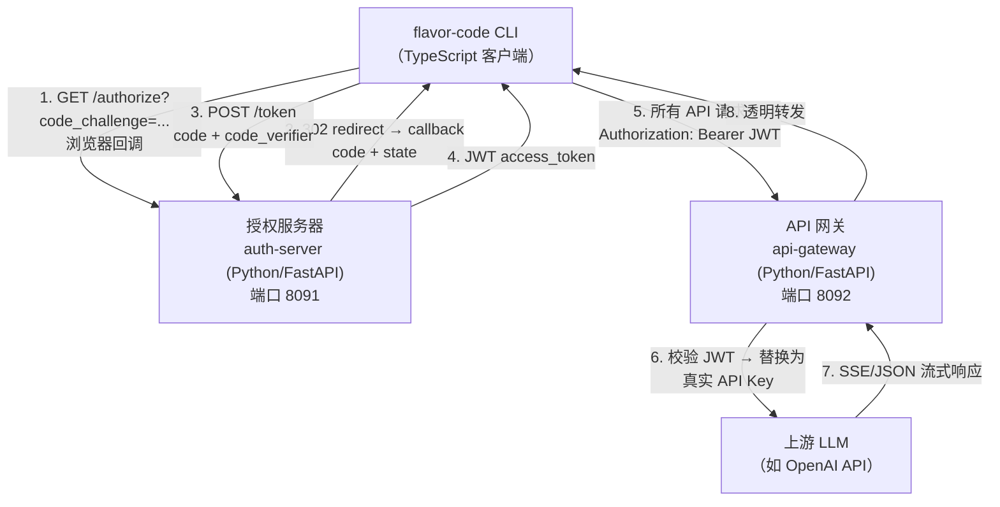
```mermaid
flowchart TD
    FC["flavor-code CLI<br/>（TypeScript 客户端）"]
    AUTH["授权服务器<br/>auth-server (Python/FastAPI)<br/>端口 8091"]
    GW["API 网关<br/>api-gateway (Python/FastAPI)<br/>端口 8092"]
    UP["上游 LLM<br/>（如 OpenAI API）"]

    FC -->|1. GET /authorize?code_challenge=...<br/>浏览器回调| AUTH
    AUTH -->|2. 302 redirect → callback<br/>code + state| FC
    FC -->|3. POST /token<br/>code + code_verifier| AUTH
    AUTH -->|4. JWT access_token| FC
    FC -->|5. 所有 API 请求<br/>Authorization: Bearer JWT| GW
    GW -->|6. 校验 JWT → 替换为<br/>真实 API Key| UP
    UP -->|7. SSE/JSON 流式响应| GW
    GW -->|8. 透明转发| FC
```

### 20.2 为什么需要 PKCE + 网关

在团队或企业环境中，直接让每个开发者持有 LLM API Key 存在以下风险：

- **凭据泄露**：API Key 一旦被日志记录、代码提交或恶意窃取，攻击者可直接消费企业配额
- **审计空白**：不知道谁在什么时间使用了多少 token
- **密钥轮换困难**：API Key 泄漏后需要通知所有人更换

**PKCE + API 网关** 方案将真正的 API Key 封存在网关后端：

1. 用户通过浏览器登录授权服务器（用户名/密码）
2. 授权服务器验证身份后签发 **JWT**（JSON Web Token）
3. flavor-code 使用 JWT 向 API 网关发起 LLM 请求
4. 网关验证 JWT 后**替换 Authorization header** 为真实 API Key，转发到上游 LLM
5. 真实 API Key **永不离开网关**，不在网络上传输，不出现在任何客户端

### 20.3 两项目分工

| 项目 | 技术栈 | 角色 | 核心文件 |
|------|--------|------|----------|
| `flavor-code` | TypeScript / Node.js | PKCE 客户端 + LLM Agent | `src/auth/oauth.ts`、`src/auth/store.ts`、`src/config/schema.ts`、`src/production.ts` |
| `flavor-pkce` | Python / FastAPI | 授权服务器 + API 网关 | `auth-server/auth_server/main.py`、`api-gateway/gateway/main.py` |

---

## 21. PKCE 客户端实现（flavor-code）

### 21.1 客户端架构

flavor-code 的 PKCE 客户端由三个模块组成，呈单向依赖关系：

```
src/config/schema.ts ────→ 定义 OAuth 配置字段
src/production.ts ───────→ 启动时调用 OAuth 流程获取 API Key
src/auth/oauth.ts ───────→ OAuthCallbackAuthProvider（PKCE 核心）
src/auth/store.ts ───────→ 文件系统 Token 持久化
src/auth/types.ts ───────→ AuthProvider / AuthResult / ApiKeyAuthProvider
```

### 21.2 配置 Schema 扩展

`ProviderConfigSchema`（`src/config/schema.ts`）在原有 `apiKey` 字段基础上新增了 OAuth PKCE 字段：

```typescript
apiType: z.enum(["openai", "anthropic"]).optional(),  // API 协议类型
authorizationUrl: z.string().url().optional(),         // 授权端点
tokenUrl: z.string().url().optional(),                 // Token 端点
clientId: z.string().min(1).optional(),                // 客户端标识
scope: z.string().optional(),                          // 权限范围
```

### 21.3 Provider 启动决策树

`registerConfiguredAdapters()`（`src/production.ts`）按以下优先级确定 API Key：

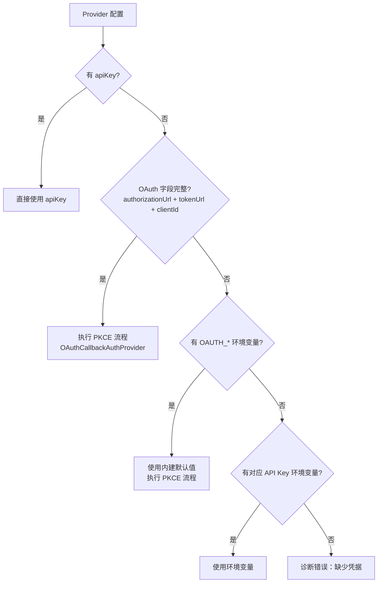
```mermaid
flowchart TD
    START["Provider 配置"] --> A{有 apiKey?}
    A -->|是| USE_KEY["直接使用 apiKey"]
    A -->|否| B{OAuth 字段完整?<br/>authorizationUrl + tokenUrl + clientId}
    B -->|是| PKCE["执行 PKCE 流程<br/>OAuthCallbackAuthProvider"]
    B -->|否| C{有 OAUTH_* 环境变量?}
    C -->|是| PKCE_DEFAULT["使用内建默认值<br/>执行 PKCE 流程"]
    C -->|否| D{有对应 API Key 环境变量?}
    D -->|是| USE_ENV["使用环境变量"]
    D -->|否| ERR["诊断错误：缺少凭据"]
```

**关键逻辑**：`resolveOAuthConfig()` 函数在没有显式 apiKey 和 OAuth 配置时，自动从环境变量 `OAUTH_AUTHORIZATION_URL`、`OAUTH_TOKEN_URL`、`OAUTH_CLIENT_ID`、`OAUTH_SCOPE` 读取内建默认值，无需用户手动填写。

### 21.4 OAuthCallbackAuthProvider 流程

`OAuthCallbackAuthProvider`（`src/auth/oauth.ts`）实现了完整的 RFC 7636 PKCE 客户端流程：

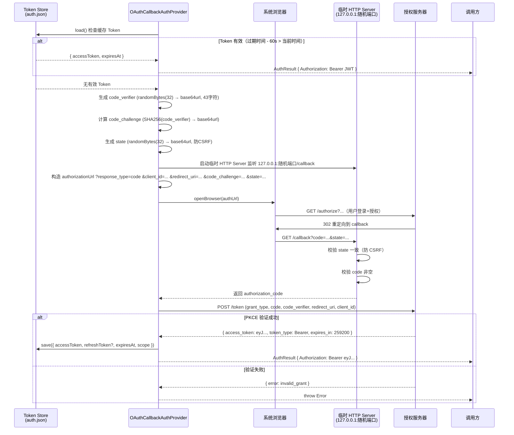
```mermaid
sequenceDiagram
    participant STORE as Token Store<br/>(auth.json)
    participant PROV as OAuthCallbackAuthProvider
    participant BROWSER as 系统浏览器
    participant SRV as 临时 HTTP Server<br/>(127.0.0.1:随机端口)
    participant AUTH as 授权服务器

    PROV->>STORE: load() 检查缓存 Token
    alt Token 有效（过期时间 - 60s > 当前时间）
        STORE-->>PROV: { accessToken, expiresAt }
        PROV-->>调用方: AuthResult { Authorization: Bearer JWT }
    end

    STORE-->>PROV: 无有效 Token

    PROV->>PROV: 生成 code_verifier (randomBytes(32) → base64url, 43字符)
    PROV->>PROV: 计算 code_challenge (SHA256(code_verifier) → base64url)
    PROV->>PROV: 生成 state (randomBytes(32) → base64url, 防CSRF)
    PROV->>SRV: 启动临时 HTTP Server 监听 127.0.0.1:随机端口/callback

    PROV->>PROV: 构造 authorizationUrl ?response_type=code &client_id=... &redirect_uri=... &code_challenge=... &state=...

    PROV->>BROWSER: openBrowser(authUrl)
    BROWSER->>AUTH: GET /authorize?...（用户登录+授权）
    AUTH->>BROWSER: 302 重定向到 callback
    BROWSER->>SRV: GET /callback?code=...&state=...

    SRV->>SRV: 校验 state 一致（防 CSRF）
    SRV->>SRV: 校验 code 非空
    SRV-->>PROV: 返回 authorization_code

    PROV->>AUTH: POST /token (grant_type, code, code_verifier, redirect_uri, client_id)

    alt PKCE 验证成功
        AUTH-->>PROV: { access_token: eyJ..., token_type: Bearer, expires_in: 259200 }
        PROV->>STORE: save({ accessToken, refreshToken?, expiresAt, scope })
        PROV-->>调用方: AuthResult { Authorization: Bearer eyJ... }
    else 验证失败
        AUTH-->>PROV: { error: invalid_grant }
        PROV-->>调用方: throw Error
    end
```

**安全设计要点：**

1. **code_verifier 熵**：32 字节随机数 → 256 位熵，暴力破解不可行
2. **S256 散列**：SHA256(code_verifier) → code_challenge，即使 challenge 泄露也无法还原 verifier
3. **state 防 CSRF**：每次流程生成新的 32 字节随机 state，回调时必须原样匹配
4. **重定向 URI 锁定**：固定 `http://127.0.0.1:{随机端口}/callback`，仅接受本地回环
5. **5 分钟超时**：防止悬挂的授权流程无限等待（`PKCE_TIMEOUT_MS = 300_000`）
6. **Token 预刷新**：过期前 60 秒自动丢弃缓存，触发新的 PKCE 流程
7. **同时只允许一个流程**：`#pendingFlow` 防并发授权

### 21.5 Token 持久化

`createFileTokenStore()`（`src/auth/store.ts`）将 Token 持久化到 `~/.flavor-code/auth.json`：

```json
{
  "openai": {
    "accessToken": "eyJhbGciOiJSUzI1NiIs...",
    "expiresAt": "2026-07-17T12:00:00.000Z",
    "scope": "models:read models:use"
  }
}
```

**安全特性：**
- 文件存储在用户目录下，权限由操作系统管理
- `load()` 时做严格的类型校验（`isStoredToken`），拒绝非法结构
- 损坏的 JSON 返回空对象，不抛异常阻断启动
- ENOENT（文件不存在）静默处理为首次授权

---

## 22. 授权服务器实现（flavor-pkce auth-server）

### 22.1 技术栈与职责

授权服务器（`auth-server/auth_server/main.py`）是一个 FastAPI 应用，负责**身份认证 + PKCE 授权 + JWT 签发**。

| 职责 | 说明 |
|------|------|
| 用户注册/登录 | `POST /register`、`POST /login`，使用 bcrypt 哈希密码 |
| PKCE 授权端点 | `GET /authorize`，校验 client + redirect_uri + PKCE 参数 |
| 授权确认页面 | 服务端渲染 consent HTML，展示 client 名、scope、用户名 |
| Token 端点 | `POST /token`，验证 code_verifier + 签发 JWT |
| JWT 生命周期 | RS256 非对称签名、3 天有效期、jti 用于撤销支持 |

### 22.2 数据库 Schema

使用 SQLite 存储，初始化代码在 `auth_server/database.py`：

```sql
-- 注册的 OAuth 客户端（支持 redirect_uri 前缀匹配）
CREATE TABLE clients (
    id            TEXT PRIMARY KEY,      -- 如 "flavor-code-cli"
    name          TEXT NOT NULL,         -- 如 "flavor-code CLI"
    redirect_uris TEXT NOT NULL,         -- JSON array: ["http://127.0.0.1:"]
    created_at    TEXT NOT NULL
);

-- 用户（密码 bcrypt 哈希）
CREATE TABLE users (
    id            TEXT PRIMARY KEY,
    username      TEXT UNIQUE NOT NULL,
    password_hash TEXT NOT NULL,
    created_at    TEXT NOT NULL
);

-- 授权码（一次性、PKCE 绑定、10分钟过期）
CREATE TABLE authorization_codes (
    code             TEXT PRIMARY KEY,
    client_id        TEXT NOT NULL REFERENCES clients(id),
    redirect_uri     TEXT NOT NULL,
    code_challenge   TEXT NOT NULL,      -- SHA256(code_verifier)
    user_id          TEXT NOT NULL REFERENCES users(id),
    scope            TEXT,
    expires_at       TEXT NOT NULL,      -- 10 分钟有效
    used             INTEGER NOT NULL DEFAULT 0,  -- 防重用
    created_at       TEXT NOT NULL
);

-- 已签发 Token（支持撤销查询）
CREATE TABLE tokens (
    id              TEXT PRIMARY KEY,
    jti             TEXT NOT NULL UNIQUE, -- JWT ID
    client_id       TEXT NOT NULL REFERENCES clients(id),
    user_id         TEXT NOT NULL REFERENCES users(id),
    scope           TEXT,
    expires_at      TEXT NOT NULL,
    revoked         INTEGER NOT NULL DEFAULT 0,
    created_at      TEXT NOT NULL
);
```

种子数据自动创建 `flavor-code-cli` 客户端（redirect_uris 匹配 `http://127.0.0.1:` 前缀）和测试用户 `testuser`。

### 22.3 JWT 签发

`auth_server/jwt_utils.py` 使用 RS256（RSA 2048 位）非对称算法：

```python
def create_jwt(sub: str, client_id: str, scope: str = "") -> str:
    payload = {
        "sub": sub,           # 用户 ID
        "client_id": client_id,
        "scope": scope,       # "models:read models:use"
        "iat": timestamp,     # 签发时间
        "exp": timestamp+3天, # 过期时间
        "jti": uuid4(),       # 唯一 ID（撤销时按此匹配）
    }
    return jwt.encode(payload, private_key, algorithm="RS256")
```

**密钥生成机制：**
- 首次运行时自动生成 `keys/private.pem` 和 `keys/public.pem`
- Docker 部署时通过 volume `keys-volume` 在容器间共享

### 22.4 授权端点流程

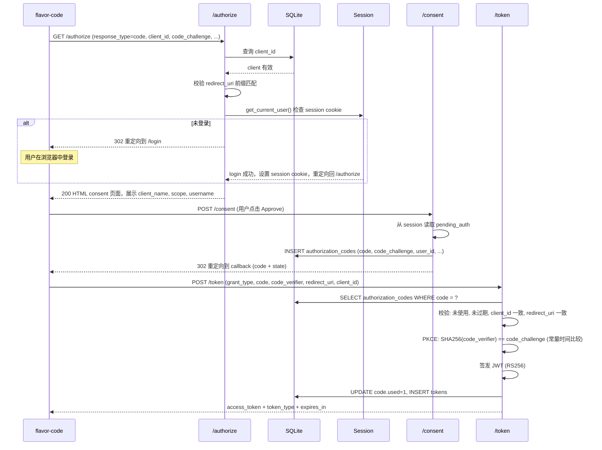
```mermaid
sequenceDiagram
    participant CLI as flavor-code
    participant A as /authorize
    participant DB as SQLite
    participant S as Session
    participant C as /consent
    participant T as /token

    CLI->>A: GET /authorize (response_type=code, client_id, code_challenge, ...)
    A->>DB: 查询 client_id
    DB-->>A: client 有效
    A->>A: 校验 redirect_uri 前缀匹配
    A->>S: get_current_user() 检查 session cookie

    alt 未登录
        A-->>CLI: 302 重定向到 /login
        Note over CLI: 用户在浏览器中登录
        S-->>A: login 成功，设置 session cookie，重定向回 /authorize
    end

    A-->>CLI: 200 HTML consent 页面，展示 client_name, scope, username
    CLI->>C: POST /consent (用户点击 Approve)

    C->>C: 从 session 读取 pending_auth
    C->>DB: INSERT authorization_codes (code, code_challenge, user_id, ...)
    C-->>CLI: 302 重定向到 callback (code + state)

    CLI->>T: POST /token (grant_type, code, code_verifier, redirect_uri, client_id)
    T->>DB: SELECT authorization_codes WHERE code = ?
    T->>T: 校验: 未使用, 未过期, client_id 一致, redirect_uri 一致
    T->>T: PKCE: SHA256(code_verifier) == code_challenge (常量时间比较)
    T->>T: 签发 JWT (RS256)
    T->>DB: UPDATE code.used=1, INSERT tokens
    T-->>CLI: access_token + token_type + expires_in
```

### 22.5 安全设计要点

- **密码存储**：bcrypt 哈希，带 salt
- **Session 管理**：httponly cookie + 3 天过期，防止 XSS 窃取
- **redirect_uri 前缀匹配**：`json.loads(client.redirect_uris)` 后逐个前缀匹配，允许 flavor-code 的动态端口
- **防重放**：authorization_code 使用后标记 `used=1`
- **防时序攻击**：`_constant_time_compare()` 逐字节异或比较 code_challenge
- **CORS**：仅允许配置的域名来源

---

## 23. API 网关 SSE 代理实现（flavor-pkce api-gateway）

### 23.1 技术栈与职责

API 网关（`api-gateway/gateway/main.py`）是一个 FastAPI 应用，作为 LLM API 的**透明反向代理**，核心职责是 **JWT 校验 → Token 交换 → 流量转发**。

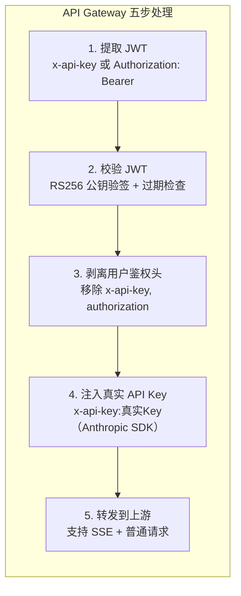
```mermaid
flowchart LR
    subgraph "API Gateway 五步处理"
        S1["1. 提取 JWT<br/>x-api-key 或 Authorization: Bearer"]
        S2["2. 校验 JWT<br/>RS256 公钥验签 + 过期检查"]
        S3["3. 剥离用户鉴权头<br/>移除 x-api-key, authorization"]
        S4["4. 注入真实 API Key<br/>x-api-key:真实Key（Anthropic SDK）"]
        S5["5. 转发到上游<br/>支持 SSE + 普通请求"]
    end

    S1 --> S2 --> S3 --> S4 --> S5
```

### 23.2 JWT 验证中间件

```python
def verify_jwt(token: str) -> dict | None:
    public_key = load_public_key()  # 从 keys/public.pem 加载，首次缓存
    return jwt.decode(token, public_key, algorithms=["RS256"])
```

- 只做**签名验证 + 过期检查**，不查数据库（零延迟）
- 公钥通过 Docker volume 以只读方式挂载（`:ro`），防篡改

### 23.3 SSE 流式代理

API 网关最关键的挑战是 **Server-Sent Events (SSE) 流式转发**——LLM 响应往往以 `text/event-stream` 格式逐个 token 推送，代理必须逐块转发而不能缓冲整个响应。

```python
@app.api_route("/{path:path}", methods=["GET","POST","PUT","DELETE","PATCH","OPTIONS"])
async def proxy(request: Request, path: str):
    """透明代理。区分 SSE 和普通响应。"""

    # ... JWT 验证 + Header 替换 ...

    async with httpx.AsyncClient(timeout=300.0) as client:
        async with client.stream(method=..., url=upstream_url, ...) as upstream_resp:
            content_type = upstream_resp.headers.get("content-type", "")

            if "text/event-stream" in content_type:
                # SSE: 使用 StreamingResponse 逐块转发
                return StreamingResponse(
                    sse_generator(),           # async generator
                    status_code=status_code,
                    headers=_clean_response_headers(headers, streaming=True),
                )

            # 非 SSE: 完整读取后返回
            content = await upstream_resp.aread()
            return Response(content=content, status_code=...)
```

**SSE 代理核心机制：**

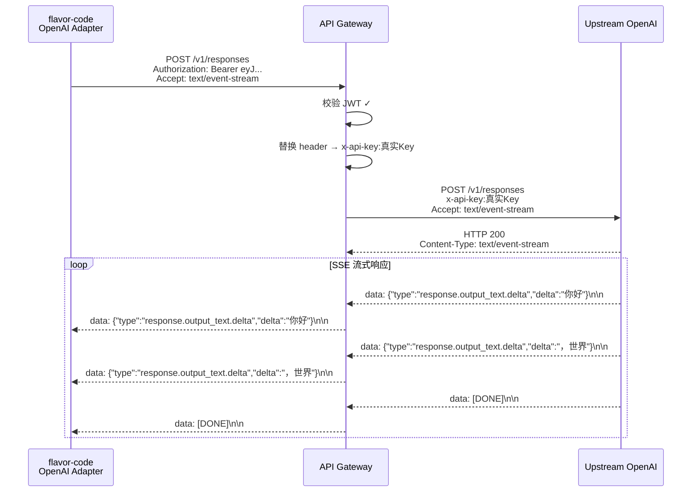
```mermaid
sequenceDiagram
    participant FC as flavor-code<br/>OpenAI Adapter
    participant GW as API Gateway
    participant UP as Upstream OpenAI

    FC->>GW: POST /v1/responses<br/>Authorization: Bearer eyJ...<br/>Accept: text/event-stream
    GW->>GW: 校验 JWT ✓
    GW->>GW: 替换 header → x-api-key:真实Key
    GW->>UP: POST /v1/responses<br/>x-api-key:真实Key<br/>Accept: text/event-stream

    UP-->>GW: HTTP 200<br/>Content-Type: text/event-stream

    loop SSE 流式响应
        UP-->>GW: data: {"type":"response.output_text.delta","delta":"你好"}\n\n
        GW-->>FC: data: {"type":"response.output_text.delta","delta":"你好"}\n\n
        UP-->>GW: data: {"type":"response.output_text.delta","delta":"，世界"}\n\n
        GW-->>FC: data: {"type":"response.output_text.delta","delta":"，世界"}\n\n
        UP-->>GW: data: [DONE]\n\n
        GW-->>FC: data: [DONE]\n\n
    end
```

**设计细节：**

1. **零缓冲转发**：`async for chunk in upstream.aiter_bytes()` 逐块 yield，不做任何拼接
2. **独立生命周期**：SSE generator 内部重新建立 httpx 连接，确保 Starlette 异步读取期间连接保持活跃
3. **长时间超时**：`timeout=300.0`，LLM 完整响应可能需要分钟级时间
4. **Header 清洗**：移除 `transfer-encoding`、`content-encoding`、`content-length`（chunked 传输不需要）
5. **Content-Type 检测**：通过 `text/event-stream` 子串匹配决定路由策略

### 23.4 双 SDK 兼容

API 网关同时支持两种上游鉴权方式：

| SDK | 用户 Header | 上游 Header |
|-----|------------|------------|
| OpenAI | `Authorization: Bearer <JWT>` | `Authorization: Bearer <REAL_KEY>` |
| Anthropic | `x-api-key: <JWT>` | `x-api-key: <REAL_KEY>` |

通过 `UPSTREAM_API_KEY` 环境变量统一配置真实 API Key。

### 23.5 配置体系

```python
# api-gateway/gateway/config.py
JWT_PUBLIC_KEY_PATH = "/app/keys/public.pem"     # 公钥路径
UPSTREAM_URL = "https://api.openai.com"           # LLM 上游地址
UPSTREAM_API_KEY = ""                             # 真实 API Key
GATEWAY_HOST = "0.0.0.0"
GATEWAY_PORT = 8092
```

通过 `.env` 文件和 Docker 环境变量注入。

---

## 24. 端到端全链路时序

### 24.1 首次授权 + LLM 流式调用的完整生命周期

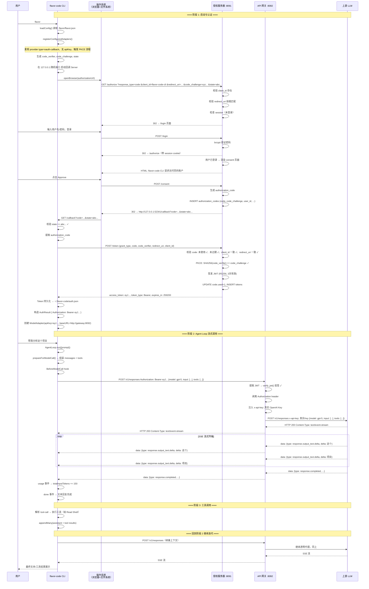
```mermaid
sequenceDiagram
    participant U as 用户
    participant FC as flavor-code CLI
    participant OS as 操作系统<br/>（浏览器+文件系统）
    participant AUTH as 授权服务器 :8091
    participant GW as API 网关 :8092
    participant LLM as 上游 LLM

    Note over FC,LLM: ═══ 阶段 1: 启动与认证 ═══

    U->>FC: flavor
    FC->>FC: loadConfig() 读取 .flavor/flavor.json
    FC->>FC: registerConfiguredAdapters()
    Note over FC: 发现 provider type=oauth-callback，无 apiKey，触发 PKCE 流程

    FC->>FC: 生成 code_verifier, code_challenge, state
    FC->>FC: 在 127.0.0.1:随机端口 启动回调 Server
    FC->>OS: openBrowser(authorizationUrl)
    OS->>AUTH: GET /authorize ?response_type=code &client_id=flavor-code-cli &redirect_uri=... &code_challenge=xyz... &state=abc...

    AUTH->>AUTH: 校验 client_id 存在
    AUTH->>AUTH: 校验 redirect_uri 前缀匹配
    AUTH->>AUTH: 检查 session（未登录）

    AUTH-->>OS: 302 → /login 页面
    U->>OS: 输入用户名/密码，登录
    OS->>AUTH: POST /login
    AUTH->>AUTH: bcrypt 验证密码
    AUTH-->>OS: 302 → /authorize（带 session cookie）

    AUTH->>AUTH: 用户已登录 → 渲染 consent 页面
    AUTH-->>OS: HTML: flavor-code CLI 请求访问您的账户
    U->>OS: 点击 Approve

    OS->>AUTH: POST /consent
    AUTH->>AUTH: 生成 authorization_code
    AUTH->>AUTH: INSERT authorization_codes (code, code_challenge, user_id, ...)
    AUTH-->>OS: 302 → http://127.0.0.1:52341/callback?code=...&state=abc...

    OS->>FC: GET /callback?code=...&state=abc...
    FC->>FC: 校验 state == abc... ✓
    FC->>FC: 提取 authorization_code

    FC->>AUTH: POST /token (grant_type, code, code_verifier, redirect_uri, client_id)

    AUTH->>AUTH: 校验 code: 未使用 ✓、未过期 ✓、client_id 一致 ✓、redirect_uri 一致 ✓
    AUTH->>AUTH: PKCE: SHA256(code_verifier) == code_challenge ✓
    AUTH->>AUTH: 签发 JWT (RS256, 3天有效)
    AUTH->>AUTH: UPDATE code.used=1, INSERT tokens
    AUTH-->>FC: access_token: eyJ..., token_type: Bearer, expires_in: 259200

    FC->>FC: Token 持久化 → ~/.flavor-code/auth.json
    FC->>FC: 构造 AuthResult { Authorization: Bearer eyJ... }
    FC->>FC: 创建 ModelAdapter(apiKey=eyJ..., baseURL=http://gateway:8092)

    Note over FC,LLM: ═══ 阶段 2: Agent Loop 流式调用 ═══

    U->>FC: 帮我分析这个项目
    FC->>FC: AgentLoop.run({prompt})
    FC->>FC: prepareForModelCall() → 组装 messages + tools
    FC->>FC: BeforeModelCall hook

    FC->>GW: POST /v1/responses Authorization: Bearer eyJ... {model: gpt-5, input: [...], tools: [...]}

    GW->>GW: 提取 JWT → verify_jwt() 验签 ✓
    GW->>GW: 剥离 Authorization header
    GW->>GW: 注入 x-api-key: 真实 OpenAI Key
    GW->>LLM: POST /v1/responses x-api-key: 真实Key {model: gpt-5, input: [...], tools: [...]}

    LLM-->>GW: HTTP 200 Content-Type: text/event-stream
    GW-->>FC: HTTP 200 Content-Type: text/event-stream

    loop SSE 流式传输
        LLM-->>GW: data: {type: response.output_text.delta, delta: 这个}
        GW-->>FC: data: {type: response.output_text.delta, delta: 这个}
        LLM-->>GW: data: {type: response.output_text.delta, delta: 项目}
        GW-->>FC: data: {type: response.output_text.delta, delta: 项目}
    end

    LLM-->>GW: data: {type: response.completed, ...}
    GW-->>FC: data: {type: response.completed, ...}

    FC->>FC: usage 事件 → totalInputTokens += 150
    FC->>FC: done 事件 → 文本回复完成

    Note over FC,LLM: ═══ 阶段 3: 工具调用 ═══

    FC->>FC: 解析 tool-call → 执行工具（如 Read Shell）
    FC->>FC: appendMany(assistant + tool results)

    Note over FC,LLM: ═══ 回到阶段 2 继续迭代 ═══

    FC->>GW: POST /v1/responses（续接上下文）
    GW->>LLM: 继续透明代理，同上
    LLM-->>GW: SSE 流
    GW-->>FC: SSE 流

    FC-->>U: 最终文本/工具结果展示
```

### 24.2 已授权用户二次启动（缓存命中）

```mermaid
sequenceDiagram
    participant U as 用户
    participant FC as flavor-code CLI
    participant STORE as auth.json
    participant GW as API 网关
    participant LLM as 上游 LLM

    U->>FC: flavor（第二次启动）
    FC->>FC: loadConfig()
    FC->>FC: registerConfiguredAdapters()

    FC->>STORE: 加载 Token 缓存
    STORE-->>FC: { accessToken: "eyJ...", expiresAt: "2026-07-17T12:00:00Z" }

    FC->>FC: expiresAt - 60s > now? → 是 ✓
    Note over FC: 直接使用缓存 Token，无需浏览器授权

    U->>FC: "继续上次的工作"
    FC->>GW: POST /v1/responses<br/>Authorization: Bearer eyJ...
    GW->>GW: verify_jwt() ✓
    GW->>LLM: 透明代理
    LLM-->>GW: SSE 流
    GW-->>FC: SSE 流
    FC-->>U: 模型响应
```

### 24.3 错误路径

| 场景 | 表现 | 处理 |
|------|------|------|
| JWT 过期 | 网关返回 401 | flavor-code 的 `normalizeProviderError` 归类为 `authentication`，自动清除缓存并触发新 PKCE 流程 |
| JWT 签名无效 | 网关返回 401 | 同上 |
| API Key 错误 | 上游返回 401 | 网关透传，flavor-code 归类为 `authentication` |
| 授权拒绝 | 浏览器显示错误页面 | `OAuthCallbackAuthProvider` 抛出 `OAuth authorization denied` |
| 网关不可达 | 网络错误 | `normalizeProviderError` 归类为 `network` |
| SSE 中断 | 流提前关闭 | `AgentLoop` 产生 `incomplete_stream` 错误，不重试（可能消耗 API） |

---

## 25. 密钥体系与安全设计

### 25.1 密钥分层

```mermaid
flowchart TD
    subgraph "授权服务器（持有私钥）"
        PRIV["private.pem<br/>RSA 2048 私钥<br/>用于签发 JWT"]
    end

    subgraph "API 网关（持有公钥 + 真实 Key）"
        PUB["public.pem<br/>RSA 2048 公钥<br/>用于验证 JWT"]
        REAL["UPSTREAM_API_KEY<br/>真实 LLM API Key"]
    end

    subgraph "flavor-code CLI（持有 JWT）"
        JWT["access_token<br/>短期 JWT<br/>3 天有效期"]
    end

    PRIV --"签发"--> JWT
    JWT --"Bearer 传递"--> PUB
    PUB --"验证后"--> REAL
    REAL --"替换 Header"--> LLM["上游 LLM API"]

    classDef private fill:#ffcccc,stroke:#cc0000
    classDef shared fill:#ffffcc,stroke:#ccaa00
    classDef temp fill:#ccffcc,stroke:#00cc00

    class PRIV,REAL private
    class PUB shared
    class JWT temp
```

### 25.2 安全边界

| 安全属性 | 实现方式 |
|----------|----------|
| 真实 Key 不离开网关 | `UPSTREAM_API_KEY` 仅存在于网关环境变量，网络传输只经过网关→上游的 TLS 隧道 |
| JWT 不可伪造 | RS256 非对称签名，公钥只能验证不能签发 |
| JWT 有生命周期 | 3 天过期，签发后不可延长 |
| Token 可废弃 | jti 存储在 tokens 表，revoked 字段支持单点撤销 |
| 防 CSRF | state 参数在回调时强制校验 |
| 防 code 重放 | authorization_codes.used 字段一次性标记 |
| 防时序攻击 | code_challenge 比较使用常量时间算法 |
| 密钥隔离 | Docker volume 只读挂载公钥到网关 |

### 25.3 部署拓扑

```mermaid
flowchart TD
    subgraph "Docker Compose (docker-compose.yml)"
        AUTH["auth-server<br/>端口 8091<br/>volume: keys-volume(RW)<br/>volume: auth-db-volume(RW)"]
        GW["api-gateway<br/>端口 8092<br/>volume: keys-volume(RO)<br/>env: UPSTREAM_URL, UPSTREAM_API_KEY"]
    end

    subgraph "开发者机器"
        FC["flavor-code CLI<br/>配置 baseURL = http://GATEWAY_HOST:8092"]
        BROWSER["浏览器<br/>访问授权页面"]
    end

    FC -->|LLM API| GW
    BROWSER -->|授权流程| AUTH
    GW -->|依赖健康检查| AUTH
    GW -->|透明代理| UP["上游 LLM API<br/>(如 api.openai.com)"]
```

Docker Compose 启动顺序：`auth-server` 健康检查通过后 `api-gateway` 才启动。

---

## 26. flavor-code 认证模块文件速查

| 路径 | 职责 |
|------|------|
| `src/auth/oauth.ts` | `OAuthCallbackAuthProvider`：PKCE 客户端核心（code_verifier 生成、临时 HTTP 回调服务、token 交换） |
| `src/auth/store.ts` | `createFileTokenStore()`：文件系统 Token 持久化（`~/.flavor-code/auth.json`） |
| `src/auth/types.ts` | `AuthProvider`、`AuthResult`、`ApiKeyAuthProvider`：认证抽象接口 |
| `src/config/schema.ts` | `ProviderConfigSchema` 扩展 `apiType`、`authorizationUrl`、`tokenUrl`、`clientId`、`scope` |
| `src/production.ts` | `registerConfiguredAdapters()`：Provider 启动决策树，整合 apiKey / OAuth / env 三种凭据来源 |
| `src/models/openai.ts` | `OpenAIModelAdapter`：SSE 流式消费者，通过 OpenAI SDK 发起流式请求 |
| `src/models/anthropic.ts` | `AnthropicModelAdapter`：SSE 流式消费者，通过 Anthropic SDK 发起流式请求 |
| `src/models/types.ts` | `ModelAdapter.stream()` 接口：统一流协议（text/tool-call/usage/error/done） |
| `src/agent/loop.ts` | `AgentLoop.run()`：`for await (const event of adapter.stream(request))` 消费流 |
