# flavor-code 技术方案报告

> 版本：0.5.0 | 语言：TypeScript | 运行时：Node.js ≥20 | 包管理器：npm

---

## 目录

- [1. 项目概述](#1-项目概述)
- [2. 目标与非目标](#2-目标与非目标)
  - [2.1 0.4.0 版本目标](#21-040-版本目标)
  - [2.2 非目标](#22-非目标明确排除)
- [3. 系统架构总览](#3-系统架构总览)
  - [3.1 模块依赖拓扑](#31-模块依赖拓扑)
  - [3.2 全链路时序](#32-全链路时序)
- [4. 启动与配置系统](#4-启动与配置系统)
- [5. Agent 核心循环](#5-agent-核心循环)
  - [5.1 迭代控制](#51-迭代控制)
  - [5.2 单轮循环详解](#52-单轮循环详解)
  - [5.3 Loop Engineering 外循环](#53-loop-engineering-外循环)
  - [5.4 幻觉检测机制](#54-幻觉检测机制)
- [6. 上下文管理与压缩系统](#6-上下文管理与压缩系统)
- [7. 任务系统（DAG 调度）](#7-任务系统)
  - [7.0 通俗理解：什么是 DAG？](#70-通俗理解什么是-dag)
  - [7.1 两层状态机](#71-两层状态机)
  - [7.2 TaskPlan 状态机](#72-taskplan-状态机)
  - [7.3 DAG 图结构设计](#73-dag-图结构设计)
  - [7.4 SubagentScheduler 核心算法](#74-subagentscheduler-核心算法)
  - [7.5 子 Agent 执行生命周期](#75-子-agent-执行生命周期)
  - [7.6 接入模型驱动流程](#76-接入模型驱动流程)
  - [7.7 状态持久化与会话恢复](#77-状态持久化与会话恢复)
  - [7.8 按步骤执行的保障机制](#78-按步骤执行的保障机制)
  - [7.9 DAG 更新正确性保障](#79-dag-更新正确性保障)
  - [7.10 并发安全与幂等性](#710-并发安全与幂等性)
- [8. Provider 适配层](#8-provider-适配层)
- [9. 工具系统与权限引擎](#9-工具系统与权限引擎)
- [10. Hook 事件总线](#10-hook-事件总线)
- [11. Skill 系统](#11-skill-系统)
- [12. 插件系统](#12-插件系统)
- [13. 会话持久化](#13-会话持久化)
- [14. UI 架构](#14-ui-架构)
- [15. 失败分类与容错](#15-失败分类与容错)
- [16. 事故上报与 RCA 系统](#16-事故上报与-rca-系统)
  - [16.1 通俗理解：从"工具挂了"到"找到根因"](#161-通俗理解从工具挂了到找到根因)
  - [16.2 告警分级与上报流程](#162-告警分级与上报流程)
  - [16.3 配置与启用](#163-配置与启用)
  - [16.4 Git 上下文自动采集](#164-git-上下文自动采集)
- [17. 安全威胁模型](#17-安全威胁模型)
- [18. 测试与 CI](#18-测试与-ci)
- [19. 权衡与路线图](#19-权衡与路线图)
- [20. 文件地图速查](#20-文件地图速查)
- [21. PKCE 认证架构总览](#21-pkce-认证架构总览)
  - [21.0 通俗理解：这套认证方案解决了什么问题？](#210-通俗理解这套认证方案解决了什么问题)
  - [长短 Token 双层设计](#长短-token-双层设计)
- [22. PKCE 客户端实现](#22-pkce-客户端实现flavor-code)
- [23. 授权服务器实现](#23-授权服务器实现flavor-pkce-auth-server)
- [24. API 网关 SSE 代理实现](#24-api-网关-sse-代理实现flavor-pkce-api-gateway)
- [25. 端到端全链路时序](#25-端到端全链路时序)
- [26. 密钥体系与安全设计](#26-密钥体系与安全设计)
- [27. 认证模块文件速查](#27-flavor-code-认证模块文件速查)
- [28. 对抗性审查方案（/goal 命令）](#28-对抗性审查方案goal-命令)
  - [28.0 通俗理解：什么是对抗性审查？](#280-通俗理解什么是对抗性审查)
  - [28.1 三阶段流水线](#281-三阶段流水线)
  - [28.2 阶段一：Goal Planner——制定可验证的契约](#282-阶段一goal-planner制定可验证的契约)
  - [28.3 阶段二：Worker 执行——受约执行与证据收集](#283-阶段二worker-执行受约执行与证据收集)
  - [28.4 阶段三：Skeptic Panel——对抗性验证](#284-阶段三skeptic-panel对抗性验证)
  - [28.5 多数投票与聚合策略](#285-多数投票与聚合策略)
  - [28.6 停滞检测与熔断](#286-停滞检测与熔断)
  - [28.7 状态机与运行时事件流](#287-状态机与运行时事件流)
  - [28.8 文件地图速查](#288-文件地图速查)

---

## 1. 项目概述

**flavor-code** 是一个运行在终端里的 AI 编程助手。它不像传统 IDE 插件那样需要图形界面——你只要在命令行里和它对话，它就能阅读代码、搜索文件、修改项目、执行命令、拆分复杂任务并调度多个子 Agent 并行工作，就像一个坐在你旁边的资深程序员。

从架构上讲，它是一个实现了 "ReAct 循环"（Reasoning + Acting）的本地 Agent 框架：接入大语言模型（OpenAI GPT、Anthropic Claude 或兼容服务），在工作区权限范围内安全操作文件，通过分层上下文压缩突破单次模型窗口限制，并通过任务 DAG 实现结构化多步协作。

本报告面向开发者、架构师以及希望深入理解 Agent 系统的技术人员，从目标定位、架构设计、核心子系统到安全策略逐一展开。

---

## 2. 目标与非目标

### 2.1 0.4.0 版本目标

- 提供 `npm install -g flavor-code` 一键安装的终端编程 Agent
- 统一接入多种模型 provider（OpenAI、Anthropic、OpenAI 兼容）
- 以可取消的流式循环调用本地工具（文件读写、搜索、Shell 等）
- 在权限与 Hook 边界内安全运行
- 支持使用 bubble 权限冒泡的子 Agent 进行 DAG 任务并行
- 通过分层上下文压缩跨越单次模型窗口
- 按需加载 Skill（技能包）与可信插件
- 通过 `/loop <goal>` 运行具备宿主验证、预算门槛、隔离与持久化证据的 loop-engineering 外循环
- **工具失败自动上报与 RCA** — 对接 langgraph-claw 告警管道，P0 级错误自动触发根因分析
- 在 Windows / macOS 上验证构建和安装

### 2.2 非目标（明确排除）

- 后台 Session Memory（持久化记忆系统）
- Anthropic cache editing
- 压缩后的文件/Skill 附件恢复
- Partial compact UI（渐进式压缩界面）
- IDE 原生协议/扩展
- 云端会话同步 / 多设备协作
- 操作系统级沙箱
- 精确 tokenizer（使用字符估算兜底）
- 授权服务器端实现（委托给 flavor-pkce 项目）

---

## 3. 系统架构总览

### 3.1 模块依赖拓扑

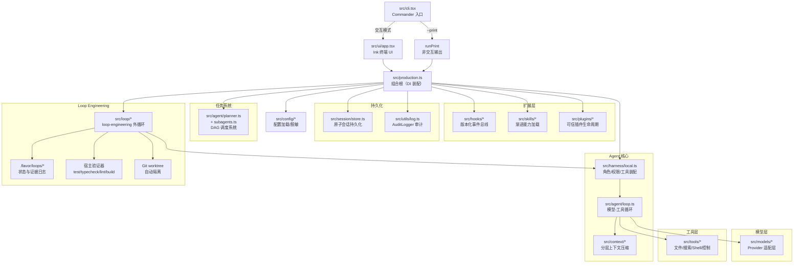
```mermaid
flowchart TD
    CLI["src/cli.tsx<br/>Commander 入口"]
    CLI -->|交互模式| UI["src/ui/app.tsx<br/>Ink 终端 UI"]
    CLI -->|--print| PRINT["runPrint<br/>非交互输出"]
    UI --> PROD["src/production.ts<br/>组合根（DI 装配）"]
    PRINT --> PROD

    PROD --> CFG["src/config/*<br/>配置加载/脱敏"]
    PROD --> HARNESS["src/harness/local.ts<br/>角色/权限/工具装配"]
    PROD --> TASK_SYS["src/agent/planner.ts<br/>+ subagents.ts<br/>DAG 调度系统"]
    PROD --> HOOKS["src/hooks/*<br/>版本化事件总线"]
    PROD --> SKILLS["src/skills/*<br/>渐进能力加载"]
    PROD --> PLUGINS["src/plugins/*<br/>可信插件生命周期"]
    PROD --> SESSION["src/session/store.ts<br/>原子会话持久化"]
    PROD --> AUDIT["src/utils/log.ts<br/>AuditLogger 审计"]
    PROD --> OUTER["src/loop/*<br/>loop-engineering 外循环"]

    HARNESS --> LOOP["src/agent/loop.ts<br/>模型-工具循环"]
    OUTER --> HARNESS
    OUTER --> LOOP_STATE[".flavor/loops/*<br/>状态与证据日志"]
    OUTER --> VERIFY["宿主验证器<br/>test/typecheck/lint/build"]
    OUTER --> ISOLATE["Git worktree<br/>自动隔离"]
    LOOP --> CTX["src/context/*<br/>分层上下文压缩"]
    LOOP --> MODELS["src/models/*<br/>Provider 适配层"]
    LOOP --> TOOLS["src/tools/*<br/>文件/搜索/Shell/控制"]

    subgraph "Agent 核心"
        LOOP
        CTX
        HARNESS
    end

    subgraph "模型层"
        MODELS
    end

    subgraph "工具层"
        TOOLS
    end

    subgraph "扩展层"
        HOOKS
        SKILLS
        PLUGINS
    end

    subgraph "持久化"
        SESSION
        AUDIT
    end

    subgraph "任务系统"
        TASK_SYS
    end

    subgraph "Loop Engineering"
        OUTER
        LOOP_STATE
        VERIFY
        ISOLATE
    end
```

**关键设计原则：**

- **组合根集中装配** — `createProductionRuntime()` 负责所有依赖注入，业务模块之间以窄接口连接
- **单向依赖** — `AgentLoop` 不读配置、不操作 UI；`SessionStore` 不接收 provider 配置，从类型边界减少凭据落盘风险
- **隔离上下文** — 主 Agent 和每个子 Agent 拥有独立的 `ContextManager` 和 `ToolRuntime` 实例

### 3.2 全链路时序

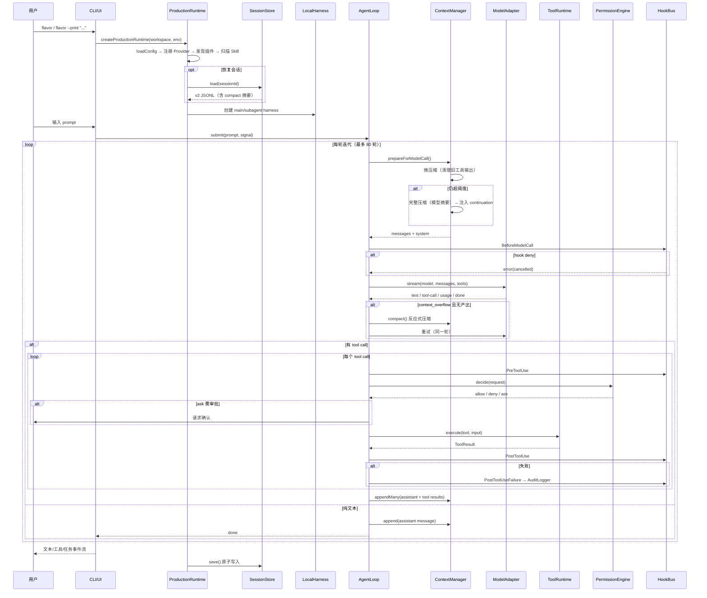
```mermaid
sequenceDiagram
    participant U as 用户
    participant CLI as CLI/UI
    participant P as ProductionRuntime
    participant S as SessionStore
    participant H as LocalHarness
    participant L as AgentLoop
    participant C as ContextManager
    participant M as ModelAdapter
    participant T as ToolRuntime
    participant PE as PermissionEngine
    participant HK as HookBus

    U->>CLI: flavor / flavor --print "..."
    CLI->>P: createProductionRuntime(workspace, env)
    P->>P: loadConfig → 注册 Provider → 发现插件 → 扫描 Skill
    opt 恢复会话
        P->>S: load(sessionId)
        S-->>P: v2 JSONL（含 compact 摘要）
    end
    P->>H: 创建 main/subagent harness

    U->>CLI: 输入 prompt
    CLI->>L: submit(prompt, signal)

    loop 每轮迭代（最多 80 轮）
        L->>C: prepareForModelCall()
        C->>C: 微压缩（清理旧工具输出）
        alt 仍超阈值
            C->>C: 完整压缩（模型摘要）→ 注入 continuation
        end
        C-->>L: messages + system

        L->>HK: BeforeModelCall
        alt hook deny
            HK-->>L: error(cancelled)
        end

        L->>M: stream(model, messages, tools)
        M-->>L: text / tool-call / usage / done

        alt context_overflow 且无产出
            L->>C: compact() 反应式压缩
            L->>M: 重试（同一轮）
        end

        alt 有 tool call
            loop 每个 tool call
                L->>HK: PreToolUse
                L->>PE: decide(request)
                PE-->>L: allow / deny / ask
                alt ask 需审批
                    L->>U: 请求确认
                end
                L->>T: execute(tool, input)
                T-->>L: ToolResult
                L->>HK: PostToolUse
                alt 失败
                    L->>HK: PostToolUseFailure → AuditLogger
                end
            end
            L->>C: appendMany(assistant + tool results)
        else 纯文本
            L->>C: append(assistant message)
            L-->>CLI: done
        end
    end

    CLI-->>U: 文本/工具/任务事件流
    P->>S: save() 原子写入
```

---

## 4. 启动与配置系统

### 4.1 入口路由

`src/cli.tsx` 基于 Commander 实现三个入口：

| 模式 | 命令 | 说明 |
|------|------|------|
| 交互模式 | `flavor` | 全功能 Ink 终端 UI，支持 slash 命令、审批面板、任务进度 |
| 非交互模式 | `flavor --print "..."` | 单次执行，所有审批默认拒绝（deny policy） |
| 会话恢复 | `flavor --resume [id]` | 从 `.flavor/sessions/` 恢复历史会话继续工作 |

非 TTY 且无 `--print` 时退出码 2 并提示用法。

### 4.2 配置加载优先级

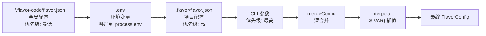
```mermaid
flowchart LR
    A["~/.flavor-code/flavor.json<br/>全局配置<br/>优先级: 最低"] --> B[".env<br/>环境变量<br/>叠加到 process.env"]
    B --> C[".flavor/flavor.json<br/>项目配置<br/>优先级: 高"]
    C --> D["CLI 参数<br/>优先级: 最高"]
    D --> E["mergeConfig<br/>深合并"]
    E --> F["interpolate<br/>${VAR} 插值"]
    F --> G["最终 FlavorConfig"]
```

- `${VAR}` 插值优先从 `.env` 取值，其次 `process.env`
- `redactConfig()` 对 `apiKey`、`authorization`、`token` 字段脱敏为 `[redacted]`
- 会话保存前递归扫描并删除敏感字段（`authorization`、`api_key`、`access_token`、`sk-*`）

#### 4.2.1 为什么配置写入不能直接覆盖原文件

配置文件可能同时被两个 Flavor 进程修改。例如，一个进程禁用 MCP server，另一个进程同时启用另一个 server。如果两个进程都先读取旧文件、各自修改后直接覆盖，后写入的进程会把前一个进程的修改吞掉；进程若在写到一半时退出，还可能留下截断 JSON。

`src/config/protected-file.ts` 把这类写入统一成下面的受保护流程：

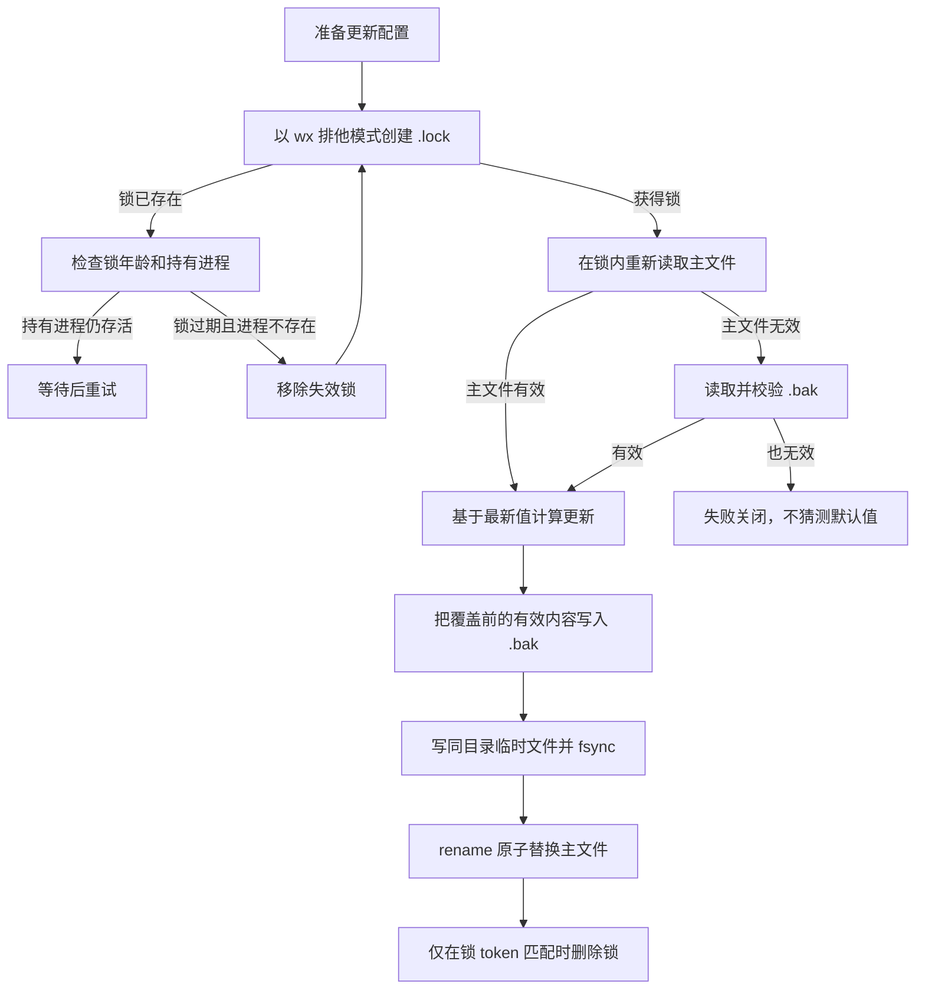
```mermaid
flowchart TD
    START[准备更新配置] --> LOCK[以 wx 排他模式创建 .lock]
    LOCK -->|锁已存在| WAIT[检查锁年龄和持有进程]
    WAIT -->|持有进程仍存活| RETRY[等待后重试]
    WAIT -->|锁过期且进程不存在| STALE[移除失效锁]
    STALE --> LOCK
    LOCK -->|获得锁| READ[在锁内重新读取主文件]
    READ -->|主文件有效| UPDATE[基于最新值计算更新]
    READ -->|主文件无效| BACKUP_READ[读取并校验 .bak]
    BACKUP_READ -->|有效| UPDATE
    BACKUP_READ -->|也无效| FAIL[失败关闭，不猜测默认值]
    UPDATE --> BACKUP[把覆盖前的有效内容写入 .bak]
    BACKUP --> TEMP[写同目录临时文件并 fsync]
    TEMP --> RENAME[rename 原子替换主文件]
    RENAME --> UNLOCK[仅在锁 token 匹配时删除锁]
```

锁文件保存 `{ pid, nonce }`：默认等待上限为 2 秒，锁超过 30 秒时还会检查 PID 是否仍存活，避免把一个运行较慢但正常的写入者误判为死锁。解锁前再次比对随机 `nonce`，防止误删后来者创建的新锁。

#### 4.2.2 主文件、备份与认证加密

读取不是“JSON 能解析就算成功”，而是同时验证结构和密文认证标签：

1. 先解码主文件；JSON 损坏、结构非法或 AES-GCM 认证失败都视为主文件无效。
2. 再用完全相同的规则解码 `.bak`。
3. 备份有效则继续启动，并在 `sources` 中记录实际使用的 `.bak` 路径。
4. 主备都无效则抛出错误，避免用空配置掩盖凭据损坏或篡改。

全局 `~/.flavor-code/flavor.json` 采用**字段级加密**：名称以 `apiKey`、`authorization`、`token`、`password`、`secret` 等敏感后缀结尾的字符串会保存为 `flavor:v1:<iv>:<tag>:<ciphertext>`。这样非敏感配置仍可人工阅读。首次读到旧明文敏感字段时会生成 32 字节 `.config.key`，随后在锁内自动迁移为 AES-256-GCM 密文；主文件和 `.bak` 都不会再保留该明文。

OAuth Token Store 复用同一套密钥管理和保护写入机制，但采用**整文件加密**，磁盘内容以 `flavor-file:v1:` 开头。整文件加密可以隐藏 provider 名称、过期时间和 scope 等认证元数据。密钥文件以排他创建方式生成，避免两个首次启动的进程生成不同密钥。

### 4.3 核心配置项

```typescript
FlavorConfigSchema = {
  providers: {                          // 模型提供商
    [name]: {
      type: "openai" | "anthropic" | "openai-compatible",
      baseURL, apiKey, defaultModel, cheapModel
    }
  },
  agents: {
    main: { model: "provider:model" }, // 主 Agent 模型
    subagent: { model: "provider:model" } // 子 Agent 模型
  },
  maxSubagents: 1-16,                  // 子 Agent 最大并行数（默认 3）
  permissionMode: "default" | "acceptEdits" | "plan" | "bypassPermissions" | "auto" | "bubble", // 默认 default
  language: "zh-CN",                   // BCP47 语言标签
  maxIterations: {
    main: 10-500,                      // 主 Agent 迭代上限（默认 80）
    subagent: 10-200,                  // 子 Agent 迭代上限（默认 40）
    softLimitFactor: 0.8,              // 软限制比例
    extendBy: 20                       // 扩展步数
  },
  loop: {
    maxCycles: 20,                     // 每次用户授权增加的 cycle 数
    maxTokens: 500_000,                // 每次用户授权增加的模型 token 数
    isolation: "auto"                  // 只读用当前目录；改代码自动用 worktree
  },
  context: {
    windowTokens: 200_000,             // 模型上下文窗口
    reservedOutputTokens: 20_000,      // 保留给输出
    autoCompactBufferTokens: 13_000,   // 自动压缩缓冲
    toolOutputChars: 30_000,           // 单次工具输出截断
    microcompactKeepRecentToolResults: 5 // 微压缩保留数
  }
}
```

---

## 5. Agent 核心循环

### 5.1 迭代控制

`AgentLoop.run()` 是一个 `async *` 生成器，输出 `AgentEvent` 事件流，由消费方（UI 或子 Agent 调用者）通过 `for await...of` 消费。

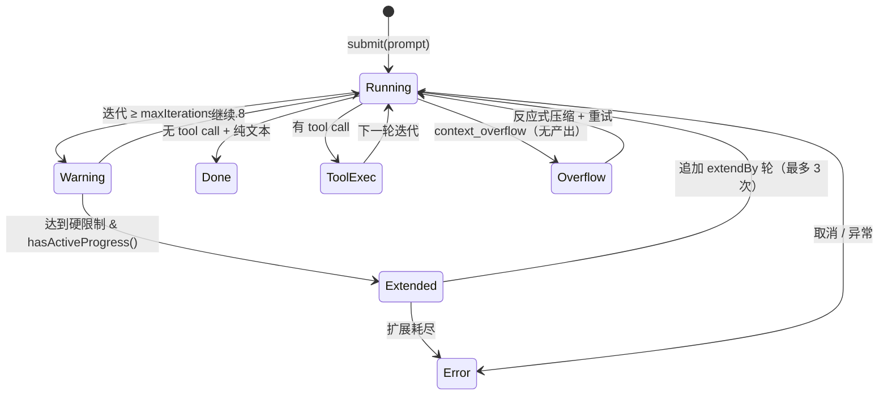
```mermaid
stateDiagram-v2
    [*] --> Running: submit(prompt)
    Running --> Warning: 迭代 ≥ maxIterations × 0.8
    Warning --> Running: 继续
    Warning --> Extended: 达到硬限制 & hasActiveProgress()
    Extended --> Running: 追加 extendBy 轮（最多 3 次）
    Extended --> Error: 扩展耗尽
    Running --> Done: 无 tool call + 纯文本
    Running --> ToolExec: 有 tool call
    ToolExec --> Running: 下一轮迭代
    Running --> Overflow: context_overflow（无产出）
    Overflow --> Running: 反应式压缩 + 重试
    Running --> Error: 取消 / 异常
```

**软限制**：迭代达到 80% 时发出 `warning` 事件，告知用户剩余轮数有限。

**硬限制 + 自动扩展**：到达上限时检查 `hasActiveProgress()`——如果存在 `in_progress` 的主任务或 `running` 的子 Agent，自动追加扩展轮数（默认 20 轮，最多 3 次扩展）。子 Agent 不可扩展。

### 5.2 单轮循环详解

```
prepareForModelCall()
  ├── 自动微压缩（快速清理旧工具输出）
  ├── needsCompaction() 判断
  │     └── 完整压缩（模型摘要）
  └── 返回 messages + system
       ↓
BeforeModelCall hook（可 deny）
       ↓
adapter.stream(model, messages, tools)
  ├── text → yield text 事件
  ├── tool-call → 暂存
  ├── usage → 回写 ContextManager
  └── context_overflow → 反应式压缩 + 重试（最多 1 次）
       ↓
AfterModelCall hook
       ↓
有 tool calls?
  ├── 是 → 逐个执行
  │     ├── PreToolUse hook
  │     ├── PermissionEngine.decide()
  │     ├── tool.execute()
  │     ├── PostToolUse hook
  │     └── 失败时 PostToolUseFailure → AuditLogger
  │     └── appendMany(assistant + tool results)
  └── 否 → append(assistant message) → done
```

关键设计细节：

- **整轮暂存**：工具调用整轮暂存后一次性 `appendMany()` 提交 assistant + tool 消息，保证 provider 对话结构有效
- **反应式压缩**：正常请求在尚未产生文本或工具调用时若返回 `context_overflow`，循环在同一 iteration 内强制压缩并重建请求，最多重试一次。若已有可见输出则不重试，避免拼接
- **取消安全**：通过 `AbortSignal` 支持取消，取消后立即合成错误结果并清理

### 5.3 Loop Engineering 外循环

#### 调研结论与边界

截至 2026-07-15，外部资料对 loop engineering 的共同定义不是“把同一个 prompt 无限重试”，而是设计 Agent 外部的控制系统：明确目标、状态、权限、独立验证、反馈路径、停止规则和记忆。论文 *Stop Hand-Holding Your Coding Agent* 将可复用 loop specification 概括为 trigger、goal、verification、stopping rule 和 memory；[Loop Engineering](https://loopengineering.sh/) 也强调它是围绕 Agent 的控制系统。OpenAI 对 [Codex agent loop](https://openai.com/index/unrolling-the-codex-agent-loop/) 的说明则对应本项目已有的内部“模型—工具—观察”循环；[Harness engineering](https://openai.com/index/harness-engineering/) 展示了在其外层通过审查与反馈继续迭代的实践。

因此本项目明确区分两层：

- `AgentLoop` 是一次 worker 内部的 ReAct 循环，模型无工具调用时即可结束。
- `LoopOrchestrator` 是宿主持有的外循环，worker 的“完成”只表示请求验证；只有宿主验证器通过才产生 `succeeded`。

这种分层也用于控制无限循环风险。[When Agents Do Not Stop](https://arxiv.org/abs/2607.01641) 指出，无有效边界的 Agent 循环会放大成本、上下文增长和重复副作用，因此实现必须同时具备预算门槛、可取消性、无进展熔断和具名终态。

#### 命令与运行流程

用户只需调用：

```text
/loop <goal>
```

`loop` 是保留的内置命令，插件或普通 Skill 不能覆盖。方法论由内置 Loop Skill 注入每个新 cycle；调度、验证、预算、持久化和终态判断属于核心运行时，不能由模型自行批准。

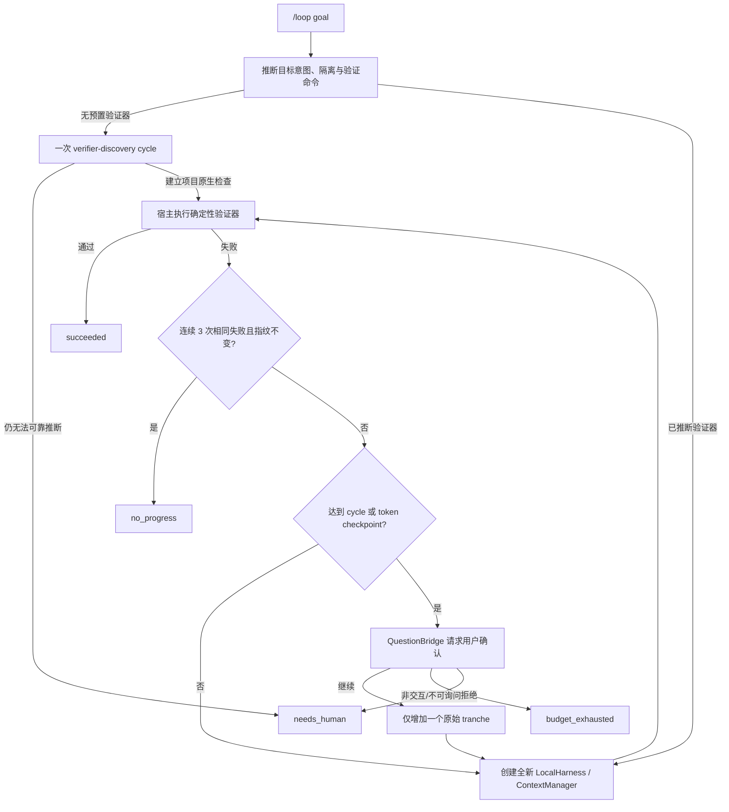
```mermaid
flowchart TD
    START["/loop goal"] --> RESOLVE["推断目标意图、隔离与验证命令"]
    RESOLVE -->|无预置验证器| DISCOVERY["一次 verifier-discovery cycle"]
    DISCOVERY -->|仍无法可靠推断| HUMAN["needs_human"]
    DISCOVERY -->|建立项目原生检查| VERIFY
    RESOLVE -->|已推断验证器| WORKER["创建全新 LocalHarness / ContextManager"]
    WORKER --> VERIFY["宿主执行确定性验证器"]
    VERIFY -->|通过| SUCCESS["succeeded"]
    VERIFY -->|失败| PROGRESS{"连续 3 次相同失败且指纹不变?"}
    PROGRESS -->|是| STUCK["no_progress"]
    PROGRESS -->|否| BUDGET{"达到 cycle 或 token checkpoint?"}
    BUDGET -->|否| WORKER
    BUDGET -->|是| CONFIRM["QuestionBridge 请求用户确认"]
    CONFIRM -->|继续| EXTEND["仅增加一个原始 tranche"]
    EXTEND --> WORKER
    CONFIRM -->|拒绝| EXHAUSTED["budget_exhausted"]
    CONFIRM -->|非交互/不可询问| HUMAN
```

#### 验证与隔离推断

验证器按稳定顺序读取 `package.json` 中的 `test`、`typecheck`、`lint`、`build`、`smoke:install`，也识别 `FLAVOR.md` 中明确列出的受信任 npm 命令。命令由宿主的 Shell 工具执行，退出码、截断后的 stdout/stderr 和摘要写入 cycle evidence。若启动时没有确定性命令，调度器不会在 `0 token` 处退出，而是先运行一次 verifier-discovery cycle：worker 检查项目并建立有意义的项目原生检查，宿主随后重新推断并执行。显然无条件成功的脚本（如 `exit 0`、`echo ok`）不会被信任；discovery 后仍没有可靠命令才进入 `needs_human`，不会用模型自述替代证据。

`isolation: "auto"` 的规则是：只读目标使用当前 workspace；代码修改目标及语义不明确的目标要求干净 Git 仓库，并创建 `.worktrees/loop-<id>` 与 `loop/<id>` 分支。`.worktrees/` 只写入仓库本地 `.git/info/exclude`，不修改共享 `.gitignore`。隔离失败时进入 `needs_human`，不会静默降级到主工作区。

#### 分段预算确认

`loop.maxCycles` 与 `loop.maxTokens` 是授权步长，不是整个 loop 的一次性硬上限。初始 checkpoint 等于配置值；达到门槛后只在当前模型流和宿主验证完成的安全边界询问用户，确认后按原始步长增加：

```text
maxTokens = 5,000,000
5,000,000 → 确认 → 10,000,000 → 确认 → 15,000,000 → ...

maxCycles = 20
20 → 确认 → 40 → 确认 → 60 → ...
```

token 统计包括 worker 的所有模型调用以及上下文压缩模型调用；本地 Shell 验证命令不计 token。用户拒绝产生 `budget_exhausted`；非交互模式无法确认时产生 `needs_human`。预算批准记录维度、旧/新 checkpoint、当时累计用量和时间戳。

#### 状态、持久化与当前限制

每次运行写入 `.flavor/loops/<loop-id>/state.json` 和 `events.jsonl`。snapshot 使用临时文件加原子 rename；journal 追加 cycle、预算和终态事件。具名状态包括 `running`、`succeeded`、`failed`、`blocked`、`cancelled`、`budget_exhausted`、`no_progress`、`needs_human`。

当前版本是前台单 loop：不包含后台调度、跨进程自动恢复、自动 merge/push/deploy、容器沙箱或并发 loop 管理。worktree 与分支会保留供用户检查，不自动合并或删除。`blocked` 已进入持久化协议，首版主要通过权限错误和最终失败证据呈现，尚未对所有工具拒绝原因做精细自动分类。

### 5.4 幻觉检测机制

Agent 是概率系统，可能在缺少证据时编造文件路径、命令结果或 API 行为（幻觉）。
flavor-code 实现了一个轻量的三层幻觉检测体系，在每次主 Agent 任务完成前对结果和执行证据进行自动化审查：

**1. 有界过程证据 + Cheap 模型评分** — `EvidenceLedger` 在工具执行时记录调用 ID、工具名、
脱敏参数摘要、成功/失败、错误码和结果短摘要。连续相同事件会折叠，评分时最多保留 24 个事件和
6,000 字符，优先保留验证、修改、失败以及最近事件，不会把完整工具日志塞给评分器。

任务结束时 Cheap 模型在一次请求中同时查看用户 query、最终输出和压缩证据，分别返回：

- `taskAlignment`：是否覆盖用户要求；
- `evidenceGrounding`：最终声明是否有执行证据支撑；
- `processReliability`：是否仍有未解决错误或前后矛盾。

最终置信度由本地固定权重计算：`40% × taskAlignment + 40% × evidenceGrounding + 20% × processReliability`。
工具选择本身不扣分，`Read` 失败后通过 `Shell` 成功读取属于正常恢复。默认阈值仍为 0.7，
低于阈值只产生告警，不再阻断已通过确定性验证的下游任务。

结构化评分关闭修复重试，最多调用模型一次。`hallucination.evaluationTimeoutMs` 控制硬超时，
默认 2,000 ms、允许 100–30,000 ms。超时、模型不可用或格式错误时均 fail-open，直接跳过 LLM 评分。

**2. 工具调用重试监测** — 追踪工具调用失败后的重试行为。默认最大重试 3 次
（匹配项目模型重试设定），同一工具成功执行后自动清零。超过阈值产生 RetryViolation，
报告工具名称、实际重试次数、最大重试次数和最近错误码。

**3. 参数滑动窗口熔断** — 检测"相同工具 + 相同参数"的反复重试死循环。
Hash 计算方式为 SHA256(toolName + JSON(sorted_params))。
默认窗口大小 20，阈值 15。同一 hash 在窗口内出现超过阈值次数即触发电路熔断
（Circuit Breaker），旧条目被推出窗口后自动解除。

**架构集成**：三条路径共享同一 `HallucinationGuard` 实例
（在 `production.ts` 以 subagent model 作为 cheap model 创建）：

- **交互式对话** — `AgentLoop.run()` 中累积文本并记录工具调用/结果。
  模型结束（无 tool call）时触发 `guard.evaluate()`，失败时 yield warning 事件（不阻断对话）。
- **/loop 命令** — `LoopOrchestrator` 验证通过后、声明 success 前触发检查。
  LLM 低分作为成功结果上的附加告警；只有重复失败和确定性循环等本地规则可以将 loop 标记为 failed。
- **子 Agent** — 不介入（`agent !== "main"` 时跳过）。

**关键类型：**

```typescript
interface HallucinationReport {
  confidence: ConfidenceResult | null;  // 置信度结果（模型不可用时为 null）
  evaluationStatus: "completed" | "timeout" | "unavailable" | "skipped";
  retryViolations: RetryViolation[];    // 超限的工具重试列表
  circuitBreakerTripped: boolean;       // 滑动窗口是否触发熔断
  circuitBreakerDetail: string | null;  // 熔断详情
  passed: boolean;                      // 仅由本地确定性检查决定
  blockingReasons: string[];            // 与告警显示配置无关的阻断原因
  warnings: string[];                   // LLM 低分及本地风险告警
}
```

**默认阈值：**

| 机制 | 默认值 | 常量 |
|------|--------|------|
| 置信度阈值 | 0.7 | `DEFAULT_CONFIDENCE_THRESHOLD` |
| LLM 评分超时 | 2,000 ms | `DEFAULT_EVALUATION_TIMEOUT_MS` |
| 工具重试上限 | 3 次 | `DEFAULT_MAX_TOOL_RETRIES` |
| 滑动窗口大小 | 20 | `DEFAULT_SLIDING_WINDOW_SIZE` |
| 滑动窗口熔断 | 15 | `DEFAULT_SLIDING_WINDOW_THRESHOLD` |

**文件结构：**

```
src/hallucination/
├── types.ts              # ConfidenceResult, SlidingWindowConfig, HallucinationReport
├── sliding-window.ts     # 滑动窗口 + SHA256 参数哈希
├── evidence-ledger.ts    # 有界过程证据、脱敏、折叠和优先选择
├── confidence.ts         # 单次三维 Cheap 模型评分 + 硬超时
├── retry-monitor.ts      # 工具重试计数 + 滑动窗口集成
├── guard.ts              # HallucinationGuard 统一门面
└── index.ts              # Barrel export

tests/hallucination/
├── sliding-window.test.ts    # 12 tests
├── evidence-ledger.test.ts   # 证据预算、脱敏、折叠和优先级
├── confidence.test.ts        # 三维评分、证据输入、单次调用和超时
├── retry-monitor.test.ts     # 重试与失败调用单次计数
├── guard.test.ts             # 告警/阻断分离、状态和 fail-open
└── integration.test.ts       # 3 tests（AgentLoop 完整集成 + spy 验证）
```

---

## 6. 上下文管理与压缩系统

### 6.1 消息布局

每次模型请求时，`ContextManager` 按以下层次拼装消息：

```
┌──────────────────────────────────────┐
│  System Prompt（身份/规则/指令）       │  ← #pinnedMessages() 固定层
├──────────────────────────────────────┤
│  FLAVOR.md（项目指南）                 │  ← 可选
├──────────────────────────────────────┤
│  TaskSnapshot（当前任务状态）          │  ← 可选
├──────────────────────────────────────┤
│  Compact Continuation（压缩摘要续接）  │  ← 注入为 user 消息
├──────────────────────────────────────┤
│  近期完整消息（未压缩部分）            │  ← provider-valid messages
└──────────────────────────────────────┘
```

固定层（system、FLAVOR、TaskSnapshot）不参与压缩持久化，每次由新的 ContextManager 重新生成。

### 6.2 三级压缩策略

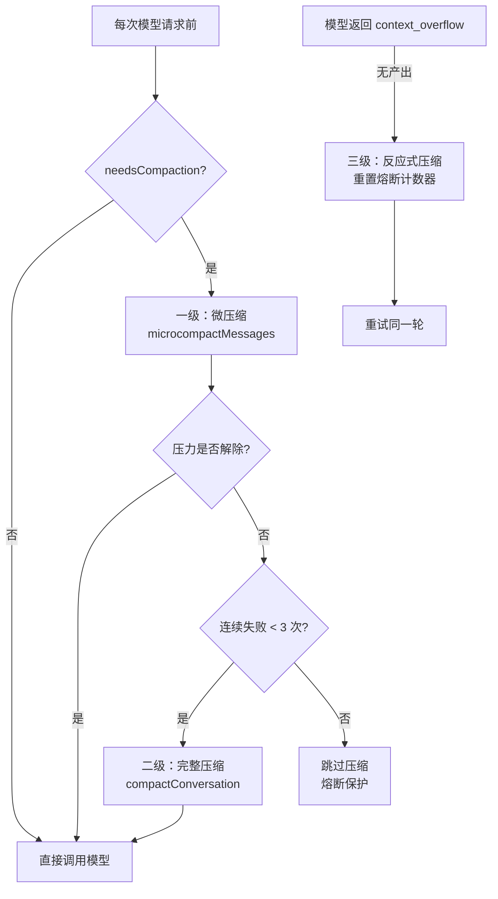
```mermaid
flowchart TD
    REQ[每次模型请求前] --> CHK{needsCompaction?}
    CHK -->|否| GO[直接调用模型]
    CHK -->|是| MICRO[一级：微压缩<br/>microcompactMessages]
    MICRO --> CHK2{压力是否解除?}
    CHK2 -->|是| GO
    CHK2 -->|否| AUTO{连续失败 < 3 次?}
    AUTO -->|是| FULL[二级：完整压缩<br/>compactConversation]
    AUTO -->|否| GO_WARN[跳过压缩<br/>熔断保护]
    FULL --> GO

    OVERFLOW[模型返回 context_overflow] -->|无产出| REACT[三级：反应式压缩<br/>重置熔断计数器]
    REACT --> GO_RETRY[重试同一轮]
```

**一级 — 微压缩（Microcompact）**

- 在完整压缩前快速释放空间
- 识别已完成的可压缩工具调用（Read、Shell、Grep、Glob、Edit、Write、ApplyPatch 等 11 种）
- 保留最近 5 个工具结果（`microcompactKeepRecentToolResults`），其余替换为 `[Old tool result content cleared]`
- 失败可回滚，不破坏对话

**二级 — 完整压缩（Model Summary）**

- 调用当前角色模型（空工具集）生成结构化摘要
- 九段式摘要提示词：用户意图与技术决策、文件与代码区、错误与修复、问题解决、待办项、当前工作、下一步、可选分析草稿
- 保留最近 10K–40K token 或 5 条文本消息，不切断 tool call/result
- 自动压缩连续 3 次失败后熔断（避免重复消耗 API）
- 手动 `/compact` 和反应式压缩绕过熔断
- 通过 `snapshot()` / `restore()` 保存和恢复压缩边界

**三级 — 反应式压缩（Reactive）**

- agent loop 在 `context_overflow` 且无可见输出时触发
- 强制完整压缩并重试同一轮
- 重置自动压缩失败计数器

### 6.3 工具输出截断

单次工具消息按 `toolOutputChars`（默认 30,000 字符）进行头尾截断，中间插入截断标记。截断方式为保留字符级头和尾，避免丢失关键信息的同时控制上下文窗口占用。

### 6.4 压力估算模型

- 模型 usage 的 input tokens 回写 ContextManager
- 下一轮以真实 usage + 新增消息估算增量作为压力基线
- 与完整上下文估算取较大值
- 有效窗口 = `windowTokens - reservedOutputTokens`（默认 180K）
- 自动压缩阈值 = 有效窗口 - `autoCompactBufferTokens`（默认 167K）
- 首次调用和刚追加工具结果时使用字符/4 保守估算兜底

---

## 7. 任务系统

### 7.0 通俗理解：什么是 DAG？

在深入技术细节之前，先用一个生活中的例子理解 DAG（有向无环图）的核心思想。

**类比：做一顿年夜饭。** 年夜饭有 6 道菜，但你的厨房只有 2 个灶台。你不能一上来就炒菜，得先洗菜、切菜——这些步骤有先后顺序：凉拌黄瓜和红烧肉可以同时准备（它们互不依赖），但红烧肉必须先焯水再炖煮（有先后依赖），而摆盘必须在所有菜都做好之后。如果你画一张"先做什么、后做什么"的图，每条线都带箭头（有向）、且不会绕回原点（无环），这就是一张 DAG。

flavor-code 把这个思想用到了 AI 编程中。当你对 flavor-code 说"重构整个 auth 模块"，它不会把 10 个文件一次性全改了——那样容易出错。相反，它会把大任务拆成若干小任务，自动分析哪些任务必须先做、哪些可以并行，然后像"厨师分灶台"一样把任务分配给多个子 Agent 同时执行。

整个任务系统分为两个层次：

| 层次 | 比喻 | 做什么 |
|------|------|--------|
| **TaskPlan**（主计划） | 年夜饭的菜单 | 主 Agent 向用户承诺"我要依次完成 A→B→C→D"，是一个结构化的任务清单 |
| **Task DAG**（子Agent调度） | 分派给帮厨的活 | 把具体工作拆成互相依赖的小任务，交给多个子 Agent 并行执行 |

以下各节从状态机、图结构、调度算法、并发安全等方面，详细介绍这套机制的实现。

### 7.1 两层状态机

Flavor 有两套独立但互补的任务管理机制：

| 层 | 角色 | 工具 | 状态数 | 特点 |
|----|------|------|--------|------|
| TaskPlan | 主 Agent 对用户的结构化承诺 | TaskPlan、TaskUpdate | 6 种 | DAG 依赖、依赖校验、仅主 Agent 可用 |
| TodoWrite | Agent 自用的轻量进度清单 | TodoWrite | 4 种 | 无依赖、最多 50 项、至多 1 项 in_progress |

### 7.2 TaskPlan 状态机

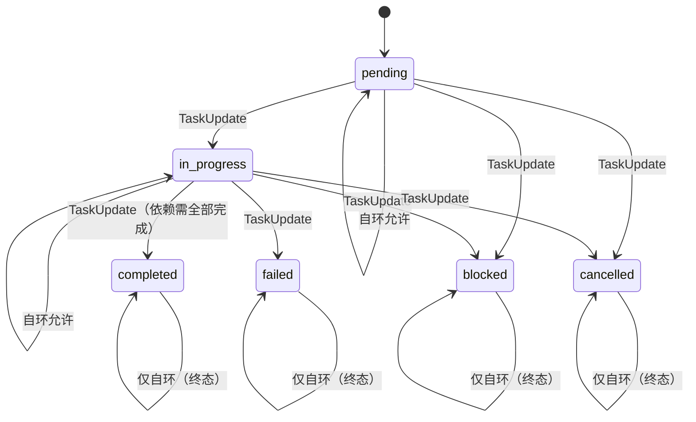
```mermaid
stateDiagram-v2
    [*] --> pending
    pending --> in_progress: TaskUpdate
    pending --> blocked: TaskUpdate
    pending --> cancelled: TaskUpdate
    pending --> pending: 自环允许

    in_progress --> completed: TaskUpdate（依赖需全部完成）
    in_progress --> failed: TaskUpdate
    in_progress --> blocked: TaskUpdate
    in_progress --> cancelled: TaskUpdate
    in_progress --> in_progress: 自环允许

    completed --> completed: 仅自环（终态）
    failed --> failed: 仅自环（终态）
    blocked --> blocked: 仅自环（终态）
    cancelled --> cancelled: 仅自环（终态）
```

**Schema 校验规则：**

- 无重复 ID
- 依赖项必须指向已知 ID
- 不允许重复依赖
- `completed` 节点的所有依赖必须 `completed`
- 最多一个 `in_progress` 任务
- 无循环依赖

`normalizeAbandonedPlan()` 在会话恢复时将所有 `in_progress` 转为 `cancelled`，防止脏状态残留。

### 7.3 DAG 图结构设计

#### 7.3.1 TaskGraph Schema

DAG 的建模单元是 `TaskNode`，由模型通过 `Task` 工具生成，经 Zod Schema 严格校验后传入调度器：

```typescript
// src/agent/planner.ts
const TaskNodeSchema = z.object({
  id: z.string().trim().min(1),                   // 唯一标识
  description: z.string().trim().min(1),           // 任务描述（传给子 Agent 的 prompt 核心）
  dependencies: z.array(z.string().trim().min(1)), // 上游依赖 ID 列表
  expectedOutputs: z.array(z.string().trim().min(1)), // 预期产出（如文件名、函数签名）
  verification: z.array(z.string().trim().min(1)), // 验证命令（如 "npm test"、"tsc --noEmit"）
}).strict();

const TaskGraphSchema = z.object({
  nodes: z.array(TaskNodeSchema),
}).strict().superRefine((graph, context) => {
  // 1. 无重复 ID
  // 2. 所有依赖项必须指向图中已知节点
  // 3. 无重复依赖声明
  // 4. 无循环依赖（Kahn 算法检测）
});
```

#### 7.3.2 图验证：Kahn 拓扑排序检测环

**通俗理解：** Kahn 算法就像在玩"多米诺骨牌"——先找出所有不需要等别人的任务（入度为 0），做完一个就"推倒"它后面的任务；如果最后所有任务都能被推倒，说明图没有环。如果有些牌永远推不倒（被循环依赖卡住了），就说明有环。

`hasCycle()` 使用经典的 Kahn 算法（BFS 拓扑排序），时间复杂度 O(V+E)：

```typescript
// src/agent/planner.ts - hasCycle()
function hasCycle(nodes: readonly TaskNode[]): boolean {
  // indegree: 每个节点还需等待多少个上游节点完成
  const indegree = new Map(nodes.map((t) => [t.id, t.dependencies.length]));
  // dependents: 邻接表（反向边），用于级联减度
  const dependents = new Map<string, string[]>();

  // 构建邻接表
  for (const task of nodes) {
    for (const dep of task.dependencies) {
      (dependents.get(dep) ?? []).push(task.id);
    }
  }

  // 入度为 0 的节点入队（无依赖，立即就绪）
  const ready = nodes.filter((t) => indegree.get(t.id) === 0).map((t) => t.id);
  let visited = 0;

  for (let cursor = 0; cursor < ready.length; cursor++) {
    const id = ready[cursor]!;
    visited += 1;
    // 当前节点"完成"后，所有后继节点入度 -1
    for (const dependent of dependents.get(id) ?? []) {
      const next = (indegree.get(dependent) ?? 0) - 1;
      indegree.set(dependent, next);
      if (next === 0) ready.push(dependent); // 后继就绪
    }
  }
  // 访问节点数 < 总节点数 → 存在环
  return visited !== nodes.length;
}
```

#### 7.3.3 TaskPlanner：带 Hook 的图生成

`TaskPlanner.plan()` 在模型生成的原始图和数据之间插入 `BeforePlan`/`AfterPlan` Hook：

```typescript
// src/agent/planner.ts - TaskPlanner.plan()
async plan(input: unknown, signal?: AbortSignal): Promise<TaskGraph> {
  // BeforePlan Hook —— 可修改或拒绝对图的规划
  const before = await this.#hooks.emit({
    type: "BeforePlan", payload: { graph: input }
  }, signal);
  if (before.decision === "deny") throw ...;

  // 解析并校验 DAG
  const graph = TaskGraphSchema.parse(
    before.updatedInput ?? input
  );

  // AfterPlan Hook —— 记录规划结果
  await this.#hooks.emit({
    type: "AfterPlan", payload: { outcome: "completed" }
  });
  return graph;
}
```

### 7.4 SubagentScheduler 核心算法

**通俗理解：** SubagentScheduler 就像一个"工地工头"。它手里有一张施工图（DAG），知道哪些活必须先干、哪些可以同时干。它手里有 N 个工人（子 Agent），每次挑出"前置活都干完了"的任务分配出去。哪个工人先干完，就立刻给他派下一个能干的活。如果有工人的活干砸了，依赖他的后续工作全部标记为"阻塞"，不会让后面的工人白等。

`SubagentScheduler`（`src/agent/subagents.ts`）是 DAG 执行的引擎，核心逻辑位于其 `run()` 方法中。

#### 7.4.1 完整调度循环

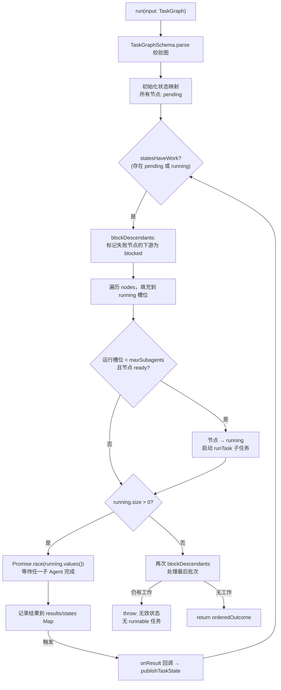
```mermaid
flowchart TD
    START["run(input: TaskGraph)"]
    START --> PARSE["TaskGraphSchema.parse 校验图"]
    PARSE --> INIT["初始化状态映射<br/>所有节点: pending"]

    INIT --> LOOP{"statesHaveWork?<br/>(存在 pending 或 running)"}

    LOOP -->|是| BLOCK["blockDescendants:<br/>标记失败节点的下游为 blocked"]

    BLOCK --> DISPATCH["遍历 nodes，填充到 running 槽位"]
    DISPATCH --> CHECK{"运行槽位 < maxSubagents<br/>且节点 ready?"}
    CHECK -->|是| LAUNCH["节点 → running<br/>启动 runTask 子任务"]
    CHECK -->|否| WAIT

    LAUNCH --> WAIT{"running.size > 0?"}
    WAIT -->|是| RACE["Promise.race(running.values())<br/>等待任一子 Agent 完成"]
    WAIT -->|否| BLOCK2["再次 blockDescendants<br/>处理最后批次"]

    RACE --> COMMIT["记录结果到 results/states Map"]
    COMMIT -->|触发| ON_RESULT["onResult 回调 → publishTaskState"]
    ON_RESULT --> LOOP

    BLOCK2 -->|仍有工作| ERR["throw: 无效状态<br/>无 runnable 任务"]
    BLOCK2 -->|无工作| DONE["return orderedOutcome"]
```

**关键机制：**

1. **事件驱动调度**：使用 `Promise.race(running.values())` 而不是轮询——任一子 Agent 完成后立即评估新的可调度任务，最大化并行度。

2. **槽位控制**：`running.size >= maxSubagents` 时暂停新任务分发，等待已运行任务完成后再填充空槽。

3. **拓扑就绪条件**：一个 `pending` 节点只有在所有 `dependencies` 都是 `"completed"` 时才被认为是 `ready`（`isReady()` 函数）。

4. **清理与取消**：调度器内部创建 `AbortController`，并与外部 `signal` 通过 `AbortSignal.any()` 组合。`finally` 块中 `controller.abort(new Error("Subagent scheduler stopped"))` 确保所有正在运行的子任务收到取消信号，并且 `Promise.allSettled(started)` 等待所有子任务完成清理。

#### 7.4.2 故障传播：blockDescendants

**通俗理解：** 这就像多米诺骨牌的反向传播——如果任务 A 失败了，所有依赖 A 的任务（B、C、D...）自动被标记为"阻塞"，不再浪费资源去执行它们。而且这个阻塞是"传染"的：如果 B 被阻塞了，依赖 B 的任务也会被阻塞，直到所有受影响的链条都停下来。

```typescript
async #blockDescendants(graph, states, results): Promise<void> {
  let changed = true;
  while (changed) {
    changed = false;
    for (const task of graph.nodes) {
      if (states.get(task.id) !== "pending") continue;
      // 只要存在一个上游处于 failed 或 blocked 状态，当前节点被阻塞
      if (!task.dependencies.some((id) =>
        ["failed", "blocked"].includes(states.get(id) ?? "pending"))
      ) continue;
      states.set(task.id, "blocked");
      results.set(task.id, syntheticResult(task, "blocked", "Blocked by a failed dependency"));
      await this.#options.onResult?.(result);
      changed = true; // 级联传播（新 blocked 的节点可能继续阻塞下游）
    }
  }
}
```

传播是**级联的**：A 失败 → B blocked → C blocked，一次 `while` 循环收敛所有影响。

#### 7.4.3 重试机制：最多 2 次尝试

每个子 Agent 任务最多获得 2 次尝试机会：

- **第一次尝试**：正常执行，子 Agent 调用 `TaskOutput` 工具或以 JSON 返回结果
- **Schema 校验**：结果必须通过 `SubagentResultSchema.parse()`，且 `taskId` 必须匹配
- **第二次尝试**（仅当首次校验失败）：prompt 中追加 `"Your previous response was invalid. Return only one strict JSON object."` 修复提示
- **两次均失败**：合成 `status: "failed"` 的 `SubagentResult`，摘要为 `"Invalid structured result after repair"`

```typescript
async #runTask(task: TaskNode, signal: AbortSignal): Promise<Completion> {
  // SubagentStart Hook（可 deny）
  const start = await this.#options.hooks.emit({
    type: "SubagentStart", payload: { taskId: task.id }
  }, signal);
  if (start.decision === "deny") throw ...;

  for (const attempt of [1, 2] as const) {
    signal.throwIfAborted();
    const raw = await awaitWithSignal(
      this.#options.execute(task, { attempt, signal }), signal
    );
    const parsed = SubagentResultSchema.safeParse(raw);
    if (parsed.success && parsed.data.taskId === task.id) {
      completion = { id: task.id, result: parsed.data };
      break; // 校验通过，退出重试
    }
    failure = parsed.success
      ? new Error(`taskId mismatch`)
      : parsed.error;
  }
  // 始终发送 SubagentStop Hook（成功/失败/取消）
  await this.#options.hooks.emit({
    type: "SubagentStop",
    payload: { taskId: task.id, status, error }
  });
}
```

### 7.5 子 Agent 执行生命周期

#### 7.5.1 runChild：独立 harness 构造

每个子 Agent 通过 `runChild()` 函数创建完全隔离的执行环境（`src/production.ts`）：

```typescript
async function runChild(
  harness: LocalHarness, skills: SkillRegistry,
  task: TaskNode, attempt: 1 | 2, signal: AbortSignal,
): Promise<unknown> {
  return harness.runSubagent(task, async (child, childSignal) => {
    // 1. 匹配相关 Skill
    const skill = await skills.match(task.description);
    const additionalContext = skill
      ? `Matched skill: ${skill.name}\n${await skills.loadBody(skill)}`
      : undefined;

    // 2. 构造子 Agent prompt（任务描述 + 预期产出 + 验证命令）
    const repair = attempt === 2
      ? " Your previous response was invalid. Return only one strict JSON object."
      : "";
    const prompt = [
      `Complete task ${task.id}: ${task.description}`,
      `Expected outputs: ${task.expectedOutputs.join("; ")}`,
      `Verification: ${task.verification.join("; ")}`,
      `For completed work, finish by calling TaskOutput...${repair}`,
    ].join("\n");

    // 3. 启动子 Agent Loop
    for await (const event of child.loop.run({ prompt, signal: childSignal, additionalContext })) {
      if (event.type === "error") throw new Error(event.error.message);
      // 4. 捕获 TaskOutput 工具调用 → 直接返回结构化结果
      if (event.type === "tool-end" && event.name === "TaskOutput" && event.result.ok) {
        const completed = subagentResultFromTaskOutput(task.id, event.result.output);
        if (completed !== undefined) return completed;
      }
    }
    // 5. 兜底：从最终 assistant 消息解析 JSON
    return parseFinalSubagentMessage(child.context.snapshot().messages);
  }, signal);
}
```

#### 7.5.2 子 Agent 约束矩阵

| 约束维度 | 主 Agent | 子 Agent |
|----------|----------|----------|
| 权限模式 | 六种规范模式可配置 | bubble（主 Agent 为 plan 时继承 plan） |
| 工具集合 | 全部工具 | 排除 Task、TaskPlan、TaskUpdate、AskUserQuestion |
| 迭代上限 | 80（可扩展至 140） | 40（不可扩展） |
| ContextManager | 主 session 上下文 | 全新独立实例 |
| AgentLoop | 主 loop | 全新独立 loop |
| Skill 匹配 | 自动匹配用户 prompt | 自动匹配 task.description |
| 输出契约 | 不限 | 必须输出结构化的 SubagentResult（通过 TaskOutput 工具或 JSON） |

**工具过滤原因**：子 Agent 不可再次委派任务（Task）、不可创建或更新计划（TaskPlan/TaskUpdate）、不可主动向用户提问（AskUserQuestion）。这些是主 Agent 的独有权限。

### 7.6 接入模型驱动流程

#### 7.6.1 工具注册与工具路由

在 `createProductionRuntime()` 中，DAG 系统通过三个独立机制接入 Agent Loop：

1. **TaskPlan / TaskUpdate 工具**（`src/agent/task-tools.ts`）：通过 `createTaskPlanTools()` 注册为主 Agent 可用工具，操作内存中的 `taskPlan` 引用
2. **Task 工具**（`src/production.ts` 行 292–328）：内联定义的 `ToolDefinition`，接收 `TaskGraph` Schema，内部创建 `SubagentScheduler` 并调用 `scheduler.run()`
3. **TaskOutput 工具**：子 Agent 完成任务后调用，返回结构化 `SubagentResult`

```typescript
// src/production.ts - Task 工具定义
const taskTool: ToolDefinition<unknown> = {
  name: "Task",
  description: "Validate a task graph and execute its nodes with isolated child agents",
  inputSchema: TaskGraphSchema,  // 模型生成图直接通过 Zod 校验
  execute: async (input, signal) => {
    const scheduler = new SubagentScheduler({
      hooks,
      maxSubagents: config.maxSubagents,
      onResult: async (result) => {
        // 每个子 Agent 完成后立即更新 taskStates/taskResults
        // 触发 publishTaskState() 推送 UI 进度面板
      },
      execute: (task, execution) =>
        runChild(harness, skills, task, execution.attempt, execution.signal),
    });
    const outcome = await scheduler.run(input);
    return outcome;
  },
};
```

#### 7.6.2 端到端调用链

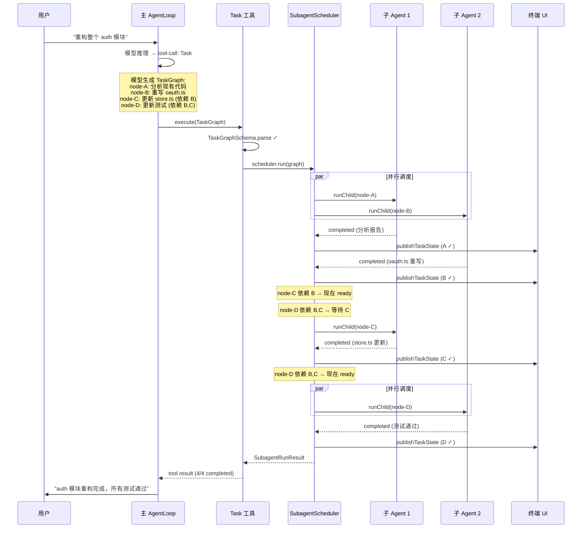
```mermaid
sequenceDiagram
    participant U as 用户
    participant MAIN as 主 AgentLoop
    participant TOOL as Task 工具
    participant SCHED as SubagentScheduler
    participant SUB1 as 子 Agent 1
    participant SUB2 as 子 Agent 2
    participant UI as 终端 UI

    U->>MAIN: "重构整个 auth 模块"
    MAIN->>MAIN: 模型推理 → tool-call: Task
    Note over MAIN: 模型生成 TaskGraph:<br/>node-A: 分析现有代码<br/>node-B: 重写 oauth.ts<br/>node-C: 更新 store.ts (依赖 B)<br/>node-D: 更新测试 (依赖 B,C)

    MAIN->>TOOL: execute(TaskGraph)
    TOOL->>TOOL: TaskGraphSchema.parse ✓
    TOOL->>SCHED: scheduler.run(graph)

    par 并行调度
        SCHED->>SUB1: runChild(node-A)
        SCHED->>SUB2: runChild(node-B)
    end
    SUB1-->>SCHED: completed (分析报告)
    SCHED->>UI: publishTaskState (A ✓)

    SUB2-->>SCHED: completed (oauth.ts 重写)
    SCHED->>UI: publishTaskState (B ✓)

    Note over SCHED: node-C 依赖 B → 现在 ready
    Note over SCHED: node-D 依赖 B,C → 等待 C

    SCHED->>SUB1: runChild(node-C)

    SUB1-->>SCHED: completed (store.ts 更新)
    SCHED->>UI: publishTaskState (C ✓)
    Note over SCHED: node-D 依赖 B,C → 现在 ready

    par 并行调度
        SCHED->>SUB2: runChild(node-D)
    end

    SUB2-->>SCHED: completed (测试通过)
    SCHED->>UI: publishTaskState (D ✓)

    SCHED-->>TOOL: SubagentRunResult
    TOOL-->>MAIN: tool result (4/4 completed)
    MAIN->>U: "auth 模块重构完成，所有测试通过"
```

### 7.7 状态持久化与会话恢复

#### 7.7.1 会话持久化

`createProductionRuntime()` 维护 DAG 执行的全量运行时状态，随每次状态变更持久化到 `.flavor/sessions/<session-id>.jsonl`：

```typescript
// 运行时状态（内存中，随会话保存）
let taskPlan: TaskPlan | undefined;
let taskGraph: TaskGraph | undefined;
let taskStates: Record<string, SubagentState>;   // 每个节点的执行状态
let taskResults: Record<string, SubagentResult>; // 已完成节点的结构化结果
const subagentStartedAt: Record<string, number>; // Unix-ms 启动时间
const subagentElapsedMs: Record<string, number>; // 冻结耗时

// 每次状态变更触发持久化
const publishTaskState = async () => {
  harness.main.context.updateTaskState(serializedTaskState()); // 注入 system prompt
  await persist();                   // 原子写入 session JSONL
  options.output({ type: "tasks", snapshot: taskSnapshot() }); // 推送 UI
};
```

#### 7.7.2 会话恢复

恢复会话时（`--resume` 标志或 `/resume` 命令），`recovered.tasks` 包含上次保存的完整 DAG 状态：

```typescript
// src/production.ts - 会话恢复
let taskPlan: TaskPlan | undefined = recovered?.tasks.plan;
let taskGraph: TaskGraph | undefined = recovered?.tasks.graph;
let taskStates = { ...(recovered?.tasks.states ?? {}) };
let taskResults = { ...(recovered?.tasks.results ?? {}) };
```

恢复后的行为：
- **已完成的节点**：状态保留为 `completed`/`failed`/`blocked`，不会重新执行
- **正在运行的节点**（`running`）：`AgentLoop` 的 `hasActiveProgress()` 检测到这些状态，触发主 Agent 的迭代上限自动扩展（3.2 节）
- **待执行的节点**（`pending`）：依赖已满足的节点在下次 `Task` 调用时继续调度

对于 `TaskPlan`（主 Agent 计划），`normalizeAbandonedPlan()` 在恢复时将遗留的 `in_progress` 任务转为 `cancelled`：

```typescript
export function normalizeAbandonedPlan(plan: TaskPlan): TaskPlan {
  return {
    tasks: plan.tasks.map((task) =>
      task.status === "in_progress"
        ? { ...task, status: "cancelled", result: "Execution was abandoned" }
        : { ...task }
    ),
  };
}
```

#### 7.7.3 TaskSnapshot 在上下文中的角色

`TaskSnapshot`（`src/agent/types.ts`）序列化为 JSON 后注入到每次模型请求的 system prompt 固定层（6.1 节消息布局），使模型清楚了解当前 DAG 的执行进度、每个节点的状态、已完成的子 Agent 结果，从而做出有效的下一步决策。

### 7.8 按步骤执行的保障机制

任务系统的核心命题不仅是"描述做什么"，更是**确保 Agent 不跳过关键步骤**。Flavor 从三个层面构建了多层防护：

#### 7.8.1 状态机硬编码 —— 不可绕过的流转约束

TaskPlan 的状态转换由 `isValidTransition()` 硬编码全部合法路径，而非依赖模型自觉：

```
pending ──→ in_progress / blocked / cancelled
in_progress ──→ completed / failed / blocked / cancelled
completed / failed / blocked / cancelled ──→ (终结态，不可再变)
```

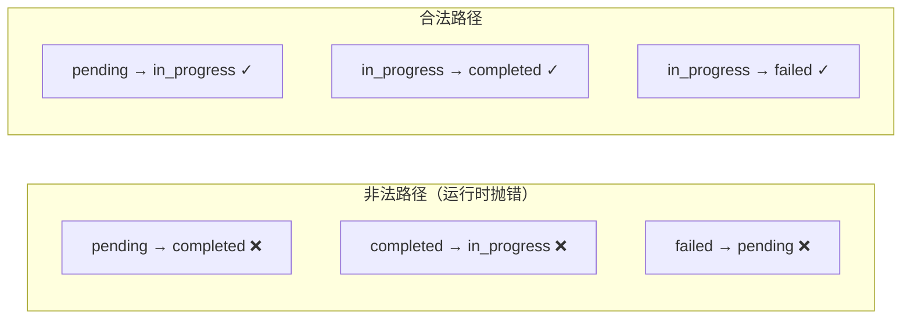
```mermaid
flowchart LR
    subgraph 非法路径["非法路径（运行时抛错）"]
        X1["pending → completed ❌"]
        X2["completed → in_progress ❌"]
        X3["failed → pending ❌"]
    end
    subgraph 合法路径["合法路径"]
        L1["pending → in_progress ✓"]
        L2["in_progress → completed ✓"]
        L3["in_progress → failed ✓"]
    end
```

这意味着模型调用 `TaskUpdate` 时如果请求 `pending → completed`，代码层面直接抛出 `Invalid task transition` 错误，**Agent 无法绕过**。

#### 7.8.2 Schema 级校验 —— 提交即检查

每次 `TaskPlan` 提交（创建或替换计划）时，Zod `superRefine` 执行六项强制校验：

| # | 校验项 | 失败后果 | 源码位置 |
|---|--------|---------|---------|
| 1 | 无重复 task id | 拒绝整个 plan | `task-plan.ts:28-30` |
| 2 | 未知依赖（引用了不存在的 task） | 拒绝整个 plan | `task-plan.ts:41-43` |
| 3 | 依赖自身重复引用 | 拒绝整个 plan | `task-plan.ts:44-46` |
| 4 | 同时最多 1 个 `in_progress` | 拒绝整个 plan | `task-plan.ts:33-35` |
| 5 | `completed` 状态的依赖必须全部 `completed` | 拒绝整个 plan | `task-plan.ts:47-56` |
| 6 | 无循环依赖（拓扑排序检测） | 拒绝整个 plan | `task-plan.ts:59-61` |

`TaskUpdate` 在单任务状态变更时额外校验：

| # | 校验项 | 失败后果 |
|---|--------|---------|
| 7 | taskId 必须存在于当前 plan | 抛出 `Unknown task` 异常 |
| 8 | 状态转换必须合法（调用 `isValidTransition`） | 抛出 `Invalid task transition` 异常 |
| 9 | 目标为 `completed` 时所有依赖必须 `completed` | 抛出 `has an incomplete dependency` 异常 |

#### 7.8.3 循环依赖检测

`hasCycle()` 使用标准拓扑排序算法（O(N+E) 复杂度）：

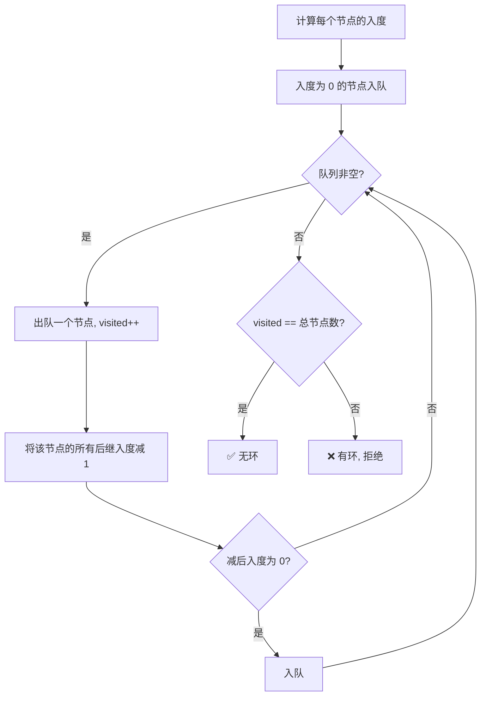
```mermaid
flowchart TD
    A[计算每个节点的入度] --> B[入度为 0 的节点入队]
    B --> C{队列非空?}
    C -->|是| D[出队一个节点, visited++]
    D --> E[将该节点的所有后继入度减 1]
    E --> F{减后入度为 0?}
    F -->|是| G[入队]
    G --> C
    F -->|否| C
    C -->|否| H{visited == 总节点数?}
    H -->|是| I[✅ 无环]
    H -->|否| J[❌ 有环, 拒绝]
```

此检测同时应用于 TaskPlan（主 Agent 计划）和 TaskGraph（子代理 DAG），从代码层面杜绝循环依赖导致的任务死锁。

#### 7.8.4 单任务焦点 —— 防止注意力分散

TodoWrite 和 TaskPlan 各自独立强制执行**同一时间只有 1 个 `in_progress`**。这不仅是一个 UI 展示约定，更是防发散机制：

- 模型无法通过"同时标记多个任务为进行中"来规避按步骤执行
- `AgentLoop` 的自动扩展逻辑也依赖此属性：`hasActiveProgress()` 检测到 `in_progress` 或 `running` 状态时才允许突破硬限制

#### 7.8.5 中断恢复 —— `normalizeAbandonedPlan`

当 Agent 运行中遭遇取消或异常，尚未手动标记完成的任务不能残留为 `in_progress`。`normalizeAbandonedPlan` 自动将所有 `in_progress` → `cancelled`（附 `result: "Execution was abandoned"`），确保下次恢复时状态一致。

#### 7.8.6 三层协同防护全景

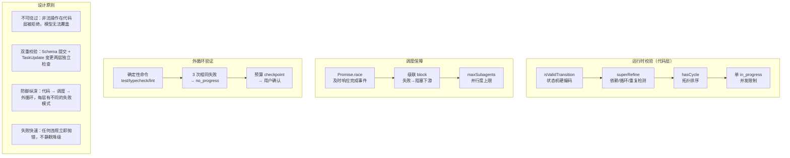
```mermaid
flowchart TD
    subgraph 运行时层["运行时校验（代码层）"]
        R1["isValidTransition<br/>状态机硬编码"]
        R2["superRefine<br/>依赖/循环/重复检测"]
        R3["hasCycle<br/>拓扑排序"]
        R4["单 in_progress<br/>并发限制"]
    end

    subgraph 调度层["调度保障"]
        S1["Promise.race<br/>及时响应完成事件"]
        S2["级联 block<br/>失败→阻塞下游"]
        S3["maxSubagents<br/>并行度上限"]
    end

    subgraph 验证层["外循环验证"]
        V1["确定性命令<br/>test/typecheck/lint"]
        V2["3 次相同失败<br/>→ no_progress"]
        V3["预算 checkpoint<br/>→ 用户确认"]
    end

    R1 --> R2 --> R3 --> R4
    S1 --> S2 --> S3
    V1 --> V2 --> V3

    subgraph 设计原则["设计原则"]
        P1["不可绕过：非法操作在代码层被拒绝，模型无法覆盖"]
        P2["双重校验：Schema 提交 + TaskUpdate 变更两层独立检查"]
        P3["防御纵深：代码 → 调度 → 外循环，每层有不同的失败模式"]
        P4["失败快速：任何违规立即抛错，不静默降级"]
    end
```

核心结论：**Agent 的按步骤执行不是靠 prompt 说教，而是靠状态机硬编码 + Schema 校验 + 拓扑排序 + 闭环验证四层机制共同保证**。模型如果尝试跳过步骤——比如不标记 `in_progress` 就直接 `completed`——代码层会直接拒绝，迫使模型回到正确的执行序列上。

### 7.9 DAG 更新正确性保障

**通俗理解：** 你可以把 DAG 更新想象成"银行转账"——不是谁都能随便改账本。flavor-code 有四道关卡保护 DAG 状态的正确性：进门前先验身份（Zod Schema 校验）、操作时核对权限（状态机约束）、修改记录不留痕（纯函数式更新）、还有独立的第三方抽查（TodoWrite 交叉校验）。任何不合规的操作在"第一道门"就会被拦下。

当 Agent 通过 `TaskUpdate` 修改计划状态、或通过 `Task` 工具调度子 Agent 执行结果回写时，整个 DAG 状态的正确性由四层防御体系保证：

#### 第 1 层：Zod Schema 静态校验

所有输入在进入执行逻辑前必须通过严格的 schema 验证。`TaskPlanSchema.superRefine()`（`src/agent/task-plan.ts:24-67`）在解析阶段就进行完整性检查：

- 无重复 task ID
- 无重复依赖声明
- 所有依赖必须指向已存在的 task ID
- `completed` 的任务的所有依赖也必须是 `completed`
- DAG 不得有环（Kahn 拓扑排序算法检测）
- 至多一个 `in_progress`

这意味着一个不合法的 plan 根本无法被创建或提交，在入口处就被拦截。

#### 第 2 层：运行时状态机约束

`updatePlanTask()`（`task-plan.ts:79-103`）在执行更新前：

- 防御性地重新解析输入和当前 plan（两次 Zod 校验）
- 检查 task ID 是否存在（`index >= 0`）
- 调用 `isValidTransition()` 严格限定状态转换路径
- 标记 `completed` 前再次校验所有依赖已完成

状态转换规则硬编码在 `isValidTransition()` 中：

```
pending      → in_progress / blocked / cancelled
in_progress  → completed / failed / blocked / cancelled
终态         → 不可再转换
```

其中一条关键规则是 `if (from === to) return true`，即同一状态的重复提交总是合法的——这为幂等性提供了基础。

#### 第 3 层：纯函数式更新

`updatePlanTask()` 是纯函数——输入 plan + update，输出新的 plan，不修改输入对象。`commit` 回调（`src/production.ts:287`）只是简单赋值 `taskPlan = next`。整个更新路径不涉及 in-place mutation，不会产生部分更新的中间状态。

#### 第 4 层：TodoWrite 交叉校验

`TodoWrite.execute()`（`src/tools/todo-write.ts:39-42`）独立校验"最多 1 个 in_progress"，作为额外安全带。虽然 TodoWrite 面向的是 Agent 自身的子步骤追踪（与 TaskPlan 不同层），但它提供了独立视角的进度一致性检查。

### 7.10 并发安全与幂等性

#### 并发安全：为何不会出现两个流程同时更新同一节点

**通俗理解：** 很多人担心：多个子 Agent 同时干活，会不会出现"两个人同时改同一个文件"的冲突？答案是：不会。因为 JavaScript 是单线程的，所有状态更新都是"一个接一个排队"执行的，就像银行柜台——虽然大厅里有很多人在等，但同一时刻只有一个人在窗口办理业务。

Agent 系统的执行模型天然避免了并发冲突，原因有三：

**1. 同回合内的工具调用是串行的。** 在 `AgentLoop.run()`（`src/agent/loop.ts`）中，即使模型在一次响应中返回多个 tool call，它们的执行也是 `for` 循环串行的：

```typescript
for (let index = 0; index < toolCalls.length; index += 1) {
    const call = toolCalls[index]!;
    const result = await this.#options.runtime.execute(call, ...);
    // 上一个执行完、结果已返回，才进入下一个
}
```

不可能出现同一时刻两个 `TaskPlan`/`TaskUpdate` 调用同时读写 `taskPlan` 变量的情况。

**2. JavaScript 单线程事件循环。** `commit` 回调只是简单赋值 `taskPlan = next`，此操作在 JS 中是原子的——赋值过程不会被另一个操作打断。

**3. 子 Agent 结果回写是顺序的。** `Task` 工具使用 `SubagentScheduler` 并行运行多个子 Agent，但结果收集通过 `Promise.race` 逐个处理（`src/agent/subagents.ts:142`）：

```typescript
const completion = await Promise.race(running.values());
running.delete(completion.id);
results.set(completion.id, completion.result);
states.set(completion.id, completion.result.status);
await this.#options.onResult?.(completion.result);
```

`onResult` 回调虽然 `await` 了，但 scheduler 的 `while` 循环必须等本次 `onResult` 完成才进入下一轮。所以即使 3 个子 Agent 同时跑完，它们的 `onResult` 也是串行执行的。

此外，`Task` 工具在执行前会合并 graph（`production.ts:305-312`）：

```typescript
// Merge new graph nodes into the accumulated task graph so that
// sub-agent statuses from prior Task calls are preserved instead of
// being overwritten.
const priorIds = new Set((taskGraph?.nodes ?? []).map((node) => node.id));
const mergedNodes = [...(taskGraph?.nodes ?? [])];
for (const node of graph.nodes) {
    const index = mergedNodes.findIndex((existing) => existing.id === node.id);
    if (index >= 0) mergedNodes[index] = node;
    else mergedNodes.push(node);
}
taskGraph = { nodes: mergedNodes };
```

旧的 graph 节点状态被保留，新节点被追加或替换，确保多次 `Task` 调用不会互相覆盖状态。

#### 幂等性设计

**TodoWrite 的幂等性。** TodoWrite 每次调用替换整个列表，是纯 "set" 语义。两次传入相同的 `todos` 数组得到完全一致的结果。不累积、不追加。

**TaskPlan 的幂等性。** 同样是替换语义（工具描述明确说 "Create or replace the main-agent plan"）。两次传入相同的 DAG 得到相同结果，没有状态累积。

**TaskUpdate 的幂等性。** 这是最精致的部分。`isValidTransition()` 的关键规则 `if (from === to) return true` 意味着：

- 第一次 `TaskUpdate({ taskId: "1", status: "in_progress" })` 从 `pending → in_progress`，成功
- 第二次同样的调用，`from === to === "in_progress"`，也成功——但结果是同一个状态，行为上幂等
- 但如果任务已经 `completed`，再调用 `in_progress`，转换非法，直接抛错。这防止了对终态的"回退"式误操作

总结：合法范围内的重复调用是安全的（结果不变），非法调用会被立即拒绝（不会产生错误的副作用）。

**Task 工具（子 Agent DAG）的幂等性。** 由于 graph 执行采用合并策略，同一节点 ID 的定义可以被替换但不会重复执行——`SubagentScheduler` 的 `isReady()` 检查确保只有依赖全满足且状态为 `pending` 的节点才会被调度执行。

---

## 8. Provider 适配层

### 8.1 统一流协议

所有模型 provider 通过 `ModelAdapter.stream()` 接口统一接入，输出五种事件：

```typescript
type ModelEvent =
  | { type: "text"; text: string }           // 流式文本块
  | { type: "tool-call"; ... }               // 工具调用
  | { type: "usage"; inputTokens; ... }      // token 用量
  | { type: "error"; error: ProviderError }  // 标准化错误
  | { type: "done" };                        // 流结束
```

`ModelRegistry` 管理 `Map<string, ModelAdapter>`，模型 ID 格式为 `provider:model`。

### 8.2 错误标准化

`normalizeProviderError()` 将各 SDK 的异常归类为 8 种标准错误码：

| 错误码 | 典型场景 |
|--------|----------|
| `authentication` | API key 无效（401） |
| `rate_limit` | 速率限制（429） |
| `context_overflow` | 上下文超窗口 |
| `output_limit` | max_tokens 耗尽 |
| `model_not_found` | 模型不存在 |
| `network` | 网络/连接异常 |
| `cancelled` | AbortSignal 触发 |
| `unknown` | 未知异常 |

### 8.3 适配器实现要点

**Anthropic（`src/models/anthropic.ts`）**
- 系统消息提升为顶级 `system` 参数
- tool 消息聚合为 `tool_result` 块
- toolCalls 映射为 `tool_use` 块
- 追踪缓存 token（`cache_creation_input_tokens + cache_read_input_tokens`）

**OpenAI（`src/models/openai.ts`）**
- 使用 Responses API 而非 Chat Completions
- 工具消息映射为 `function_call_output`
- toolCalls 映射为 `function_call`
- 所有工具参数使用 `strict: true`
- 通过 `pendingCalls` Map 处理输出索引与调用 ID 的时序问题

---

## 9. 工具系统与权限引擎

### 9.1 工具分类

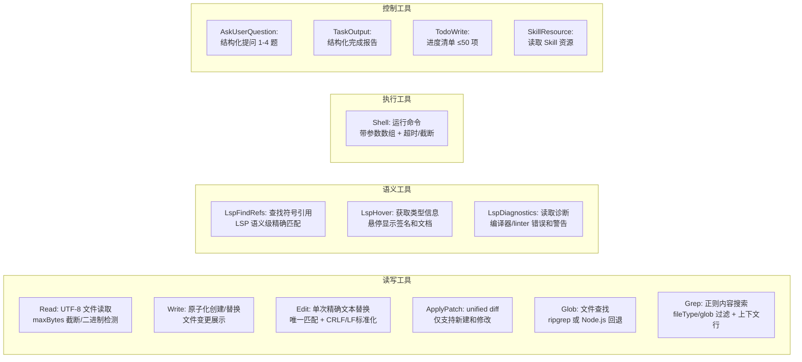
```mermaid
flowchart LR
    subgraph "读写工具"
        READ[Read: UTF-8 文件读取<br/>maxBytes 截断/二进制检测]
        WRITE[Write: 原子化创建/替换<br/>文件变更展示]
        EDIT[Edit: 单次精确文本替换<br/>唯一匹配 + CRLF/LF标准化]
        PATCH[ApplyPatch: unified diff<br/>仅支持新建和修改]
        GLOB[Glob: 文件查找<br/>ripgrep 或 Node.js 回退]
        GREP[Grep: 正则内容搜索<br/>fileType/glob 过滤 + 上下文行]
    end

    subgraph "语义工具"
        LSP_REF[LspFindRefs: 查找符号引用<br/>LSP 语义级精确匹配]
        LSP_HOV[LspHover: 获取类型信息<br/>悬停显示签名和文档]
        LSP_DIAG[LspDiagnostics: 读取诊断<br/>编译器/linter 错误和警告]
    end

    subgraph "执行工具"
        SHELL[Shell: 运行命令<br/>带参数数组 + 超时/截断]
    end

    subgraph "控制工具"
        ASK[AskUserQuestion:<br/>结构化提问 1-4 题]
        OUTPUT[TaskOutput:<br/>结构化完成报告]
        TODO[TodoWrite:<br/>进度清单 ≤50 项]
        SKILL_RES[SkillResource:<br/>读取 Skill 资源]
    end
```

### 9.2 权限引擎决策树

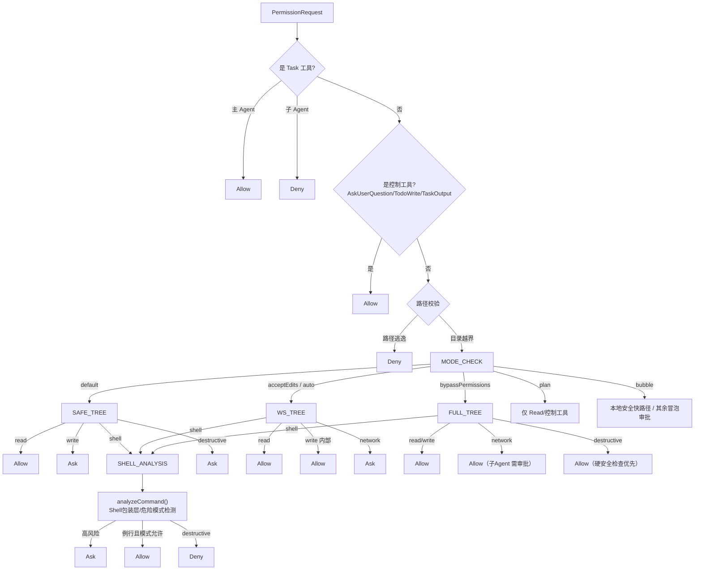
```mermaid
flowchart TD
    REQ[PermissionRequest] --> T1{是 Task 工具?}
    T1 -->|主 Agent| A1[Allow]
    T1 -->|子 Agent| D1[Deny]

    T1 -->|否| T2{是控制工具?<br/>AskUserQuestion/TodoWrite/TaskOutput}
    T2 -->|是| A2[Allow]

    T2 -->|否| T3{路径校验}
    T3 -->|路径逃逸| D2[Deny]
    T3 -->|目录越界| MODE_CHECK

    MODE_CHECK -->|default| SAFE_TREE
    MODE_CHECK -->|acceptEdits / auto| WS_TREE
    MODE_CHECK -->|bypassPermissions| FULL_TREE
    MODE_CHECK -->|plan| PLAN_TREE[仅 Read/控制工具]
    MODE_CHECK -->|bubble| BUBBLE_TREE[本地安全快路径 / 其余冒泡审批]

    SAFE_TREE -->|read| A3a[Allow]
    SAFE_TREE -->|write| ASK3a[Ask]
    SAFE_TREE -->|shell| SHELL_ANALYSIS
    SAFE_TREE -->|destructive| ASK3b[Ask]

    WS_TREE -->|read| A3b[Allow]
    WS_TREE -->|write 内部| A3e[Allow]
    WS_TREE -->|shell| SHELL_ANALYSIS
    WS_TREE -->|network| ASK3e[Ask]

    FULL_TREE -->|read/write| A3c[Allow]
    FULL_TREE -->|shell| SHELL_ANALYSIS
    FULL_TREE -->|network| A3d[Allow（子Agent 需审批）]
    FULL_TREE -->|destructive| A3f[Allow（硬安全检查优先）]

    SHELL_ANALYSIS --> CMD["analyzeCommand()<br/>Shell包装层/危险模式检测"]
    CMD -->|高风险| ASK_S[Ask]
    CMD -->|例行且模式允许| ALLOW_S[Allow]
    CMD -->|destructive| DENY_S[Deny]
```

六种模式的实际语义如下。表中的“询问”表示继续进入 Hook/UI 审批，而不是直接执行：

| 模式 | 本地读取 | 工作区内写入 | Shell | 网络/MCP | 删除、移动等破坏性操作 |
|------|----------|--------------|-------|----------|------------------------|
| `default` | 放行 | 询问 | 询问 | 询问 | 询问 |
| `acceptEdits` | 放行 | 放行 | 仅工作区内的例行测试、构建、检查命令放行，其余询问 | 询问 | 询问 |
| `plan` | 放行 | 拒绝 | 拒绝 | 拒绝 | 拒绝 |
| `bypassPermissions` | 放行 | 主 Agent 放行，允许显式工作区外路径 | 一般命令放行，但系统级硬禁止命令仍拒绝 | 主 Agent 放行 | 主 Agent 放行 |
| `auto` | 放行 | 工作区内放行 | 例行命令走本地快路径，未决命令交给分类器 | 交给分类器 | 交给分类器 |
| `bubble` | 放行 | 未决请求冒泡 | 安全例行命令可放行，其余冒泡 | 冒泡 | 冒泡 |

旧配置不需要手工修改：`safe` 和 `workspace` 会迁移为 `default`，`full` 会迁移为 `bypassPermissions`。会话恢复也通过同一个 `PermissionModeSchema` 迁移，因此旧会话不会因为枚举名称变化而无法打开。

所有模式共享一组**先于模式捷径执行**的确定性检查：缺少必需路径会拒绝；`Move`/`Copy` 缺少源或目标会拒绝；词法 `..` 逃逸和符号链接逃逸会拒绝；子 Agent 的工作区外文件访问会拒绝。`rm -rf /`、磁盘格式化等明确的系统级破坏命令在 `auto` 和 `bypassPermissions` 下也不会交给模型或直接放行。

### 9.3 运行时权限链

```

#### 9.3.1 `auto`：AI 只处理本地规则无法确定的请求

`auto` 并不是把每次工具调用都发送给模型。权限引擎先执行所有确定性规则：安全读取、工作区内写入和经过 cwd/参数路径校验的例行命令直接放行，路径逃逸和硬禁止命令直接拒绝。只有结果仍为 `ask` 时，`ToolRuntime` 才调用 `src/permissions/classifier.ts`。

分类器使用配置的便宜模型，只接收结构化的最小元数据：Agent 类型、工具名、路径、命令、参数和 cwd；不会接收主模型的自然语言解释或思考内容。发送前会清理 Bearer Token、Cookie、URL 用户名密码、敏感查询参数、密钥命令行参数和 PEM 私钥块，并限制数组数量与单字段长度。

分类器必须在默认 2 秒内返回严格的 `{ decision: "allow" | "ask" | "deny", reason }`。结果处理如下：

- `allow`：本次调用继续执行。
- `deny`：本次调用被拒绝，原因返回给 Agent。
- `ask`：进入正常 Hook/UI 审批。
- 超时、模型不可用、结构化输出失败：同样回退正常审批，不会因为分类器故障而静默放行。

#### 9.3.2 `bubble`：子 Agent 不直接向用户交互

创建子 Agent 时，主会话如果处于 `plan`，子 Agent 同样使用 `plan`；其他情况下子 Agent 使用 `bubble`。子 Agent 能在本地确定安全的读取和例行命令继续执行，无法确定的写入、网络或命令请求则复用主会话的 `approve` callback，在主 UI 中显示审批。

因此“冒泡”只改变**由谁完成审批**，不会放宽硬边界：子 Agent 仍不能访问工作区外路径、不能再次调用 `Task` 派生子 Agent，危险命令也不会因为父会话批准能力存在而绕过确定性拒绝。
PreToolUse hook → (可 deny / 修改 input)
  → PermissionEngine.decide()
    → 若 main agent 为 auto 且结果为 ask: 调用便宜模型分类器
      → 分类器超时、失败或返回 ask: 回退正常审批
    → 若仍为 ask: 触发 PermissionRequest hook
      → main agent 调用 approve callback（UI 弹审批面板）
      → bubble 子 Agent 复用主会话 approve callback，把审批冒泡给用户
      → 若 "always": 同分类后续放行（destructive 除外）
  → tool.execute()
  → PostToolUse hook
  → 失败时: PostToolUseFailure hook → AuditLogger
```

### 9.4 Shell 安全分类

`analyzeCommand()` 对每个命令执行多层分析：

- **包装层检测**：`sh -c`、`cmd /c`、`powershell -Command` 等会递归提取内部命令进行再分析
- **模式匹配**：删除命令（`rm -rf`、`del /f`）、磁盘操作（`mkfs`、`format`、`dd`）、仓库破坏（`git push --force`、`git reset --hard`）、权限修改（`chmod 777`）等
- **例行命令**：测试、构建、版本控制、包管理、格式化等常规开发命令
- **降级规则**：不透明命令（复杂管道、重定向）、多语句串联自动降级

### 9.5 工具参数提示 (Tool Hint)

每个工具定义可选实现 `summarize(input) → string | undefined` 方法，用于生成工具调用的简短参数摘要，不包含 ANSI 转义序列。`ToolRuntime.hint()` 在工具开始前解析 input 并调用 summarize，返回纯文本字符串。

`AgentLoop` 将 hint 附加到 `tool-start` 和 `tool-end` 事件的可选 `hint` 字段中，沿事件管道传递至 UI 层。`transcriptReducer` 将 hint 存储在 `TranscriptBlock.hint` 字段，`StatusLine` 组件以灰暗文字 (`dimColor`) 在括号中渲染：` (hint)`。长 hint 使用 `truncate-end` 截断并附加省略号，不会导致换行。

目前已为所有控制工具和搜索工具实现 summarize：

| 工具 | 摘要示例 |
|------|----------|
| Shell | `npm run build`（命令 + 参数拼接） |
| Glob | `pattern: "**/*.ts" in src` |
| Grep | `pattern: /import/ [typescript] in src` |
| TodoWrite | `3/7 done · Implementing cache layer` |
| AskUserQuestion | `2 questions · 6 options` |
| TaskOutput | 直接复用 `summary` 字段内容 |

hint 生成失败时安全降级——输入 schema 校验失败、summarize 抛异常或返回空字符串均视为无 hint，不影响工具执行流程。

---

### 9.4 LSP 语义代码分析

传统代码搜索（Grep）只能做**文本匹配**——搜 `handleAuth` 可能返回注释、字符串、甚至不同函数里的同名变量。flavor-code 通过 LSP（Language Server Protocol）实现了**语义级代码理解**。

#### 什么是 LSP

LSP 是微软主导的开放协议。核心理念：一种语言只需写一个 Language Server，所有工具（VS Code、Neovim、flavor-code）都能复用。flavor-code 作为 LSP **客户端**，启动各语言的 Language Server 子进程，通过 JSON-RPC 2.0 over stdio 通信，查询代码的语义信息。

#### 三个 LSP 工具

| 工具 | 作用 | 与 Grep 的对比 |
|------|------|---------------|
| `LspFindRefs` | 找到某个符号的所有引用位置 | Grep 搜到的可能是同名变量、注释、字符串；LSP 只返回同一个符号的精确匹配 |
| `LspHover` | 获取光标处符号的类型定义和文档 | Grep 不支持；LSP 直接返回类型签名和 markdown 文档 |
| `LspDiagnostics` | 读取编译器和 linter 的诊断信息 | Grep 不确定是否有错误；LSP 给出精确的行列号和错误描述 |

#### 架构层次

```
Agent（模型）
  ↓ 调用 LspFindRefs / LspHover / LspDiagnostics
ToolRuntime（统一工具执行）
  ↓ execute()
createLspTools(workspace) → ToolDefinition[]
  ↓ 委托
LspManager（接口：findReferences / hover / diagnostics / dispose）
  ↓ 实现
RealLspManager（会话级管理器）
  ↓ 按需懒启动
LspConnection × N（每种语言一个长连接子进程）
  ↓ JSON-RPC 2.0
Language Server 进程（typescript-language-server / pyright / rust-analyzer / gopls）
```

#### 按需懒启动流程

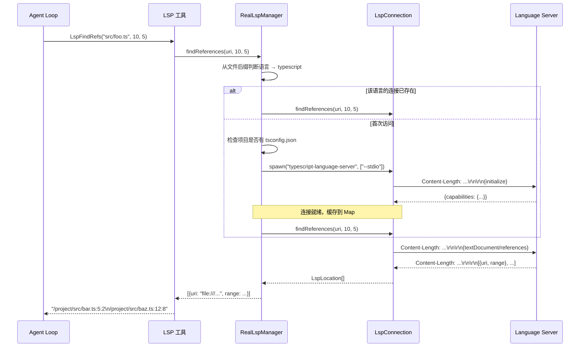
```mermaid
sequenceDiagram
    participant Agent as Agent Loop
    participant Tools as LSP 工具
    participant Mgr as RealLspManager
    participant Conn as LspConnection
    participant LS as Language Server

    Agent->>Tools: LspFindRefs("src/foo.ts", 10, 5)
    Tools->>Mgr: findReferences(uri, 10, 5)

    Mgr->>Mgr: 从文件后缀判断语言 → typescript

    alt 该语言的连接已存在
        Mgr->>Conn: findReferences(uri, 10, 5)
    else 首次访问
        Mgr->>Mgr: 检查项目是否有 tsconfig.json
        Mgr->>Conn: spawn("typescript-language-server", ["--stdio"])
        Conn->>LS: Content-Length: ...\r\n\r\n{initialize}
        LS-->>Conn: {capabilities: {...}}
        Note over Mgr,Conn: 连接就绪，缓存到 Map
        Mgr->>Conn: findReferences(uri, 10, 5)
    end

    Conn->>LS: Content-Length: ...\r\n\r\n{textDocument/references}
    LS-->>Conn: Content-Length: ...\r\n\r\n[{uri, range}, ...]
    Conn-->>Mgr: LspLocation[]
    Mgr-->>Tools: [{uri: "file:///...", range: ...}]
    Tools-->>Agent: "/project/src/bar.ts:5:2\n/project/src/baz.ts:12:8"
```

#### JSON-RPC 通信协议

Language Server 是一个独立进程，通过 stdin/stdout 通信。每条消息遵循 LSP 标准帧格式：

```
Content-Length: 156\r\n
Content-Type: application/vscode-jsonrpc; charset=utf-8\r\n
\r\n
{"jsonrpc":"2.0","id":1,"method":"textDocument/references","params":{...}}
```

`LspConnection` 内部维护 `LspBuffer` 做流式帧拆分——TCP 是字节流，消息边界靠 `Content-Length` 头部的数字确定，拆分后按 `id` 匹配请求和响应。支持的请求/通知包括：

| 方法 | 方向 | 说明 |
|------|------|------|
| `initialize` | 请求 | 握手，声明客户端能力（hover、references、diagnostics） |
| `initialized` | 通知 | 握手完成 |
| `textDocument/references` | 请求 | 查找引用 |
| `textDocument/hover` | 请求 | 获取悬停信息 |
| `textDocument/diagnostic` | 请求 | 拉取诊断 |
| `shutdown` + `exit` | 请求+通知 | 优雅关闭 |

#### 语言自动检测

`RealLspManager` 根据**文件后缀**匹配语言，再检查工作区内的**根文件**确认是否需要启动：

| 语言 | 文件后缀 | 根文件（任一存在即启动） | Language Server 命令 |
|------|----------|-------------------------|---------------------|
| TypeScript | `.ts`, `.tsx`, `.mts`, `.cts` | `tsconfig.json` | `typescript-language-server --stdio` |
| Python | `.py`, `.pyi`, `.pyx` | `pyproject.toml`, `pyrightconfig.json` | `pyright-langserver --stdio` |
| Rust | `.rs` | `Cargo.toml` | `rust-analyzer` |
| Go | `.go` | `go.mod`, `go.work` | `gopls` |

连接按语言缓存（`Map<language, LspConnection>`），同一种语言的所有文件共享一个长连接，避免重复启动进程。

#### 权限与安全

LSP 三个工具均归类为 `READ_TOOLS`（只读），与 `Read`、`Grep` 同级。工作区内自动放行，无额外审批开销。Language Server 子进程通过 `spawn` 启动，`windowsHide: true`，dispose 时发送 `shutdown` + `exit` 后 `kill` 清理。


## 10. Hook 事件总线

### 10.1 19 个事件全集

| 类别 | 事件 | 触发时机 | 决定支持 |
|------|------|----------|----------|
| **会话** | `SessionStart` | 会话开始 | — |
| | `UserPromptSubmit` | 用户提交 prompt | deny→阻止执行 |
| | `Stop` | 中断当前请求 | — |
| | `SessionEnd` | 会话结束 | — |
| **规划** | `BeforePlan` | TaskPlanner 调用前 | deny→拒绝计划 |
| | `AfterPlan` | 计划创建后 | — |
| **子 Agent** | `SubagentStart` | 子 Agent 启动 | — |
| | `SubagentStop` | 子 Agent 结束 | — |
| **模型** | `BeforeModelCall` | 模型调用前 | deny→阻止调用 |
| | `AfterModelCall` | 模型调用后 | — |
| **工具** | `PreToolUse` | 工具执行前 | deny→阻止 / updatedInput |
| | `PermissionRequest` | 权限引擎 ask | allow/deny/ask |
| | `PostToolUse` | 工具执行后 | — |
| | `PostToolUseFailure` | 工具执行失败 | — |
| **压缩** | `PreCompact` | 压缩开始前 | — |
| | `PostCompact` | 压缩完成后 | — |
| **插件** | `PluginLoad` | 插件激活 | — |
| | `PluginUnload` | 插件卸载 | — |
| **通用** | `Notification` | 任意时机 | — |

### 10.2 事件格式与处理

```typescript
// 事件格式
{ version: 1, type: "PreToolUse", payload: { toolName, input, ... } }

// 决定格式
{ decision: "allow" | "deny" | "ask", reason?, updatedInput?, additionalContext? }
```

**处理管道：**

1. 按注册顺序遍历处理器
2. `deny` → 短路返回
3. `ask` → 聚合到汇总决定
4. `updatedInput` → 替换后续处理器的 payload（管道模式）
5. `additionalContext` → 跨处理器累积
6. 超时 / 异常 → 按 `failurePolicy` 策略（error/allow/deny/ask）兜底

**Shell 处理器**：通过子进程 stdin 传递 JSON 事件，从 stdout 解析决定，最大输出 1MB，进程树终止跨平台兼容。

---

## 11. Skill 系统

### 11.1 渐进加载流水线

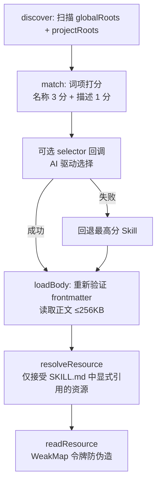
```mermaid
flowchart TD
    DISCOVER[discover: 扫描 globalRoots + projectRoots] --> MATCH[match: 词项打分<br/>名称 3 分 + 描述 1 分]
    MATCH --> SELECT[可选 selector 回调<br/>AI 驱动选择]
    SELECT -->|成功| BODY[loadBody: 重新验证 frontmatter<br/>读取正文 ≤256KB]
    SELECT -->|失败| FALLBACK[回退最高分 Skill]
    FALLBACK --> BODY

    BODY --> RESOLVE[resolveResource<br/>仅接受 SKILL.md 中显式引用的资源]
    RESOLVE --> READ_RES[readResource<br/>WeakMap 令牌防伪造]
```

### 11.2 资源安全

- **引用校验**：使用 `marked.lexer` 解析正文中的 Markdown 链接、图片和代码跨度，只有显式引用 `{assets|references|scripts}/{name}` 的资源才可被访问
- **路径安全**：资源访问的每一步都做 stat 快照验证和路径逃逸检查
- **执行隔离**：脚本通过 `SkillResource` 工具仅返回 UTF-8 或 base64 数据，不自动执行
- **覆盖规则**：project 同名覆盖 global

---

## 12. 插件系统

### 12.1 生命周期

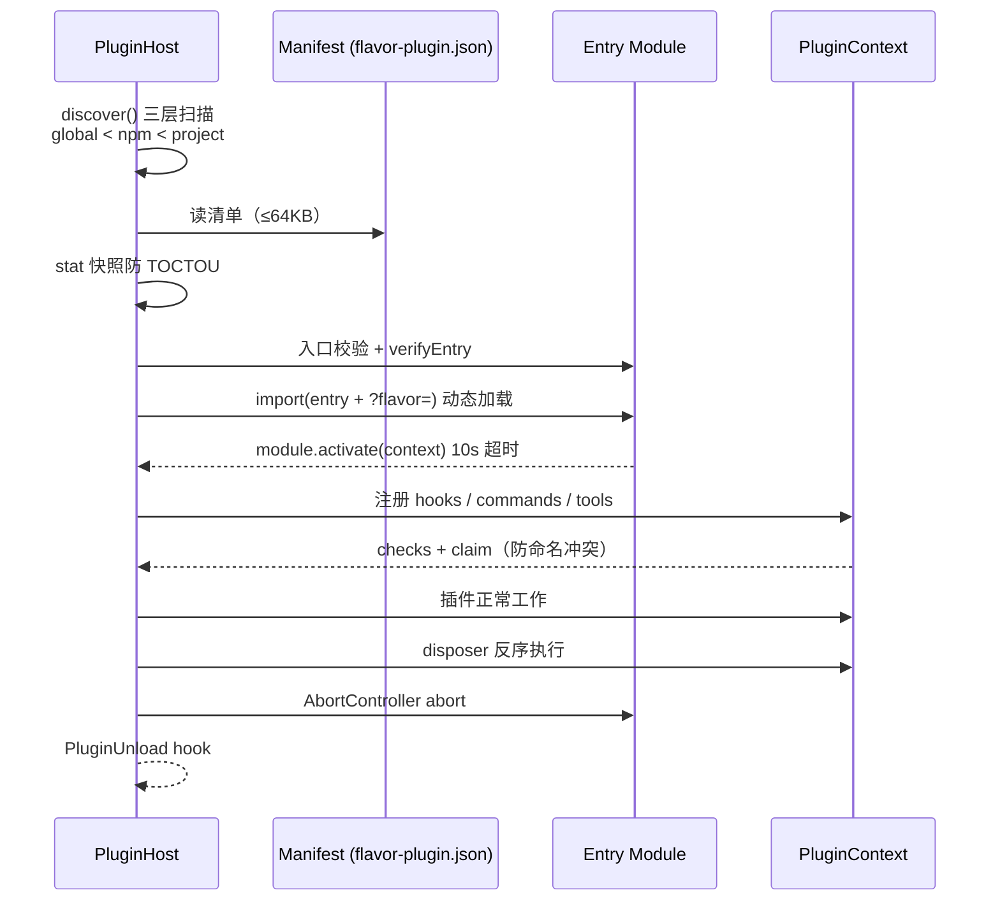
```mermaid
sequenceDiagram
    participant H as PluginHost
    participant M as Manifest (flavor-plugin.json)
    participant E as Entry Module
    participant C as PluginContext

    H->>H: discover() 三层扫描<br/>global < npm < project
    H->>M: 读清单（≤64KB）
    H->>H: stat 快照防 TOCTOU
    H->>E: 入口校验 + verifyEntry

    H->>E: import(entry + ?flavor=) 动态加载
    E-->>H: module.activate(context) 10s 超时

    H->>C: 注册 hooks / commands / tools
    C-->>H: checks + claim（防命名冲突）
    H->>C: 插件正常工作

    H->>C: disposer 反序执行
    H->>E: AbortController abort
    H-->>H: PluginUnload hook
```

### 12.2 信任模型

- 插件运行在**进程内**，不是沙箱
- 安全边界：文件系统授权回调 + stat 快照防 TOCTOU + 贡献点声明-注册一致性 + 路径逃逸检测
- 当前信任模型：**只加载可信插件**，恶意插件可绕过窄 API
- 未来方向：Worker/process sandbox、签名验证、能力 broker

---

## 13. 会话持久化

### 13.1 JSONL 格式

```
第 1 行：__meta {"version":2,"sessionId":"...","workspace":{"path":"..."},...}
第 2 行：{"role":"user","content":"帮我分析项目"}
第 3 行：{"role":"assistant","content":[{"type":"text","text":"..."}]}
第 4 行：{"role":"assistant","content":[...],"toolCalls":[...]}
第 5 行：{"role":"tool","content":"工具执行结果","toolCallId":"..."}
...
```

### 13.2 v1 → v2 迁移

| 特性 | v1 | v2 |
|------|----|----|
| 摘要格式 | `conversation.summary`（单条 system 消息） | `conversation.compact`（结构化字段） |
| 任务状态 | 内嵌于消息 | `tasks.plan` + `tasks.states` + `tasks.results` |
| 压缩边界 | 无 | `compact.summary` + `compact.compactedAt` |
| 迁移策略 | — | 检测 `"Conversation summary\n"` 前缀，提取文本 |

### 13.3 写入安全

- **原子写入**：写临时文件 → fsync → rename
- **隔离**：损坏文件重命名为 `.corrupt-{timestamp}-{uuid}`，不隐式回退
- **工作区校验**：realpath 比较防符号链接逃逸
- **大小限制**：5MB 上限（`DEFAULT_MAX_SESSION_BYTES`）
- **保存时机**：prompt/tool 轮完成、任务转换、压缩、模型/权限变化、SessionEnd、dispose 边界——避免 token 级写盘

---

## 14. UI 架构

### 14.1 Ink 组件树

flavor-code 的终端 UI 基于 **Ink**（React for CLI）构建，使用自定义的 `claude-ink` 渲染层（内嵌 yoga-layout 排版引擎）。

核心组件层次：

```
App
├── StartingLayout（runtime 初始化中）
│   └── 加载中指示器
└── TerminalLayout（runtime 就绪）
    ├── ScrollBox（可滚动主区域）
    │   ├── Header: "flavor · {model} · {workspaceName}"
    │   ├── TurnView × N（已完成对话）
    │   │   ├── 用户提示（灰底白字 + ❯ 前缀）
    │   │   └── 模型输出块
    │   │       ├── AssistantText（文本块）
    │   │       ├── StatusLine（工具调用状态 + 灰暗参数提示）
    │   │       ├── TaskStatusLine（子任务状态）
    │   │       └── FileDiffView（文件变更 diff）
    │   └── TurnView（进行中对话）
    ├── TaskProgressPanel（底部进度面板，最多 6 条）
    ├── ApprovalPanel（审批请求面板）
    ├── QuestionCards（用户选择题面板）
    ├── SlashMenu（斜杠命令补全菜单）
    ├── PromptLine（多行输入框）
    └── 底部快捷键提示
```

### 14.2 交互流程

- **输入处理优先级**：终端滚动/翻页 → Ctrl+C 中断 → 审批面板 y/n/a → 问题面板数字选择 → 斜杠补全 ↑/↓/Tab → 提交 prompt → 普通编辑
- **历史记录**：上限 200 条，↑/↓ 导航
- **任务进度面板**：子 Agent 显示橙色旋转动画 + 实时计时器，完成/失败后显示用时

### 14.3 斜杠命令（14 个内置）

| 命令 | 功能 |
|------|------|
| `/model` | 切换主/子 Agent 模型 |
| `/init` | 生成 FLAVOR.md |
| `/config` | 查看配置（脱敏） |
| `/permissions` | 切换权限模式 |
| `/skills` | 列出已安装 Skill |
| `/plugins` | 列出已加载插件 |
| `/hooks` | 列出 Hook 状态 |
| `/tasks` | 查看任务计划 |
| `/compact` | 强制压缩上下文 |
| `/clear` | 仅清屏 |
| `/audit [toolFilter]` | 查看失败审计 |
| `/loop <goal>` | 启动带宿主验证与分段预算确认的 loop-engineering 外循环 |
| `/help` | 帮助信息 |
| `/exit` | 退出 |

输入 `/` 后弹出交互式菜单，列出所有可用命令（内置 + 插件 + Skill），支持模糊匹配与编辑距离建议。未识别命令返回不超过 3 个最近的有效命令。

---

## 15. 失败分类与容错

| 层 | 代表性失败 | 处理策略 |
|----|-----------|----------|
| **启动配置** | JSON/Zod 错误、无 provider | 启动错误或可操作诊断；无密钥可进入 UI |
| **Provider** | auth/rate/context/model/network | `normalizeProviderError` 结构化分类 |
| **模型流** | 无 done/error、迭代耗尽 | `incomplete_stream` / `iteration_limit` |
| **工具** | schema、权限、超时、取消 | ToolResult error + PostToolUseFailure → AuditLogger（`.flavor/audit.jsonl`） |
| **Hook** | deny、ask、超时、handler 异常 | 决定合并与 failurePolicy 兜底 |
| **DAG** | 环/未知依赖/非法结果 | 规划拒绝、修复一次、合成 failed |
| **Plugin/Skill** | manifest、冲突、越界、身份变化 | diagnostic、拒绝激活/读取、清理已注册项 |
| **Session** | 超限、损坏、版本/工作区不兼容 | 拒绝；损坏文件隔离 |
| **UI/进程** | Ctrl+C、关闭期异常 | AbortSignal、幂等 close/dispose |

---

## 16. 事故上报与 RCA 系统

### 16.1 通俗理解：从"工具挂了"到"找到根因"

在大型项目中，Agent 每天执行成百上千次工具调用。偶尔某个工具会失败——文件不存在、权限不够、Shell 命令执行异常——这些错误往往被淹没在翻滚的屏幕日志里，等真正出问题再回头排查时，现场早已丢失。

事故上报与 RCA（Root Cause Analysis，根因分析）系统的思路是：**每一次工具失败都是现场证据**。失败发生后，系统自动采集失败时的完整现场信息（哪个工具、什么错误、Git 分支和 commit、工作区是否脏），打包成 AlertManager v4 格式的告警，推送到 langgraph-claw 告警管道。P0 级严重错误（工具代码路径损坏）还会触发 langgraph-claw 内的 Auto-RCA 流程——一个 Agent harness 加载 code-rca skill，自动分析错误根因。

换个比喻：就像飞机上的"黑匣子"——平时我们不希望它被触发，但一旦出问题，它能复现完整的事故现场。关键是整个过程**自动进行**，不需要开发者在终端里手动记日志。

### 16.2 告警分级与上报流程

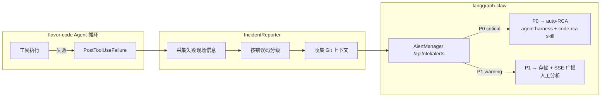
```mermaid
flowchart LR
    subgraph "flavor-code Agent 循环"
        TOOL[工具执行]
        FAIL[PostToolUseFailure]
    end

    subgraph "IncidentReporter"
        COLLECT[采集失败现场信息]
        CLASSIFY[按错误码分级]
        GIT[收集 Git 上下文]
    end

    subgraph "langgraph-claw"
        ALERT[AlertManager /api/otel/alerts]
        P0_RCA["P0 → auto-RCA<br/>agent harness + code-rca skill"]
        P1_STORE["P1 → 存储 + SSE 广播<br/>人工分析"]
    end

    TOOL -->|失败| FAIL
    FAIL --> COLLECT
    COLLECT --> CLASSIFY
    CLASSIFY --> GIT
    GIT --> ALERT
    ALERT -->|P0 critical| P0_RCA
    ALERT -->|P1 warning| P1_STORE
```

错误码与告警级别映射：

| 错误码 | 级别 | 严重度 | 处理方式 |
|--------|------|--------|----------|
| `tool_error` | P0 | critical | 自动触发 RCA，agent harness + code-rca skill 分析根因 |
| `permission_denied` | P1 | warning | 存储 + SSE 广播，人工分析 |
| `hook_denied` | P1 | warning | 存储 + SSE 广播，人工分析 |
| `unknown_tool` | P1 | warning | 存储 + SSE 广播，人工分析 |
| `user_denied` | P1 | warning | 存储 + SSE 广播，人工分析 |
| `approval_required` | P2 | info | 低优先级记录 |
| `invalid_input` | P2 | info | 低优先级记录 |
| 其他 | P3 | none | 不上报 |

每条告报警告负载包含完整的现场信息：

```json
{
  "receiver": "flavor-code",
  "status": "firing",
  "alerts": [{
    "status": "firing",
    "labels": {
      "alertname": "FlavorToolFailure:Shell",
      "severity": "critical",
      "service_name": "flavor-code",
      "error_code": "tool_error",
      "tool": "Shell"
    },
    "annotations": {
      "summary": "[flavor-code] Shell failed: command not found",
      "description": "Tool: Shell\nAgent: main\nError: [tool_error] command not found\nBranch: feature/login\nCommit: a1b2c3d\nWorking tree is clean\nWorkspace: /home/user/my-project\nInput: {\"command\":\"invalid-cmd\"}"
    },
    "startsAt": "2026-07-20T10:30:00Z"
  }],
  "version": "4"
}
```

上报是 **fire-and-forget** 模式——网络失败不会中断 Agent 循环，仅向 stderr 输出 `[incidents]` 日志。

### 16.3 配置与启用

在 `.flavor/flavor.json` 中添加：

```json
{
  "incidents": {
    "enabled": true,
    "webhookUrl": "http://localhost:8000"
  }
}
```

或通过环境变量：

```bash
FLAVOR_INCIDENT_ENABLED=true
FLAVOR_INCIDENT_WEBHOOK_URL="http://localhost:8000"
```

- 默认 webhook 端点：`{webhookUrl}/api/otel/alerts`
- 未启用时 `createIncidentReporter()` 返回零开销的空操作处理器
- 配置优先级：`flavor.json` > 环境变量 > 默认值 `http://localhost:8000`

### 16.4 Git 上下文自动采集

每条告警自动附带工作区的 Git 状态：

```typescript
interface GitContext {
  branch: string | null;   // git rev-parse --abbrev-ref HEAD
  commit: string | null;   // git rev-parse --short HEAD
  dirty: boolean;           // git status --porcelain 非空
}
```

三个命令并行执行（`Promise.all`），超时 3 秒。Git 命令失败时对应字段为 `null`，不阻止告警发送。这份上下文让 RCA 分析时无需手动询问"当时在哪个分支？代码有没有未提交修改？"。

---

## 17. 安全威胁模型

### 17.1 主要资产

- 工作区代码
- 宿主文件系统
- API 凭据
- 命令执行权
- 对话内容

### 17.2 威胁与缓解

| 威胁 | 缓解措施 |
|------|----------|
| Prompt injection（模型指令注入） | 分层消息设计、固定层不参与压缩 |
| 恶意路径/符号链接 | realpath 校验、逐级包含检查 |
| 模型伪造工具参数 | Zod schema 校验、权限引擎二次决策 |
| Shell 包装层绕过 | 递归命令分析、模式匹配 + 降级规则 |
| 巨大输出/会话 DoS | 输出截断、5MB 会话上限、逐级安全校验 |
| 损坏恢复文件 | 损坏文件隔离、schema 严格校验、不隐式回退 |
| 凭据泄露 | 配置脱敏、会话敏感字段递归删除 |
| 恶意 Skill 资源 | 显式引用校验、stat 快照、路径逃逸检测 |
| 进程内插件 | 信任模型限制（仅加载可信插件） |

### 17.3 剩余风险

- 同进程插件与被批准 shell 具有宿主进程权力
- Provider 会收到模型上下文（包括文件内容）
- 模型可能提出有害但看似常规的操作
- 本地用户仍可读自己的会话文件

---

## 18. 测试与 CI

- **测试框架**：Vitest，分层组织（config → models → context → agent → tools → permissions → hooks → plugins → skills → UI → CLI → session）
- **严格模式**：TypeScript `strict: true` + `noUncheckedIndexedAccess: true` + `exactOptionalPropertyTypes: true`
- **零凭据**：所有测试使用假 adapter 或不可达本地地址验证选择/错误，无真实 API key
- **CI 矩阵**：Windows/macOS × Node 20/24（`.github/workflows/ci.yml`）
- **POSIX 隔离**：`tests/cli/sigint-process.test.ts` 仅 macOS 执行，Windows 跳过
- **构建**：`tsup` 将 `src/cli.tsx` 打包为带 shebang 的 ESM `dist/cli.js`
- **烟雾测试**：`scripts/smoke-install.mjs` 真实执行 pack → 安装 → 验证版本号和 `--help`

---

## 19. 权衡与路线图

| 当前权衡 | 原因 | 未来方向 |
|----------|------|----------|
| 字符/4 估算 token | 无需绑定 tokenizer | 为已知模型接入精确 tokenizer |
| v1/v2 兼容迁移 | 兼容存量会话 | 校验签名、更细粒度 journal |
| 模型九段摘要 | 能跨越窗口但消耗一次调用 | 后台 Session Memory + 循环状态日志 |
| 稳定边界保存 | 避免 token 级 I/O | 有界 debounce journal |
| 进程内插件 | 易开发但隔离弱 | Worker/process sandbox + 签名 + broker |
| 终端 UI | 跨平台 MVP | IDE 协议/扩展 |
| API key 环境变量 | 直接但体验一般 | 系统 keychain、provider 扫码登录 |
| 前台单 loop | 首版优先可观察、可中断与用户确认 | 后台恢复、调度与并发 loop 管理 |

---

## 20. 文件地图速查

| 路径 | 职责 |
|------|------|
| `src/cli.tsx` | `flavor` / `--print` / `--resume` 入口，退出码与错误脱敏 |
| `src/production.ts` | 组合根：配置、provider、工具、插件、Skill、任务、会话与 loop 的全部装配 |
| `src/ui/app.tsx` | Ink 根组件：状态管理、事件分发、UI 布局 |
| `src/ui/transcript.ts` | 对话状态机 `transcriptReducer`：text/tool/task/done/error 事件 |
| `src/ui/task-progress.tsx` | 任务进度面板：实时状态、计时器、子 Agent 动画 |
| `src/ui/commands.ts` | 内置斜杠命令实现：model/init/config/permissions/skills/plugins/hooks/tasks/compact/clear/audit/loop/help/exit |
| `src/agent/loop.ts` | ReAct 循环：迭代控制、流式处理、工具执行、压缩触发 |
| `src/agent/planner.ts` | TaskPlanner：DAG 验证、环检测、计划生成 |
| `src/agent/subagents.ts` | SubagentScheduler：并行调度、依赖解析、重试、阻塞传播 |
| `src/agent/types.ts` | AgentEvent 类型定义：tool-start/end 含可选 hint 字段 |
| `src/agent/task-plan.ts` | TaskPlan 状态机：6 状态、合法转换、依赖校验 |
| `src/agent/task-tools.ts` | TaskPlan/TaskUpdate 工具定义 |
| `src/loop/orchestrator.ts` | LoopOrchestrator：fresh worker、宿主验证、预算门槛、无进展熔断与终态 |
| `src/loop/types.ts` | LoopState、cycle evidence、approval 与事件 journal 的 Zod 协议 |
| `src/loop/store.ts` | `.flavor/loops/` 原子 snapshot、追加 journal、安全加载与损坏隔离 |
| `src/loop/verifier.ts` | 确定性验证命令推断与有界证据采集 |
| `src/loop/isolation.ts` | 目标意图分类、Git worktree 隔离与拒绝静默降级 |
| `src/loop/budget.ts` | cycle/token checkpoint 判断、按原始 tranche 扩展与拒绝终止 |
| `src/skills/builtin-loop.ts` | 内置 Loop Skill 的单 cycle 方法论与证据反馈 prompt |
| `src/context/manager.ts` | ContextManager：固定层、压缩调度、snapshot/restore |
| `src/context/compaction.ts` | 压缩策略：压力估算、分割点选择、微压缩、九段摘要构建 |
| `src/context/summarizer.ts` | `summarizeWithModel()`：空工具摘要请求 + PTL 重试 |
| `src/tools/types.ts` | ToolDefinition 接口：summarize 可选方法、路径声明、权限元数据 |
| `src/tools/files.ts` | Read/Write/Edit/ApplyPatch 文件工具 |
| `src/tools/search.ts` | Glob/Grep 搜索工具 |
| `src/tools/shell.ts` | Shell 执行工具 |
| `src/tools/runtime.ts` | ToolRuntime：统一执行管线 + Hook 集成 + 工具 hint 生成 |
| `src/tools/ask-user-question.ts` | AskUserQuestion：结构化提问 |
| `src/tools/task-output.ts` | TaskOutput：结构化完成报告 |
| `src/tools/todo-write.ts` | TodoWrite：Agent 自检清单 |
| `src/permissions/engine.ts` | 六种权限模式决策树 + Shell 安全分析 |
| `src/models/registry.ts` | ModelRegistry：provider:model 解析与适配器查找 |
| `src/models/openai.ts` | OpenAI Responses API 适配器 |
| `src/models/anthropic.ts` | Anthropic Messages API 适配器 |
| `src/hooks/bus.ts` | HookBus：19 事件注册/发射/管道/失败策略 |
| `src/hooks/types.ts` | Hook 事件 schema、决定类型、处理器定义 |
| `src/skills/registry.ts` | SkillRegistry：发现、匹配、渐进加载、资源解析 |
| `src/skills/tool.ts` | SkillResource 工具工厂 |
| `src/plugins/host.ts` | PluginHost：发现、清单、激活/反激活、TOCTOU 防护 |
| `src/plugins/types.ts` | 插件清单 schema、贡献点定义 |
| `src/harness/local.ts` | LocalHarness：主/子 Agent 的工具/上下文/权限装配 |
| `src/session/store.ts` | SessionStore：v2 JSONL、v1 迁移、原子写入、隔离 |
| `src/config/schema.ts` | Zod 配置 schema、Provider/Agent/Context 定义 |
| `src/config/load.ts` | 四层配置合并、环境插值、脱敏 |
| `src/utils/log.ts` | AuditLogger：PostToolUseFailure 结构化审计 |
| `src/incidents/reporter.ts` | IncidentReporter：工具失败上报 langgraph-claw，P0-P3 自动分级，附带 Git 上下文（0.4.0） |

---

## 21. PKCE 认证架构总览

### 21.0 通俗理解：这套认证方案解决了什么问题？

先看一个常见的安全困境：公司买了 LLM API，每个开发者都需要 API Key 才能调用模型。但如果直接把 Key 发给每个人——

- Key 可能被不小心写到代码里、提交到 GitHub
- Key 可能在日志中泄露
- Key 一旦泄漏，攻击者直接用公司的配额疯狂调用，账单暴涨
- 要换 Key，得通知所有人，有人没换就留下安全隐患

**flavor-code 的解决方案是"三权分立"**——把真正的 API Key 锁在服务器机房里，开发者只拿一张"临时通行证"：

> 想象你住酒店。你不会拿着万能房卡到处跑——你去前台登记身份，前台给你一张只能开你房间、3 天后自动失效的房卡。真正的万能卡一直锁在前台保险柜里，从不外借。

在这个类比中：
- **授权服务器** = 酒店前台（验证你的身份、发房卡）
- **JWT Token** = 房卡（3 天有效、只能做授权范围内的事）
- **API 网关** = 楼层服务台（你用房卡进楼层，服务台用万能卡帮你开门）
- **上游 LLM API** = 酒店房间里的设施（真正要用的东西）
- **真实 API Key** = 万能卡（永远不离开服务台）

flavor-code 从 0.1.0 开始内置了 OAuth 2.0 PKCE（Proof Key for Code Exchange）客户端能力，支持与配套的 **flavor-pkce** 项目（授权服务器 + API 网关）协作，实现企业级"无 API Key 暴露"的 LLM 安全访问方案。

#### 长短 Token 双层设计

PKCE 流程中实际使用了两层 Token，一短一长，各司其职：

| 层级 | Token 名称 | 有效期 | 用途 | 类比 |
|------|-----------|--------|------|------|
| **短 Token** | authorization_code | **10 分钟** | 浏览器回调后，flavor-code 用它向授权服务器换取真正的 JWT | 酒店前台给的一张"临时取卡凭条"，只能在前台使用、10 分钟内有效、用一次就作废 |
| **长 Token** | JWT access_token | **3 天** | 签发后 flavor-code 缓存在本地，后续所有 LLM API 请求都用它；3 天内重启无需重新授权 | 酒店房卡，可以反复刷卡开门，3 天后自动失效 |

**为什么需要两个 Token？** 这是安全上的纵深防御。授权码只走浏览器（暴露面大），所以有效期极短（10 分钟）、一次性（用完即标记 `used=1`），即使被截获也几乎没有利用窗口。真正的 JWT 走的是 flavor-code 与授权服务器之间的直连通道（不经过浏览器），安全性更高，有效期可以长达 3 天。

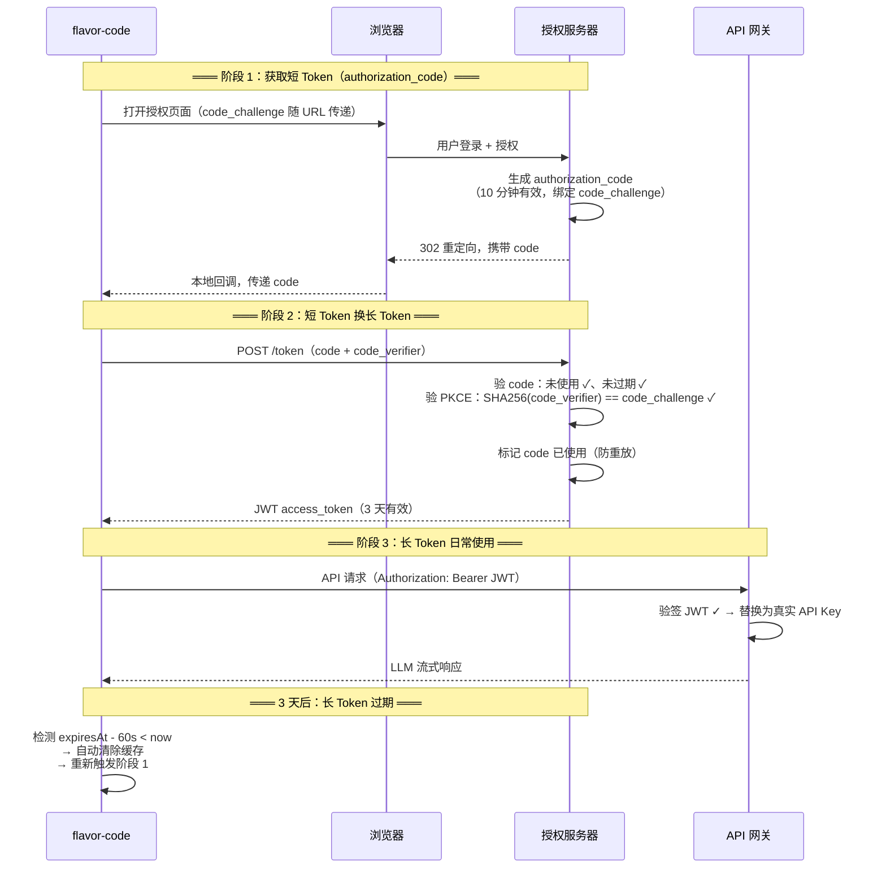
```mermaid
sequenceDiagram
    participant FC as flavor-code
    participant BROWSER as 浏览器
    participant AUTH as 授权服务器
    participant GW as API 网关

    Note over FC,AUTH: ═══ 阶段 1：获取短 Token（authorization_code）═══
    FC->>BROWSER: 打开授权页面（code_challenge 随 URL 传递）
    BROWSER->>AUTH: 用户登录 + 授权
    AUTH->>AUTH: 生成 authorization_code<br/>（10 分钟有效，绑定 code_challenge）
    AUTH-->>BROWSER: 302 重定向，携带 code
    BROWSER-->>FC: 本地回调，传递 code

    Note over FC,AUTH: ═══ 阶段 2：短 Token 换长 Token ═══
    FC->>AUTH: POST /token（code + code_verifier）
    AUTH->>AUTH: 验 code：未使用 ✓、未过期 ✓<br/>验 PKCE：SHA256(code_verifier) == code_challenge ✓
    AUTH->>AUTH: 标记 code 已使用（防重放）
    AUTH-->>FC: JWT access_token（3 天有效）

    Note over FC,GW: ═══ 阶段 3：长 Token 日常使用 ═══
    FC->>GW: API 请求（Authorization: Bearer JWT）
    GW->>GW: 验签 JWT ✓ → 替换为真实 API Key
    GW-->>FC: LLM 流式响应

    Note over FC,AUTH: ═══ 3 天后：长 Token 过期 ═══
    FC->>FC: 检测 expiresAt - 60s < now<br/>→ 自动清除缓存<br/>→ 重新触发阶段 1
```

**当前版本的 Token 刷新策略**：没有使用 OAuth refresh_token 机制。JWT 过期前 60 秒 flavor-code 自动丢弃缓存，下次启动时重新走完整的 PKCE 流程（弹出浏览器 → 用户授权 → 获取新 JWT）。设计如此，因为 PKCE 流程在本地回环完成、用户体验轻量，且避免了 refresh_token 长期存储带来的安全风险。

### 21.1 架构拓扑

```mermaid
flowchart TD
    FC["flavor-code CLI<br/>（TypeScript 客户端）"]
    AUTH["授权服务器<br/>auth-server (Python/FastAPI)<br/>端口 8091"]
    GW["API 网关<br/>api-gateway (Python/FastAPI)<br/>端口 8092"]
    UP["上游 LLM<br/>（如 OpenAI API）"]

    FC -->|1. GET /authorize?code_challenge=...<br/>浏览器回调| AUTH
    AUTH -->|2. 302 redirect → callback<br/>code + state| FC
    FC -->|3. POST /token<br/>code + code_verifier| AUTH
    AUTH -->|4. JWT access_token| FC
    FC -->|5. 所有 API 请求<br/>Authorization: Bearer JWT| GW
    GW -->|6. 校验 JWT → 替换为<br/>真实 API Key| UP
    UP -->|7. SSE/JSON 流式响应| GW
    GW -->|8. 透明转发| FC
```

### 21.2 为什么需要 PKCE + 网关

在团队或企业环境中，直接让每个开发者持有 LLM API Key 存在以下风险：

- **凭据泄露**：API Key 一旦被日志记录、代码提交或恶意窃取，攻击者可直接消费企业配额
- **审计空白**：不知道谁在什么时间使用了多少 token
- **密钥轮换困难**：API Key 泄漏后需要通知所有人更换

**PKCE + API 网关** 方案将真正的 API Key 封存在网关后端：

1. 用户通过浏览器登录授权服务器（用户名/密码）
2. 授权服务器验证身份后签发 **JWT**（JSON Web Token）
3. flavor-code 使用 JWT 向 API 网关发起 LLM 请求
4. 网关验证 JWT 后**替换 Authorization header** 为真实 API Key，转发到上游 LLM
5. 真实 API Key **永不离开网关**，不在网络上传输，不出现在任何客户端

### 21.3 两项目分工

| 项目 | 技术栈 | 角色 | 核心文件 |
|------|--------|------|----------|
| `flavor-code` | TypeScript / Node.js | PKCE 客户端 + LLM Agent | `src/auth/oauth.ts`、`src/auth/store.ts`、`src/config/schema.ts`、`src/production.ts` |
| `flavor-pkce` | Python / FastAPI | 授权服务器 + API 网关 | `auth-server/auth_server/main.py`、`api-gateway/gateway/main.py` |

---

## 22. PKCE 客户端实现（flavor-code）

**通俗理解：** 这一章讲的是"你手里的 flavor-code 是怎么自动弄到那张房卡的"。整个流程对用户来说是透明的——你只需要在命令行的指引下用浏览器登录一次，剩下的 token 获取、缓存、过期刷新全部由 flavor-code 自动完成。整个过程就像"手机 App 用微信登录"：点击登录 → 跳转浏览器 → 确认授权 → 回到 App，只不过这是为命令行设计的。

### 22.1 客户端架构

flavor-code 的 PKCE 客户端由三个模块组成，呈单向依赖关系：

```
src/config/schema.ts ────→ 定义 OAuth 配置字段
src/production.ts ───────→ 启动时调用 OAuth 流程获取 API Key
src/auth/oauth.ts ───────→ OAuthCallbackAuthProvider（PKCE 核心）
src/auth/store.ts ───────→ 文件系统 Token 持久化
src/auth/types.ts ───────→ AuthProvider / AuthResult / ApiKeyAuthProvider
```

### 22.2 配置 Schema 扩展

`ProviderConfigSchema`（`src/config/schema.ts`）在原有 `apiKey` 字段基础上新增了 OAuth PKCE 字段：

```typescript
apiType: z.enum(["openai", "anthropic"]).optional(),  // API 协议类型
authorizationUrl: z.string().url().optional(),         // 授权端点
tokenUrl: z.string().url().optional(),                 // Token 端点
clientId: z.string().min(1).optional(),                // 客户端标识
scope: z.string().optional(),                          // 权限范围
```

### 22.3 Provider 启动决策树

**通俗理解：** 启动时 flavor-code 会按以下顺序"想办法弄到 Key"：手里本来就有 Key 就直接用 → 没有就去后台领一张（PKCE 流程）→ 连后台地址都没配置就试试环境变量 → 都没有才报错。这样设计的意义是：无论你是个人开发（直接写 apiKey）、团队用户（PKCE）、还是 CI 环境（环境变量），都能自动适配。

`registerConfiguredAdapters()`（`src/production.ts`）按以下优先级确定 API Key：

```mermaid
flowchart TD
    START["Provider 配置"] --> A{有 apiKey?}
    A -->|是| USE_KEY["直接使用 apiKey"]
    A -->|否| B{OAuth 字段完整?<br/>authorizationUrl + tokenUrl + clientId}
    B -->|是| PKCE["执行 PKCE 流程<br/>OAuthCallbackAuthProvider"]
    B -->|否| C{有 OAUTH_* 环境变量?}
    C -->|是| PKCE_DEFAULT["使用内建默认值<br/>执行 PKCE 流程"]
    C -->|否| D{有对应 API Key 环境变量?}
    D -->|是| USE_ENV["使用环境变量"]
    D -->|否| ERR["诊断错误：缺少凭据"]
```

**关键逻辑**：`resolveOAuthConfig()` 函数在没有显式 apiKey 和 OAuth 配置时，自动从环境变量 `OAUTH_AUTHORIZATION_URL`、`OAUTH_TOKEN_URL`、`OAUTH_CLIENT_ID`、`OAUTH_SCOPE` 读取内建默认值，无需用户手动填写。

### 22.4 OAuthCallbackAuthProvider 流程

**通俗理解：** 下面是 PKCE 最核心的"握手"过程。它的精妙之处在于：浏览器和授权服务器之间传递的 `code_challenge` 是哈希值，即使被截获也无法还原出 `code_verifier`；而真正用于换 Token 的 `code_verifier` 只在 flavor-code 和授权服务器之间直传，不经过浏览器。这就是 PKCE 安全性的关键——"中间人截到挑战也没法用"。

`OAuthCallbackAuthProvider`（`src/auth/oauth.ts`）实现了完整的 RFC 7636 PKCE 客户端流程：

```mermaid
sequenceDiagram
    participant STORE as Token Store<br/>(auth.json)
    participant PROV as OAuthCallbackAuthProvider
    participant BROWSER as 系统浏览器
    participant SRV as 临时 HTTP Server<br/>(127.0.0.1:随机端口)
    participant AUTH as 授权服务器

    PROV->>STORE: load() 检查缓存 Token
    alt Token 有效（过期时间 - 60s > 当前时间）
        STORE-->>PROV: { accessToken, expiresAt }
        PROV-->>调用方: AuthResult { Authorization: Bearer JWT }
    end

    STORE-->>PROV: 无有效 Token

    PROV->>PROV: 生成 code_verifier (randomBytes(32) → base64url, 43字符)
    PROV->>PROV: 计算 code_challenge (SHA256(code_verifier) → base64url)
    PROV->>PROV: 生成 state (randomBytes(32) → base64url, 防CSRF)
    PROV->>SRV: 启动临时 HTTP Server 监听 127.0.0.1:随机端口/callback

    PROV->>PROV: 构造 authorizationUrl ?response_type=code &client_id=... &redirect_uri=... &code_challenge=... &state=...

    PROV->>BROWSER: openBrowser(authUrl)
    BROWSER->>AUTH: GET /authorize?...（用户登录+授权）
    AUTH->>BROWSER: 302 重定向到 callback
    BROWSER->>SRV: GET /callback?code=...&state=...

    SRV->>SRV: 校验 state 一致（防 CSRF）
    SRV->>SRV: 校验 code 非空
    SRV-->>PROV: 返回 authorization_code

    PROV->>AUTH: POST /token (grant_type, code, code_verifier, redirect_uri, client_id)

    alt PKCE 验证成功
        AUTH-->>PROV: { access_token: eyJ..., token_type: Bearer, expires_in: 259200 }
        PROV->>STORE: save({ accessToken, refreshToken?, expiresAt, scope })
        PROV-->>调用方: AuthResult { Authorization: Bearer eyJ... }
    else 验证失败
        AUTH-->>PROV: { error: invalid_grant }
        PROV-->>调用方: throw Error
    end
```

**安全设计要点：**

1. **code_verifier 熵**：32 字节随机数 → 256 位熵，暴力破解不可行
2. **S256 散列**：SHA256(code_verifier) → code_challenge，即使 challenge 泄露也无法还原 verifier
3. **state 防 CSRF**：每次流程生成新的 32 字节随机 state，回调时必须原样匹配
4. **重定向 URI 锁定**：固定 `http://127.0.0.1:{随机端口}/callback`，仅接受本地回环
5. **5 分钟超时**：防止悬挂的授权流程无限等待（`PKCE_TIMEOUT_MS = 300_000`）
6. **Token 预刷新**：过期前 60 秒自动丢弃缓存，触发新的 PKCE 流程
7. **同时只允许一个流程**：`#pendingFlow` 防并发授权

### 22.5 Token 持久化

`createFileTokenStore()`（`src/auth/store.ts`）将 Token 持久化到 `~/.flavor-code/auth.json`：

下面是**解密后的逻辑结构**，便于说明数据模型：

```json
{
  "openai": {
    "accessToken": "eyJhbGciOiJSUzI1NiIs...",
    "expiresAt": "2026-07-17T12:00:00.000Z",
    "scope": "models:read models:use"
  }
}
```

磁盘上的 `auth.json` 不保存上述明文，而是一个完整的认证加密信封：

```text
"flavor-file:v1:<base64 iv>:<base64 auth tag>:<base64 ciphertext>"
```

加载时先读取 `.config.key`，再依次尝试认证并解析主文件和 `.bak`。解密成功后，每个 provider 条目还必须包含非空 `accessToken` 和字符串 `expiresAt`；任意非法条目都会让整份文件被视为损坏，而不是悄悄丢掉该 provider。

保存时不能简单执行“读旧值→覆盖整个对象”，否则两个 provider 同时刷新 Token 时会互相丢失。Store 会保留调用方最近一次 `load()` 得到的基线快照，把本次对象转换为“新增/修改/删除”差异，然后在文件锁内重新读取磁盘最新值并应用该差异。这样既保留其他进程刚写入的 provider，也能正确删除已过期的 provider。

**安全特性：**
- 文件存储在用户目录下，并使用 AES-256-GCM 认证加密
- `load()` 时做严格的逐 provider 类型校验，非法结构按损坏处理，不会静默丢弃条目
- 主文件损坏或认证失败时读取 `.bak`；主备均无效则失败关闭
- 并发保存通过排他锁、锁内重读与基于已加载快照的增删改合并，避免覆盖其他 provider 的更新
- ENOENT（文件不存在）静默处理为首次授权

---

## 23. 授权服务器实现（flavor-pkce auth-server）

**通俗理解：** 这一章对应"酒店前台"。它的工作很明确：注册住户（用户管理）、验证住户身份（登录）、确认住户要开哪些房间（授权确认页面）、签发房卡（JWT Token）。下面是它的内部运作方式。

### 23.1 技术栈与职责

授权服务器（`auth-server/auth_server/main.py`）是一个 FastAPI 应用，负责**身份认证 + PKCE 授权 + JWT 签发**。

| 职责 | 说明 |
|------|------|
| 用户注册/登录 | `POST /register`、`POST /login`，使用 bcrypt 哈希密码 |
| PKCE 授权端点 | `GET /authorize`，校验 client + redirect_uri + PKCE 参数 |
| 授权确认页面 | 服务端渲染 consent HTML，展示 client 名、scope、用户名 |
| Token 端点 | `POST /token`，验证 code_verifier + 签发 JWT |
| JWT 生命周期 | RS256 非对称签名、3 天有效期、jti 用于撤销支持 |

### 23.2 数据库 Schema

使用 SQLite 存储，初始化代码在 `auth_server/database.py`：

```sql
-- 注册的 OAuth 客户端（支持 redirect_uri 前缀匹配）
CREATE TABLE clients (
    id            TEXT PRIMARY KEY,      -- 如 "flavor-code-cli"
    name          TEXT NOT NULL,         -- 如 "flavor-code CLI"
    redirect_uris TEXT NOT NULL,         -- JSON array: ["http://127.0.0.1:"]
    created_at    TEXT NOT NULL
);

-- 用户（密码 bcrypt 哈希）
CREATE TABLE users (
    id            TEXT PRIMARY KEY,
    username      TEXT UNIQUE NOT NULL,
    password_hash TEXT NOT NULL,
    created_at    TEXT NOT NULL
);

-- 授权码（一次性、PKCE 绑定、10分钟过期）
CREATE TABLE authorization_codes (
    code             TEXT PRIMARY KEY,
    client_id        TEXT NOT NULL REFERENCES clients(id),
    redirect_uri     TEXT NOT NULL,
    code_challenge   TEXT NOT NULL,      -- SHA256(code_verifier)
    user_id          TEXT NOT NULL REFERENCES users(id),
    scope            TEXT,
    expires_at       TEXT NOT NULL,      -- 10 分钟有效
    used             INTEGER NOT NULL DEFAULT 0,  -- 防重用
    created_at       TEXT NOT NULL
);

-- 已签发 Token（支持撤销查询）
CREATE TABLE tokens (
    id              TEXT PRIMARY KEY,
    jti             TEXT NOT NULL UNIQUE, -- JWT ID
    client_id       TEXT NOT NULL REFERENCES clients(id),
    user_id         TEXT NOT NULL REFERENCES users(id),
    scope           TEXT,
    expires_at      TEXT NOT NULL,
    revoked         INTEGER NOT NULL DEFAULT 0,
    created_at      TEXT NOT NULL
);
```

种子数据自动创建 `flavor-code-cli` 客户端（redirect_uris 匹配 `http://127.0.0.1:` 前缀）和测试用户 `testuser`。

### 23.3 JWT 签发

`auth_server/jwt_utils.py` 使用 RS256（RSA 2048 位）非对称算法：

```python
def create_jwt(sub: str, client_id: str, scope: str = "") -> str:
    payload = {
        "sub": sub,           # 用户 ID
        "client_id": client_id,
        "scope": scope,       # "models:read models:use"
        "iat": timestamp,     # 签发时间
        "exp": timestamp+3天, # 过期时间
        "jti": uuid4(),       # 唯一 ID（撤销时按此匹配）
    }
    return jwt.encode(payload, private_key, algorithm="RS256")
```

**密钥生成机制：**
- 首次运行时自动生成 `keys/private.pem` 和 `keys/public.pem`
- Docker 部署时通过 volume `keys-volume` 在容器间共享

### 23.4 授权端点流程

**通俗理解：** 下面这张图展示了一次完整的"登录→授权→拿房卡"过程。核心要点在于：

1. 用户先登录、再授权——两步分开，防止恶意应用冒充用户
2. 授权码只能使用一次（`used=1`），用完即废——即使被截获也无法重放
3. PKCE 验证在最后一步：服务器算一遍 `SHA256(code_verifier)`，对比之前存下的 `code_challenge`，一致才给 Token——这个过程用的是常量时间比较，防止攻击者通过"多久返回结果"来猜测正确答案

```mermaid
sequenceDiagram
    participant CLI as flavor-code
    participant A as /authorize
    participant DB as SQLite
    participant S as Session
    participant C as /consent
    participant T as /token

    CLI->>A: GET /authorize (response_type=code, client_id, code_challenge, ...)
    A->>DB: 查询 client_id
    DB-->>A: client 有效
    A->>A: 校验 redirect_uri 前缀匹配
    A->>S: get_current_user() 检查 session cookie

    alt 未登录
        A-->>CLI: 302 重定向到 /login
        Note over CLI: 用户在浏览器中登录
        S-->>A: login 成功，设置 session cookie，重定向回 /authorize
    end

    A-->>CLI: 200 HTML consent 页面，展示 client_name, scope, username
    CLI->>C: POST /consent (用户点击 Approve)

    C->>C: 从 session 读取 pending_auth
    C->>DB: INSERT authorization_codes (code, code_challenge, user_id, ...)
    C-->>CLI: 302 重定向到 callback (code + state)

    CLI->>T: POST /token (grant_type, code, code_verifier, redirect_uri, client_id)
    T->>DB: SELECT authorization_codes WHERE code = ?
    T->>T: 校验: 未使用, 未过期, client_id 一致, redirect_uri 一致
    T->>T: PKCE: SHA256(code_verifier) == code_challenge (常量时间比较)
    T->>T: 签发 JWT (RS256)
    T->>DB: UPDATE code.used=1, INSERT tokens
    T-->>CLI: access_token + token_type + expires_in
```

### 23.5 安全设计要点

- **密码存储**：bcrypt 哈希，带 salt
- **Session 管理**：httponly cookie + 3 天过期，防止 XSS 窃取
- **redirect_uri 前缀匹配**：`json.loads(client.redirect_uris)` 后逐个前缀匹配，允许 flavor-code 的动态端口
- **防重放**：authorization_code 使用后标记 `used=1`
- **防时序攻击**：`_constant_time_compare()` 逐字节异或比较 code_challenge
- **CORS**：仅允许配置的域名来源

---

## 24. API 网关 SSE 代理实现（flavor-pkce api-gateway）

**通俗理解：** 这是整个认证链条中"干活最多"的环节，对应"楼层服务台"。当 flavor-code 带着 JWT（房卡）来请求 LLM 时，网关做五件事：验房卡真假 → 确认没过期 → 把房卡收起来 → 从保险柜取出万能卡 → 用万能卡打开房间门。

最关键的一点：LLM 响应是**流式**的——模型是一个字一个字往外蹦的，不是等全文生成完再一次性返回。所以网关不能等"收齐了再转发"，而是"收到一个字就立刻转发一个字"。这就是 SSE（Server-Sent Events）代理的核心挑战——零缓冲、逐块转发，用户感觉不到中间还有一个转发层。

### 24.1 技术栈与职责

API 网关（`api-gateway/gateway/main.py`）是一个 FastAPI 应用，作为 LLM API 的**透明反向代理**，核心职责是 **JWT 校验 → Token 交换 → 流量转发**。

```mermaid
flowchart LR
    subgraph "API Gateway 五步处理"
        S1["1. 提取 JWT<br/>x-api-key 或 Authorization: Bearer"]
        S2["2. 校验 JWT<br/>RS256 公钥验签 + 过期检查"]
        S3["3. 剥离用户鉴权头<br/>移除 x-api-key, authorization"]
        S4["4. 注入真实 API Key<br/>x-api-key:真实Key（Anthropic SDK）"]
        S5["5. 转发到上游<br/>支持 SSE + 普通请求"]
    end

    S1 --> S2 --> S3 --> S4 --> S5
```

### 24.2 JWT 验证中间件

```python
def verify_jwt(token: str) -> dict | None:
    public_key = load_public_key()  # 从 keys/public.pem 加载，首次缓存
    return jwt.decode(token, public_key, algorithms=["RS256"])
```

- 只做**签名验证 + 过期检查**，不查数据库（零延迟）
- 公钥通过 Docker volume 以只读方式挂载（`:ro`），防篡改

### 24.3 SSE 流式代理

**通俗理解：** 这是网关最"秀技术"的地方。LLM 不是等全文写好再发——它写一个字就发一个字（就像打字机），这叫流式响应。网关必须做到"接到一个字就立刻转发一个字"，不能傻等收集完一整句话再发——那样用户看到的 AI 回复就会像卡顿的视频一样一顿一顿的。

API 网关最关键的挑战是 **Server-Sent Events (SSE) 流式转发**——LLM 响应往往以 `text/event-stream` 格式逐个 token 推送，代理必须逐块转发而不能缓冲整个响应。

```python
@app.api_route("/{path:path}", methods=["GET","POST","PUT","DELETE","PATCH","OPTIONS"])
async def proxy(request: Request, path: str):
    """透明代理。区分 SSE 和普通响应。"""

    # ... JWT 验证 + Header 替换 ...

    async with httpx.AsyncClient(timeout=300.0) as client:
        async with client.stream(method=..., url=upstream_url, ...) as upstream_resp:
            content_type = upstream_resp.headers.get("content-type", "")

            if "text/event-stream" in content_type:
                # SSE: 使用 StreamingResponse 逐块转发
                return StreamingResponse(
                    sse_generator(),           # async generator
                    status_code=status_code,
                    headers=_clean_response_headers(headers, streaming=True),
                )

            # 非 SSE: 完整读取后返回
            content = await upstream_resp.aread()
            return Response(content=content, status_code=...)
```

**SSE 代理核心机制：**

```mermaid
sequenceDiagram
    participant FC as flavor-code<br/>OpenAI Adapter
    participant GW as API Gateway
    participant UP as Upstream OpenAI

    FC->>GW: POST /v1/responses<br/>Authorization: Bearer eyJ...<br/>Accept: text/event-stream
    GW->>GW: 校验 JWT ✓
    GW->>GW: 替换 header → x-api-key:真实Key
    GW->>UP: POST /v1/responses<br/>x-api-key:真实Key<br/>Accept: text/event-stream

    UP-->>GW: HTTP 200<br/>Content-Type: text/event-stream

    loop SSE 流式响应
        UP-->>GW: data: {"type":"response.output_text.delta","delta":"你好"}\n\n
        GW-->>FC: data: {"type":"response.output_text.delta","delta":"你好"}\n\n
        UP-->>GW: data: {"type":"response.output_text.delta","delta":"，世界"}\n\n
        GW-->>FC: data: {"type":"response.output_text.delta","delta":"，世界"}\n\n
        UP-->>GW: data: [DONE]\n\n
        GW-->>FC: data: [DONE]\n\n
    end
```

**设计细节：**

1. **零缓冲转发**：`async for chunk in upstream.aiter_bytes()` 逐块 yield，不做任何拼接
2. **独立生命周期**：SSE generator 内部重新建立 httpx 连接，确保 Starlette 异步读取期间连接保持活跃
3. **长时间超时**：`timeout=300.0`，LLM 完整响应可能需要分钟级时间
4. **Header 清洗**：移除 `transfer-encoding`、`content-encoding`、`content-length`（chunked 传输不需要）
5. **Content-Type 检测**：通过 `text/event-stream` 子串匹配决定路由策略

### 24.4 双 SDK 兼容

API 网关同时支持两种上游鉴权方式：

| SDK | 用户 Header | 上游 Header |
|-----|------------|------------|
| OpenAI | `Authorization: Bearer <JWT>` | `Authorization: Bearer <REAL_KEY>` |
| Anthropic | `x-api-key: <JWT>` | `x-api-key: <REAL_KEY>` |

通过 `UPSTREAM_API_KEY` 环境变量统一配置真实 API Key。

### 24.5 配置体系

```python
# api-gateway/gateway/config.py
JWT_PUBLIC_KEY_PATH = "/app/keys/public.pem"     # 公钥路径
UPSTREAM_URL = "https://api.openai.com"           # LLM 上游地址
UPSTREAM_API_KEY = ""                             # 真实 API Key
GATEWAY_HOST = "0.0.0.0"
GATEWAY_PORT = 8092
```

通过 `.env` 文件和 Docker 环境变量注入。

---

## 25. 端到端全链路时序

### 25.1 首次授权 + LLM 流式调用的完整生命周期

```mermaid
sequenceDiagram
    participant U as 用户
    participant FC as flavor-code CLI
    participant OS as 操作系统<br/>（浏览器+文件系统）
    participant AUTH as 授权服务器 :8091
    participant GW as API 网关 :8092
    participant LLM as 上游 LLM

    Note over FC,LLM: ═══ 阶段 1: 启动与认证 ═══

    U->>FC: flavor
    FC->>FC: loadConfig() 读取 .flavor/flavor.json
    FC->>FC: registerConfiguredAdapters()
    Note over FC: 发现 provider type=oauth-callback，无 apiKey，触发 PKCE 流程

    FC->>FC: 生成 code_verifier, code_challenge, state
    FC->>FC: 在 127.0.0.1:随机端口 启动回调 Server
    FC->>OS: openBrowser(authorizationUrl)
    OS->>AUTH: GET /authorize ?response_type=code &client_id=flavor-code-cli &redirect_uri=... &code_challenge=xyz... &state=abc...

    AUTH->>AUTH: 校验 client_id 存在
    AUTH->>AUTH: 校验 redirect_uri 前缀匹配
    AUTH->>AUTH: 检查 session（未登录）

    AUTH-->>OS: 302 → /login 页面
    U->>OS: 输入用户名/密码，登录
    OS->>AUTH: POST /login
    AUTH->>AUTH: bcrypt 验证密码
    AUTH-->>OS: 302 → /authorize（带 session cookie）

    AUTH->>AUTH: 用户已登录 → 渲染 consent 页面
    AUTH-->>OS: HTML: flavor-code CLI 请求访问您的账户
    U->>OS: 点击 Approve

    OS->>AUTH: POST /consent
    AUTH->>AUTH: 生成 authorization_code
    AUTH->>AUTH: INSERT authorization_codes (code, code_challenge, user_id, ...)
    AUTH-->>OS: 302 → http://127.0.0.1:52341/callback?code=...&state=abc...

    OS->>FC: GET /callback?code=...&state=abc...
    FC->>FC: 校验 state == abc... ✓
    FC->>FC: 提取 authorization_code

    FC->>AUTH: POST /token (grant_type, code, code_verifier, redirect_uri, client_id)

    AUTH->>AUTH: 校验 code: 未使用 ✓、未过期 ✓、client_id 一致 ✓、redirect_uri 一致 ✓
    AUTH->>AUTH: PKCE: SHA256(code_verifier) == code_challenge ✓
    AUTH->>AUTH: 签发 JWT (RS256, 3天有效)
    AUTH->>AUTH: UPDATE code.used=1, INSERT tokens
    AUTH-->>FC: access_token: eyJ..., token_type: Bearer, expires_in: 259200

    FC->>FC: Token 持久化 → ~/.flavor-code/auth.json
    FC->>FC: 构造 AuthResult { Authorization: Bearer eyJ... }
    FC->>FC: 创建 ModelAdapter(apiKey=eyJ..., baseURL=http://gateway:8092)

    Note over FC,LLM: ═══ 阶段 2: Agent Loop 流式调用 ═══

    U->>FC: 帮我分析这个项目
    FC->>FC: AgentLoop.run({prompt})
    FC->>FC: prepareForModelCall() → 组装 messages + tools
    FC->>FC: BeforeModelCall hook

    FC->>GW: POST /v1/responses Authorization: Bearer eyJ... {model: gpt-5, input: [...], tools: [...]}

    GW->>GW: 提取 JWT → verify_jwt() 验签 ✓
    GW->>GW: 剥离 Authorization header
    GW->>GW: 注入 x-api-key: 真实 OpenAI Key
    GW->>LLM: POST /v1/responses x-api-key: 真实Key {model: gpt-5, input: [...], tools: [...]}

    LLM-->>GW: HTTP 200 Content-Type: text/event-stream
    GW-->>FC: HTTP 200 Content-Type: text/event-stream

    loop SSE 流式传输
        LLM-->>GW: data: {type: response.output_text.delta, delta: 这个}
        GW-->>FC: data: {type: response.output_text.delta, delta: 这个}
        LLM-->>GW: data: {type: response.output_text.delta, delta: 项目}
        GW-->>FC: data: {type: response.output_text.delta, delta: 项目}
    end

    LLM-->>GW: data: {type: response.completed, ...}
    GW-->>FC: data: {type: response.completed, ...}

    FC->>FC: usage 事件 → totalInputTokens += 150
    FC->>FC: done 事件 → 文本回复完成

    Note over FC,LLM: ═══ 阶段 3: 工具调用 ═══

    FC->>FC: 解析 tool-call → 执行工具（如 Read Shell）
    FC->>FC: appendMany(assistant + tool results)

    Note over FC,LLM: ═══ 回到阶段 2 继续迭代 ═══

    FC->>GW: POST /v1/responses（续接上下文）
    GW->>LLM: 继续透明代理，同上
    LLM-->>GW: SSE 流
    GW-->>FC: SSE 流

    FC-->>U: 最终文本/工具结果展示
```

### 25.2 已授权用户二次启动（缓存命中）

```mermaid
sequenceDiagram
    participant U as 用户
    participant FC as flavor-code CLI
    participant STORE as auth.json
    participant GW as API 网关
    participant LLM as 上游 LLM

    U->>FC: flavor（第二次启动）
    FC->>FC: loadConfig()
    FC->>FC: registerConfiguredAdapters()

    FC->>STORE: 加载 Token 缓存
    STORE-->>FC: { accessToken: "eyJ...", expiresAt: "2026-07-17T12:00:00Z" }

    FC->>FC: expiresAt - 60s > now? → 是 ✓
    Note over FC: 直接使用缓存 Token，无需浏览器授权

    U->>FC: "继续上次的工作"
    FC->>GW: POST /v1/responses<br/>Authorization: Bearer eyJ...
    GW->>GW: verify_jwt() ✓
    GW->>LLM: 透明代理
    LLM-->>GW: SSE 流
    GW-->>FC: SSE 流
    FC-->>U: 模型响应
```

### 25.3 错误路径

| 场景 | 表现 | 处理 |
|------|------|------|
| JWT 过期 | 网关返回 401 | flavor-code 的 `normalizeProviderError` 归类为 `authentication`，自动清除缓存并触发新 PKCE 流程 |
| JWT 签名无效 | 网关返回 401 | 同上 |
| API Key 错误 | 上游返回 401 | 网关透传，flavor-code 归类为 `authentication` |
| 授权拒绝 | 浏览器显示错误页面 | `OAuthCallbackAuthProvider` 抛出 `OAuth authorization denied` |
| 网关不可达 | 网络错误 | `normalizeProviderError` 归类为 `network` |
| SSE 中断 | 流提前关闭 | `AgentLoop` 产生 `incomplete_stream` 错误，不重试（可能消耗 API） |

---

## 26. 密钥体系与安全设计

### 26.1 密钥分层

```mermaid
flowchart TD
    subgraph "授权服务器（持有私钥）"
        PRIV["private.pem<br/>RSA 2048 私钥<br/>用于签发 JWT"]
    end

    subgraph "API 网关（持有公钥 + 真实 Key）"
        PUB["public.pem<br/>RSA 2048 公钥<br/>用于验证 JWT"]
        REAL["UPSTREAM_API_KEY<br/>真实 LLM API Key"]
    end

    subgraph "flavor-code CLI（持有 JWT）"
        JWT["access_token<br/>短期 JWT<br/>3 天有效期"]
    end

    PRIV --"签发"--> JWT
    JWT --"Bearer 传递"--> PUB
    PUB --"验证后"--> REAL
    REAL --"替换 Header"--> LLM["上游 LLM API"]

    classDef private fill:#ffcccc,stroke:#cc0000
    classDef shared fill:#ffffcc,stroke:#ccaa00
    classDef temp fill:#ccffcc,stroke:#00cc00

    class PRIV,REAL private
    class PUB shared
    class JWT temp
```

### 26.2 安全边界

| 安全属性 | 实现方式 |
|----------|----------|
| 真实 Key 不离开网关 | `UPSTREAM_API_KEY` 仅存在于网关环境变量，网络传输只经过网关→上游的 TLS 隧道 |
| JWT 不可伪造 | RS256 非对称签名，公钥只能验证不能签发 |
| JWT 有生命周期 | 3 天过期，签发后不可延长 |
| Token 可废弃 | jti 存储在 tokens 表，revoked 字段支持单点撤销 |
| 防 CSRF | state 参数在回调时强制校验 |
| 防 code 重放 | authorization_codes.used 字段一次性标记 |
| 防时序攻击 | code_challenge 比较使用常量时间算法 |
| 密钥隔离 | Docker volume 只读挂载公钥到网关 |

### 26.3 部署拓扑

```mermaid
flowchart TD
    subgraph "Docker Compose (docker-compose.yml)"
        AUTH["auth-server<br/>端口 8091<br/>volume: keys-volume(RW)<br/>volume: auth-db-volume(RW)"]
        GW["api-gateway<br/>端口 8092<br/>volume: keys-volume(RO)<br/>env: UPSTREAM_URL, UPSTREAM_API_KEY"]
    end

    subgraph "开发者机器"
        FC["flavor-code CLI<br/>配置 baseURL = http://GATEWAY_HOST:8092"]
        BROWSER["浏览器<br/>访问授权页面"]
    end

    FC -->|LLM API| GW
    BROWSER -->|授权流程| AUTH
    GW -->|依赖健康检查| AUTH
    GW -->|透明代理| UP["上游 LLM API<br/>(如 api.openai.com)"]
```

Docker Compose 启动顺序：`auth-server` 健康检查通过后 `api-gateway` 才启动。

---

## 27. flavor-code 认证模块文件速查

| 路径 | 职责 |
|------|------|
| `src/auth/oauth.ts` | `OAuthCallbackAuthProvider`：PKCE 客户端核心（code_verifier 生成、临时 HTTP 回调服务、token 交换） |
| `src/auth/store.ts` | `createFileTokenStore()`：文件系统 Token 持久化（`~/.flavor-code/auth.json`） |
| `src/auth/types.ts` | `AuthProvider`、`AuthResult`、`ApiKeyAuthProvider`：认证抽象接口 |
| `src/config/schema.ts` | `ProviderConfigSchema` 扩展 `apiType`、`authorizationUrl`、`tokenUrl`、`clientId`、`scope` |
| `src/production.ts` | `registerConfiguredAdapters()`：Provider 启动决策树，整合 apiKey / OAuth / env 三种凭据来源 |
| `src/models/openai.ts` | `OpenAIModelAdapter`：SSE 流式消费者，通过 OpenAI SDK 发起流式请求 |
| `src/models/anthropic.ts` | `AnthropicModelAdapter`：SSE 流式消费者，通过 Anthropic SDK 发起流式请求 |
| `src/models/types.ts` | `ModelAdapter.stream()` 接口：统一流协议（text/tool-call/usage/error/done） |
| `src/agent/loop.ts` | `AgentLoop.run()`：`for await (const event of adapter.stream(request))` 消费流 |

---

## 28. 对抗性审查方案（/goal 命令）

### 28.0 通俗理解：什么是对抗性审查？

我们让一个 AI"干活"，谁来验证它真的干好了？传统的做法是让干活的那个 AI 自己检查自己——这就像让学生自己批改自己的卷子，难免"放水"。**对抗性审查**的核心思想是：**干活的和审查的是不同的角色**——

1. **Planner（规划者）**：把模糊需求翻译成"可验证的契约"——不是指导你怎么写代码，而是定义"做完之后能观察到什么"
2. **Worker（执行者）**：在契约约束下干活，提交证据
3. **Skeptic Panel（质疑团）**：3 个独立的"刺头"AI 并行审查工作成果，默认立场是"我不信，证明给我看"

如果多数质疑者认为目标已达成，Goal 才算完成。任一阶段不及格，Worker 会被送回重做——附带质疑团提供的具体缺陷清单。这就好比：程序员写代码 → 三个资深审查者交叉检查 → 有 bug 就打回重做 → 重复直到通过。连续多轮无进展则自动熔断。

使用方式：

```text
/goal 修复项目里所有的 TypeScript 类型错误，并确保 npm test 全部通过
```

### 28.1 三阶段流水线

```mermaid
flowchart TD
    START["/goal objective"] --> PLAN["阶段 1: Planner<br/>制定可验证的验收标准"]
    PLAN -->|成功| PLANFILE["写入 .flavor/goal-plan.md"]
    PLAN -->|失败| FAIL_PLAN["goal-failed"]
    PLANFILE --> WORKER["阶段 2: Worker<br/>执行代码变更，收集证据"]
    WORKER --> EVIDENCE["收集证据包：<br/>变更文件 + 最终回复 + 残留 gaps"]
    EVIDENCE --> SKEPTIC["阶段 3: Skeptic Panel<br/>3 个独立 AI 对抗性审查"]
    SKEPTIC --> VOTE["多数投票聚合"]
    VOTE -->|achieved| SUCCESS["goal-complete ✓"]
    VOTE -->|not_achieved| FEEDBACK["反馈具体缺陷清单<br/>送回 Worker 重做"]
    FEEDBACK -->|新 round| WORKER
    VOTE -->|blocked| BLOCKED["goal-blocked<br/>全部质疑者认为不可修复"]
    FEEDBACK -->|stall streak ≥ 2 且指纹不变| STALLED["goal-stalled ✗<br/>自动熔断"]
```

**关键参数（硬编码在 `src/production.ts` 中）：**

| 参数 | 值 | 说明 |
|------|------|------|
| `skepticCount` | 3 | 质疑团人数（1–5） |
| `maxRounds` | 5 | 最大执行-验证轮次 |
| `maxStallStreak` | 2 | 连续停滞轮数上限（相同指纹触发熔断） |
| Planner 模型 | 主 Agent 模型 | 规划阶段共享主力模型 |
| Classifier 模型 | 主 Agent 模型 | 审查阶段共享主力模型 |

### 28.2 阶段一：Goal Planner——制定可验证的契约

**职责：** 将自然语言目标翻译成结构化验收标准。

Planner 被注入如下角色提示（`src/goal/planner.ts`）：

- **只描述 OUTCOME，不描述实现**：定义可观测的结果，不指定模块布局、类名、函数签名
- **验收标准分类**：
  - `gating`（门槛）：必须通过，否则 Goal 被证伪
  - `evidence`（证据）：尽力而为，仅在所有 gating 通过后才检查
- **3–8 条标准**，少而精——更多标准不代表更好的验证
- **验证计划**：明确写出审计者应该看什么、在哪里、期望什么输出

Planner 返回的 JSON 结构（`Plan`）：

```typescript
{
  kind: "code-change" | "analysis" | "research",
  criteria: [
    { id: 1, description: "npm run typecheck exits 0", type: "gating" },
    { id: 2, description: "npm test 全部通过", type: "gating" },
    { id: 3, description: "无 console.log 残留", type: "evidence" }
  ],
  verificationPlan: "运行 npm run typecheck，确认退出码为 0；运行 npm test...",
  approach: "1-2 句实现建议（非契约性，仅给 Worker 参考）",
  checklist: ["bite-sized task 1", "bite-sized task 2"],
  nonGoals: ["不修改测试文件", "不添加新依赖"],
  assumedScope: ["项目使用 TypeScript strict 模式"]
}
```

该计划被写入 `.flavor/goal-plan.md`，作为 Worker 和 Skeptic 的工作契约。

### 28.3 阶段二：Worker 执行——受约执行与证据收集

**职责：** 在契约约束下完成代码变更。

Worker 是一个全新的 `LocalHarness` / `ContextManager` 实例，每次 cycle 独立启动。它收到的 prompt 结构（`buildWorkerPrompt`）包含：

1. **Goal（当前 round）**：原始目标
2. **Acceptance Criteria（契约）**：按编号列出，标注 `[gating]/[evidence]`
3. **Implementation Guidance（非契约性）**：Planner 的建议
4. **Task Checklist**：可选的 bite-sized 任务清单
5. **Prior Verification Gaps（上一轮审查发现的缺陷）**：精确列出需要修复的问题，附 `blocking` 类型

Worker 的关键约束：
- 必须实施并**自行验证**
- 不能仅声称完成——需要证据
- 完成声明后，由独立验证团审计（Worker 不能自己批准成功）
- 如果上一轮有残留 gaps，必须**优先修复**而不是引入新变更

Worker 执行完毕后，系统从当前 workspace 收集**证据包**（`EvidencePacket`）：

| 证据项 | 来源 |
|------|------|
| 变更文件列表 | 扫描 workspace（排除 `.git`、`node_modules`、`.flavor`、隐藏文件） |
| 最终响应 | Worker 最后 4000 字符的文本回复 |
| Plan 文件 | `.flavor/goal-plan.md` 内容 |
| 历史 gaps | 上一轮审查发现的缺陷描述 |

### 28.4 阶段三：Skeptic Panel——对抗性验证

**职责：** 3 个独立的"质疑者"并行审查证据，判定目标是否达成。

每个 Skeptic 的角色提示（`buildSkepticPrompt`，`src/goal/classifier.ts`）的核心指令：

```
You are an adversarial verifier (skeptic #N).
Your job is to AUDIT the work and determine whether the objective has been met.

Default to refuted: true if uncertain.
A false-positive is worse than one more iteration.

Rules:
1. The OBJECTIVE is the immutable contract. Criteria are a derived checklist.
2. If claims are not reflected in CHANGED_FILES → refute (fabrication).
3. TODO/FIXME/unimplemented/skipped tests → refute.
4. Missing tests alone are NOT grounds for refutation unless explicitly required.
5. NEVER invent requirements beyond the contract.
6. In repeat rounds, focus on PRIOR_GAPS — new issues only if clearly demonstrable.
7. Audit CURRENT workspace state — do not re-execute code unless a cheap spot-check.
```

每个 Skeptic 独立审查证据包——它们**看不到对方的输出**，保证审查独立性。Skeptic 返回统一的 Verdict 结构：

```typescript
{
  refuted: boolean,
  gaps: [
    {
      criterion: "AC-2",
      description: "npm test 仍然有 3 个失败用例",
      blocking: "model_fixable" | "contradiction" | "unverifiable"
    }
  ]
}
```

**blocking 三种类型：**

| blocking 值 | 含义 | 示例 |
|-------------|------|------|
| `model_fixable` | Worker 新一轮迭代可修复 | 测试未通过、文件未保存 |
| `contradiction` | 目标与现实矛盾 | 要求删除的文件根本不存在 |
| `unverifiable` | 环境限制无法验证 | 缺少必要的外部服务 |

### 28.5 多数投票与聚合策略

`aggregate()` 函数（`src/goal/classifier.ts`）实现带故障安全（fail-safe）的多数投票：

```mermaid
flowchart TD
    INPUT["N 个 Verdict"] --> COUNT{"refuted 数量 ≥ N/2 ?"}
    COUNT -->|否| ACHIEVED["type: achieved<br/>goal-complete"]
    COUNT -->|是| ALL_BLOCKING{"所有 refuter 的 gaps<br/>全部是 contradiction 或 unverifiable ?"}
    ALL_BLOCKING -->|是| BLOCKED["type: blocked<br/>所有质疑者认为不可修复"]
    ALL_BLOCKING -->|否| NOT_ACHIEVED["type: not_achieved<br/>收集所有 gaps → 去重 → 计算指纹"]
```

关键设计决策：

- **过半通过即达成**：N=3 时，至少需要 2 个 Skeptic 确认才通过
- **Fail-open 策略**：如果某个 Skeptic 返回无法解析的响应，自动按 `refuted: false`（不通过）处理——宁可多跑一轮，也不能因为解析错误放过问题
- **Gap 去重**：同一 criterion + description 的 gap 只保留一条

#### 28.5.1 指纹计算详解

聚合出 `not_achieved` 结果时，系统会为当前 gaps 集合计算一个**内容指纹**（`computeFingerprint`，`src/goal/classifier.ts`），供后续停滞检测使用。

**实现代码：**

```typescript
export function computeFingerprint(gaps: Gap[]): string {
  const content = gaps
    .map((g) => `${g.criterion}:${g.description}`)
    .sort()
    .join("\n");
  return createHash("sha256").update(content).digest("hex").slice(0, 16);
}
```

**逐步拆解：**

```
输入 gaps = [
  { criterion: "AC-2", description: "npm test 仍有 3 个失败", blocking: "model_fixable" },
  { criterion: "AC-1", description: "src/utils.ts 存在类型错误", blocking: "model_fixable" },
]

Step 1 — map 为正则形式
  ["AC-2:npm test 仍有 3 个失败", "AC-1:src/utils.ts 存在类型错误"]

Step 2 — sort() 排序（保证顺序无关）
  ["AC-1:src/utils.ts 存在类型错误", "AC-2:npm test 仍有 3 个失败"]

Step 3 — join("\n") 拼接
  "AC-1:src/utils.ts 存在类型错误\nAC-2:npm test 仍有 3 个失败"

Step 4 — SHA256 哈希
  "a3f1b9c0d2e45678..."  (64 hex chars)

Step 5 — slice(0, 16) 截取前 16 字符
  "a3f1b9c0d2e45678"
```

**设计决策：**

| 决策 | 原因 |
|------|------|
| **排序后再哈希** | 3 个 Skeptic 返回 gaps 的顺序不可控——Skeptic A 可能先报告 AC-2 再 AC-1，Skeptic B 反过来。排序后再 `join` 保证相同的 gap 集合无论以何种顺序到达，都产生相同的指纹 |
| **只取 criterion + description** | `blocking` 类型（`model_fixable` / `contradiction` / `unverifiable`）会随 Worker 修复进度变化——如果 Worker 把一个 `contradiction` 变成 `model_fixable`，gap 本质没变，指纹也不该变。`blocking` 不参与指纹，只影响聚合阶段的 `blocked` 判定 |
| **SHA256 而非短哈希** | 需要抗碰撞的安全哈希——gaps 数量可能达到 8–16 条，简单 CRC 或 32-bit 哈希碰撞概率过高。用 SHA256 后截取前 16 hex 字符（64 bits），碰撞概率 ≈ 1/2^64，在实际 gap 规模下几乎为零 |
| **16 字符而非完整 64 字符** | 指纹仅用于同一 goal 会话内的停滞检测，不是持久化到跨会话比较。64 bits 空间已经远超 5 轮 × 32 条 gap 的可能组合数。截短降低日志和事件中携带的噪音 |

### 28.6 停滞检测与熔断

当 Worker 反复打回重做但毫无进展时，系统需要自动熔断——否则每一轮都在烧模型调用费用却原地踏步。

**核心逻辑**（`src/goal/orchestrator.ts`）：

```typescript
// 每轮 not_achieved 后
if (outcome.fingerprint === priorFingerprint) {
  stallStreak++;
  if (stallStreak >= maxStallStreak) {
    yield { type: "goal-stalled", ... };
    yield { type: "goal-failed", ... };
    return;
  }
} else {
  stallStreak = 1;  // 指纹变化 → 有进展 → 重置计数器
}
priorGaps = outcome.gaps;
priorFingerprint = outcome.fingerprint;
```

**具体场景示例（假设 3 轮执行-验证循环）：**

```
Round 1: Worker 尝试修复 → Skeptic 发现 3 个 gaps
  指纹 = "a3f1b9c0d2e45678"
  priorFingerprint = "" (初始为空)
  不匹配 → stallStreak = 1

Round 2: Worker 被反馈"修复 AC-1 和 AC-2"，但它只修了 AC-1
  Skeptic 仍发现同样 3 个 gaps
  指纹 = "a3f1b9c0d2e45678" (相同!)
  匹配 → stallStreak = 2
  stallStreak ≥ maxStallStreak(2) → goal-stalled → goal-failed ✗
```

**对比：Worker 有进展时：**

```
Round 1: 3 个 gaps → 指纹 "a3f1..."
Round 2: Worker 修复了 AC-1，只剩 AC-2 → 指纹 "b7c2..."
  不匹配 → stallStreak 重置为 1（即使仍有残留问题，也算有进展）
Round 3: 如果 AC-2 又没修好，指纹 "b7c2..." 不变
  匹配 → stallStreak = 2 → 熔断
```

**设计要点：**

- **"部分修复"算进展**：只要指纹变化（gap 增删或描述改变），streak 就重置——不要求零缺陷，只要求不原地踏步
- **gap 增加也算进展**：如果 Worker 引入新的缺陷（指纹变了但可能更糟），计数器也会重置——这不是 bug。停滞检测只判断"动没动"，不判断"方向对不对"。如果 Worker 越改越烂，Skeptic 会在后续轮次中抓到更多 gaps，最终会在某一轮因指纹不变而熔断
- **`goal-stalled` 是温和信号**：它是一个独立的运行时事件，UI 可以展示为"检测到停滞"，随后立即转为 `goal-failed` 终止流水线。两层事件让调用方有机会插入日志或通知

### 28.7 状态机与运行时事件流

```mermaid
stateDiagram-v2
    [*] --> Planning: /goal objective
    Planning --> Executing: plan created
    Planning --> Failed: plan failed
    Executing --> Verifying: worker done
    Verifying --> Executing: not_achieved (continue)
    Verifying --> Complete: achieved
    Verifying --> Paused: blocked
    Verifying --> Failed: stalled / max rounds
    Executing --> Failed: worker error
    Paused --> [*]
    Complete --> [*]
    Failed --> [*]
```

运行时事件定义（`GoalRuntimeEvent`，`src/goal/types.ts`）：

| 事件 | 触发时机 |
|------|------|
| `goal-plan-created` | Planner 成功生成验收契约，携带 `Plan` 和文件路径 |
| `goal-plan-failed` | Planner 无法解析目标，plan 创建失败 |
| `goal-worker-start` | 每一轮 Worker 开始执行 |
| `goal-verification-start` | Skeptic Panel 开始审查 |
| `goal-verdict` | 多数投票结果（achieved / not_achieved / blocked） |
| `goal-complete` | 目标达成，流水线终止 |
| `goal-failed` | 目标失败（Plan 失败 / Worker 错误 / 停滞 / 最大轮次） |
| `goal-paused` | 目标被阻塞（非模型可修复问题） |
| `goal-stalled` | 连续多轮无进展，即将熔断 |

### 28.8 文件地图速查

| 路径 | 职责 |
|------|------|
| `src/goal/types.ts` | 核心类型定义：Plan、Verdict、Gap、GoalState、GoalRuntimeEvent、EvidencePacket 等 Zod Schema |
| `src/goal/planner.ts` | `runPlanner()`：调用模型，将自然语言目标翻译为结构化 Plan（含 gating/evidence 验收标准） |
| `src/goal/orchestrator.ts` | `GoalOrchestrator`：三阶段流水线调度器——Plan → Execute-Verify Loop → 终止判定 |
| `src/goal/classifier.ts` | `runClassifier()` + `collectEvidence()`：并行运行 N 个 Skeptic、多数投票聚合、证据收集、指纹计算、停滞检测 |
| `src/ui/commands.ts` | `/goal` 命令解析（`name: "goal"`, `goal: string`） |
| `src/ui/session.ts` | 帮助文本与 `runGoal()` 调度 |
| `src/production.ts` | `GoalOrchestrator` 创建（`skepticCount: 3`, `maxRounds: 5`, `maxStallStreak: 2`）与 `runGoalSession()` 事件转发 |
