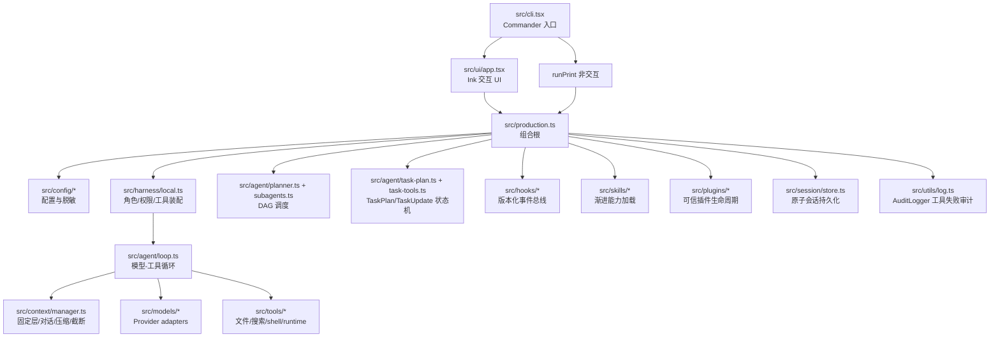
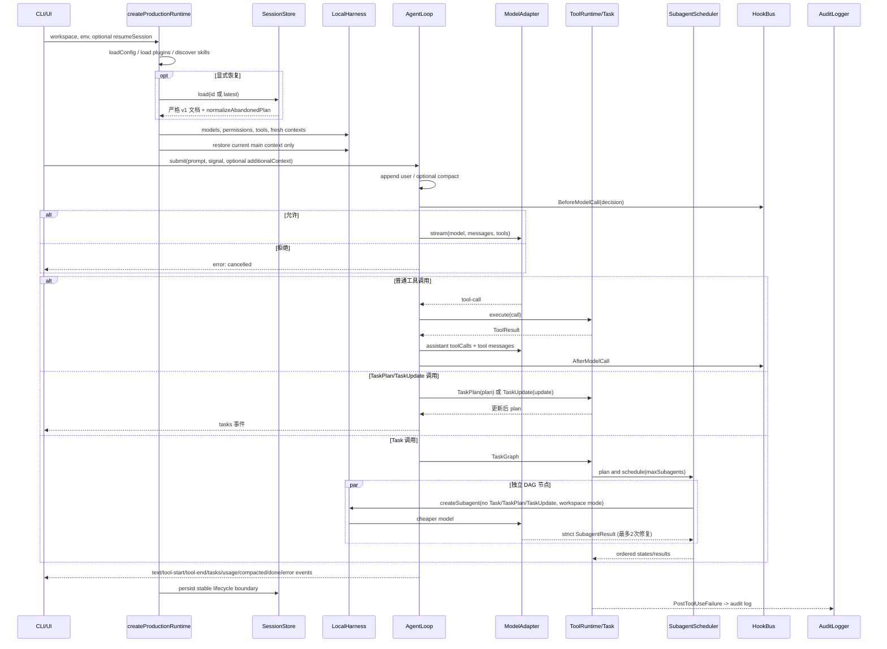

# flavor-code 技术方案报告

## 1. 目标与非目标

flavor-code 0.1.0 的目标是在 Node.js 20+ 上提供一个可安装、可恢复、跨平台的终端编程 Agent MVP：统一接入多种模型 provider；以可取消的流式循环调用本地工具；在权限与 Hook 边界内运行；支持受限子 Agent 的任务 DAG；按需加载 Skill 与可信插件；在 Windows/macOS 上验证构建和安装。

本版本的非目标是：IDE 原生体验、OAuth/账号系统、云端会话同步、任意旧会话格式迁移、操作系统级沙箱、恶意进程内插件隔离、精确 tokenizer 和完整自治项目管理。`src/ui/commands.ts` 中没有 `/ide`，插件注册也显式保留该名称，说明 IDE 尚属路线图。

## 2. 模块架构

组合根集中在 `createProductionRuntime()`，业务模块之间以窄接口连接。`LocalHarness` 为主 Agent 和每个子 Agent 创建独立 `ContextManager`/`ToolRuntime`；`AgentLoop` 不读取配置文件，也不直接操作 UI；`SessionStore` 不接收 provider 配置，从类型边界减少凭据落盘风险。`TaskPlan`/`TaskUpdate` 提供主 Agent 任务状态机，与 `TaskGraph`/`SubagentScheduler` 分层协作；`AuditLogger` 将工具失败事件追加到工作区审计日志。

## 3. 启动与模型—工具—子 Agent 时序

启动先加载全局/项目配置，再注册 provider 和插件贡献，发现 Skill，最后构造 Harness。只有传入 `resumeSession` 才读取会话。主循环在每轮模型请求前先通过 `BeforeModelCall` Hook 检查取消与决策，再压缩；工具调用整轮暂存后一次性追加 assistant/tool 消息，保证 provider 对话结构有效。`TaskPlan`/`TaskUpdate` 工具由生产组合根直接注入主 Agent 工具集，不经过 Task DAG；子 Agent 的 Task/TaskPlan/TaskUpdate 均被过滤。

## 4. 文件地图

| 路径 | 当前职责 |
|---|---|
| `src/cli.tsx` | `flavor`、`--print`、`--resume [session-id]`，退出码与错误脱敏 |
| `src/ui/app.tsx`, `src/ui/session.ts` | Ink 状态、输入/审批、slash 命令、会话 Hook 与关闭 |
| `src/production.ts` | 配置、provider、工具、插件、Skill、任务与会话的生产装配 |
| `src/config/schema.ts`, `src/config/load.ts` | Zod 配置、深合并、环境插值、显示脱敏 |
| `src/models/types.ts`, `openai.ts`, `anthropic.ts`, `registry.ts` | 流事件协议、错误归类、模型 ID 解析与 SDK 适配 |
| `src/agent/loop.ts` | 最大迭代（默认40）、模型流、工具整轮、BeforeModelCall/AfterModelCall、usage/error 事件 |
| `src/agent/task-plan.ts`, `task-tools.ts` | TaskPlan/TaskUpdate 工具、6 状态机、依赖校验、过渡合法性 |
| `src/context/manager.ts` | 当前固定指令、对话、工具输出截断(toolOutputChars)、压缩、snapshot/restore |
| `src/tools/files.ts`, `search.ts`, `shell.ts`, `runtime.ts` | 具体工具与 Hook/权限执行管线 |
| `src/permissions/engine.ts` | safe/workspace/full 决策、真实路径与命令风险分类 |
| `src/hooks/bus.ts`, `types.ts` | v1 事件/决定 schema、超时和失败策略、additionalContext 决定字段 |
| `src/agent/planner.ts`, `subagents.ts` | 严格 DAG、并发调度、结构化子 Agent 结果、最多2次修复尝试 |
| `src/skills/registry.ts`, `tool.ts` | Skill 发现/匹配/正文及资源的能力式读取 |
| `src/plugins/host.ts`, `types.ts` | manifest、优先级、激活/卸载、窄注册 API |
| `src/session/store.ts` | v1 schema、原子保存、受限读取、隔离与恢复归一化、遗留任务修复 |
| `src/utils/log.ts` | AuditLogger：PostToolUseFailure 结构化审计日志追加 |

## 5. 配置模型与优先级

`loadConfig()` 的深合并顺序为：`~/.flavor-code/flavor.json` < `<workspace>/.flavor/flavor.json` < `LoadConfigOptions.cli`。`${VAR}` 插值环境由进程环境再叠加项目 `.env`，因此 `.env` 同名值优先。最终统一通过 `FlavorConfigSchema`：provider 可声明 `type/baseURL/apiKey/defaultModel/cheapModel`；Agent 选择为 `provider:model`；`maxSubagents` 范围 1–16（默认3）；权限默认为 `workspace`；`context.compactAtChars` 默认 240000、`context.toolOutputChars` 默认 30000，均为正整数；`language` 可选 BCP47 标签（如 `zh-CN`、`en-US`），用于控制 Agent 回复语言。

`.env` 是环境来源而不是 JSON 配置层。`redactConfig()` 对 `apiKey/authorization/token` 字段脱敏；生产诊断还对已知密钥值做替换。当前 CLI 没有通用 `--config key=value`，不能把内部 `cli` 注入能力宣传为公开功能。

## 6. Provider adapters

`ModelAdapter.stream(ModelRequest)` 是统一边界，输出 `text/tool-call/usage/error/done`。`ModelRegistry.get("provider:model")` 解析 provider 和模型名。`OpenAIModelAdapter` 与 `AnthropicModelAdapter` 把各 SDK 的流转换为统一事件；`normalizeProviderError()` 将异常归类为 authentication、rate_limit、context_overflow、model_not_found、network、cancelled 或 unknown。

`production.ts` 支持 `openai`、`anthropic`、`openai-compatible`。官方类型在没有显式 agent 时可选内置默认模型；OpenAI-compatible 必须配置 `defaultModel`，子 Agent 还必须有不同的 `cheapModel` 或显式模型。注册失败进入诊断，不会把 API key 原文写入 UI 或会话。

## 7. Harness、AgentLoop 与上下文 MVP

`LocalHarness` 保存 `mainModelId/subagentModelId/permissionMode`，为每个 profile 创建独立 runtime/context。主 Agent 可动态切模型和权限；子 Agent 永久 `workspace` 且工具集合过滤 `Task/TaskPlan/TaskUpdate`。所有 child 在成功、失败和取消路径都由 `dispose()` 收束。

`AgentLoop.run()` 默认最多 40 次迭代。它先追加 user 消息，将可选的 `additionalContext`（如匹配的 Skill 正文）作为当轮 system 消息注入而不持久化；再压缩，通过 `BeforeModelCall` Hook 检查是否允许调用模型，调用模型，累计 usage；工具调用通过 `ToolRuntime.execute()`，结果序列化为 tool 消息并使用 `ContextManager` 的阶段截断。整个 assistant 消息与所有 tool 消息在一次 `appendMany()` 中整轮暂存后提交，保证 provider 对话结构有效；一轮结束后触发 `AfterModelCall`。取消、provider 终止不完整、序列化失败和迭代耗尽均产生结构化错误。

`ContextManager` 每次请求重新拼装当前 system、当前 `FLAVOR.md`、可选 task state（JSON 序列化的 `TaskSnapshot`）、摘要和对话。字符数/4 只是文档化估算。`append()`/`appendMany()` 对 tool 消息按 `toolOutputChars`（默认 30000 字符）截断：头尾各保留一半，中间标记原始长度。压缩保留最近 `recentTurns`（默认 3）个完整 user turn，经过 `PreCompact/PostCompact` Hook，仅在全部成功后提交。`snapshot()` 不含 system/FLAVOR/taskState 等固定层；`restore()` 丢弃 system 注入、孤立 tool（无对应 assistant tool-call）和空内容无 tool-call 的 assistant，从而保留当前固定指令并恢复 provider-valid turns。

`LocalHarness` 的 `toModelTool()` 通过 `ensureStrictSchema()` 将工具 Zod schema 转为 JSON Schema 并注入 `additionalProperties: false`；可选字段若非 required 则包装为 `anyOf: [原类型, {type:"null"}]` 并加入 required，适配严格 JSON 模式的 provider。

## 8. 工具、搜索与 shell 安全

文件工具将路径限制在工作区，检查路径穿越、符号链接和 TOCTOU 相关身份，写入/编辑使用受控路径。搜索工具使用 `@vscode/ripgrep`，遵循 ignore 语义并限制匹配/输出。`SkillResource` 同样做大小、目录和文件身份校验。

Shell 工具通过 executable/args 运行，设置 cwd、超时、最大输出和 AbortSignal 清理。`PermissionEngine` 对 sh/cmd/PowerShell 包装层、不透明字符串、例行命令参数及删除/磁盘/仓库破坏模式分类。它能降低误操作，但被批准的命令仍是宿主进程，不构成容器隔离。

## 9. 权限模型

`PermissionEngine.decide(PermissionRequest)` 输出 allow/deny/ask。`safe` 对写和 shell 更保守；`workspace` 允许工作区内常规操作；`full` 放宽主 Agent 常规操作，但明确禁止项、路径逃逸仍拒绝。网络在非 full 模式询问。交互 UI 用 `ApprovalBridge` 等待用户；`--print` 使用 deny policy，不会悬挂。

子 Agent 规则不随主模式升级：禁止再次委派；工作目录必须在 workspace；破坏命令拒绝；非例行 shell 和网络需要上层批准。`ToolRuntime` 在执行前后发 Hook，并保证权限请求与工具结果形成一致事件序列。

## 10. Hook 事件与决定语义

`HOOK_EVENT_NAMES` 当前含 19 个事件：SessionStart、UserPromptSubmit、Stop、SessionEnd、BeforePlan、AfterPlan、SubagentStart、SubagentStop、BeforeModelCall、AfterModelCall、PreToolUse、PermissionRequest、PostToolUse、PostToolUseFailure、PreCompact、PostCompact、PluginLoad、PluginUnload、Notification。

事件必须为 `{version:1,type,payload}`；决定为 allow/deny/ask，加可选 reason、updatedInput、additionalContext。`BeforeModelCall`/`AfterModelCall` 在 `AgentLoop` 每轮模型调用前后触发；`BeforePlan`/`AfterPlan` 由 `TaskPlanner.plan()` 触发；子 Agent 生命周期由 `SubagentStart`/`SubagentStop` 包围。`HookBus` 校验 schema，按优先级/注册顺序运行，支持 handler timeout 与 error/allow/deny/ask failurePolicy。只有消费方明确支持时 updatedInput 才改变输入，例如 `TaskPlanner.plan()` 要求 `BeforePlan.updatedInput.graph` 并重新验证 DAG；决定对象不是任意代码执行许可。

## 11. Task DAG、TaskPlan 状态机与子 Agent 结果

### 11.1 TaskPlan/TaskUpdate（主 Agent 状态机）

`TaskPlanSchema` 的 `tasks` 数组每项为 `id/subject/activeForm/status/dependencies/result?`，其中 `status` 支持 6 种状态：`pending`、`in_progress`、`completed`、`failed`、`blocked`、`cancelled`。Schema 校验：无重复 ID、无未知/重复依赖、无环、至多一个 `in_progress`、`completed` 节点的依赖必须全部 `completed`。

`updatePlanTask()` 强制合法状态转移：`pending`→`in_progress|blocked|cancelled`；`in_progress`→`completed|failed|blocked|cancelled`；其他不变。目标 `completed` 时再次校验依赖全部 `completed`。`normalizeAbandonedPlan()` 将所有 `in_progress` 改为 `cancelled`（用于会话恢复）。

生产组合根将 `TaskPlan` 和 `TaskUpdate` 工具注入主 Agent 工具集，子 Agent 通过 `MAIN_TASK_TOOL_NAMES` 过滤（Task/TaskPlan/TaskUpdate 均不可用于子 Agent）。

### 11.2 TaskGraph 与 SubagentScheduler

`TaskGraphSchema` 的节点字段为 `id/description/dependencies/expectedOutputs/verification`，拒绝重复 ID、未知/重复依赖和环。`SubagentScheduler` 按原节点顺序选择 ready 节点，最大并发由 `maxSubagents` 控制。失败/blocked 的后代被确定性标 blocked，无关分支继续。

子 Agent 最多返回两次：第一次不符合 `SubagentResultSchema` 时给修复提示，第二次仍非法则合成 failed。结果字段为 `taskId/status/summary/filesChanged/commandsRun/verification/artifacts/risks/suggestedNextSteps`。

其中 `status` 为 `completed|failed|blocked`；`commandsRun` 是 `{command: string, exitCode: number|null, summary: string}` 的结构化数组；`verification` 是 `{name: string, passed: boolean, details: string}` 的数组。不保存隐藏推理或完整 transcript。调度取消会 abort 并等待所有已启动 child 的收尾 Hook。`SubagentStop` 事件携带 taskId、最终 status 和可选 error 信息。

## 12. Skill 能力设计

Skill 元数据来自严格 YAML frontmatter 的 `name/description`。全局根与项目根分层，项目同名覆盖全局；匹配先按名称/描述词项确定候选，可选 selector 失败时仍有确定性回退。大小上限分别约束元数据、正文和资源。

资源只允许 `assets/`、`references/`、`scripts/` 中被正文引用的规范相对路径。`resolveResource()` 返回带文件身份快照的不可伪造 capability，`readResource()` 再验证；符号链接/替换/越界被拒绝。脚本通过 `SkillResource` 仅返回 UTF-8 或 base64 数据，不自动执行。这实现“元数据 → 匹配正文 → 明确资源”的渐进加载。

## 13. 插件生命周期与信任

`PluginManifestSchema` 要求 apiVersion `1`、入口、权限以及 commands/tools/hooks/skillRoots/modelAdapters 的完整贡献清单。Host 发现优先级为 project > npm > global，校验根目录与入口身份，限制激活 10 秒、卸载 5 秒；注册名冲突会失败。卸载按 disposer 反序释放，再发 PluginUnload。

`PluginContext` 暴露 logger、脱敏 config、受控 filesystem service 和窄注册函数。manifest filesystem 权限经过 host authorizer。然而插件入口仍在同一 Node.js 进程 import；恶意插件可绕过窄 API，因此当前信任模型是“只加载可信插件”，不是安全沙箱。

## 14. 会话持久化

`SessionDocumentSchema` 是 strict v1：sessionId、createdAt/updatedAt、workspace.path、conversation(summary/messages)、tasks(graph/states/results)、models(main/subagent)、permissionMode。它不包含 providers、环境、审批、认证 header 或 key。`SessionStore.save()` 在写前递归删除敏感键并脱敏凭据形态字符串，限制序列化大小。

会话位于 `.flavor/sessions`。Store 验证工作区真实路径、每级目录非符号链接和最终包含关系；临时文件以 0600 独占创建，写入后 fsync，再同目录 rename。load 先 stat 限制，再读后复查字节数；ID 只允许有限安全字符。schema/JSON 损坏或版本不兼容文件改名为 `.corrupt-*`，list 按 updatedAt 降序、ID 升序确定性返回。

恢复仅由 `--resume [session-id]` 或 `ProductionRuntimeOptions.resumeSession` 触发。工作区不一致直接拒绝。当前 system/FLAVOR 由新 ContextManager 生成；只注入恢复的摘要/规范消息。

`SessionDocumentSchema` 的 `tasks` 字段包含 `plan: TaskPlanSchema.optional()` 和 `states`/`results`。恢复时 `normalizeAbandonedPlan()` 将所有 `in_progress` 任务转为 `cancelled`；`normalizeAbandonedTasks()` 处理 DAG 遗留 `running` 节点：依赖失败/blocked 则 failed 并合成结果，否则降回 pending。生产组合根在 prompt/tool 轮完成、任务转换/结果、压缩、模型/权限变化、SessionEnd 与 dispose 边界排队保存，避免流 token 级写盘。

## 15. CLI 与 UI

`createProgram()` 提供 `--version`、`-p/--print <prompt>` 和 `--resume [session-id]`。非 TTY 且没有 `--print` 时退出码 2 并提示用法。print 启动失败为 2，运行失败为 1，成功为 0；finally 关闭 session 并 dispose runtime。

Ink `App` 管理输出行、输入历史、审批和 Ctrl+C：第一次中断活动请求，后续退出。`FlavorSession` 串行化 submit，平衡 SessionStart/UserPromptSubmit/Stop/SessionEnd Hook，并路由内置/插件命令。

内置命令有 13 个：`/model`（切模型）、`/init`（初始化）、`/config`（配置）、`/permissions`（权限模式）、`/skills`（Skill 列表）、`/plugins`（插件列表）、`/hooks`（Hook 状态）、`/tasks`（任务状态）、`/compact`（压缩对话）、`/clear`（仅清 UI 展示，不删 ContextManager 或会话文件）、`/help`、`/exit`、`/audit [toolFilter]`（查询工具失败审计日志）。插件命令和 Skill 命令按动态名称路由，分别委托 `pluginCommands` 和 `runSkill`。`/ide` 名称保留。

## 16. 失败分类

| 层 | 代表失败 | 当前处理 |
|---|---|---|
| 启动配置 | JSON/Zod 错误、无 provider | 启动错误或可操作诊断；无密钥可进入 UI |
| Provider | auth/rate/context/model/network | `normalizeProviderError` 结构化分类 |
| 模型流 | 无 done/error、迭代耗尽 | incomplete_stream / iteration_limit |
| 工具 | schema、权限、超时、取消、序列化 | ToolResult error + failure Hook + AuditLogger |
| Hook | deny、ask、超时、handler 异常 | 决定合并与 failurePolicy |
| DAG | 环/未知依赖/非法结果 | 规划拒绝、修复一次、合成 failed |
| Plugin/Skill | manifest、冲突、越界、身份变化 | diagnostic、拒绝激活/读取、清理已注册项 |
| Session | 超限、损坏、版本/工作区不兼容 | 拒绝；损坏文件隔离；不隐式回退其他 workspace |
| UI/进程 | Ctrl+C、关闭期异常 | AbortSignal、幂等 close/dispose、保留主错误 |

## 17. 测试、CI 与打包

测试使用 Vitest，按 config/models/context/agent/tools/permissions/hooks/plugins/skills/init/ui/cli/session/utils 分层。所有测试无真实 API 凭据；provider 使用假 adapter 或不可达本地地址验证选择/错误。TypeScript 开启严格与 exact optional 属性检查。

`.github/workflows/ci.yml` 矩阵为 Windows/macOS × Node 20/24：`npm ci`、测试、typecheck、build、安装 smoke。POSIX signal/process 合约 `tests/cli/sigint-process.test.ts` 仅在 macOS 跑，Windows 跳过；其他测试两平台执行。

`tsup.config.ts` 将 `src/cli.tsx` 构建为带 `#!/usr/bin/env node` 的 ESM `dist/cli.js`。package `files` allow-list 排除源码测试、`.env` 和会话。`scripts/smoke-install.mjs` 真实执行 pack、临时 prefix 全局安装、定位 POSIX `bin/flavor` 或 Windows `flavor.cmd`，验证 0.1.0 与无凭据 `--help`，finally 删除 tarball/临时目录。

## 18. 安全威胁模型

主要资产是工作区代码、宿主文件、凭据、命令执行权和对话。威胁来源包括 prompt injection、恶意仓库路径/符号链接、模型伪造工具参数、shell 包装、巨大输出/会话 DoS、损坏恢复文件、恶意 Skill 资源与插件。

现有缓解包括：真实路径/包含校验、bounded read/output、工具输入 Zod、权限 ask/deny、子 Agent 降权、Hook 版本校验、取消/超时、会话原子写/隔离/敏感字段删除、配置/UI 错误脱敏、Skill capability 身份复查、发布 allow-list。剩余风险是同进程插件与被批准 shell 具有宿主权力；provider 会收到模型上下文；模型可能提出有害但看似常规的操作；本地用户仍可读自己的会话文件。建议最小权限 key、受控插件、版本控制与隔离开发环境。

## 19. 权衡与路线图

- 字符估算和摘要截断实现简单、无 provider tokenizer 依赖，但精度有限；未来可按模型预算与结构化摘要改进。
- JSON strict v1 与不自动迁移优先安全/可诊断性，牺牲旧格式兼容；未来加入显式迁移器和校验签名。
- 稳定生命周期保存避免 token 级 I/O，但进程被强杀时可能丢失最后一个进行中边界；未来可引入有界 debounce journal。
- 进程内插件易开发且贡献类型丰富，但隔离弱；未来考虑 worker/process sandbox、签名与能力 broker。
- 终端 UI 便于跨平台 MVP，缺少编辑器上下文与 diff UX；路线图包括 IDE 协议/扩展。
- API key 配置直接但体验与轮换一般；路线图包括 OAuth、系统 keychain 和 provider 登录。
