# flavor-code 技术方案报告

> 版本：0.1.0 | 语言：TypeScript | 运行时：Node.js ≥20 | 包管理器：npm

---

## 1. 项目概述

**flavor-code** 是一个运行在终端里的 AI 编程助手。它不像传统 IDE 插件那样需要图形界面——你只要在命令行里和它对话，它就能阅读代码、搜索文件、修改项目、执行命令、拆分复杂任务并调度多个子 Agent 并行工作，就像一个坐在你旁边的资深程序员。

从架构上讲，它是一个实现了 "ReAct 循环"（Reasoning + Acting）的本地 Agent 框架：接入大语言模型（OpenAI GPT、Anthropic Claude 或兼容服务），在工作区权限范围内安全操作文件，通过分层上下文压缩突破单次模型窗口限制，并通过任务 DAG 实现结构化多步协作。

本报告面向开发者、架构师以及希望深入理解 Agent 系统的技术人员，从目标定位、架构设计、核心子系统到安全策略逐一展开。

---

## 2. 目标与非目标

### 2.1 0.1.0 版本目标

- 提供 `npm install -g flavor-code` 一键安装的终端编程 Agent
- 统一接入多种模型 provider（OpenAI、Anthropic、OpenAI 兼容）
- 以可取消的流式循环调用本地工具（文件读写、搜索、Shell 等）
- 在权限与 Hook 边界内安全运行
- 支持受限于 workspace 权限的子 Agent 进行 DAG 任务并行
- 通过分层上下文压缩跨越单次模型窗口
- 按需加载 Skill（技能包）与可信插件
- 在 Windows / macOS 上验证构建和安装

### 2.2 非目标（明确排除）

- `/loop` 与 loop-engineering 调度器（长期自主循环）
- 后台 Session Memory（持久化记忆系统）
- Anthropic cache editing
- 压缩后的文件/Skill 附件恢复
- Partial compact UI（渐进式压缩界面）
- IDE 原生协议/扩展
- OAuth / 账号系统 / 云端会话同步
- 操作系统级沙箱
- 精确 tokenizer（使用字符估算兜底）

---

## 3. 系统架构总览

### 3.1 模块依赖拓扑

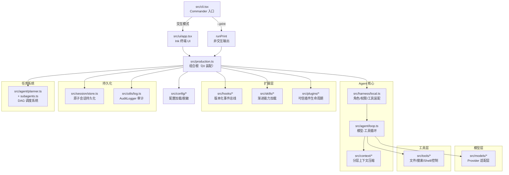

**关键设计原则：**

- **组合根集中装配** — `createProductionRuntime()` 负责所有依赖注入，业务模块之间以窄接口连接
- **单向依赖** — `AgentLoop` 不读配置、不操作 UI；`SessionStore` 不接收 provider 配置，从类型边界减少凭据落盘风险
- **隔离上下文** — 主 Agent 和每个子 Agent 拥有独立的 `ContextManager` 和 `ToolRuntime` 实例

### 3.2 全链路时序

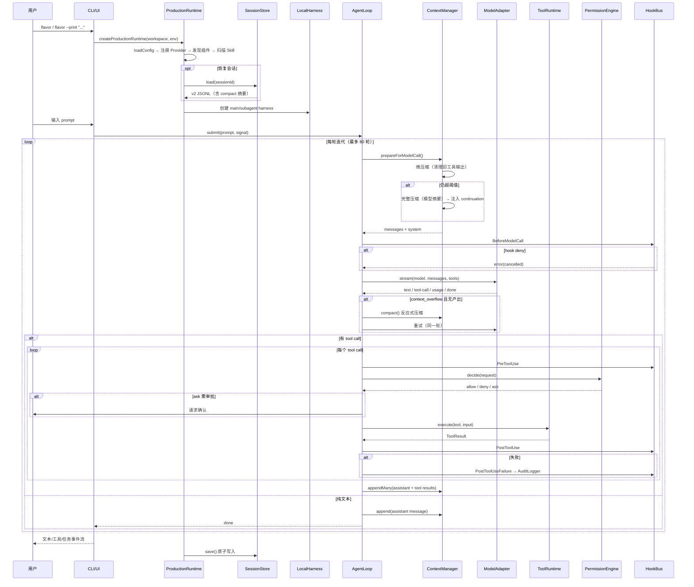

---

## 4. 启动与配置系统

### 4.1 入口路由

`src/cli.tsx` 基于 Commander 实现三个入口：

| 模式 | 命令 | 说明 |
|------|------|------|
| 交互模式 | `flavor` | 全功能 Ink 终端 UI，支持 slash 命令、审批面板、任务进度 |
| 非交互模式 | `flavor --print "..."` | 单次执行，所有审批默认拒绝（deny policy） |
| 会话恢复 | `flavor --resume [id]` | 从 `.flavor/sessions/` 恢复历史会话继续工作 |

非 TTY 且无 `--print` 时退出码 2 并提示用法。

### 4.2 配置加载优先级

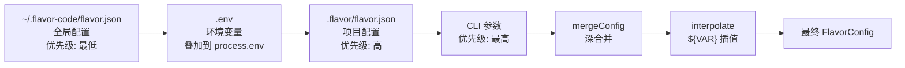

- `${VAR}` 插值优先从 `.env` 取值，其次 `process.env`
- `redactConfig()` 对 `apiKey`、`authorization`、`token` 字段脱敏为 `[redacted]`
- 会话保存前递归扫描并删除敏感字段（`authorization`、`api_key`、`access_token`、`sk-*`）

### 4.3 核心配置项

```typescript
FlavorConfigSchema = {
  providers: {                          // 模型提供商
    [name]: {
      type: "openai" | "anthropic" | "openai-compatible",
      baseURL, apiKey, defaultModel, cheapModel
    }
  },
  agents: {
    main: { model: "provider:model" }, // 主 Agent 模型
    subagent: { model: "provider:model" } // 子 Agent 模型
  },
  maxSubagents: 1-16,                  // 子 Agent 最大并行数（默认 3）
  permissionMode: "safe" | "workspace" | "full", // 默认 workspace
  language: "zh-CN",                   // BCP47 语言标签
  maxIterations: {
    main: 10-500,                      // 主 Agent 迭代上限（默认 80）
    subagent: 10-200,                  // 子 Agent 迭代上限（默认 40）
    softLimitFactor: 0.8,              // 软限制比例
    extendBy: 20                       // 扩展步数
  },
  context: {
    windowTokens: 200_000,             // 模型上下文窗口
    reservedOutputTokens: 20_000,      // 保留给输出
    autoCompactBufferTokens: 13_000,   // 自动压缩缓冲
    toolOutputChars: 30_000,           // 单次工具输出截断
    microcompactKeepRecentToolResults: 5 // 微压缩保留数
  }
}
```

---

## 5. Agent 核心循环

### 5.1 迭代控制

`AgentLoop.run()` 是一个 `async *` 生成器，输出 `AgentEvent` 事件流，由消费方（UI 或子 Agent 调用者）通过 `for await...of` 消费。

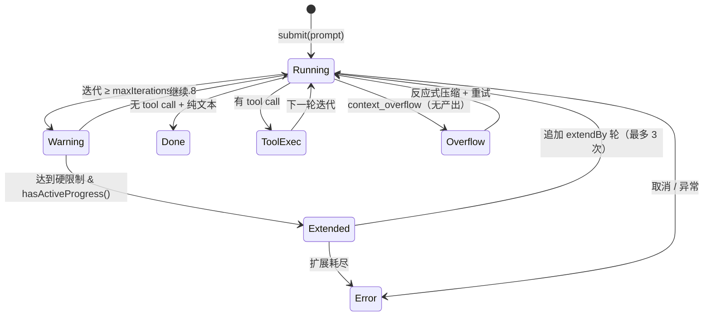

**软限制**：迭代达到 80% 时发出 `warning` 事件，告知用户剩余轮数有限。

**硬限制 + 自动扩展**：到达上限时检查 `hasActiveProgress()`——如果存在 `in_progress` 的主任务或 `running` 的子 Agent，自动追加扩展轮数（默认 20 轮，最多 3 次扩展）。子 Agent 不可扩展。

### 5.2 单轮循环详解

```
prepareForModelCall()
  ├── 自动微压缩（快速清理旧工具输出）
  ├── needsCompaction() 判断
  │     └── 完整压缩（模型摘要）
  └── 返回 messages + system
       ↓
BeforeModelCall hook（可 deny）
       ↓
adapter.stream(model, messages, tools)
  ├── text → yield text 事件
  ├── tool-call → 暂存
  ├── usage → 回写 ContextManager
  └── context_overflow → 反应式压缩 + 重试（最多 1 次）
       ↓
AfterModelCall hook
       ↓
有 tool calls?
  ├── 是 → 逐个执行
  │     ├── PreToolUse hook
  │     ├── PermissionEngine.decide()
  │     ├── tool.execute()
  │     ├── PostToolUse hook
  │     └── 失败时 PostToolUseFailure → AuditLogger
  │     └── appendMany(assistant + tool results)
  └── 否 → append(assistant message) → done
```

关键设计细节：

- **整轮暂存**：工具调用整轮暂存后一次性 `appendMany()` 提交 assistant + tool 消息，保证 provider 对话结构有效
- **反应式压缩**：正常请求在尚未产生文本或工具调用时若返回 `context_overflow`，循环在同一 iteration 内强制压缩并重建请求，最多重试一次。若已有可见输出则不重试，避免拼接
- **取消安全**：通过 `AbortSignal` 支持取消，取消后立即合成错误结果并清理

---

## 6. 上下文管理与压缩系统

### 6.1 消息布局

每次模型请求时，`ContextManager` 按以下层次拼装消息：

```
┌──────────────────────────────────────┐
│  System Prompt（身份/规则/指令）       │  ← #pinnedMessages() 固定层
├──────────────────────────────────────┤
│  FLAVOR.md（项目指南）                 │  ← 可选
├──────────────────────────────────────┤
│  TaskSnapshot（当前任务状态）          │  ← 可选
├──────────────────────────────────────┤
│  Compact Continuation（压缩摘要续接）  │  ← 注入为 user 消息
├──────────────────────────────────────┤
│  近期完整消息（未压缩部分）            │  ← provider-valid messages
└──────────────────────────────────────┘
```

固定层（system、FLAVOR、TaskSnapshot）不参与压缩持久化，每次由新的 ContextManager 重新生成。

### 6.2 三级压缩策略

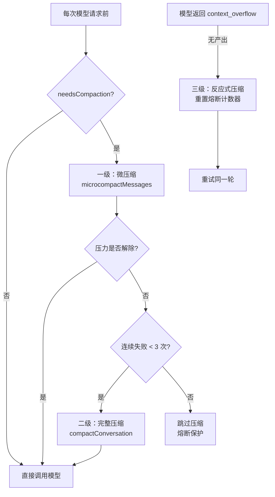

**一级 — 微压缩（Microcompact）**

- 在完整压缩前快速释放空间
- 识别已完成的可压缩工具调用（Read、Shell、Grep、Glob、Edit、Write、ApplyPatch 等 11 种）
- 保留最近 5 个工具结果（`microcompactKeepRecentToolResults`），其余替换为 `[Old tool result content cleared]`
- 失败可回滚，不破坏对话

**二级 — 完整压缩（Model Summary）**

- 调用当前角色模型（空工具集）生成结构化摘要
- 九段式摘要提示词：用户意图与技术决策、文件与代码区、错误与修复、问题解决、待办项、当前工作、下一步、可选分析草稿
- 保留最近 10K–40K token 或 5 条文本消息，不切断 tool call/result
- 自动压缩连续 3 次失败后熔断（避免重复消耗 API）
- 手动 `/compact` 和反应式压缩绕过熔断
- 通过 `snapshot()` / `restore()` 保存和恢复压缩边界

**三级 — 反应式压缩（Reactive）**

- agent loop 在 `context_overflow` 且无可见输出时触发
- 强制完整压缩并重试同一轮
- 重置自动压缩失败计数器

### 6.3 工具输出截断

单次工具消息按 `toolOutputChars`（默认 30,000 字符）进行头尾截断，中间插入截断标记。截断方式为保留字符级头和尾，避免丢失关键信息的同时控制上下文窗口占用。

### 6.4 压力估算模型

- 模型 usage 的 input tokens 回写 ContextManager
- 下一轮以真实 usage + 新增消息估算增量作为压力基线
- 与完整上下文估算取较大值
- 有效窗口 = `windowTokens - reservedOutputTokens`（默认 180K）
- 自动压缩阈值 = 有效窗口 - `autoCompactBufferTokens`（默认 167K）
- 首次调用和刚追加工具结果时使用字符/4 保守估算兜底

---

## 7. 任务系统

### 7.1 两层状态机

Flavor 有两套独立但互补的任务管理机制：

| 层 | 角色 | 工具 | 状态数 | 特点 |
|----|------|------|--------|------|
| TaskPlan | 主 Agent 对用户的结构化承诺 | TaskPlan、TaskUpdate | 6 种 | DAG 依赖、依赖校验、仅主 Agent 可用 |
| TodoWrite | Agent 自用的轻量进度清单 | TodoWrite | 4 种 | 无依赖、最多 50 项、至多 1 项 in_progress |

### 7.2 TaskPlan 状态机

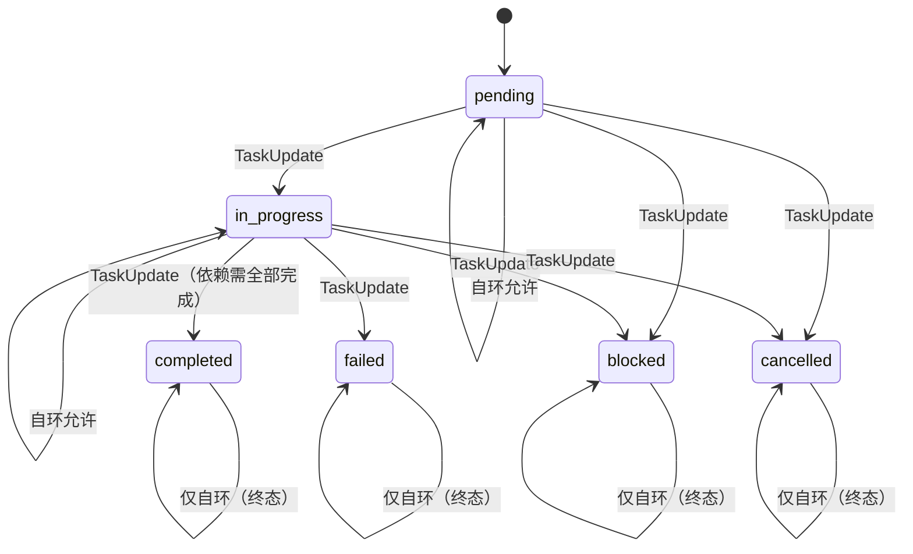

**Schema 校验规则：**

- 无重复 ID
- 依赖项必须指向已知 ID
- 不允许重复依赖
- `completed` 节点的所有依赖必须 `completed`
- 最多一个 `in_progress` 任务
- 无循环依赖

`normalizeAbandonedPlan()` 在会话恢复时将所有 `in_progress` 转为 `cancelled`，防止脏状态残留。

### 7.3 子 Agent DAG 调度

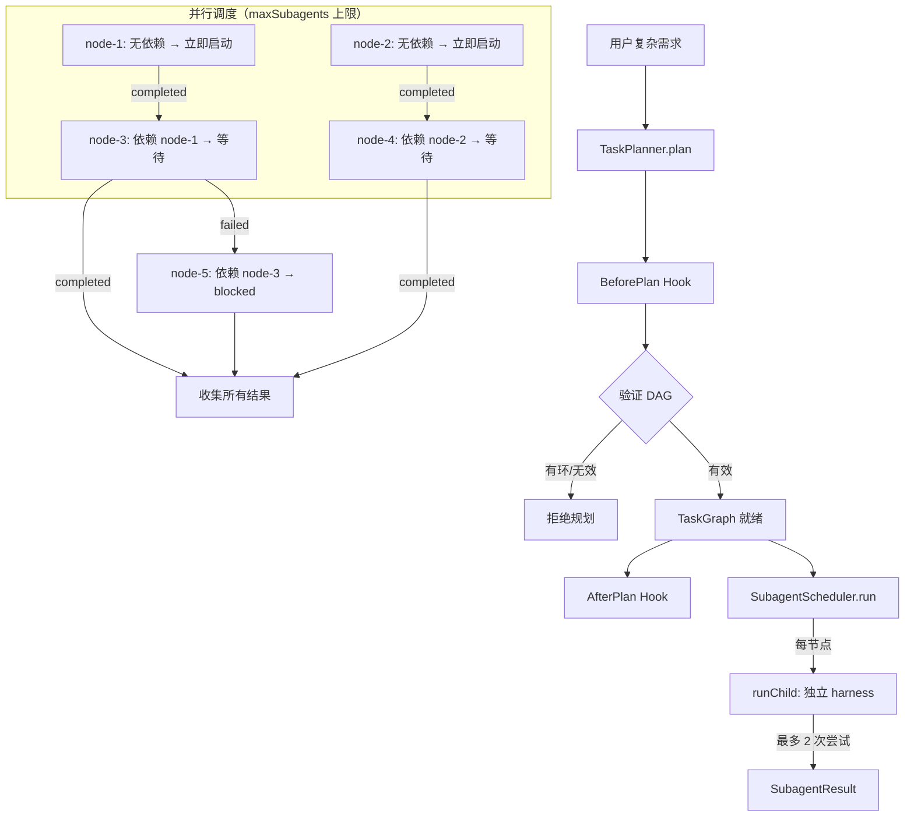

**调度机制：**

- 最大并行度：`maxSubagents`（1–16，默认 3）
- 基于 `Promise.race` 事件驱动调度
- 依赖传播：失败/blocked 的节点级联阻塞下游
- 每次尝试最多 2 次：第一次不符合 `SubagentResultSchema` 给修复提示，第二次仍非法则合成 failed

**子 Agent 约束：**

- 权限强制 `workspace` 模式
- 工具集合过滤 `Task`、`TaskPlan`、`TaskUpdate`、`AskUserQuestion`（不可委派）
- 独立 `ContextManager`、`ToolRuntime`、`AgentLoop`
- 通过 `TaskOutput` 工具或最终 assistant 消息的 JSON 解析获取结构化结果

---

## 8. Provider 适配层

### 8.1 统一流协议

所有模型 provider 通过 `ModelAdapter.stream()` 接口统一接入，输出五种事件：

```typescript
type ModelEvent =
  | { type: "text"; text: string }           // 流式文本块
  | { type: "tool-call"; ... }               // 工具调用
  | { type: "usage"; inputTokens; ... }      // token 用量
  | { type: "error"; error: ProviderError }  // 标准化错误
  | { type: "done" };                        // 流结束
```

`ModelRegistry` 管理 `Map<string, ModelAdapter>`，模型 ID 格式为 `provider:model`。

### 8.2 错误标准化

`normalizeProviderError()` 将各 SDK 的异常归类为 8 种标准错误码：

| 错误码 | 典型场景 |
|--------|----------|
| `authentication` | API key 无效（401） |
| `rate_limit` | 速率限制（429） |
| `context_overflow` | 上下文超窗口 |
| `output_limit` | max_tokens 耗尽 |
| `model_not_found` | 模型不存在 |
| `network` | 网络/连接异常 |
| `cancelled` | AbortSignal 触发 |
| `unknown` | 未知异常 |

### 8.3 适配器实现要点

**Anthropic（`src/models/anthropic.ts`）**
- 系统消息提升为顶级 `system` 参数
- tool 消息聚合为 `tool_result` 块
- toolCalls 映射为 `tool_use` 块
- 追踪缓存 token（`cache_creation_input_tokens + cache_read_input_tokens`）

**OpenAI（`src/models/openai.ts`）**
- 使用 Responses API 而非 Chat Completions
- 工具消息映射为 `function_call_output`
- toolCalls 映射为 `function_call`
- 所有工具参数使用 `strict: true`
- 通过 `pendingCalls` Map 处理输出索引与调用 ID 的时序问题

---

## 9. 工具系统与权限引擎

### 9.1 工具分类

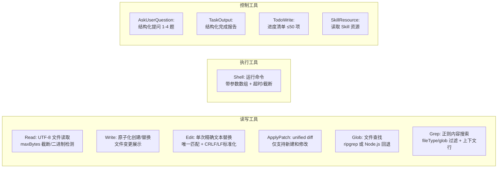

### 9.2 权限引擎决策树

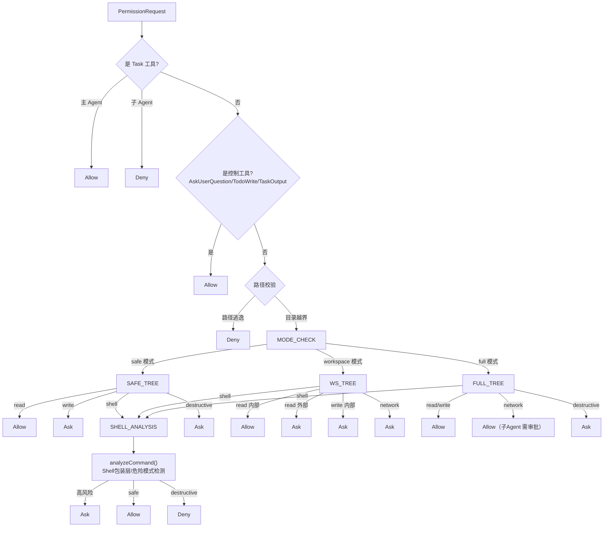

### 9.3 运行时权限链

```
PreToolUse hook → (可 deny / 修改 input)
  → PermissionEngine.decide()
    → 若 ask: 触发 PermissionRequest hook
      → 若 main agent: 调用 approve callback（UI 弹审批面板）
      → 若 "always": 同分类后续放行（destructive 除外）
  → tool.execute()
  → PostToolUse hook
  → 失败时: PostToolUseFailure hook → AuditLogger
```

### 9.4 Shell 安全分类

`analyzeCommand()` 对每个命令执行多层分析：

- **包装层检测**：`sh -c`、`cmd /c`、`powershell -Command` 等会递归提取内部命令进行再分析
- **模式匹配**：删除命令（`rm -rf`、`del /f`）、磁盘操作（`mkfs`、`format`、`dd`）、仓库破坏（`git push --force`、`git reset --hard`）、权限修改（`chmod 777`）等
- **例行命令**：测试、构建、版本控制、包管理、格式化等常规开发命令
- **降级规则**：不透明命令（复杂管道、重定向）、多语句串联自动降级

---

## 10. Hook 事件总线

### 10.1 19 个事件全集

| 类别 | 事件 | 触发时机 | 决定支持 |
|------|------|----------|----------|
| **会话** | `SessionStart` | 会话开始 | — |
| | `UserPromptSubmit` | 用户提交 prompt | deny→阻止执行 |
| | `Stop` | 中断当前请求 | — |
| | `SessionEnd` | 会话结束 | — |
| **规划** | `BeforePlan` | TaskPlanner 调用前 | deny→拒绝计划 |
| | `AfterPlan` | 计划创建后 | — |
| **子 Agent** | `SubagentStart` | 子 Agent 启动 | — |
| | `SubagentStop` | 子 Agent 结束 | — |
| **模型** | `BeforeModelCall` | 模型调用前 | deny→阻止调用 |
| | `AfterModelCall` | 模型调用后 | — |
| **工具** | `PreToolUse` | 工具执行前 | deny→阻止 / updatedInput |
| | `PermissionRequest` | 权限引擎 ask | allow/deny/ask |
| | `PostToolUse` | 工具执行后 | — |
| | `PostToolUseFailure` | 工具执行失败 | — |
| **压缩** | `PreCompact` | 压缩开始前 | — |
| | `PostCompact` | 压缩完成后 | — |
| **插件** | `PluginLoad` | 插件激活 | — |
| | `PluginUnload` | 插件卸载 | — |
| **通用** | `Notification` | 任意时机 | — |

### 10.2 事件格式与处理

```typescript
// 事件格式
{ version: 1, type: "PreToolUse", payload: { toolName, input, ... } }

// 决定格式
{ decision: "allow" | "deny" | "ask", reason?, updatedInput?, additionalContext? }
```

**处理管道：**

1. 按注册顺序遍历处理器
2. `deny` → 短路返回
3. `ask` → 聚合到汇总决定
4. `updatedInput` → 替换后续处理器的 payload（管道模式）
5. `additionalContext` → 跨处理器累积
6. 超时 / 异常 → 按 `failurePolicy` 策略（error/allow/deny/ask）兜底

**Shell 处理器**：通过子进程 stdin 传递 JSON 事件，从 stdout 解析决定，最大输出 1MB，进程树终止跨平台兼容。

---

## 11. Skill 系统

### 11.1 渐进加载流水线

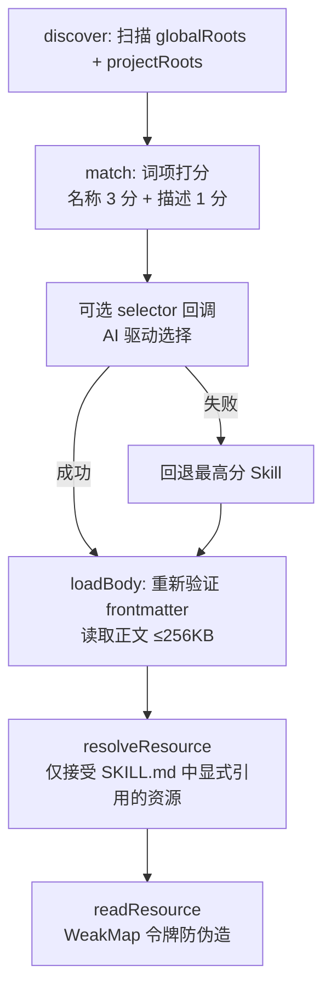

### 11.2 资源安全

- **引用校验**：使用 `marked.lexer` 解析正文中的 Markdown 链接、图片和代码跨度，只有显式引用 `{assets|references|scripts}/{name}` 的资源才可被访问
- **路径安全**：资源访问的每一步都做 stat 快照验证和路径逃逸检查
- **执行隔离**：脚本通过 `SkillResource` 工具仅返回 UTF-8 或 base64 数据，不自动执行
- **覆盖规则**：project 同名覆盖 global

---

## 12. 插件系统

### 12.1 生命周期

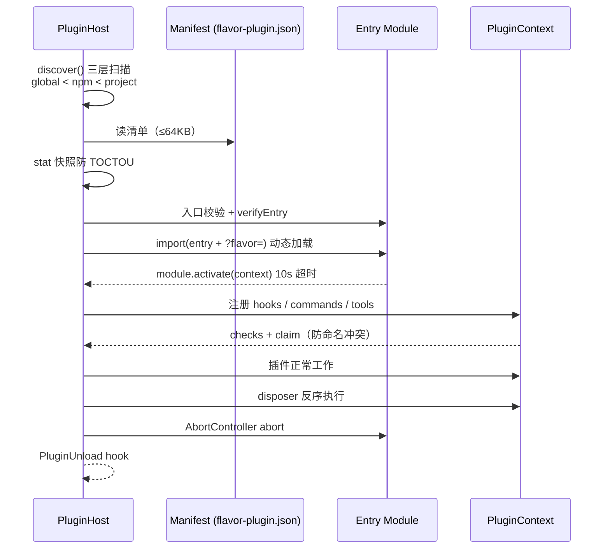

### 12.2 信任模型

- 插件运行在**进程内**，不是沙箱
- 安全边界：文件系统授权回调 + stat 快照防 TOCTOU + 贡献点声明-注册一致性 + 路径逃逸检测
- 当前信任模型：**只加载可信插件**，恶意插件可绕过窄 API
- 未来方向：Worker/process sandbox、签名验证、能力 broker

---

## 13. 会话持久化

### 13.1 JSONL 格式

```
第 1 行：__meta {"version":2,"sessionId":"...","workspace":{"path":"..."},...}
第 2 行：{"role":"user","content":"帮我分析项目"}
第 3 行：{"role":"assistant","content":[{"type":"text","text":"..."}]}
第 4 行：{"role":"assistant","content":[...],"toolCalls":[...]}
第 5 行：{"role":"tool","content":"工具执行结果","toolCallId":"..."}
...
```

### 13.2 v1 → v2 迁移

| 特性 | v1 | v2 |
|------|----|----|
| 摘要格式 | `conversation.summary`（单条 system 消息） | `conversation.compact`（结构化字段） |
| 任务状态 | 内嵌于消息 | `tasks.plan` + `tasks.states` + `tasks.results` |
| 压缩边界 | 无 | `compact.summary` + `compact.compactedAt` |
| 迁移策略 | — | 检测 `"Conversation summary\n"` 前缀，提取文本 |

### 13.3 写入安全

- **原子写入**：写临时文件 → fsync → rename
- **隔离**：损坏文件重命名为 `.corrupt-{timestamp}-{uuid}`，不隐式回退
- **工作区校验**：realpath 比较防符号链接逃逸
- **大小限制**：5MB 上限（`DEFAULT_MAX_SESSION_BYTES`）
- **保存时机**：prompt/tool 轮完成、任务转换、压缩、模型/权限变化、SessionEnd、dispose 边界——避免 token 级写盘

---

## 14. UI 架构

### 14.1 Ink 组件树

flavor-code 的终端 UI 基于 **Ink**（React for CLI）构建，使用自定义的 `claude-ink` 渲染层（内嵌 yoga-layout 排版引擎）。

核心组件层次：

```
App
├── StartingLayout（runtime 初始化中）
│   └── 加载中指示器
└── TerminalLayout（runtime 就绪）
    ├── ScrollBox（可滚动主区域）
    │   ├── Header: "flavor · {model} · {workspaceName}"
    │   ├── TurnView × N（已完成对话）
    │   │   ├── 用户提示（灰底白字 + ❯ 前缀）
    │   │   └── 模型输出块
    │   │       ├── AssistantText（文本块）
    │   │       ├── StatusLine（工具调用状态）
    │   │       ├── TaskStatusLine（子任务状态）
    │   │       └── FileDiffView（文件变更 diff）
    │   └── TurnView（进行中对话）
    ├── TaskProgressPanel（底部进度面板，最多 6 条）
    ├── ApprovalPanel（审批请求面板）
    ├── QuestionCards（用户选择题面板）
    ├── SlashMenu（斜杠命令补全菜单）
    ├── PromptLine（多行输入框）
    └── 底部快捷键提示
```

### 14.2 交互流程

- **输入处理优先级**：终端滚动/翻页 → Ctrl+C 中断 → 审批面板 y/n/a → 问题面板数字选择 → 斜杠补全 ↑/↓/Tab → 提交 prompt → 普通编辑
- **历史记录**：上限 200 条，↑/↓ 导航
- **任务进度面板**：子 Agent 显示橙色旋转动画 + 实时计时器，完成/失败后显示用时

### 14.3 斜杠命令（13 个内置）

| 命令 | 功能 |
|------|------|
| `/model` | 切换主/子 Agent 模型 |
| `/init` | 生成 FLAVOR.md |
| `/config` | 查看配置（脱敏） |
| `/permissions` | 切换权限模式 |
| `/skills` | 列出已安装 Skill |
| `/plugins` | 列出已加载插件 |
| `/hooks` | 列出 Hook 状态 |
| `/tasks` | 查看任务计划 |
| `/compact` | 强制压缩上下文 |
| `/clear` | 仅清屏 |
| `/audit [toolFilter]` | 查看失败审计 |
| `/help` | 帮助信息 |
| `/exit` | 退出 |

输入 `/` 后弹出交互式菜单，列出所有可用命令（内置 + 插件 + Skill），支持模糊匹配与编辑距离建议。未识别命令返回不超过 3 个最近的有效命令。

---

## 15. 失败分类与容错

| 层 | 代表性失败 | 处理策略 |
|----|-----------|----------|
| **启动配置** | JSON/Zod 错误、无 provider | 启动错误或可操作诊断；无密钥可进入 UI |
| **Provider** | auth/rate/context/model/network | `normalizeProviderError` 结构化分类 |
| **模型流** | 无 done/error、迭代耗尽 | `incomplete_stream` / `iteration_limit` |
| **工具** | schema、权限、超时、取消 | ToolResult error + PostToolUseFailure → AuditLogger（`.flavor/audit.jsonl`） |
| **Hook** | deny、ask、超时、handler 异常 | 决定合并与 failurePolicy 兜底 |
| **DAG** | 环/未知依赖/非法结果 | 规划拒绝、修复一次、合成 failed |
| **Plugin/Skill** | manifest、冲突、越界、身份变化 | diagnostic、拒绝激活/读取、清理已注册项 |
| **Session** | 超限、损坏、版本/工作区不兼容 | 拒绝；损坏文件隔离 |
| **UI/进程** | Ctrl+C、关闭期异常 | AbortSignal、幂等 close/dispose |

---

## 16. 安全威胁模型

### 16.1 主要资产

- 工作区代码
- 宿主文件系统
- API 凭据
- 命令执行权
- 对话内容

### 16.2 威胁与缓解

| 威胁 | 缓解措施 |
|------|----------|
| Prompt injection（模型指令注入） | 分层消息设计、固定层不参与压缩 |
| 恶意路径/符号链接 | realpath 校验、逐级包含检查 |
| 模型伪造工具参数 | Zod schema 校验、权限引擎二次决策 |
| Shell 包装层绕过 | 递归命令分析、模式匹配 + 降级规则 |
| 巨大输出/会话 DoS | 输出截断、5MB 会话上限、逐级安全校验 |
| 损坏恢复文件 | 损坏文件隔离、schema 严格校验、不隐式回退 |
| 凭据泄露 | 配置脱敏、会话敏感字段递归删除 |
| 恶意 Skill 资源 | 显式引用校验、stat 快照、路径逃逸检测 |
| 进程内插件 | 信任模型限制（仅加载可信插件） |

### 16.3 剩余风险

- 同进程插件与被批准 shell 具有宿主进程权力
- Provider 会收到模型上下文（包括文件内容）
- 模型可能提出有害但看似常规的操作
- 本地用户仍可读自己的会话文件

---

## 17. 测试与 CI

- **测试框架**：Vitest，分层组织（config → models → context → agent → tools → permissions → hooks → plugins → skills → UI → CLI → session）
- **严格模式**：TypeScript `strict: true` + `noUncheckedIndexedAccess: true` + `exactOptionalPropertyTypes: true`
- **零凭据**：所有测试使用假 adapter 或不可达本地地址验证选择/错误，无真实 API key
- **CI 矩阵**：Windows/macOS × Node 20/24（`.github/workflows/ci.yml`）
- **POSIX 隔离**：`tests/cli/sigint-process.test.ts` 仅 macOS 执行，Windows 跳过
- **构建**：`tsup` 将 `src/cli.tsx` 打包为带 shebang 的 ESM `dist/cli.js`
- **烟雾测试**：`scripts/smoke-install.mjs` 真实执行 pack → 安装 → 验证版本号和 `--help`

---

## 18. 权衡与路线图

| 当前权衡 | 原因 | 未来方向 |
|----------|------|----------|
| 字符/4 估算 token | 无需绑定 tokenizer | 为已知模型接入精确 tokenizer |
| v1/v2 兼容迁移 | 兼容存量会话 | 校验签名、更细粒度 journal |
| 模型九段摘要 | 能跨越窗口但消耗一次调用 | 后台 Session Memory + 循环状态日志 |
| 稳定边界保存 | 避免 token 级 I/O | 有界 debounce journal |
| 进程内插件 | 易开发但隔离弱 | Worker/process sandbox + 签名 + broker |
| 终端 UI | 跨平台 MVP | IDE 协议/扩展 |
| API key 环境变量 | 直接但体验一般 | OAuth、系统 keychain、provider 登录 |
| `/loop` 未实现 | MVP 范围限制 | loop-engineering 调度器 |

---

## 19. 文件地图速查

| 路径 | 职责 |
|------|------|
| `src/cli.tsx` | `flavor` / `--print` / `--resume` 入口，退出码与错误脱敏 |
| `src/production.ts` | 组合根：配置、provider、工具、插件、Skill、任务、会话的全部装配 |
| `src/ui/app.tsx` | Ink 根组件：状态管理、事件分发、UI 布局 |
| `src/ui/transcript.ts` | 对话状态机 `transcriptReducer`：text/tool/task/done/error 事件 |
| `src/ui/task-progress.tsx` | 任务进度面板：实时状态、计时器、子 Agent 动画 |
| `src/ui/commands.ts` | 内置斜杠命令实现：model/init/config/permissions/skills/plugins/hooks/tasks/compact/clear/audit/help/exit |
| `src/agent/loop.ts` | ReAct 循环：迭代控制、流式处理、工具执行、压缩触发 |
| `src/agent/planner.ts` | TaskPlanner：DAG 验证、环检测、计划生成 |
| `src/agent/subagents.ts` | SubagentScheduler：并行调度、依赖解析、重试、阻塞传播 |
| `src/agent/task-plan.ts` | TaskPlan 状态机：6 状态、合法转换、依赖校验 |
| `src/agent/task-tools.ts` | TaskPlan/TaskUpdate 工具定义 |
| `src/context/manager.ts` | ContextManager：固定层、压缩调度、snapshot/restore |
| `src/context/compaction.ts` | 压缩策略：压力估算、分割点选择、微压缩、九段摘要构建 |
| `src/context/summarizer.ts` | `summarizeWithModel()`：空工具摘要请求 + PTL 重试 |
| `src/tools/files.ts` | Read/Write/Edit/ApplyPatch 文件工具 |
| `src/tools/search.ts` | Glob/Grep 搜索工具 |
| `src/tools/shell.ts` | Shell 执行工具 |
| `src/tools/runtime.ts` | ToolRuntime：统一执行管线 + Hook 集成 |
| `src/tools/ask-user-question.ts` | AskUserQuestion：结构化提问 |
| `src/tools/task-output.ts` | TaskOutput：结构化完成报告 |
| `src/tools/todo-write.ts` | TodoWrite：Agent 自检清单 |
| `src/permissions/engine.ts` | 权限决策树：safe/workspace/full + Shell 安全分析 |
| `src/models/registry.ts` | ModelRegistry：provider:model 解析与适配器查找 |
| `src/models/openai.ts` | OpenAI Responses API 适配器 |
| `src/models/anthropic.ts` | Anthropic Messages API 适配器 |
| `src/hooks/bus.ts` | HookBus：19 事件注册/发射/管道/失败策略 |
| `src/hooks/types.ts` | Hook 事件 schema、决定类型、处理器定义 |
| `src/skills/registry.ts` | SkillRegistry：发现、匹配、渐进加载、资源解析 |
| `src/skills/tool.ts` | SkillResource 工具工厂 |
| `src/plugins/host.ts` | PluginHost：发现、清单、激活/反激活、TOCTOU 防护 |
| `src/plugins/types.ts` | 插件清单 schema、贡献点定义 |
| `src/harness/local.ts` | LocalHarness：主/子 Agent 的工具/上下文/权限装配 |
| `src/session/store.ts` | SessionStore：v2 JSONL、v1 迁移、原子写入、隔离 |
| `src/config/schema.ts` | Zod 配置 schema、Provider/Agent/Context 定义 |
| `src/config/load.ts` | 四层配置合并、环境插值、脱敏 |
| `src/utils/log.ts` | AuditLogger：PostToolUseFailure 结构化审计 |
